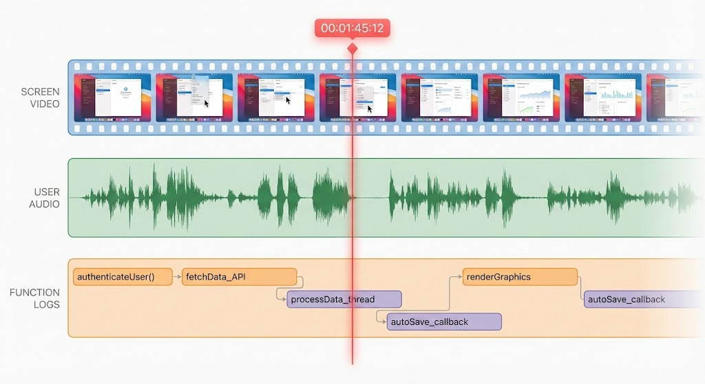

# ReadyCheck

**ReadyCheck** makes debugging faster and clearer by capturing what happened and replaying it later.

## Get ReadyCheck

```sh
claude plugin marketplace add WeZZard/skills
claude plugin install readycheck@wezzard-skills
```

This installs the **ReadyCheck** skills for capture and analysis (`check`), standalone analysis (`analyze`), and system checks (`doctor`).

## Use ReadyCheck

**Run and Analyze**

Run your app with `/check`. It builds, runs, captures, and automatically analyzes your app.

```shell
/check Run the app
```

**Analyze Only**

Run standalone analysis on an existing session.

When analysis completes, Claude Code enters Plan mode and generates a fix plan.

```shell
/analyze
```

**Supported Platforms and Programming Languages**

| | macOS | iOS | Android | Linux | Windows |
| --- | --- | --- | --- | --- | --- |
| Swift | ✅ | 📋 | 📋 | 📋 | 📋 |
| Objective-C | ✅ | 📋 | 📋 | 📋 | 📋 |
| C | ✅ | 📋 | 📋 | 📋 | 📋 |
| C++ | ✅ | 📋 | 📋 | 📋 | 📋 |
| Rust | ⚠️ | 📋 | 📋 | 📋 | 📋 |
| Kotlin | 📋 | 📋 | 📋 | 📋 | 📋 |
| Java | 📋 | 📋 | 📋 | 📋 | 📋 |

- ✅: Supported
- ⚠️: Not Tested
- 📋: Planned
- 🚧: Under construction

## Brief Introduction

### Agent-first Debugging Architecture

**ReadyCheck** records a layered, shareable timeline of what you saw, what you said, and what your program did.

It's designed to give AI agents *evidence* (not guesses): a tight, time-aligned bundle they can summarize, search, and cite, including:

- **Screen Recording**: Captures high-fidelity video of your screen.
- **Voice Waveform**: Records voice activity as a waveform.
- **Function Activity Records**: Detailed traces of function activity.



### Human-first Review Workflow

**ReadyCheck** implements a workflow that keeps human judgment first—both when defining the problem and when reviewing solutions.

It leverages Claude Code's Ask User Question and Plan tools to provide a **proactive**, **native** review experience.

```
┌─────────────────────────────────────────────────────────────────────────┐
│                         ANALYZE WORKFLOW                                │
├─────────────────────────────────────────────────────────────────────────┤
│                                                                         │
│  ┌──────────────┐                                                       │
│  │   Voice      │  "It crashed when I clicked save"                     │
│  │  Transcript  │──────────────────────────────┐                        │
│  └──────────────┘                              │                        │
│                                                ▼                        │
│                                    ┌───────────────────┐                │
│                                    │ Intent Extraction │                │
│                                    │    (Step 1)       │                │
│                                    └─────────┬─────────┘                │
│                                              │                          │
│                                              ▼                          │
│                              ┌───────────────────────────┐              │
│                              │   Issue Selection (You)   │◄── Human     │
│                              │        (Step 2)           │    Decision  │
│                              └─────────────┬─────────────┘              │
│                                            │                            │
│         ┌──────────────────────────────────┼────────────────────┐       │
│         │                                  │                    │       │
│         ▼                                  ▼                    ▼       │
│  ┌─────────────┐                   ┌─────────────┐      ┌─────────────┐ │
│  │ Screenshots │                   │   Trace     │      │  Transcript │ │
│  │  @ time T   │                   │   Events    │      │   Context   │ │
│  └──────┬──────┘                   └──────┬──────┘      └──────┬──────┘ │
│         │                                 │                    │        │
│         └─────────────────────────────────┼────────────────────┘        │
│                                           ▼                             │
│                              ┌───────────────────────┐                  │
│                              │  Evidence Correlation │                  │
│                              │       (Step 3)        │                  │
│                              └───────────┬───────────┘                  │
│                                          │                              │
│                                          ▼                              │
│                              ┌───────────────────────┐                  │
│                              │   Hypothesis Review   │◄── Human         │
│                              │     (Steps 4-5)       │    Approval      │
│                              └───────────┬───────────┘                  │
│                                          │                              │
│                                          ▼                              │
│                              ┌───────────────────────┐                  │
│                              │      Fix Plan         │◄── Human         │
│                              │      (Step 6)         │    Sign-off      │
│                              └───────────────────────┘                  │
│                                                                         │
└─────────────────────────────────────────────────────────────────────────┘
```

## Contributing Ideas

For now, ideas are submitted as GitHub issues.

If something feels missing or painful, open an issue with:

- What you were trying to do, what you expected, and what happened instead
- Your platform/version details
- (Optional) A redacted session bundle or screenshots/timestamps

## Contributing Code

Pull requests are welcome. Please:
- Follow the build/setup guide: [docs/GETTING_STARTED.md](docs/GETTING_STARTED.md)
- Keep changes focused and tested
- Run `cargo test --all` before opening a PR

## Contributing Tokens

This project is maintained by AI agents that continuously review contributed ideas and selectively implement them.

If you want to support the project's LLM-related costs (docs, examples, and evaluations), please open an issue to coordinate sponsorship or token contributions.

**Do not post API keys in issues.**

**Contributable Tokens:**

- Anthropic Claude
- OpenAI GPT

## License

MIT

## Support

For issues or questions, please refer to the documentation or create an issue in the repository.

## Quality Metrics


