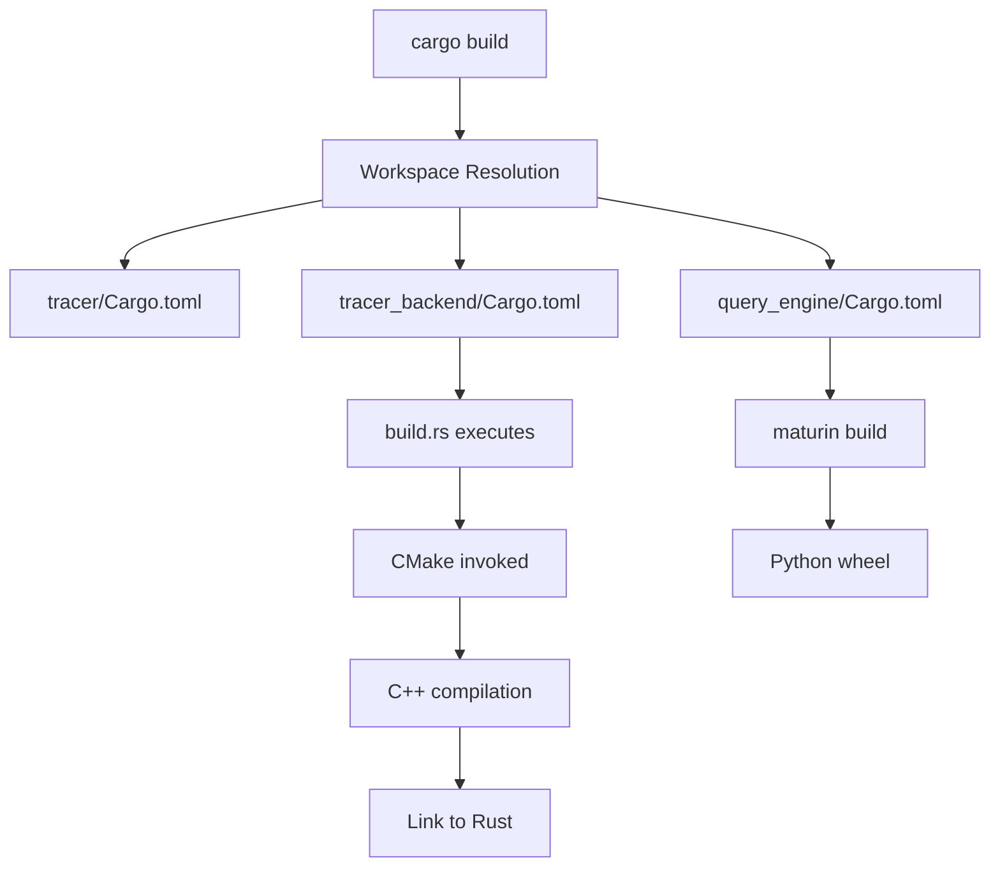

# Build System Architecture

This document describes the detailed project structure focusing on the Cargo-orchestrated build system.

## Complete Project Structure

```plaintext
project-root/
├── Cargo.toml                     # Root workspace manifest - orchestrates everything
├── Cargo.lock                     # Dependency lock file
├── rust-toolchain.toml           # Rust version specification
├── .cargo/
│   └── config.toml               # Cargo configuration
│
├── docs/                          # Documentation (see CLAUDE.md for details)
│
├── tracer/                        # Rust tracer component
│   ├── Cargo.toml                # Component manifest
│   ├── build.rs                  # Build script (if needed)
│   ├── src/
│   │   ├── lib.rs               # Library root
│   │   └── bin/
│   │       └── tracer.rs        # Binary entry point
│   ├── tests/
│   │   ├── unit/                # Unit tests
│   │   ├── integration/         # Integration tests
│   │   └── fixtures/            # Test data
│   └── docs/
│       └── design/              # Component design docs
│
├── tracer_backend/               # C/C++ backend
│   ├── Cargo.toml               # Rust crate manifest (orchestrates CMake)
│   ├── build.rs                 # CRITICAL: Invokes CMake via cmake crate
│   ├── CMakeLists.txt           # CMake config (invoked by build.rs)
│   ├── src/
│   │   ├── lib.rs              # Rust FFI bindings
│   │   └── native/             # C/C++ sources
│   │       ├── agent.cpp
│   │       ├── ring_buffer.cpp
│   │       └── shared_memory.cpp
│   ├── include/                 # C/C++ headers
│   │   ├── agent.h
│   │   ├── ring_buffer.h
│   │   └── shared_memory.h
│   ├── tests/
│   │   ├── unit/               # Google Test unit tests
│   │   ├── integration/        # Integration tests
│   │   └── fixtures/           # Test binaries
│   └── docs/
│       └── design/
│
├── query_engine/                # Python component (built with maturin)
│   ├── Cargo.toml              # Rust crate manifest for Python binding
│   ├── pyproject.toml          # Python project config
│   ├── build.rs                # Build script (if needed)
│   ├── src/
│   │   └── lib.rs             # Rust bindings for Python
│   ├── query_engine/          # Python sources
│   │   ├── __init__.py
│   │   ├── parser.py
│   │   └── analyzer.py
│   ├── tests/
│   │   ├── unit/              # pytest unit tests
│   │   ├── integration/       # Integration tests
│   │   └── fixtures/          # Test data
│   └── docs/
│       └── design/
│
├── mcp_server/                 # Python MCP server
│   ├── Cargo.toml             # Rust crate manifest (if using maturin)
│   ├── pyproject.toml         # Python project config
│   ├── mcp_server/            # Python sources
│   │   ├── __init__.py
│   │   └── server.py
│   ├── tests/
│   │   ├── unit/
│   │   └── integration/
│   └── docs/
│       └── design/
│
├── utils/                      # Engineering efficiency tools
│   ├── coverage_helper/       # Coverage collection tool
│   │   ├── Cargo.toml        # Tool manifest
│   │   └── src/
│   │       └── main.rs
│   ├── init_third_parties.sh # Frida SDK initialization
│   ├── install_hooks.sh      # Git hooks installation
│   ├── run_coverage.sh       # Simple coverage wrapper
│   └── metrics/
│       └── integration_quality.sh
│
├── third_parties/             # External dependencies
│   ├── frida-core/           # Frida Core SDK (after init)
│   ├── frida-gum/            # Frida Gum SDK (after init)
│   └── *.tar.xz             # Downloaded archives (git-ignored)
│
└── target/                    # All build outputs (git-ignored)
    ├── debug/                # Debug builds
    ├── release/              # Release builds
    ├── coverage/             # Temporary coverage data
    └── coverage_report/      # Coverage reports
```

## Build Orchestration

### Root Cargo.toml (Workspace)

```toml
[workspace]
members = [
    "tracer",
    "tracer_backend",
    "query_engine",
    "mcp_server",
    "utils/coverage_helper",
]
resolver = "2"

[workspace.dependencies]
# Shared dependencies across all crates
anyhow = "1.0"
serde = { version = "1.0", features = ["derive"] }

[profile.release]
lto = true
codegen-units = 1
opt-level = 3
```

### Component Cargo.toml Pattern

Each component follows this pattern:

```toml
[package]
name = "component_name"
version = "0.1.0"
edition = "2021"

[dependencies]
# Use workspace dependencies where possible
anyhow.workspace = true

[build-dependencies]
# For C/C++ components
cmake = "0.1"
bindgen = "0.69"

[features]
# Coverage instrumentation feature
coverage = []
```

### Critical build.rs Files

#### tracer_backend/build.rs
- Invokes CMake via cmake crate
- Sets coverage flags when feature enabled
- Copies binaries to predictable locations
- Generates compile_commands.json

#### query_engine/build.rs
- Uses maturin for Python bindings
- Handles coverage instrumentation
- Links with native dependencies

## Build Commands Flow



## Key Principles

1. **Cargo drives everything** - Never bypass Cargo
2. **build.rs orchestrates native code** - CMake is a leaf, not a driver
3. **Predictable output locations** - All artifacts in target/
4. **Feature flags for instrumentation** - Coverage controlled by features
5. **Workspace dependencies** - Consistent versions across components

## Platform-Specific Considerations

### macOS
- Clang is default compiler
- Framework linking handled in build.rs
- Code signing for Frida injection

### Linux  
- May need to specify CC/CXX for coverage
- Different library extensions (.so vs .dylib)
- ptrace permissions for attachment

### Windows
- Not currently supported
- Would require MSVC configuration

## Coverage Instrumentation

When `--features coverage` is enabled:

1. **Rust**: RUSTFLAGS="-C instrument-coverage"
2. **C/C++**: CMAKE_C_FLAGS="-fprofile-instr-generate -fcoverage-mapping"
3. **Python**: pytest-cov handles instrumentation

All controlled through Cargo feature flags, never manual configuration.