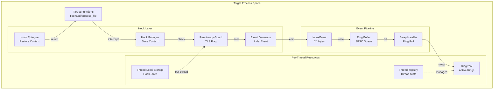
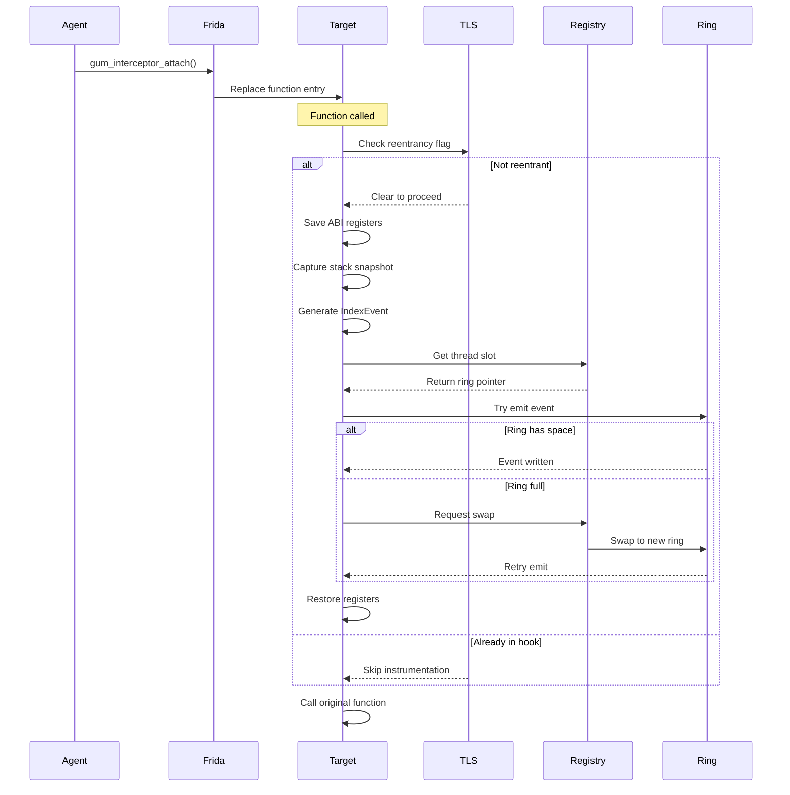
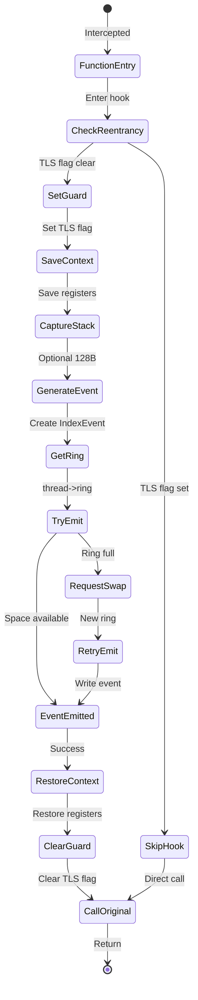

# M1_E1_I10 Technical Design: Broad Coverage Hooks

## Overview
Install comprehensive function hooks in target process with DSO (Dynamic Shared Object) on-arrival hooking and configurable exclude list support. This iteration establishes broad coverage of function interception across main binary and dynamically loaded libraries, with performance-aware exclusions for pathological hotspots, while emitting tracing events through the per-thread ring buffer system.

## Architecture

### Component Hierarchy


### Hook Installation Sequence


### State Machine: Hook Execution


## Data Structures

### Hook Context (TLS)
```c
typedef struct HookContext {
    // Reentrancy guard - per-thread flag
    _Atomic(uint32_t) in_hook;  // 0 = not in hook, 1 = in hook
    
    // Saved register state (ABI-specific)
    uint64_t saved_regs[8];      // x0-x7 (ARM64) or rdi,rsi,rdx,rcx,r8,r9 (x64)
    
    // Optional stack snapshot
    uint8_t stack_snapshot[128];
    size_t stack_size;
    
    // Performance counters
    uint64_t hook_count;
    uint64_t skip_count;          // Due to reentrancy
    uint64_t swap_count;          // Ring full events
} HookContext;

// Thread-local storage for hook state
__thread HookContext g_hook_ctx = {0};
```

### IndexEvent Structure
```c
typedef struct IndexEvent {
    uint64_t timestamp;           // 8 bytes: TSC or monotonic
    uint32_t thread_id;          // 4 bytes: System TID
    uint16_t event_type;         // 2 bytes: ENTER/EXIT/CALL
    uint16_t function_id;        // 2 bytes: Pre-assigned ID
    uint64_t context;            // 8 bytes: Return address or arg
} IndexEvent;  // Total: 24 bytes aligned

// Event types
#define EVENT_ENTER  0x0001
#define EVENT_EXIT   0x0002  
#define EVENT_CALL   0x0004

// Function IDs (deterministic set)
#define FUNC_FIBONACCI      0x0001
#define FUNC_PROCESS_FILE   0x0002
#define FUNC_CALCULATE      0x0003
#define FUNC_VALIDATE       0x0004
```

### Hook Installation Table
```c
typedef struct HookTarget {
    const char* symbol_name;
    uint16_t function_id;
    void* original_ptr;           // Saved original function
    _Atomic(uint64_t) call_count;
    _Atomic(uint64_t) event_count;
} HookTarget;

static HookTarget g_hook_targets[] = {
    {"fibonacci",     FUNC_FIBONACCI,     NULL, 0, 0},
    {"process_file",  FUNC_PROCESS_FILE,  NULL, 0, 0},
    {"calculate",     FUNC_CALCULATE,     NULL, 0, 0},
    {"validate",      FUNC_VALIDATE,      NULL, 0, 0},
    {NULL, 0, NULL, 0, 0}  // Sentinel
};
```

## Memory Ordering

### Reentrancy Guard Operations
```c
// Enter hook - acquire semantics to see all previous writes
static inline bool enter_hook(void) {
    uint32_t expected = 0;
    return atomic_compare_exchange_strong_explicit(
        &g_hook_ctx.in_hook,
        &expected,
        1,
        memory_order_acquire,  // Success: acquire barrier
        memory_order_relaxed   // Failure: no barrier needed
    );
}

// Exit hook - release semantics to publish all writes
static inline void exit_hook(void) {
    atomic_store_explicit(&g_hook_ctx.in_hook, 0, memory_order_release);
}
```

### Event Emission with Ring Buffer
```c
// Emit event to per-thread ring
static int emit_event(IndexEvent* event) {
    // Get current thread's ring (acquire to see latest ring pointer)
    ThreadSlot* slot = thread_registry_get_current();
    if (!slot) return -1;
    
    RingBuffer* ring = atomic_load_explicit(&slot->active_ring, 
                                           memory_order_acquire);
    if (!ring) return -1;
    
    // Try to reserve space in ring
    uint32_t tail = atomic_load_explicit(&ring->tail_cache, 
                                        memory_order_relaxed);
    uint32_t head = atomic_load_explicit(&ring->head, 
                                        memory_order_acquire);
    
    uint32_t next_tail = (tail + 1) & (RING_SIZE - 1);
    if (next_tail == head) {
        // Ring full - request swap
        ring_pool_swap_request(slot);
        
        // Retry with new ring
        ring = atomic_load_explicit(&slot->active_ring, 
                                   memory_order_acquire);
        if (!ring) return -1;
        
        tail = atomic_load_explicit(&ring->tail_cache, 
                                   memory_order_relaxed);
    }
    
    // Write event data
    memcpy(&ring->events[tail], event, sizeof(IndexEvent));
    
    // Publish with release semantics
    atomic_store_explicit(&ring->tail, next_tail, memory_order_release);
    atomic_store_explicit(&ring->tail_cache, next_tail, memory_order_relaxed);
    
    return 0;
}
```

## Hook Implementation

### Generic Hook Wrapper
```c
// Platform-specific prologue/epilogue handled by Frida
static void hook_enter(GumInvocationContext* ctx) {
    // Check reentrancy
    if (!enter_hook()) {
        atomic_fetch_add(&g_hook_ctx.skip_count, 1);
        return;  // Already in hook, skip
    }
    
    // Save register context (platform-specific)
    #ifdef __aarch64__
        g_hook_ctx.saved_regs[0] = ctx->cpu_context->x[0];
        g_hook_ctx.saved_regs[1] = ctx->cpu_context->x[1];
        // ... save x0-x7
    #elif defined(__x86_64__)
        g_hook_ctx.saved_regs[0] = ctx->cpu_context->rdi;
        g_hook_ctx.saved_regs[1] = ctx->cpu_context->rsi;
        // ... save calling convention registers
    #endif
    
    // Optional: Capture stack snapshot
    void* sp = gum_invocation_context_get_stack_pointer(ctx);
    if (sp && g_capture_stack) {
        size_t copy_size = MIN(128, available_stack_size(sp));
        memcpy(g_hook_ctx.stack_snapshot, sp, copy_size);
        g_hook_ctx.stack_size = copy_size;
    }
    
    // Generate event
    IndexEvent event = {
        .timestamp = get_timestamp(),
        .thread_id = gettid(),
        .event_type = EVENT_ENTER,
        .function_id = get_function_id(ctx),  // From hook table
        .context = get_return_address(ctx)
    };
    
    // Emit to ring buffer
    if (emit_event(&event) == 0) {
        atomic_fetch_add(&g_hook_ctx.hook_count, 1);
    } else {
        atomic_fetch_add(&g_hook_ctx.swap_count, 1);
    }
    
    // Clear reentrancy guard
    exit_hook();
}
```

### Comprehensive Hook Installation
```c
// Install hooks across main binary and all loaded DSOs
static int install_comprehensive_hooks(const char** cli_excludes, size_t cli_count) {
    // Initialize exclude list
    if (init_exclude_list(cli_excludes, cli_count) != 0) {
        log_error("Failed to initialize exclude list");
        return -1;
    }
    
    // Set up DSO interceptors for future loads
    if (setup_dso_interceptors() != 0) {
        log_error("Failed to setup DSO interceptors");
        return -1;
    }
    
    int total_installed = 0;
    
    // Hook main binary first
    int main_hooks = install_main_binary_hooks();
    if (main_hooks > 0) {
        total_installed += main_hooks;
        log_info("Main binary: %d hooks installed", main_hooks);
    }
    
    // Hook already loaded DSOs
    int dso_hooks = install_existing_dso_hooks();
    if (dso_hooks > 0) {
        total_installed += dso_hooks;
        log_info("Existing DSOs: %d hooks installed", dso_hooks);
    }
    
    // Report comprehensive installation
    char msg[512];
    snprintf(msg, sizeof(msg),
             "{\"type\":\"comprehensive_hooks_installed\","
             "\"total\":%d,\"main\":%d,\"dsos\":%d,\"excludes\":%zu}",
             total_installed, main_hooks, dso_hooks, g_exclude_list.count);
    on_message(msg, NULL);
    
    return total_installed;
}

// Install hooks for main binary exports
static int install_main_binary_hooks(void) {
    int installed = 0;
    
    // Enumerate main binary exports
    gum_module_enumerate_exports(NULL, enumerate_export_callback, &installed);
    
    return installed;
}

// Install hooks for already loaded DSOs
static int install_existing_dso_hooks(void) {
    int total_installed = 0;
    
    // Enumerate all loaded modules
    gum_process_enumerate_modules(enumerate_module_callback, &total_installed);
    
    return total_installed;
}

// Module enumeration callback for existing DSOs
static gboolean enumerate_module_callback(const GumModuleDetails* details,
                                        gpointer user_data) {
    int* total_hooks = (int*)user_data;
    
    // Skip main binary (already processed)
    if (gum_module_name_is_main_binary(details->name)) {
        return TRUE;
    }
    
    // Install hooks for this DSO
    int hooks = install_dso_hooks((void*)details->range->base_address, details->path);
    if (hooks > 0) {
        *total_hooks += hooks;
    }
    
    return TRUE;
}

// Install single hook with exclude check
static int install_single_hook(const GumExportDetails* details) {
    // Double-check exclude list (defense in depth)
    if (is_symbol_excluded(details->name)) {
        return -1;  // Excluded
    }
    
    GumInterceptor* interceptor = gum_interceptor_obtain();
    
    GumAttachReturn ret = gum_interceptor_attach(
        interceptor,
        GSIZE_TO_POINTER(details->address),
        hook_enter,
        hook_exit,
        create_hook_target(details)  // Create dynamic target
    );
    
    if (ret == GUM_ATTACH_OK) {
        log_debug("Hooked: %s at %p", details->name, 
                 GSIZE_TO_POINTER(details->address));
        return 0;
    } else {
        log_warn("Failed to hook %s: %d", details->name, ret);
        return -1;
    }
}
```

## Performance Considerations

### Critical Path Optimization
```c
// Fast path for hook with minimal overhead
__attribute__((always_inline))
static inline void fast_hook_enter(uint16_t func_id) {
    // Quick reentrancy check
    if (g_hook_ctx.in_hook) {
        g_hook_ctx.skip_count++;
        return;
    }
    g_hook_ctx.in_hook = 1;
    
    // Minimal event (no stack capture)
    IndexEvent event = {
        .timestamp = rdtsc(),  // Inline TSC read
        .thread_id = g_cached_tid,  // Cached TID
        .event_type = EVENT_ENTER,
        .function_id = func_id,
        .context = 0
    };
    
    // Direct ring write (no function call)
    RingBuffer* ring = g_thread_slot->active_ring;
    uint32_t tail = ring->tail_cache;
    uint32_t next = (tail + 1) & RING_MASK;
    
    if (next != ring->head) {
        ring->events[tail] = event;
        ring->tail = next;
        ring->tail_cache = next;
    }
    
    g_hook_ctx.in_hook = 0;
}
```

### Performance Targets
- Hook overhead: < 100ns per call (fast path)
- Exclude check: < 10ns (hash lookup)
- DSO enumeration: < 1ms per DSO
- Event generation: < 50ns
- Ring emission: < 30ns (no contention)
- Swap handling: < 1μs (rare case)
- Stack capture: < 200ns (optional)

## Error Handling

### Hook Failure Modes
1. **Symbol not found**: Log and skip
2. **Symbol excluded**: Skip silently, increment counter
3. **DSO load failure**: Continue with main binary hooks
4. **Attach failure**: Report and continue
5. **Ring full**: Trigger swap
6. **Swap failure**: Drop event, increment counter
7. **Reentrancy**: Skip instrumentation
8. **dlopen interception failure**: Fall back to periodic DSO scanning

### Recovery Mechanisms
```c
// Graceful degradation on errors
static void handle_hook_error(int error, HookTarget* target) {
    switch (error) {
        case ERR_RING_FULL:
            // Already handled by swap
            break;
            
        case ERR_NO_THREAD_SLOT:
            // Thread not registered - lazy init
            thread_registry_register_current();
            break;
            
        case ERR_SWAP_FAILED:
            // Count dropped events
            atomic_fetch_add(&g_stats.dropped_events, 1);
            break;
            
        default:
            log_error("Hook error %d for %s", error, target->symbol_name);
    }
}
```

## Integration Points

### Dependencies
- **M1_E1_I4**: Agent must be loaded with Frida
- **M1_E1_I5**: ThreadRegistry for per-thread slots
- **M1_E1_I6**: RingPool for swap operations

### Interfaces
```c
// From ThreadRegistry
extern ThreadSlot* thread_registry_get_current(void);
extern int thread_registry_register_current(void);

// From RingPool  
extern int ring_pool_swap_request(ThreadSlot* slot);
extern RingBuffer* ring_pool_acquire(void);

// To Agent
extern void on_message(const char* message, void* data);
```

## Success Criteria

### Functional Requirements
- [ ] Install hooks for main binary exports
- [ ] Intercept dlopen/dlclose for DSO detection
- [ ] Hook all DSO exports on arrival
- [ ] Filter symbols using exclude list
- [ ] Support CLI --exclude flag
- [ ] Generate IndexEvent on function entry
- [ ] Emit events to per-thread rings
- [ ] Handle reentrancy correctly
- [ ] Swap rings when full
- [ ] Report installation status with DSO metrics

### Performance Requirements
- [ ] Hook overhead < 100ns
- [ ] Exclude check < 10ns (O(1) hash lookup)
- [ ] DSO enumeration < 1ms per library
- [ ] Zero lock contention in hook path
- [ ] No allocations in event hot path
- [ ] Support 10M events/sec/thread
- [ ] Handle 1000+ hooked functions efficiently

### Reliability Requirements
- [ ] No crashes from hooks or DSO operations
- [ ] Graceful handling of DSO load/unload
- [ ] Safe exclude list modifications
- [ ] Clean detach with DSO cleanup
- [ ] Thread-safe registry operations
- [ ] Handle missing symbols gracefully
