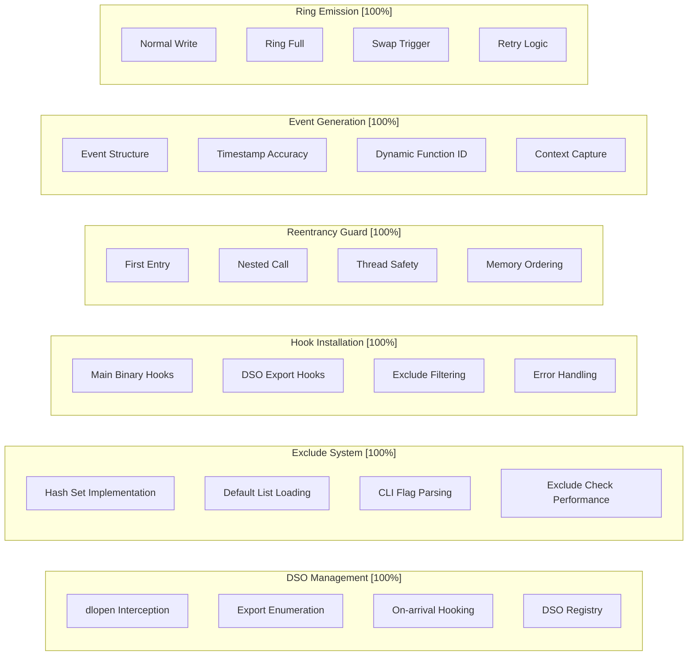

# M1_E1_I10 Test Plan: Broad Coverage Hooks

## Test Coverage Map

### Component Coverage Requirements


## Test Matrix

| Category | Test Case | Type | Priority | Duration |
|----------|-----------|------|----------|----------|
| **DSO Management** |
| | dso__dlopen_intercept__then_hooks_new_library | Unit | P0 | 20ms |
| | dso__dlclose_intercept__then_cleans_up_hooks | Unit | P0 | 15ms |
| | dso__export_enumeration__then_finds_all_functions | Unit | P0 | 10ms |
| | dso__registry_tracking__then_maintains_loaded_list | Unit | P0 | 10ms |
| **Exclude System** |
| | exclude__hash_lookup__then_finds_excluded_symbols | Unit | P0 | 5ms |
| | exclude__default_list__then_loads_hotspots | Unit | P0 | 5ms |
| | exclude__cli_override__then_adds_custom_excludes | Unit | P0 | 5ms |
| | exclude__performance__then_under_10ns_lookup | Perf | P0 | 50ms |
| **Hook Installation** |
| | hook_install__main_binary__then_hooks_exports | Unit | P0 | 15ms |
| | hook_install__dso_exports__then_hooks_functions | Unit | P0 | 15ms |
| | hook_install__exclude_filter__then_skips_hotspots | Unit | P0 | 10ms |
| | hook_install__comprehensive__then_reports_metrics | Integration | P0 | 30ms |
| **Reentrancy Guard** |
| | reentrancy__first_call__then_instruments | Unit | P0 | 5ms |
| | reentrancy__nested_call__then_skips | Unit | P0 | 5ms |
| | reentrancy__concurrent_threads__then_independent | Unit | P0 | 10ms |
| | reentrancy__memory_ordering__then_consistent | Unit | P0 | 5ms |
| **Event Generation** |
| | event__function_entry__then_correct_type | Unit | P0 | 5ms |
| | event__timestamp__then_monotonic_increase | Unit | P0 | 5ms |
| | event__thread_id__then_matches_current | Unit | P0 | 5ms |
| | event__function_id__then_maps_correctly | Unit | P0 | 5ms |
| **Ring Emission** |
| | emit__space_available__then_writes_event | Unit | P0 | 5ms |
| | emit__ring_full__then_triggers_swap | Unit | P0 | 10ms |
| | emit__swap_success__then_retries_write | Unit | P0 | 10ms |
| | emit__swap_fails__then_drops_event | Unit | P1 | 10ms |
| **Stack Capture** |
| | stack__enabled__then_captures_128_bytes | Unit | P1 | 5ms |
| | stack__disabled__then_skips_capture | Unit | P1 | 5ms |
| | stack__boundary__then_limits_size | Unit | P1 | 5ms |
| | stack__performance__then_under_200ns | Perf | P1 | 100ms |
| **Integration Tests** |
| | system__main_and_dso_hooks__then_generates_events | Integration | P0 | 100ms |
| | system__dso_load_runtime__then_hooks_automatically | Integration | P0 | 150ms |
| | system__exclude_effectiveness__then_skips_hotspots | Integration | P0 | 50ms |
| | system__multiple_threads__then_no_interference | Integration | P0 | 100ms |
| | system__high_frequency__then_handles_load | Integration | P0 | 500ms |
| | system__comprehensive_detach__then_cleans_up | Integration | P0 | 30ms |

## Behavioral Test Cases

### Unit Tests

#### DSO Management Tests
```c
TEST(DSOManagement, dso__dlopen_intercept__then_hooks_new_library) {
    // Arrange
    MockInterceptor interceptor;
    reset_dso_registry();
    const char* test_lib = "libtest.so";
    
    // Act - simulate dlopen call
    void* handle = (void*)0x12345000;
    dlopen_hook_leave_simulation(test_lib, handle);
    
    // Assert
    DSOEntry* entry = find_dso_entry(handle);
    ASSERT_NE(entry, nullptr);
    EXPECT_STREQ(entry->path, test_lib);
    EXPECT_GT(entry->hook_count, 0);
    EXPECT_GT(interceptor.attach_count, 0);
}

TEST(DSOManagement, dso__export_enumeration__then_finds_all_functions) {
    // Arrange
    MockDSOExports exports = {
        {"func1", GUM_EXPORT_FUNCTION, 0x1000},
        {"func2", GUM_EXPORT_FUNCTION, 0x2000},
        {"var1", GUM_EXPORT_VARIABLE, 0x3000},  // Should skip
        {"func3", GUM_EXPORT_FUNCTION, 0x4000}
    };
    
    // Act
    int hooked = enumerate_dso_exports("test.so", &exports);
    
    // Assert
    EXPECT_EQ(hooked, 3);  // Only functions, not variables
    EXPECT_TRUE(is_symbol_hooked("func1"));
    EXPECT_TRUE(is_symbol_hooked("func2"));
    EXPECT_TRUE(is_symbol_hooked("func3"));
    EXPECT_FALSE(is_symbol_hooked("var1"));
}
```

#### Exclude System Tests
```c
TEST(ExcludeSystem, exclude__hash_lookup__then_finds_excluded_symbols) {
    // Arrange
    const char* excludes[] = {"malloc", "free", "objc_msgSend", NULL};
    init_exclude_list(excludes, 3);
    
    // Act & Assert
    EXPECT_TRUE(is_symbol_excluded("malloc"));
    EXPECT_TRUE(is_symbol_excluded("free"));
    EXPECT_TRUE(is_symbol_excluded("objc_msgSend"));
    EXPECT_FALSE(is_symbol_excluded("my_function"));
    EXPECT_FALSE(is_symbol_excluded("calculate"));
}

TEST(ExcludeSystem, exclude__default_list__then_loads_hotspots) {
    // Arrange & Act
    init_exclude_list(NULL, 0);  // Load defaults only
    
    // Assert - check key hotspots are excluded
    EXPECT_TRUE(is_symbol_excluded("objc_msgSend"));
    EXPECT_TRUE(is_symbol_excluded("objc_retain"));
    EXPECT_TRUE(is_symbol_excluded("objc_release"));
    EXPECT_TRUE(is_symbol_excluded("malloc"));
    EXPECT_TRUE(is_symbol_excluded("free"));
    EXPECT_TRUE(is_symbol_excluded("pthread_mutex_lock"));
    EXPECT_TRUE(is_symbol_excluded("memcpy"));
    EXPECT_GT(get_exclude_list_count(), 15);  // Should have many defaults
}

TEST(ExcludePerf, exclude__performance__then_under_10ns_lookup) {
    // Arrange
    init_default_exclude_list();
    const int NUM_LOOKUPS = 1000000;
    
    // Warmup
    for (int i = 0; i < 1000; i++) {
        is_symbol_excluded("malloc");
        is_symbol_excluded("my_function");
    }
    
    // Measure excluded symbol lookup
    auto start = std::chrono::high_resolution_clock::now();
    for (int i = 0; i < NUM_LOOKUPS; i++) {
        volatile bool excluded = is_symbol_excluded("objc_msgSend");
    }
    auto excluded_time = std::chrono::high_resolution_clock::now() - start;
    
    // Measure non-excluded symbol lookup
    start = std::chrono::high_resolution_clock::now();
    for (int i = 0; i < NUM_LOOKUPS; i++) {
        volatile bool excluded = is_symbol_excluded("my_function");
    }
    auto normal_time = std::chrono::high_resolution_clock::now() - start;
    
    // Calculate average times
    auto excluded_avg_ns = excluded_time / NUM_LOOKUPS;
    auto normal_avg_ns = normal_time / NUM_LOOKUPS;
    
    // Assert performance targets
    EXPECT_LT(excluded_avg_ns.count(), 10);  // < 10ns for excluded
    EXPECT_LT(normal_avg_ns.count(), 10);    // < 10ns for normal
    
    printf("Exclude lookup: excluded=%ldns, normal=%ldns\n",
           excluded_avg_ns.count(), normal_avg_ns.count());
}
```

#### Hook Installation Tests
```c
TEST(HookInstall, hook_install__main_binary__then_hooks_exports) {
    // Arrange
    MockInterceptor interceptor;
    MockExportEnumerator exports;
    setup_main_binary_exports(&exports, {
        {"main", GUM_EXPORT_FUNCTION, 0x1000},
        {"fibonacci", GUM_EXPORT_FUNCTION, 0x2000},
        {"calculate", GUM_EXPORT_FUNCTION, 0x3000}
    });
    
    // Act
    int count = install_main_binary_hooks();
    
    // Assert
    EXPECT_EQ(count, 3);
    EXPECT_EQ(interceptor.attach_count, 3);
    EXPECT_TRUE(is_symbol_hooked("main"));
    EXPECT_TRUE(is_symbol_hooked("fibonacci"));
    EXPECT_TRUE(is_symbol_hooked("calculate"));
}

TEST(HookInstall, hook_install__exclude_filter__then_skips_hotspots) {
    // Arrange
    init_default_exclude_list();
    MockExportEnumerator exports;
    setup_mock_exports(&exports, {
        {"malloc", GUM_EXPORT_FUNCTION, 0x1000},      // Should exclude
        {"objc_msgSend", GUM_EXPORT_FUNCTION, 0x2000}, // Should exclude
        {"my_function", GUM_EXPORT_FUNCTION, 0x3000},  // Should hook
        {"calculate", GUM_EXPORT_FUNCTION, 0x4000}     // Should hook
    });
    
    // Act
    int count = enumerate_and_install_hooks(&exports);
    
    // Assert
    EXPECT_EQ(count, 2);  // Only non-excluded functions
    EXPECT_FALSE(is_symbol_hooked("malloc"));
    EXPECT_FALSE(is_symbol_hooked("objc_msgSend"));
    EXPECT_TRUE(is_symbol_hooked("my_function"));
    EXPECT_TRUE(is_symbol_hooked("calculate"));
    
    // Verify statistics
    EXPECT_EQ(get_exclude_hit_count(), 2);
    EXPECT_EQ(get_hook_install_count(), 2);
}
```

#### Reentrancy Guard Tests
```c
TEST(Reentrancy, reentrancy__first_call__then_instruments) {
    // Arrange
    reset_hook_context();
    
    // Act
    bool entered = enter_hook();
    
    // Assert
    EXPECT_TRUE(entered);
    EXPECT_EQ(g_hook_ctx.in_hook, 1);
    
    // Cleanup
    exit_hook();
}

TEST(Reentrancy, reentrancy__nested_call__then_skips) {
    // Arrange
    enter_hook();  // First entry
    
    // Act
    bool nested = enter_hook();  // Nested attempt
    
    // Assert
    EXPECT_FALSE(nested);
    EXPECT_EQ(g_hook_ctx.skip_count, 1);
    
    // Cleanup
    exit_hook();
}

TEST(Reentrancy, reentrancy__concurrent_threads__then_independent) {
    // Arrange
    std::atomic<int> success_count{0};
    std::atomic<bool> start{false};
    
    // Act
    std::thread t1([&]() {
        while (!start) {}
        if (enter_hook()) {
            success_count++;
            std::this_thread::sleep_for(std::chrono::microseconds(10));
            exit_hook();
        }
    });
    
    std::thread t2([&]() {
        while (!start) {}
        if (enter_hook()) {
            success_count++;
            std::this_thread::sleep_for(std::chrono::microseconds(10));
            exit_hook();
        }
    });
    
    start = true;
    t1.join();
    t2.join();
    
    // Assert - both threads should succeed independently
    EXPECT_EQ(success_count, 2);
}
```

#### Event Generation Tests
```c
TEST(EventGen, event__function_entry__then_correct_type) {
    // Arrange
    IndexEvent event = {0};
    
    // Act
    generate_entry_event(&event, FUNC_FIBONACCI);
    
    // Assert
    EXPECT_EQ(event.event_type, EVENT_ENTER);
    EXPECT_EQ(event.function_id, FUNC_FIBONACCI);
    EXPECT_NE(event.timestamp, 0);
    EXPECT_EQ(event.thread_id, gettid());
}

TEST(EventGen, event__timestamp__then_monotonic_increase) {
    // Arrange
    IndexEvent event1 = {0}, event2 = {0};
    
    // Act
    generate_entry_event(&event1, FUNC_FIBONACCI);
    std::this_thread::sleep_for(std::chrono::microseconds(1));
    generate_entry_event(&event2, FUNC_CALCULATE);
    
    // Assert
    EXPECT_GT(event2.timestamp, event1.timestamp);
}
```

#### Ring Emission Tests
```c
TEST(RingEmit, emit__space_available__then_writes_event) {
    // Arrange
    RingBuffer ring = {0};
    ring_buffer_init(&ring);
    ThreadSlot slot = {.active_ring = &ring};
    set_current_thread_slot(&slot);
    
    IndexEvent event = {
        .timestamp = 12345,
        .thread_id = 1000,
        .event_type = EVENT_ENTER,
        .function_id = FUNC_FIBONACCI,
        .context = 0xDEADBEEF
    };
    
    // Act
    int result = emit_event(&event);
    
    // Assert
    EXPECT_EQ(result, 0);
    EXPECT_EQ(ring.tail, 1);
    EXPECT_EQ(ring.events[0].timestamp, 12345);
    EXPECT_EQ(ring.events[0].function_id, FUNC_FIBONACCI);
}

TEST(RingEmit, emit__ring_full__then_triggers_swap) {
    // Arrange
    RingBuffer ring = {0};
    ring_buffer_init(&ring);
    // Fill ring to capacity - 1
    ring.tail = RING_SIZE - 1;
    ring.head = 0;
    
    MockRingPool pool;
    ThreadSlot slot = {.active_ring = &ring};
    set_current_thread_slot(&slot);
    
    IndexEvent event = {.timestamp = 99999};
    
    // Act
    int result = emit_event(&event);
    
    // Assert
    EXPECT_EQ(result, 0);
    EXPECT_TRUE(pool.swap_requested);
    EXPECT_NE(slot.active_ring, &ring);  // Should have new ring
}
```

### Integration Tests

#### System-Level Hook Tests
```c
TEST(SystemHooks, system__main_and_dso_hooks__then_generates_events) {
    // Arrange
    start_test_agent();
    install_comprehensive_hooks(nullptr, 0);
    reset_event_counters();
    
    // Act
    int result = fibonacci(10);  // Main binary function
    double math_result = sin(3.14159); // Math library function (DSO)
    
    // Assert
    EXPECT_EQ(result, 55);  // Correct fibonacci result
    EXPECT_GT(get_event_count("fibonacci"), 0);
    EXPECT_GT(get_event_count("sin"), 0);  // DSO function
    EXPECT_GT(get_total_event_count(), 0);
    
    // Verify DSO registry
    EXPECT_GT(get_dso_count(), 0);
    EXPECT_TRUE(is_dso_loaded("libm"));  // Math library
    
    // Cleanup
    uninstall_comprehensive_hooks();
}

TEST(SystemHooks, system__dso_load_runtime__then_hooks_automatically) {
    // Arrange
    start_test_agent();
    install_comprehensive_hooks(nullptr, 0);
    size_t initial_hook_count = get_total_hook_count();
    
    // Act - load a DSO at runtime
    void* handle = dlopen("libtest.so", RTLD_NOW);
    ASSERT_NE(handle, nullptr);
    
    // Wait for DSO hook installation
    std::this_thread::sleep_for(std::chrono::milliseconds(10));
    
    // Call function from newly loaded DSO
    void (*test_func)() = (void(*)())dlsym(handle, "test_function");
    ASSERT_NE(test_func, nullptr);
    test_func();
    
    // Assert
    size_t final_hook_count = get_total_hook_count();
    EXPECT_GT(final_hook_count, initial_hook_count);  // New hooks added
    EXPECT_GT(get_event_count("test_function"), 0);   // Events generated
    EXPECT_TRUE(is_dso_registered(handle));           // DSO tracked
    
    // Cleanup
    dlclose(handle);
    uninstall_comprehensive_hooks();
}

TEST(SystemHooks, system__exclude_effectiveness__then_skips_hotspots) {
    // Arrange
    start_test_agent();
    install_comprehensive_hooks(nullptr, 0);
    reset_event_counters();
    
    // Act - call excluded functions
    void* ptr = malloc(100);    // Should be excluded
    free(ptr);                  // Should be excluded
    
    // Call non-excluded function
    int result = fibonacci(5);  // Should be hooked
    
    // Assert
    EXPECT_EQ(get_event_count("malloc"), 0);    // No events from malloc
    EXPECT_EQ(get_event_count("free"), 0);      // No events from free
    EXPECT_GT(get_event_count("fibonacci"), 0); // Events from fibonacci
    
    // Verify exclude statistics
    EXPECT_GT(get_exclude_hit_count(), 0);
    EXPECT_FALSE(is_symbol_hooked("malloc"));
    EXPECT_FALSE(is_symbol_hooked("free"));
    EXPECT_TRUE(is_symbol_hooked("fibonacci"));
    
    // Cleanup
    uninstall_comprehensive_hooks();
}

TEST(SystemHooks, system__multiple_threads__then_no_interference) {
    // Arrange
    install_baseline_hooks();
    std::atomic<int> errors{0};
    const int NUM_THREADS = 8;
    const int CALLS_PER_THREAD = 1000;
    
    // Act
    std::vector<std::thread> threads;
    for (int i = 0; i < NUM_THREADS; i++) {
        threads.emplace_back([&, tid = i]() {
            for (int j = 0; j < CALLS_PER_THREAD; j++) {
                int result = fibonacci(10);
                if (result != 55) {
                    errors++;
                }
            }
            
            // Verify thread-local events
            RingBuffer* ring = get_current_thread_ring();
            if (!ring || ring->tail == 0) {
                errors++;
            }
        });
    }
    
    for (auto& t : threads) {
        t.join();
    }
    
    // Assert
    EXPECT_EQ(errors, 0);
    EXPECT_EQ(get_total_hook_count(), NUM_THREADS * CALLS_PER_THREAD);
    EXPECT_EQ(get_active_thread_count(), NUM_THREADS);
}
```

## Performance Benchmarks

### Hook Overhead Measurement
```c
BENCHMARK(HookPerf, hook_overhead_measurement) {
    // Setup
    install_baseline_hooks();
    volatile int result = 0;
    
    // Warmup
    for (int i = 0; i < 1000; i++) {
        result = fibonacci(5);
    }
    
    // Measure hooked performance
    auto start = std::chrono::high_resolution_clock::now();
    for (int i = 0; i < 100000; i++) {
        result = fibonacci(5);
    }
    auto hooked_time = std::chrono::high_resolution_clock::now() - start;
    
    // Uninstall hooks
    uninstall_all_hooks();
    
    // Measure baseline performance
    start = std::chrono::high_resolution_clock::now();
    for (int i = 0; i < 100000; i++) {
        result = fibonacci(5);
    }
    auto baseline_time = std::chrono::high_resolution_clock::now() - start;
    
    // Calculate overhead
    auto overhead_ns = (hooked_time - baseline_time) / 100000;
    
    // Report
    EXPECT_LT(overhead_ns.count(), 100);  // < 100ns overhead
    printf("Hook overhead: %ld ns per call\n", overhead_ns.count());
}
```

### Event Generation Throughput
```c
BENCHMARK(EventPerf, event_generation_throughput) {
    // Setup
    RingBuffer ring;
    ring_buffer_init(&ring);
    ThreadSlot slot = {.active_ring = &ring};
    set_current_thread_slot(&slot);
    
    const int NUM_EVENTS = 1000000;
    IndexEvent event = {
        .timestamp = 0,
        .thread_id = gettid(),
        .event_type = EVENT_ENTER,
        .function_id = FUNC_FIBONACCI,
        .context = 0
    };
    
    // Measure
    auto start = std::chrono::high_resolution_clock::now();
    for (int i = 0; i < NUM_EVENTS; i++) {
        event.timestamp = i;  // Unique timestamp
        emit_event_fast(&event);  // Fast path without checks
    }
    auto elapsed = std::chrono::high_resolution_clock::now() - start;
    
    // Calculate throughput
    double events_per_sec = NUM_EVENTS / 
        std::chrono::duration<double>(elapsed).count();
    
    // Report
    EXPECT_GT(events_per_sec, 10000000);  // > 10M events/sec
    printf("Event throughput: %.2f M events/sec\n", 
           events_per_sec / 1000000);
}
```

## Test Execution Strategy

### Phase 1: Unit Tests (Day 1)
1. DSO management and interception
2. Exclude system hash operations
3. Comprehensive hook installation
4. Reentrancy guard logic
5. Event structure generation
6. Ring buffer emission

### Phase 2: Integration Tests (Day 2)
1. Main binary and DSO hook flow
2. Runtime DSO loading scenarios
3. Exclude list effectiveness
4. Multi-threaded scenarios
5. Error recovery paths
6. Comprehensive resource cleanup

### Phase 3: Performance Tests (Day 3)
1. Hook overhead measurement
2. Event throughput testing
3. Memory ordering verification
4. Stress testing under load

### Phase 4: Acceptance Tests (Day 4)
1. Broad coverage user story validation
2. DSO and exclude system integration
3. Performance targets (including exclude lookup)
4. Stability verification under DSO loading
5. CLI --exclude flag functionality

## Coverage Requirements

### Line Coverage: 100%
- All hook installation paths
- All reentrancy scenarios
- All event generation code
- All ring emission logic

### Branch Coverage: 100%
- Success and failure paths
- Ring full conditions
- Swap retry logic
- Error handling

### Function Coverage: 100%
- All public APIs
- All helper functions
- All callbacks
- All cleanup routines

## Acceptance Criteria

### Functional Acceptance
- [ ] Hooks installed for main binary and DSO exports
- [ ] DSO on-arrival hooking functional
- [ ] Exclude list properly filters hotspots
- [ ] CLI --exclude flag support working
- [ ] Events generated for non-excluded functions
- [ ] Reentrancy properly handled
- [ ] Ring swaps trigger on full
- [ ] Comprehensive detach without crashes

### Performance Acceptance
- [ ] Hook overhead < 100ns per call
- [ ] Exclude check < 10ns per lookup
- [ ] DSO enumeration < 1ms per library
- [ ] Event generation > 10M/sec/thread
- [ ] Zero lock contention in hook path
- [ ] Memory ordering correct
- [ ] Handles 1000+ hooked functions efficiently

### Quality Acceptance
- [ ] 100% test coverage achieved
- [ ] All tests passing
- [ ] No memory leaks detected
- [ ] Thread sanitizer clean

## Risk Mitigation

### Identified Risks
1. **Hook overhead too high**: Use fast path optimization
2. **Reentrancy issues**: TLS-based guard with atomics
3. **Ring contention**: Per-thread isolation
4. **Symbol resolution failures**: Graceful degradation

### Mitigation Strategies
- Profile hook overhead continuously
- Test with thread sanitizer
- Verify memory ordering with formal tools
- Implement comprehensive error handling
