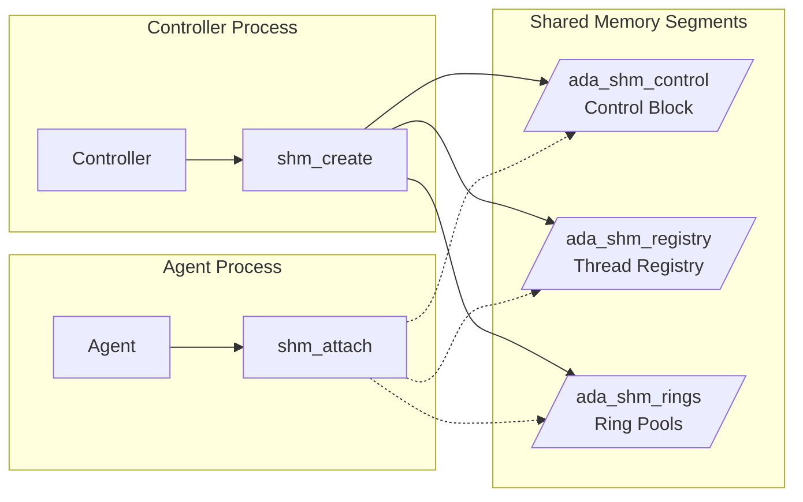
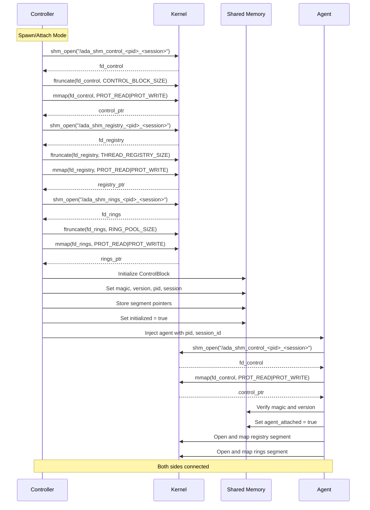
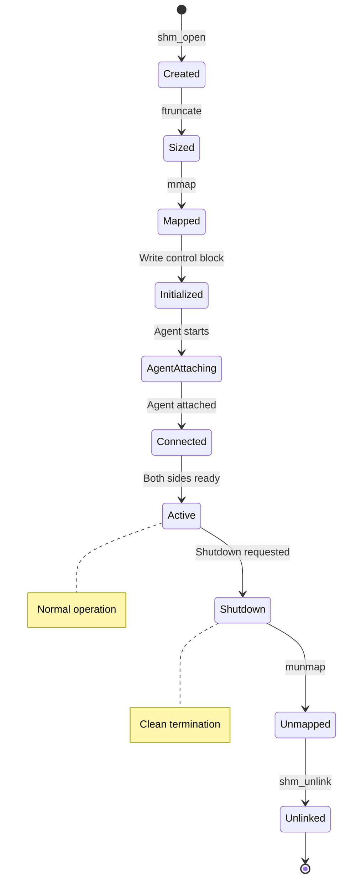

# Tech Design — M1 E1 I1 Shared Memory Setup

## Objective
Create shared memory segments with proper layout for control block, thread registry, and ring pools.

## Architecture Diagram



## Memory Layout

```c
// Shared memory segment sizes
#define CONTROL_BLOCK_SIZE      4096     // 4KB for control
#define THREAD_REGISTRY_SIZE    (64 * 1024)  // 64KB for registry
#define RING_POOL_SIZE          (16 * 1024 * 1024)  // 16MB for rings

// Total shared memory: ~16MB

typedef struct {
    // Identification
    uint32_t magic;          // 0xADA5F7C1
    uint32_t version;        // 1
    uint32_t pid;           // Process ID
    uint32_t session_id;    // Unique session
    
    // Segment pointers
    void* registry_base;     // Offset to ThreadRegistry
    void* ring_pool_base;    // Offset to ring storage
    
    // Global control
    _Atomic(bool) initialized;
    _Atomic(bool) agent_attached;
    _Atomic(bool) shutdown_requested;
    
    // Statistics
    _Atomic(uint64_t) total_events;
    _Atomic(uint64_t) start_timestamp;
} ControlBlock;
```

## Sequence Diagram: Initialization



## State Machine: Shared Memory Lifecycle



## Implementation Details

### Creating Shared Memory (Controller)
```c
SharedMemory* shared_memory_create(uint32_t pid, uint32_t session_id) {
    SharedMemory* shm = calloc(1, sizeof(SharedMemory));
    
    // Format unique names
    snprintf(shm->control_name, sizeof(shm->control_name),
             "/ada_shm_control_%u_%u", pid, session_id);
    snprintf(shm->registry_name, sizeof(shm->registry_name),
             "/ada_shm_registry_%u_%u", pid, session_id);
    snprintf(shm->rings_name, sizeof(shm->rings_name),
             "/ada_shm_rings_%u_%u", pid, session_id);
    
    // Create control block segment
    shm->fd_control = shm_open(shm->control_name, 
                               O_CREAT | O_RDWR | O_EXCL, 0600);
    if (shm->fd_control < 0) {
        goto error;
    }
    
    if (ftruncate(shm->fd_control, CONTROL_BLOCK_SIZE) < 0) {
        goto error;
    }
    
    shm->control = mmap(NULL, CONTROL_BLOCK_SIZE,
                        PROT_READ | PROT_WRITE,
                        MAP_SHARED, shm->fd_control, 0);
    if (shm->control == MAP_FAILED) {
        goto error;
    }
    
    // Similarly for registry and rings...
    
    // Initialize control block
    ControlBlock* cb = (ControlBlock*)shm->control;
    cb->magic = 0xADA5F7C1;
    cb->version = 1;
    cb->pid = pid;
    cb->session_id = session_id;
    cb->registry_base = shm->registry;
    cb->ring_pool_base = shm->rings;
    
    atomic_store_explicit(&cb->initialized, true, memory_order_release);
    
    return shm;
    
error:
    shared_memory_destroy(shm);
    return NULL;
}
```

### Attaching to Shared Memory (Agent)
```c
SharedMemory* shared_memory_attach(uint32_t pid, uint32_t session_id) {
    SharedMemory* shm = calloc(1, sizeof(SharedMemory));
    
    // Format names
    snprintf(shm->control_name, sizeof(shm->control_name),
             "/ada_shm_control_%u_%u", pid, session_id);
    
    // Open existing control block
    shm->fd_control = shm_open(shm->control_name, O_RDWR, 0);
    if (shm->fd_control < 0) {
        return NULL;  // Not created yet
    }
    
    // Map control block
    shm->control = mmap(NULL, CONTROL_BLOCK_SIZE,
                        PROT_READ | PROT_WRITE,
                        MAP_SHARED, shm->fd_control, 0);
    
    // Verify magic and version
    ControlBlock* cb = (ControlBlock*)shm->control;
    if (cb->magic != 0xADA5F7C1 || cb->version != 1) {
        goto error;
    }
    
    // Wait for initialization
    while (!atomic_load_explicit(&cb->initialized, memory_order_acquire)) {
        usleep(1000);  // 1ms
    }
    
    // Map other segments...
    
    // Mark agent attached
    atomic_store_explicit(&cb->agent_attached, true, memory_order_release);
    
    return shm;
}
```

## Error Handling

1. **Creation Failures**
   - Check if segments already exist (EEXIST)
   - Verify sufficient memory available
   - Handle permission errors

2. **Attachment Failures**
   - Retry with exponential backoff
   - Clear error messages for debugging
   - Timeout after reasonable period

3. **Version Mismatch**
   - Report incompatible versions clearly
   - Suggest rebuild/upgrade

## Testing Strategy

### Unit Tests
- `shm_create__unique_names__then_no_collision`
- `shm_create__already_exists__then_error`
- `shm_attach__valid_segments__then_maps`
- `shm_attach__missing_segment__then_null`
- `control_block__initialization__then_valid`

### Integration Tests
- Controller creates, agent attaches
- Multiple segments mapped correctly
- Cleanup removes all segments

### Stress Tests
- Rapid create/destroy cycles
- Many sessions simultaneously
- Memory pressure scenarios

## Success Criteria
- [ ] Three segments created with unique names
- [ ] Control block initialized correctly
- [ ] Agent can attach to existing segments
- [ ] Memory layout matches specification
- [ ] Error handling comprehensive
- [ ] No memory leaks on cleanup

## Dependencies
None - this is the foundation iteration

## References
- `docs/tech_designs/SHARED_MEMORY_IPC_MECHANISM.md`
- POSIX shared memory specification