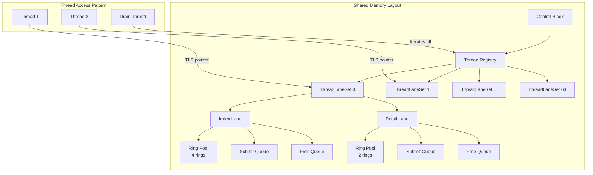
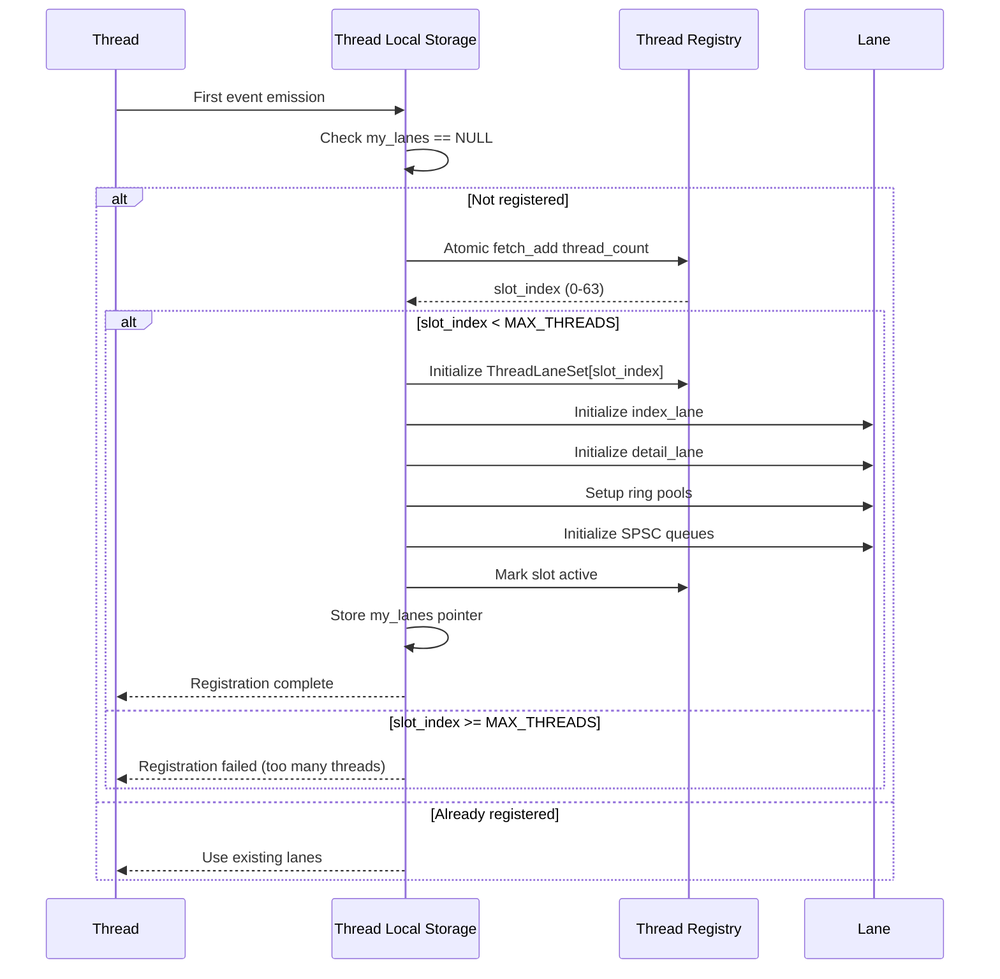
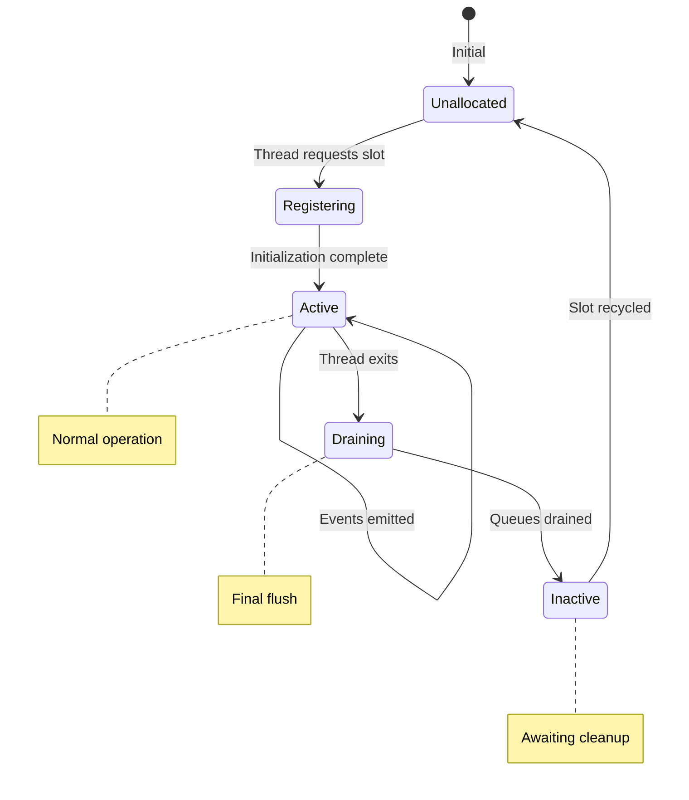

# Tech Design — M1 E1 I2 Thread Registry

## Objective
Implement ThreadRegistry structure with per-thread lane sets, enabling lock-free SPSC communication between each thread and the drain thread.

## Architecture Diagram



## Data Structures

```c
#define MAX_THREADS 64
#define RINGS_PER_INDEX_LANE 4
#define RINGS_PER_DETAIL_LANE 2

typedef struct {
    // Global thread registry
    _Atomic(uint32_t) thread_count;
    ThreadLaneSet thread_lanes[MAX_THREADS];
    
    // Global control flags
    _Atomic(bool) accepting_registrations;
    _Atomic(bool) shutdown_requested;
} ThreadRegistry;

typedef struct {
    // Thread identification
    uint32_t thread_id;        // System thread ID
    uint32_t slot_index;        // Index in registry (0-63)
    _Atomic(bool) active;       // Thread still alive
    
    // Per-thread lanes
    Lane index_lane;
    Lane detail_lane;
    
    // Thread-local metrics
    _Atomic(uint64_t) events_generated;
    _Atomic(uint64_t) last_event_timestamp;
} ThreadLaneSet;

typedef struct {
    // Ring pool for this lane
    RingBuffer* rings;          // Array of rings
    uint32_t ring_count;        // Number of rings
    _Atomic(uint32_t) active_idx;  // Currently active ring
    
    // SPSC queues (thread → drain)
    _Atomic(uint32_t) submit_head;
    _Atomic(uint32_t) submit_tail;
    uint32_t* submit_queue;     // Ring indices to drain
    
    // SPSC queues (drain → thread)
    _Atomic(uint32_t) free_head;
    _Atomic(uint32_t) free_tail;
    uint32_t* free_queue;       // Available ring indices
    
    // Lane-specific state
    _Atomic(bool) marked_event_seen;  // For detail lane
    
    // Lane metrics
    _Atomic(uint64_t) events_written;
    _Atomic(uint64_t) events_dropped;
    _Atomic(uint32_t) ring_swaps;
    _Atomic(uint32_t) pool_exhaustions;
} Lane;
```

## Sequence Diagram: Thread Registration



## State Machine: Thread Slot Lifecycle



## Memory Ordering Requirements

### Thread Registration (One-time per thread)
```c
// Thread side - registering
uint32_t slot = atomic_fetch_add_explicit(&registry->thread_count, 1, 
                                          memory_order_acq_rel);
if (slot >= MAX_THREADS) return NULL;

ThreadLaneSet* tls = &registry->thread_lanes[slot];
// Initialize lanes...
atomic_store_explicit(&tls->active, true, memory_order_release);

// Drain side - discovering new thread
uint32_t count = atomic_load_explicit(&registry->thread_count, 
                                      memory_order_acquire);
for (uint32_t i = 0; i < count; i++) {
    if (atomic_load_explicit(&registry->thread_lanes[i].active, 
                            memory_order_acquire)) {
        // Process this thread's lanes
    }
}
```

### SPSC Queue Operations (Per-thread isolation)
```c
// Producer (thread) - submit ring for draining
uint32_t tail = atomic_load_explicit(&lane->submit_tail, 
                                     memory_order_relaxed);
lane->submit_queue[tail % queue_size] = ring_idx;
atomic_store_explicit(&lane->submit_tail, tail + 1, 
                     memory_order_release);  // Publish

// Consumer (drain) - take ring for draining  
uint32_t head = atomic_load_explicit(&lane->submit_head, 
                                     memory_order_acquire);
uint32_t tail = atomic_load_explicit(&lane->submit_tail, 
                                     memory_order_acquire);
if (head != tail) {
    uint32_t ring_idx = lane->submit_queue[head % queue_size];
    atomic_store_explicit(&lane->submit_head, head + 1, 
                         memory_order_release);
    // Process ring_idx
}
```

## Implementation Steps

1. **Define structures** in `tracer_types.h`
2. **Allocate in shared memory** during control block creation
3. **Initialize all slots** as inactive
4. **Implement thread registration** with atomic slot allocation
5. **Setup SPSC queues** with proper memory ordering
6. **Add thread-local storage** for lane pointer caching

## Testing Strategy

### Unit Tests
- `thread_registry__single_thread__then_slot_zero`
- `thread_registry__max_threads__then_rejects_extra`
- `thread_registry__concurrent_registration__then_unique_slots`
- `spsc_queue__single_producer__then_ordered`
- `spsc_queue__wraparound__then_correct`

### Integration Tests
- Multiple threads register successfully
- Each thread gets unique slot
- No slot conflicts under concurrent registration
- Drain thread sees all registered threads

### Performance Tests
- Registration time < 1μs
- Zero contention between threads after registration
- Linear scaling with thread count

## Success Criteria
- [ ] MAX_THREADS (64) can register
- [ ] Each thread gets unique slot atomically
- [ ] True SPSC semantics per lane
- [ ] No false sharing between threads
- [ ] Memory ordering correct (TSan clean)
- [ ] Drain thread can iterate all active threads

## Dependencies
- M1_E1_I1: Shared memory setup complete
- Ring buffer structure defined (but not implemented)

## References
- `BH-005-ring-buffer` (Ring Buffer Management - Multi-threading)
- `BH-006-backpressure` (Backpressure Handling)