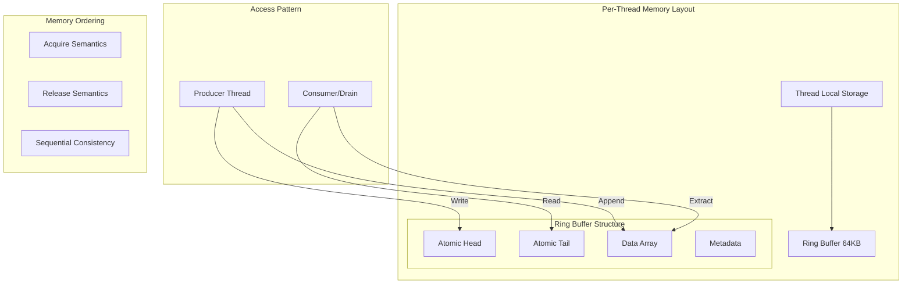
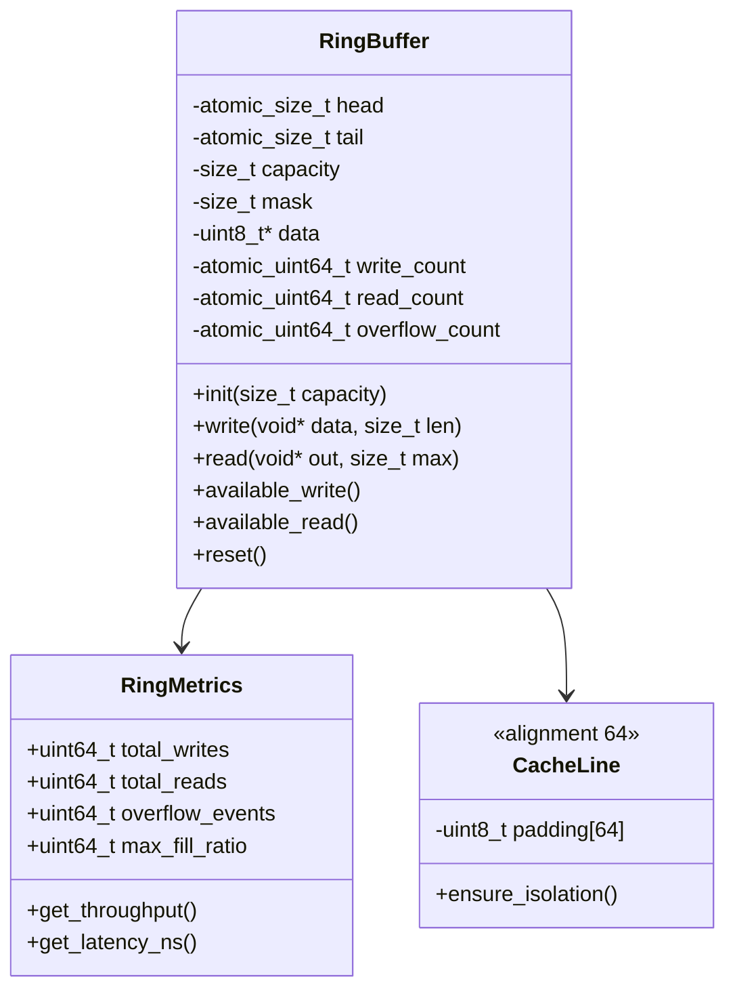
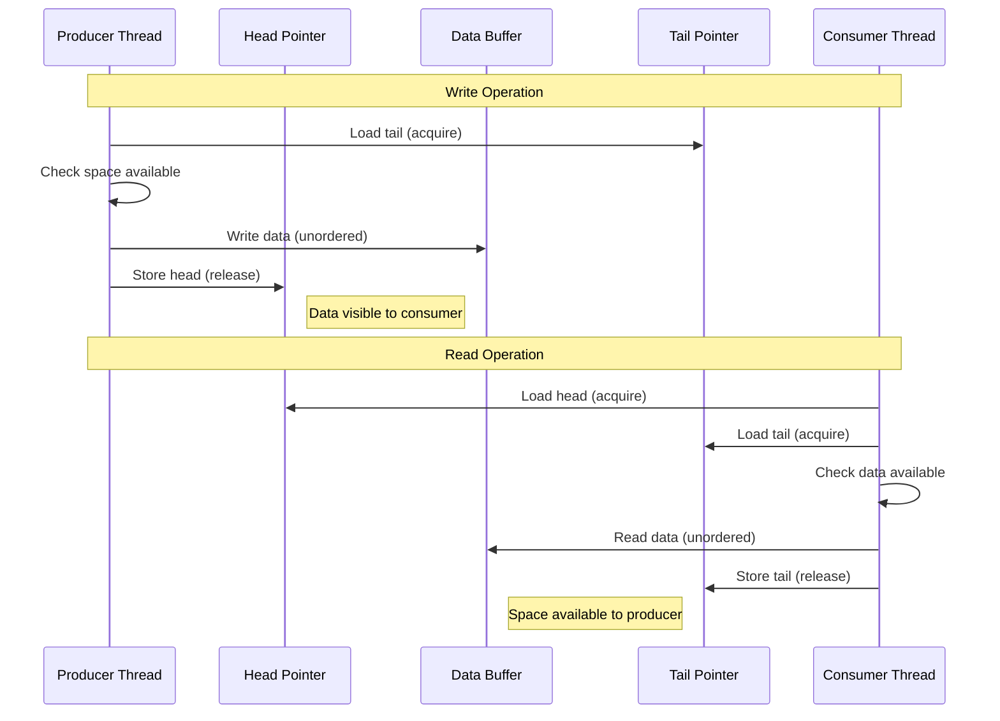
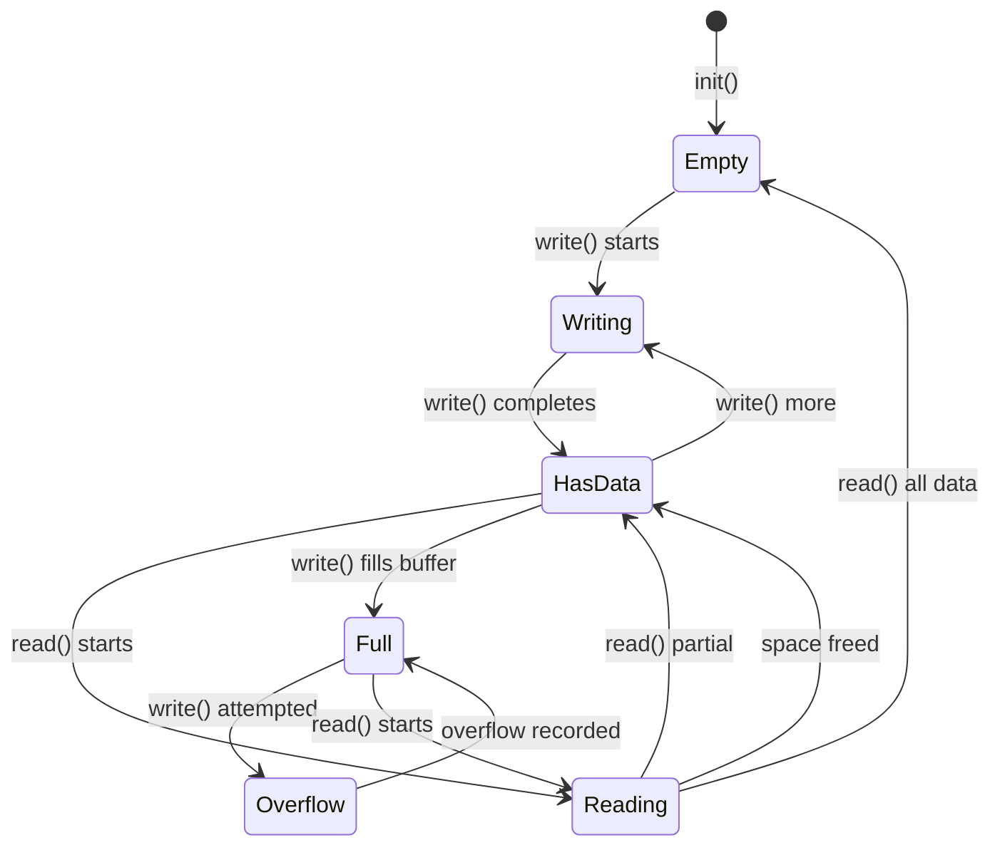

# M1_E1_I3 Technical Design: Ring Buffer Core

## Overview
Lock-free SPSC (Single Producer Single Consumer) ring buffer implementation for per-thread event storage. Each thread owns a dedicated ring buffer instance with no contention.

## Architecture

### System Context


### Component Design


## Data Structures

### Ring Buffer Layout
```c
// Cache-line aligned structure for zero false sharing
typedef struct ada_ring_buffer {
    // Producer cache line (64 bytes)
    union {
        struct {
            _Atomic(size_t) head;        // Write position
            _Atomic(uint64_t) write_count; // Total writes
            size_t capacity;              // Buffer size
            size_t mask;                  // For fast modulo
        } producer;
        uint8_t _pad1[64];
    };
    
    // Consumer cache line (64 bytes)
    union {
        struct {
            _Atomic(size_t) tail;         // Read position
            _Atomic(uint64_t) read_count;  // Total reads
            _Atomic(uint64_t) overflow_count; // Dropped events
            void* consumer_ctx;           // Consumer state
        } consumer;
        uint8_t _pad2[64];
    };
    
    // Shared read-only data
    uint8_t* data;                       // Event data array
    size_t data_size;                    // Actual data size
    
    // Metrics cache line
    union {
        struct {
            _Atomic(uint64_t) last_write_ns;
            _Atomic(uint64_t) last_read_ns;
            _Atomic(size_t) max_used;
        } metrics;
        uint8_t _pad3[64];
    };
} ada_ring_buffer_t;

// Event header for variable-length storage
typedef struct ada_event_header {
    uint32_t size;          // Total size including header
    uint32_t type;          // Event type identifier
    uint64_t timestamp_ns;  // Nanosecond timestamp
} ada_event_header_t;
```

## Algorithms

### Lock-Free Write Operation
```c
// Producer: Single thread write with memory ordering
int ada_ring_write(ada_ring_buffer_t* ring, const void* data, size_t len) {
    // Check alignment and size
    if (len == 0 || len > ring->capacity / 2) {
        return -EINVAL;
    }
    
    // Load head with acquire (synchronize with consumer)
    size_t head = atomic_load_explicit(&ring->producer.head, 
                                       memory_order_acquire);
    
    // Load tail with acquire for available space check
    size_t tail = atomic_load_explicit(&ring->consumer.tail,
                                       memory_order_acquire);
    
    // Calculate available space (handle wraparound)
    size_t available = (tail + ring->capacity - head - 1) & ring->mask;
    
    if (available < len) {
        // Buffer full - record overflow
        atomic_fetch_add_explicit(&ring->consumer.overflow_count, 1,
                                 memory_order_relaxed);
        return -ENOSPC;
    }
    
    // Copy data (may wrap around)
    size_t first_part = ring->capacity - (head & ring->mask);
    if (first_part >= len) {
        // Single contiguous write
        memcpy(ring->data + (head & ring->mask), data, len);
    } else {
        // Split write at boundary
        memcpy(ring->data + (head & ring->mask), data, first_part);
        memcpy(ring->data, (uint8_t*)data + first_part, len - first_part);
    }
    
    // Update head with release (make data visible to consumer)
    atomic_store_explicit(&ring->producer.head, head + len,
                         memory_order_release);
    
    // Update metrics
    atomic_fetch_add_explicit(&ring->producer.write_count, 1,
                             memory_order_relaxed);
    
    return 0;
}
```

### Lock-Free Read Operation
```c
// Consumer: Single thread read with memory ordering
ssize_t ada_ring_read(ada_ring_buffer_t* ring, void* out, size_t max_len) {
    // Load tail with acquire
    size_t tail = atomic_load_explicit(&ring->consumer.tail,
                                       memory_order_acquire);
    
    // Load head with acquire (synchronize with producer)
    size_t head = atomic_load_explicit(&ring->producer.head,
                                       memory_order_acquire);
    
    // Calculate available data
    size_t available = (head - tail) & ring->mask;
    if (available == 0) {
        return 0; // Empty buffer
    }
    
    // Limit read to max_len
    size_t to_read = (available < max_len) ? available : max_len;
    
    // Copy data (may wrap around)
    size_t first_part = ring->capacity - (tail & ring->mask);
    if (first_part >= to_read) {
        // Single contiguous read
        memcpy(out, ring->data + (tail & ring->mask), to_read);
    } else {
        // Split read at boundary
        memcpy(out, ring->data + (tail & ring->mask), first_part);
        memcpy((uint8_t*)out + first_part, ring->data, to_read - first_part);
    }
    
    // Update tail with release
    atomic_store_explicit(&ring->consumer.tail, tail + to_read,
                         memory_order_release);
    
    // Update metrics
    atomic_fetch_add_explicit(&ring->consumer.read_count, 1,
                             memory_order_relaxed);
    
    return to_read;
}
```

## Memory Ordering Strategy

### Sequence Diagram


### State Machine


## Performance Characteristics

### Cache Line Optimization
```c
// Ensure cache line alignment and padding
_Static_assert(sizeof(((ada_ring_buffer_t*)0)->producer) == 64,
               "Producer section must be exactly one cache line");
_Static_assert(sizeof(((ada_ring_buffer_t*)0)->consumer) == 64,
               "Consumer section must be exactly one cache line");
_Static_assert(offsetof(ada_ring_buffer_t, consumer) == 64,
               "Consumer must start at cache line boundary");
```

### Throughput Calculations
```c
// Target: 10M+ operations per second
// Assumptions:
// - 64-byte cache line
// - ~10ns cache miss penalty
// - ~1ns L1 cache hit
// - No contention (SPSC)

// Best case (all cache hits):
// Write: 1 load + 1 memcpy + 1 store = ~5ns
// Read: 2 loads + 1 memcpy + 1 store = ~6ns
// Throughput: 200M ops/sec theoretical

// Realistic case (some cache misses):
// Write: ~20ns (with occasional miss)
// Read: ~25ns (with occasional miss)
// Throughput: 40-50M ops/sec expected

// Worst case (constant misses):
// Write/Read: ~50ns
// Throughput: 20M ops/sec minimum
```

## Integration Points

### Thread Registry Integration
```c
// Allocation through ThreadRegistry
ada_ring_buffer_t* ada_thread_get_ring(ada_thread_context_t* ctx) {
    // Ring buffer embedded in thread context
    return &ctx->ring_buffer;
}

// Initialize during thread registration
int ada_thread_init_ring(ada_thread_context_t* ctx) {
    ada_ring_buffer_t* ring = &ctx->ring_buffer;
    
    // Allocate 64KB data buffer
    ring->data = aligned_alloc(64, 65536);
    if (!ring->data) return -ENOMEM;
    
    ring->capacity = 65536;
    ring->mask = 65535;  // Power of 2 - 1
    
    // Initialize atomics
    atomic_init(&ring->producer.head, 0);
    atomic_init(&ring->consumer.tail, 0);
    atomic_init(&ring->producer.write_count, 0);
    atomic_init(&ring->consumer.read_count, 0);
    atomic_init(&ring->consumer.overflow_count, 0);
    
    return 0;
}
```

### Drain Thread Integration
```c
// Consumer side - drain thread
void* ada_drain_worker(void* arg) {
    ada_drain_context_t* drain = arg;
    uint8_t buffer[4096];
    
    while (!atomic_load(&drain->shutdown)) {
        // Iterate all registered threads
        for (int i = 0; i < MAX_THREADS; i++) {
            ada_thread_context_t* ctx = &drain->threads[i];
            if (!ctx->active) continue;
            
            // Drain this thread's ring
            ada_ring_buffer_t* ring = &ctx->ring_buffer;
            ssize_t bytes = ada_ring_read(ring, buffer, sizeof(buffer));
            
            if (bytes > 0) {
                // Process drained data
                ada_process_events(buffer, bytes);
            }
        }
        
        // Brief sleep to prevent spinning
        usleep(100); // 100us
    }
    
    return NULL;
}
```

## Error Handling

### Return Codes
```c
// Standard error codes
#define ADA_RING_SUCCESS      0
#define ADA_RING_FULL        -1  // No space available
#define ADA_RING_EMPTY       -2  // No data available
#define ADA_RING_INVALID     -3  // Invalid parameters
#define ADA_RING_CORRUPTED   -4  // Data corruption detected
```

### Overflow Handling
```c
// Configurable overflow behavior
typedef enum {
    ADA_OVERFLOW_DROP,      // Drop new events (default)
    ADA_OVERFLOW_OVERWRITE, // Overwrite oldest events
    ADA_OVERFLOW_BLOCK      // Block until space (not lock-free!)
} ada_overflow_mode_t;

// Set per-ring overflow policy
void ada_ring_set_overflow_mode(ada_ring_buffer_t* ring,
                                ada_overflow_mode_t mode);
```

## Security Considerations

1. **Memory Safety**
   - Bounds checking on all operations
   - No buffer overflows possible
   - Wraparound arithmetic validated

2. **Thread Safety**
   - SPSC guarantees no races
   - Memory ordering prevents reordering
   - ThreadSanitizer validation

3. **Data Integrity**
   - Optional checksums on events
   - Sequence numbers for ordering
   - Corruption detection

## Testing Requirements

1. **Unit Tests**
   - Basic read/write operations
   - Wraparound handling
   - Overflow conditions
   - Memory ordering validation

2. **Performance Tests**
   - Throughput benchmarks
   - Latency measurements
   - Cache miss analysis

3. **Stress Tests**
   - Continuous read/write
   - Maximum throughput
   - Long-duration stability

4. **ThreadSanitizer**
   - No data races
   - Proper synchronization
   - Memory ordering correctness

## Implementation Addendum (M1 Scope)

- For M1, the production path uses fixed-size event rings (IndexEvent/DetailEvent). The variable-length event header discussed in earlier drafts is deferred to a later iteration to minimize risk.
- Effective capacity is rounded down to the nearest power-of-two; a cached mask is used for wrap and availability arithmetic.
- Producer and consumer indices are placed on separate cache lines to reduce false sharing.
- Lightweight smoke tests for throughput and p99 latency validate basic performance characteristics in CI; deeper benchmarks and long-duration stress should be run locally when tuning.

### Local Validation Tips

- Enable ThreadSanitizer for C/C++ via Cargo’s CMake bridge:

```
ADA_ENABLE_THREAD_SANITIZER=1 cargo test -p tracer_backend --lib
```

- Enable AddressSanitizer similarly:

```
ADA_ENABLE_ADDRESS_SANITIZER=1 cargo test -p tracer_backend --lib
```

- Run ring-only tests:

```
cargo test -p tracer_backend --lib tests::test_ring_buffer
```
