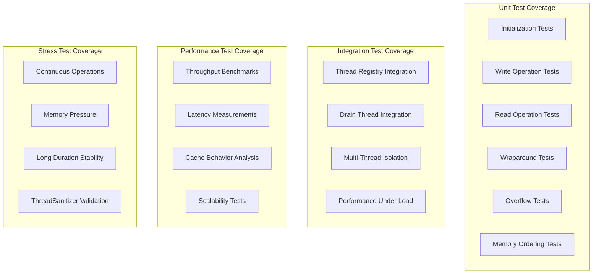

# M1_E1_I3 Test Plan: Ring Buffer Core

## Test Coverage Map



## Test Matrix

| Test Category | Test Case | Priority | Dependencies | Success Criteria |
|--------------|-----------|----------|--------------|------------------|
| **Initialization** | | | | |
| Unit | ring_buffer__init_valid_size__then_succeeds | P0 | None | Returns 0, all fields initialized |
| Unit | ring_buffer__init_invalid_size__then_fails | P0 | None | Returns -EINVAL |
| Unit | ring_buffer__init_non_power_of_two__then_rounds_up | P1 | None | Capacity adjusted to power of 2 |
| Unit | ring_buffer__double_init__then_resets_state | P1 | None | Previous state cleared |
| **Write Operations** | | | | |
| Unit | ring_buffer__write_empty__then_succeeds | P0 | Init | Data written, head updated |
| Unit | ring_buffer__write_full__then_returns_overflow | P0 | Init | Returns -ENOSPC, overflow count++ |
| Unit | ring_buffer__write_zero_length__then_returns_invalid | P0 | Init | Returns -EINVAL |
| Unit | ring_buffer__write_exceeds_half_capacity__then_returns_invalid | P1 | Init | Returns -EINVAL |
| **Read Operations** | | | | |
| Unit | ring_buffer__read_empty__then_returns_zero | P0 | Init | Returns 0, no data modified |
| Unit | ring_buffer__read_available__then_returns_data | P0 | Write | Returns bytes read, data matches |
| Unit | ring_buffer__read_partial__then_leaves_remainder | P0 | Write | Partial read, remainder available |
| Unit | ring_buffer__read_exact__then_empties_buffer | P1 | Write | All data read, buffer empty |
| **Wraparound** | | | | |
| Unit | ring_buffer__write_wraparound__then_splits_correctly | P0 | Init | Data split at boundary |
| Unit | ring_buffer__read_wraparound__then_reassembles_correctly | P0 | Write wrap | Data reassembled correctly |
| Unit | ring_buffer__multiple_wraparounds__then_maintains_order | P1 | Multiple ops | FIFO order preserved |
| **Overflow Handling** | | | | |
| Unit | ring_buffer__overflow_drop_mode__then_increments_counter | P0 | Full buffer | Counter incremented, data dropped |
| Unit | ring_buffer__overflow_recovery__then_continues_normally | P1 | Overflow | Normal operation after space freed |
| **Memory Ordering** | | | | |
| Unit | ring_buffer__concurrent_write_read__then_no_tearing | P0 | TSAN | No partial reads observed |
| Unit | ring_buffer__memory_barriers__then_proper_synchronization | P0 | TSAN | Acquire/release semantics verified |
| Unit | ring_buffer__cache_line_isolation__then_no_false_sharing | P1 | Perf | No false sharing detected |
| **Integration** | | | | |
| Integration | ring_buffer__thread_registry_allocation__then_properly_aligned | P0 | ThreadRegistry | 64-byte aligned allocation |
| Integration | ring_buffer__drain_thread_consumer__then_drains_all_rings | P0 | Drain thread | All rings drained in round-robin |
| Integration | ring_buffer__multi_thread_isolation__then_no_interference | P0 | Multiple threads | Each thread isolated |
| **Performance** | | | | |
| Performance | ring_buffer__throughput_single_thread__then_exceeds_10M_ops | P0 | None | >10M ops/sec achieved |
| Performance | ring_buffer__latency_p99__then_under_100ns | P1 | None | P99 latency <100ns |
| Performance | ring_buffer__cache_misses__then_minimal | P2 | Perf counters | <5% cache miss rate |
| **Stress** | | | | |
| Stress | ring_buffer__continuous_24h__then_stable | P1 | None | No degradation over 24 hours |
| Stress | ring_buffer__memory_pressure__then_graceful_degradation | P2 | Memory limits | Handles low memory gracefully |
| Stress | ring_buffer__tsan_clean__then_no_races | P0 | ThreadSanitizer | Zero races reported |

## Test Implementation Examples

### Unit Test: Basic Write/Read
```c
TEST(RingBufferTest, ring_buffer__write_read_cycle__then_data_matches) {
    // Arrange
    ada_ring_buffer_t ring;
    ASSERT_EQ(ada_ring_init(&ring, 65536), 0);
    
    const char* test_data = "Hello, Ring Buffer!";
    size_t data_len = strlen(test_data) + 1;
    
    // Act - Write
    int write_result = ada_ring_write(&ring, test_data, data_len);
    
    // Assert - Write succeeded
    ASSERT_EQ(write_result, 0);
    ASSERT_EQ(ada_ring_available_read(&ring), data_len);
    
    // Act - Read
    char read_buffer[256];
    ssize_t bytes_read = ada_ring_read(&ring, read_buffer, sizeof(read_buffer));
    
    // Assert - Read succeeded and data matches
    ASSERT_EQ(bytes_read, data_len);
    ASSERT_STREQ(read_buffer, test_data);
    ASSERT_EQ(ada_ring_available_read(&ring), 0);
    
    // Cleanup
    ada_ring_destroy(&ring);
}
```

### Unit Test: Wraparound Handling
```c
TEST(RingBufferTest, ring_buffer__wraparound__then_maintains_integrity) {
    // Arrange
    ada_ring_buffer_t ring;
    ASSERT_EQ(ada_ring_init(&ring, 1024), 0);  // Small buffer for easy wraparound
    
    uint8_t pattern[100];
    for (int i = 0; i < 100; i++) {
        pattern[i] = i;
    }
    
    // Act - Fill buffer near capacity
    for (int i = 0; i < 9; i++) {
        ASSERT_EQ(ada_ring_write(&ring, pattern, 100), 0);
    }
    
    // Read some data to free space at beginning
    uint8_t temp[500];
    ada_ring_read(&ring, temp, 500);
    
    // Write data that will wrap around
    ASSERT_EQ(ada_ring_write(&ring, pattern, 100), 0);
    
    // Read all remaining data
    uint8_t result[1024];
    ssize_t total_read = 0;
    while (true) {
        ssize_t bytes = ada_ring_read(&ring, result + total_read, 
                                      sizeof(result) - total_read);
        if (bytes == 0) break;
        total_read += bytes;
    }
    
    // Assert - Verify data integrity after wraparound
    ASSERT_GT(total_read, 0);
    // Check that pattern is preserved
    for (int i = 0; i < total_read - 99; i += 100) {
        for (int j = 0; j < 100 && i + j < total_read; j++) {
            ASSERT_EQ(result[i + j], j);
        }
    }
    
    ada_ring_destroy(&ring);
}
```

### Unit Test: Memory Ordering Validation
```c
TEST(RingBufferTest, ring_buffer__memory_ordering__then_proper_synchronization) {
    // This test uses ThreadSanitizer to validate memory ordering
    ada_ring_buffer_t ring;
    ASSERT_EQ(ada_ring_init(&ring, 65536), 0);
    
    std::atomic<bool> stop(false);
    std::atomic<uint64_t> write_count(0);
    std::atomic<uint64_t> read_count(0);
    std::atomic<uint64_t> mismatch_count(0);
    
    // Producer thread
    std::thread producer([&]() {
        uint64_t counter = 0;
        while (!stop.load()) {
            ada_event_header_t event = {
                .size = sizeof(ada_event_header_t) + sizeof(uint64_t),
                .type = 1,
                .timestamp_ns = counter
            };
            
            uint8_t buffer[sizeof(event) + sizeof(counter)];
            memcpy(buffer, &event, sizeof(event));
            memcpy(buffer + sizeof(event), &counter, sizeof(counter));
            
            if (ada_ring_write(&ring, buffer, sizeof(buffer)) == 0) {
                write_count.fetch_add(1);
                counter++;
            }
            
            // Small delay to prevent spinning
            std::this_thread::yield();
        }
    });
    
    // Consumer thread
    std::thread consumer([&]() {
        uint64_t expected = 0;
        uint8_t buffer[1024];
        
        while (!stop.load()) {
            ssize_t bytes = ada_ring_read(&ring, buffer, sizeof(buffer));
            
            size_t offset = 0;
            while (offset + sizeof(ada_event_header_t) <= bytes) {
                ada_event_header_t* event = (ada_event_header_t*)(buffer + offset);
                
                if (event->size > bytes - offset) break;
                
                uint64_t* value = (uint64_t*)(buffer + offset + sizeof(*event));
                
                // Verify sequential ordering
                if (*value != expected) {
                    mismatch_count.fetch_add(1);
                }
                expected = *value + 1;
                read_count.fetch_add(1);
                
                offset += event->size;
            }
            
            std::this_thread::yield();
        }
    });
    
    // Run for 1 second
    std::this_thread::sleep_for(std::chrono::seconds(1));
    stop.store(true);
    
    producer.join();
    consumer.join();
    
    // Assert - No mismatches in sequential ordering
    ASSERT_EQ(mismatch_count.load(), 0);
    ASSERT_GT(write_count.load(), 0);
    ASSERT_GT(read_count.load(), 0);
    
    // Verify metrics
    ASSERT_EQ(atomic_load(&ring.producer.write_count), write_count.load());
    ASSERT_EQ(atomic_load(&ring.consumer.read_count), read_count.load());
    
    ada_ring_destroy(&ring);
}
```

### Performance Test: Throughput Benchmark
```c
TEST(RingBufferPerf, ring_buffer__throughput__then_exceeds_target) {
    ada_ring_buffer_t ring;
    ASSERT_EQ(ada_ring_init(&ring, 65536), 0);
    
    const size_t event_size = 64;  // Typical event size
    uint8_t event_data[event_size];
    memset(event_data, 0xAA, event_size);
    
    const size_t target_ops = 10000000;  // 10M operations
    const size_t batch_size = 1000;
    
    // Warmup
    for (size_t i = 0; i < 10000; i++) {
        ada_ring_write(&ring, event_data, event_size);
        uint8_t temp[event_size];
        ada_ring_read(&ring, temp, event_size);
    }
    
    // Benchmark write throughput
    auto write_start = std::chrono::high_resolution_clock::now();
    
    size_t write_ops = 0;
    for (size_t i = 0; i < target_ops; i++) {
        if (ada_ring_write(&ring, event_data, event_size) == 0) {
            write_ops++;
        }
        
        // Periodic drain to prevent overflow
        if (i % batch_size == 0) {
            uint8_t drain[batch_size * event_size];
            ada_ring_read(&ring, drain, sizeof(drain));
        }
    }
    
    auto write_end = std::chrono::high_resolution_clock::now();
    auto write_duration = std::chrono::duration_cast<std::chrono::nanoseconds>(
        write_end - write_start).count();
    
    double write_throughput = (double)write_ops * 1e9 / write_duration;
    
    // Assert - Throughput exceeds 10M ops/sec
    ASSERT_GT(write_throughput, 10000000) 
        << "Write throughput: " << write_throughput << " ops/sec";
    
    // Benchmark read throughput
    // First fill the buffer
    while (ada_ring_write(&ring, event_data, event_size) == 0);
    
    auto read_start = std::chrono::high_resolution_clock::now();
    
    size_t read_ops = 0;
    uint8_t read_buffer[event_size];
    for (size_t i = 0; i < target_ops; i++) {
        if (ada_ring_read(&ring, read_buffer, event_size) > 0) {
            read_ops++;
        }
        
        // Periodic refill
        if (i % batch_size == 0) {
            for (size_t j = 0; j < batch_size; j++) {
                ada_ring_write(&ring, event_data, event_size);
            }
        }
    }
    
    auto read_end = std::chrono::high_resolution_clock::now();
    auto read_duration = std::chrono::duration_cast<std::chrono::nanoseconds>(
        read_end - read_start).count();
    
    double read_throughput = (double)read_ops * 1e9 / read_duration;
    
    // Assert - Read throughput also exceeds target
    ASSERT_GT(read_throughput, 10000000)
        << "Read throughput: " << read_throughput << " ops/sec";
    
    ada_ring_destroy(&ring);
}
```

### Performance Test: Latency Measurement
```c
TEST(RingBufferPerf, ring_buffer__latency_p99__then_under_100ns) {
    ada_ring_buffer_t ring;
    ASSERT_EQ(ada_ring_init(&ring, 65536), 0);
    
    const size_t num_samples = 100000;
    std::vector<uint64_t> write_latencies;
    std::vector<uint64_t> read_latencies;
    write_latencies.reserve(num_samples);
    read_latencies.reserve(num_samples);
    
    uint8_t data[64];
    memset(data, 0, sizeof(data));
    
    // Measure write latencies
    for (size_t i = 0; i < num_samples; i++) {
        auto start = std::chrono::high_resolution_clock::now();
        ada_ring_write(&ring, data, sizeof(data));
        auto end = std::chrono::high_resolution_clock::now();
        
        uint64_t latency = std::chrono::duration_cast<std::chrono::nanoseconds>(
            end - start).count();
        write_latencies.push_back(latency);
        
        // Keep buffer from filling
        if (i % 100 == 0) {
            uint8_t drain[6400];
            ada_ring_read(&ring, drain, sizeof(drain));
        }
    }
    
    // Fill buffer for read tests
    while (ada_ring_write(&ring, data, sizeof(data)) == 0);
    
    // Measure read latencies
    for (size_t i = 0; i < num_samples; i++) {
        uint8_t buffer[64];
        
        auto start = std::chrono::high_resolution_clock::now();
        ada_ring_read(&ring, buffer, sizeof(buffer));
        auto end = std::chrono::high_resolution_clock::now();
        
        uint64_t latency = std::chrono::duration_cast<std::chrono::nanoseconds>(
            end - start).count();
        read_latencies.push_back(latency);
        
        // Keep buffer from emptying
        if (i % 100 == 0) {
            for (int j = 0; j < 100; j++) {
                ada_ring_write(&ring, data, sizeof(data));
            }
        }
    }
    
    // Calculate percentiles
    std::sort(write_latencies.begin(), write_latencies.end());
    std::sort(read_latencies.begin(), read_latencies.end());
    
    size_t p50_idx = num_samples * 50 / 100;
    size_t p99_idx = num_samples * 99 / 100;
    size_t p999_idx = num_samples * 999 / 1000;
    
    // Assert - P99 latency under 100ns
    ASSERT_LT(write_latencies[p99_idx], 100)
        << "Write P99: " << write_latencies[p99_idx] << "ns";
    ASSERT_LT(read_latencies[p99_idx], 100)
        << "Read P99: " << read_latencies[p99_idx] << "ns";
    
    // Log percentiles for analysis
    std::cout << "Write latencies (ns) - P50: " << write_latencies[p50_idx]
              << ", P99: " << write_latencies[p99_idx]
              << ", P99.9: " << write_latencies[p999_idx] << std::endl;
    std::cout << "Read latencies (ns) - P50: " << read_latencies[p50_idx]
              << ", P99: " << read_latencies[p99_idx]
              << ", P99.9: " << read_latencies[p999_idx] << std::endl;
    
    ada_ring_destroy(&ring);
}
```

### Integration Test: Multi-Thread Isolation
```c
TEST(RingBufferIntegration, ring_buffer__multi_thread_isolation__then_no_interference) {
    const size_t num_threads = 16;
    const size_t ops_per_thread = 100000;
    
    struct thread_context {
        ada_ring_buffer_t ring;
        std::atomic<uint64_t> write_count;
        std::atomic<uint64_t> read_count;
        std::atomic<bool> error;
        uint64_t thread_id;
    };
    
    std::vector<thread_context> contexts(num_threads);
    std::vector<std::thread> producers;
    std::vector<std::thread> consumers;
    
    // Initialize rings
    for (size_t i = 0; i < num_threads; i++) {
        ASSERT_EQ(ada_ring_init(&contexts[i].ring, 65536), 0);
        contexts[i].write_count = 0;
        contexts[i].read_count = 0;
        contexts[i].error = false;
        contexts[i].thread_id = i;
    }
    
    // Start producer threads
    for (size_t i = 0; i < num_threads; i++) {
        producers.emplace_back([&contexts, i, ops_per_thread]() {
            auto& ctx = contexts[i];
            
            for (size_t op = 0; op < ops_per_thread; op++) {
                // Create unique data for this thread
                struct {
                    uint64_t thread_id;
                    uint64_t sequence;
                } data = { i, op };
                
                if (ada_ring_write(&ctx.ring, &data, sizeof(data)) == 0) {
                    ctx.write_count.fetch_add(1);
                }
                
                // Yield occasionally
                if (op % 1000 == 0) {
                    std::this_thread::yield();
                }
            }
        });
    }
    
    // Start consumer threads
    for (size_t i = 0; i < num_threads; i++) {
        consumers.emplace_back([&contexts, i]() {
            auto& ctx = contexts[i];
            uint64_t expected_sequence = 0;
            
            while (ctx.read_count.load() < ctx.write_count.load() || 
                   ctx.write_count.load() == 0) {
                struct {
                    uint64_t thread_id;
                    uint64_t sequence;
                } data;
                
                if (ada_ring_read(&ctx.ring, &data, sizeof(data)) > 0) {
                    // Verify this is our thread's data
                    if (data.thread_id != i) {
                        ctx.error.store(true);
                        break;
                    }
                    
                    // Verify sequence
                    if (data.sequence != expected_sequence) {
                        ctx.error.store(true);
                        break;
                    }
                    
                    expected_sequence++;
                    ctx.read_count.fetch_add(1);
                }
                
                std::this_thread::yield();
            }
        });
    }
    
    // Wait for all threads
    for (auto& t : producers) t.join();
    for (auto& t : consumers) t.join();
    
    // Verify isolation - no cross-thread interference
    for (size_t i = 0; i < num_threads; i++) {
        ASSERT_FALSE(contexts[i].error.load())
            << "Thread " << i << " detected interference";
        ASSERT_EQ(contexts[i].write_count.load(), ops_per_thread)
            << "Thread " << i << " write count mismatch";
        ASSERT_EQ(contexts[i].read_count.load(), ops_per_thread)
            << "Thread " << i << " read count mismatch";
        
        ada_ring_destroy(&contexts[i].ring);
    }
}
```

## Acceptance Criteria

### Functional Requirements
- [ ] Ring buffer initializes with power-of-2 capacity
- [ ] Write operation is lock-free with single producer
- [ ] Read operation is lock-free with single consumer
- [ ] Wraparound handled correctly at buffer boundary
- [ ] Overflow detection and counting
- [ ] Zero false sharing between cache lines

### Performance Requirements
- [ ] Throughput exceeds 10M ops/second
- [ ] P99 latency under 100ns
- [ ] Cache miss rate under 5%
- [ ] No performance degradation over time

### Reliability Requirements
- [ ] ThreadSanitizer reports no races
- [ ] Valgrind reports no memory errors
- [ ] 24-hour stress test passes
- [ ] Graceful handling of edge cases

### Integration Requirements
- [ ] Integrates with ThreadRegistry
- [ ] Compatible with drain thread consumer
- [ ] Per-thread isolation maintained
- [ ] Memory properly aligned and managed

## Test Execution Strategy

### Phase 1: Unit Testing (Day 1)
1. Implement basic ring buffer structure
2. Write initialization tests
3. Implement write/read operations
4. Test wraparound logic
5. Verify overflow handling

### Phase 2: Performance Testing (Day 2)
1. Implement throughput benchmarks
2. Measure latency percentiles
3. Analyze cache behavior
4. Optimize based on results

### Phase 3: Integration Testing (Day 3)
1. Integrate with ThreadRegistry
2. Test multi-thread isolation
3. Implement drain thread consumer
4. Verify end-to-end operation

### Phase 4: Validation (Day 4)
1. Run ThreadSanitizer validation
2. Execute stress tests
3. Performance regression testing
4. Documentation and cleanup

## Coverage Requirements

```yaml
coverage:
  target: 100%
  enforcement: strict
  exclusions:
    - test files
    - benchmark code
  
  required:
    - All public API functions
    - All error paths
    - All edge cases
    - Memory ordering paths
```

## Risk Mitigation

| Risk | Mitigation | Test Coverage |
|------|------------|---------------|
| Memory ordering bugs | ThreadSanitizer validation | Memory ordering tests |
| Performance regression | Continuous benchmarking | Performance test suite |
| Cache line conflicts | Padding and alignment | Cache analysis tests |
| Overflow data loss | Configurable policies | Overflow handling tests |
| Integration issues | Early integration testing | Integration test suite |