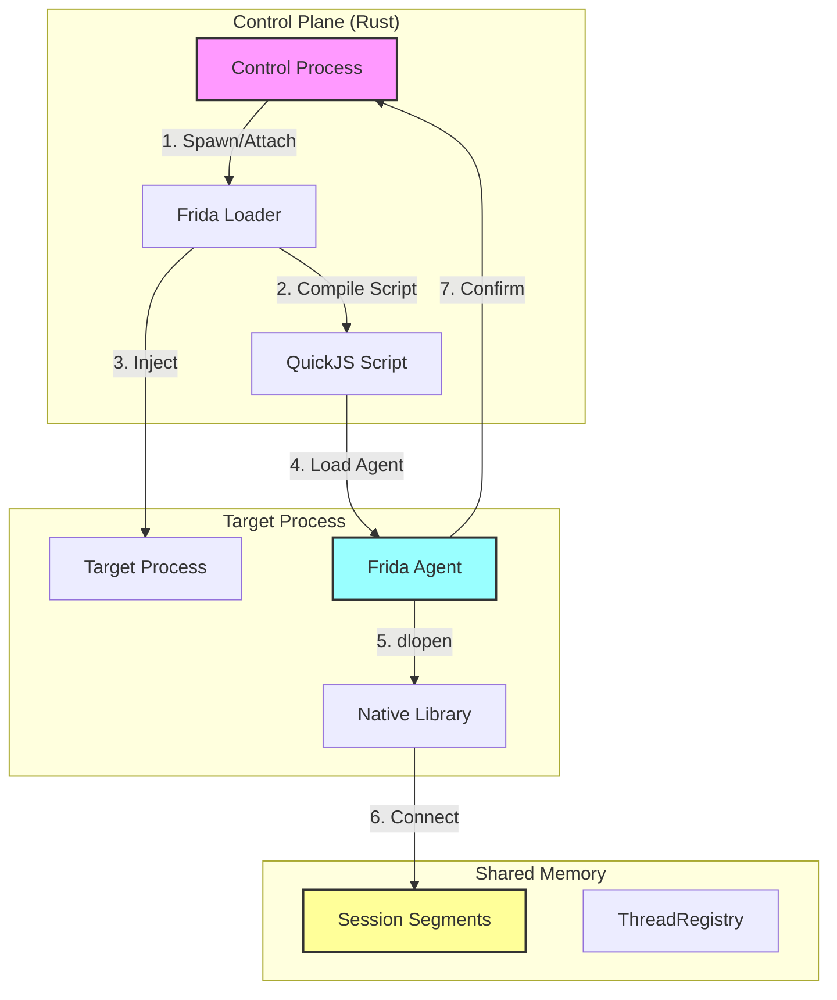
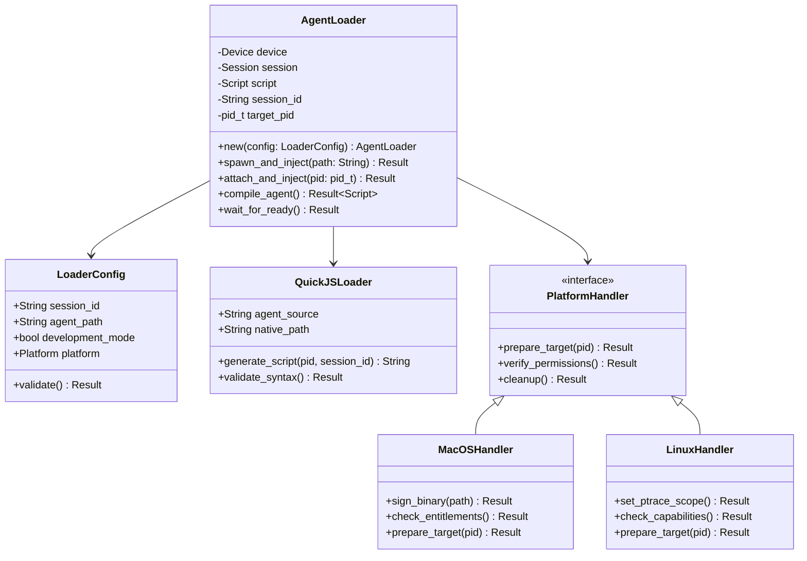
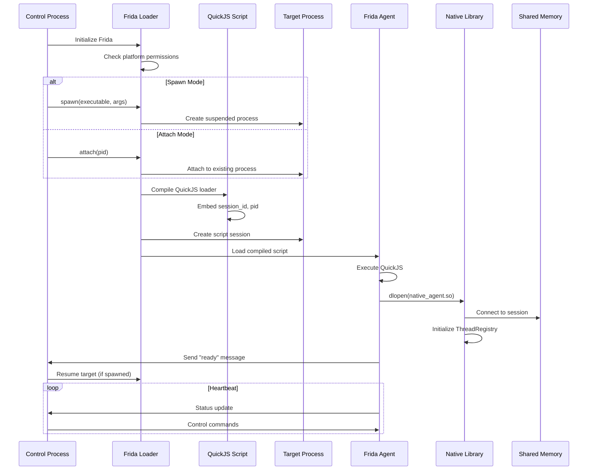

# M1_E1_I4 Technical Design: Agent Loader

## Iteration Overview

**Goal**: Implement Frida-based agent injection into target process with QuickJS loader

**Duration**: 3 days (Dec 16-18, 2024)

**Dependencies**:
- M1_E1_I1: Shared memory segments created and named

## Architecture

### System Architecture



### Component Hierarchy



### Injection Sequence



## Data Structures

### Core Types

```c
// Platform configuration
typedef enum {
    PLATFORM_MACOS,
    PLATFORM_LINUX,
    PLATFORM_UNKNOWN
} platform_t;

// Injection mode
typedef enum {
    MODE_SPAWN,
    MODE_ATTACH
} injection_mode_t;

// Agent state
typedef enum {
    AGENT_INITIALIZING,
    AGENT_LOADING,
    AGENT_READY,
    AGENT_ERROR,
    AGENT_DETACHED
} agent_state_t;

// Loader configuration
typedef struct loader_config {
    char session_id[64];
    char agent_path[256];
    char native_path[256];
    platform_t platform;
    bool development_mode;
    uint32_t timeout_ms;
} loader_config_t;

// Agent status
typedef struct agent_status {
    _Atomic(agent_state_t) state;
    pid_t target_pid;
    uint64_t inject_time;
    uint64_t ready_time;
    char error_msg[256];
} agent_status_t;

// Message from agent
typedef struct agent_message {
    enum {
        MSG_READY,
        MSG_ERROR,
        MSG_STATUS,
        MSG_LOG
    } type;
    union {
        struct {
            pid_t pid;
            uint64_t base_addr;
        } ready;
        struct {
            int code;
            char msg[256];
        } error;
        struct {
            uint64_t events_captured;
            uint64_t bytes_written;
        } status;
        struct {
            char text[512];
        } log;
    } data;
} agent_message_t;
```

### QuickJS Loader Template

```javascript
// Generated QuickJS loader script
const LOADER_TEMPLATE = `
(function() {
    const SESSION_ID = "{{SESSION_ID}}";
    const TARGET_PID = {{TARGET_PID}};
    const NATIVE_PATH = "{{NATIVE_PATH}}";
    
    // Platform detection
    const isWindows = Process.platform === 'windows';
    const isDarwin = Process.platform === 'darwin';
    const isLinux = Process.platform === 'linux';
    
    // Load native agent
    function loadNativeAgent() {
        try {
            // Construct full path
            const libName = isDarwin ? 'libada_agent.dylib' : 
                           isLinux ? 'libada_agent.so' : 
                           null;
            
            if (!libName) {
                throw new Error('Unsupported platform: ' + Process.platform);
            }
            
            const fullPath = NATIVE_PATH + '/' + libName;
            
            // Load the library
            const lib = Module.load(fullPath);
            
            // Initialize the agent
            const init_func = lib.getExportByName('ada_agent_init');
            const InitAgent = new NativeFunction(init_func, 'int', ['pointer', 'int']);
            
            // Pass session ID and PID
            const sessionBuf = Memory.allocUtf8String(SESSION_ID);
            const result = InitAgent(sessionBuf, TARGET_PID);
            
            if (result !== 0) {
                throw new Error('Agent initialization failed: ' + result);
            }
            
            return lib;
        } catch (e) {
            send({
                type: 'error',
                payload: {
                    code: -1,
                    message: e.toString()
                }
            });
            throw e;
        }
    }
    
    // Install hooks
    function installHooks(lib) {
        // Get hook installation function
        const install_func = lib.getExportByName('ada_install_hooks');
        const InstallHooks = new NativeFunction(install_func, 'int', []);
        
        const result = InstallHooks();
        if (result !== 0) {
            throw new Error('Hook installation failed: ' + result);
        }
    }
    
    // Main entry point
    function main() {
        try {
            // Load native library
            const lib = loadNativeAgent();
            
            // Install hooks
            installHooks(lib);
            
            // Notify ready
            send({
                type: 'ready',
                payload: {
                    pid: TARGET_PID,
                    base_addr: lib.base.toString()
                }
            });
            
            // Setup periodic status updates
            setInterval(function() {
                const status_func = lib.getExportByName('ada_agent_status');
                const GetStatus = new NativeFunction(status_func, 'pointer', []);
                
                const statusPtr = GetStatus();
                if (!statusPtr.isNull()) {
                    const events = statusPtr.readU64();
                    const bytes = statusPtr.add(8).readU64();
                    
                    send({
                        type: 'status',
                        payload: {
                            events_captured: events.toString(),
                            bytes_written: bytes.toString()
                        }
                    });
                }
            }, 1000);
            
        } catch (e) {
            send({
                type: 'error',
                payload: {
                    code: -2,
                    message: 'Main failed: ' + e.toString()
                }
            });
        }
    }
    
    // Run
    main();
})();
`;
```

## Memory Model

### Thread Safety

```c
// Agent initialization with atomic state
typedef struct agent_context {
    _Atomic(agent_state_t) state;
    _Atomic(uint64_t) event_count;
    _Atomic(uint64_t) byte_count;
    
    // Session connection
    char session_id[64];
    pid_t target_pid;
    void* shm_base;
    
    // Platform specific
    platform_t platform;
    void* platform_data;
} agent_context_t;

// Global agent context (per-process singleton)
static agent_context_t g_agent_ctx = {
    .state = AGENT_INITIALIZING,
    .event_count = ATOMIC_VAR_INIT(0),
    .byte_count = ATOMIC_VAR_INIT(0)
};

// Thread-safe state transition
bool agent_set_state(agent_state_t new_state) {
    agent_state_t expected = atomic_load_explicit(&g_agent_ctx.state, 
                                                  memory_order_acquire);
    
    // Validate transition
    switch (new_state) {
    case AGENT_READY:
        if (expected != AGENT_LOADING) return false;
        break;
    case AGENT_ERROR:
        // Can transition from any state to error
        break;
    case AGENT_DETACHED:
        if (expected == AGENT_ERROR) return false;
        break;
    default:
        return false;
    }
    
    return atomic_compare_exchange_strong_explicit(
        &g_agent_ctx.state,
        &expected,
        new_state,
        memory_order_release,
        memory_order_acquire
    );
}
```

### Platform-Specific Handling

```c
// macOS code signing
#ifdef __APPLE__
int macos_prepare_injection(const char* binary_path) {
    // Check for developer certificate
    if (access("/usr/bin/codesign", X_OK) != 0) {
        return -ENOENT;
    }
    
    // Sign the binary
    char cmd[512];
    snprintf(cmd, sizeof(cmd), 
             "codesign --force --deep --sign - %s", 
             binary_path);
    
    int ret = system(cmd);
    if (ret != 0) {
        fprintf(stderr, "Code signing failed: %d\n", ret);
        return -EPERM;
    }
    
    // Verify entitlements
    snprintf(cmd, sizeof(cmd),
             "codesign -d --entitlements - %s 2>/dev/null | "
             "grep -q com.apple.security.cs.debugger",
             binary_path);
    
    ret = system(cmd);
    if (ret != 0) {
        fprintf(stderr, "Missing debugger entitlement\n");
        return -EPERM;
    }
    
    return 0;
}
#endif

// Linux ptrace setup
#ifdef __linux__
int linux_prepare_injection(pid_t target_pid) {
    // Check ptrace scope
    FILE* f = fopen("/proc/sys/kernel/yama/ptrace_scope", "r");
    if (!f) {
        return -ENOENT;
    }
    
    int scope;
    if (fscanf(f, "%d", &scope) != 1) {
        fclose(f);
        return -EIO;
    }
    fclose(f);
    
    // Scope 0: Classic ptrace
    // Scope 1: Restricted ptrace (need CAP_SYS_PTRACE or same uid)
    // Scope 2: Admin only
    // Scope 3: No ptrace
    
    if (scope >= 2) {
        fprintf(stderr, "ptrace_scope=%d, injection may fail\n", scope);
        
        // Check for CAP_SYS_PTRACE
        if (prctl(PR_CAPBSET_READ, CAP_SYS_PTRACE) < 0) {
            return -EPERM;
        }
    }
    
    // Try to attach (will fail if not permitted)
    if (ptrace(PTRACE_ATTACH, target_pid, NULL, NULL) < 0) {
        return -errno;
    }
    
    // Detach immediately
    ptrace(PTRACE_DETACH, target_pid, NULL, NULL);
    
    return 0;
}
#endif
```

## Error Handling

### Error Categories

```c
typedef enum {
    ERR_NONE = 0,
    
    // Platform errors (1000-1999)
    ERR_PLATFORM_UNSUPPORTED = 1000,
    ERR_PLATFORM_PERMISSION = 1001,
    ERR_PLATFORM_CODESIGN = 1002,
    ERR_PLATFORM_PTRACE = 1003,
    
    // Frida errors (2000-2999)
    ERR_FRIDA_INIT = 2000,
    ERR_FRIDA_DEVICE = 2001,
    ERR_FRIDA_SESSION = 2002,
    ERR_FRIDA_SCRIPT = 2003,
    ERR_FRIDA_COMPILE = 2004,
    ERR_FRIDA_LOAD = 2005,
    
    // Agent errors (3000-3999)
    ERR_AGENT_NOT_FOUND = 3000,
    ERR_AGENT_LOAD_FAILED = 3001,
    ERR_AGENT_INIT_FAILED = 3002,
    ERR_AGENT_TIMEOUT = 3003,
    ERR_AGENT_CRASHED = 3004,
    
    // Session errors (4000-4999)
    ERR_SESSION_INVALID = 4000,
    ERR_SESSION_SHM_FAILED = 4001,
    ERR_SESSION_CONNECT_FAILED = 4002
} error_code_t;

// Error context
typedef struct error_context {
    error_code_t code;
    char message[256];
    char details[512];
    uint64_t timestamp;
    pid_t pid;
} error_context_t;

// User-friendly error messages
const char* get_user_message(error_code_t code) {
    switch (code) {
    case ERR_PLATFORM_PERMISSION:
        return "Permission denied. On macOS, ensure you have a valid "
               "Apple Developer certificate. On Linux, check ptrace permissions.";
    
    case ERR_PLATFORM_CODESIGN:
        return "Code signing failed. Run: ./utils/sign_binary.sh <path>";
    
    case ERR_PLATFORM_PTRACE:
        return "Cannot attach to process. Check /proc/sys/kernel/yama/ptrace_scope "
               "or run with CAP_SYS_PTRACE capability.";
    
    case ERR_FRIDA_DEVICE:
        return "Failed to get Frida device. Ensure Frida is properly installed.";
    
    case ERR_AGENT_NOT_FOUND:
        return "Agent library not found. Run: cargo build --release";
    
    case ERR_AGENT_TIMEOUT:
        return "Agent failed to initialize within timeout period. "
               "Check target process logs.";
    
    default:
        return "An unexpected error occurred. Check logs for details.";
    }
}
```

## Performance Considerations

### Injection Timing

```c
typedef struct injection_metrics {
    uint64_t frida_init_ns;
    uint64_t session_create_ns;
    uint64_t script_compile_ns;
    uint64_t script_load_ns;
    uint64_t agent_init_ns;
    uint64_t total_ns;
} injection_metrics_t;

// Target latencies
#define TARGET_FRIDA_INIT_MS     50
#define TARGET_SESSION_CREATE_MS 20
#define TARGET_SCRIPT_COMPILE_MS 10
#define TARGET_SCRIPT_LOAD_MS    30
#define TARGET_AGENT_INIT_MS     10
#define TARGET_TOTAL_MS          120
```

### Memory Overhead

```c
// Memory usage targets
#define MAX_LOADER_MEMORY_KB    512   // QuickJS script
#define MAX_AGENT_MEMORY_KB     2048  // Native agent
#define MAX_BUFFER_MEMORY_MB    64    // Ring buffers
```

## Integration Points

### With M1_E1_I1 (Session Management)

```c
// Connect to existing session
int agent_connect_session(const char* session_id, pid_t pid) {
    // Format shared memory name
    char shm_name[128];
    snprintf(shm_name, sizeof(shm_name), 
             "/ada_session_%s_%d", session_id, pid);
    
    // Open shared memory
    int fd = shm_open(shm_name, O_RDWR, 0666);
    if (fd < 0) {
        return -errno;
    }
    
    // Map memory
    size_t size = sizeof(thread_registry_t) + 
                  (64 * sizeof(thread_lane_t));
    
    void* addr = mmap(NULL, size, PROT_READ | PROT_WRITE,
                     MAP_SHARED, fd, 0);
    if (addr == MAP_FAILED) {
        close(fd);
        return -errno;
    }
    
    g_agent_ctx.shm_base = addr;
    strncpy(g_agent_ctx.session_id, session_id, 63);
    g_agent_ctx.target_pid = pid;
    
    return 0;
}
```

### With Future Iterations

```c
// Hook points for future features
typedef struct agent_hooks {
    // M1_E1_I5: Function interception
    void (*on_function_enter)(void* addr, void* sp);
    void (*on_function_exit)(void* addr, void* ret);
    
    // M1_E2: Event pipeline
    void (*on_event_captured)(event_t* event);
    void (*on_buffer_full)(void* buffer);
    
    // M1_E3: Query interface
    void (*on_query_request)(query_t* query);
} agent_hooks_t;
```

## Build Configuration

### Development vs Production

```rust
// Rust side configuration
pub struct AgentLoaderBuilder {
    development_mode: bool,
    agent_path: Option<PathBuf>,
    native_path: Option<PathBuf>,
    timeout: Duration,
}

impl AgentLoaderBuilder {
    pub fn development() -> Self {
        Self {
            development_mode: true,
            agent_path: Some(PathBuf::from("target/debug")),
            native_path: Some(PathBuf::from("target/debug")),
            timeout: Duration::from_secs(30),
        }
    }
    
    pub fn production() -> Self {
        Self {
            development_mode: false,
            agent_path: Some(PathBuf::from("target/release")),
            native_path: Some(PathBuf::from("target/release")),
            timeout: Duration::from_secs(5),
        }
    }
}
```

## Success Criteria

1. **Functional Requirements**
   - Successfully inject into spawned processes
   - Successfully attach to running processes
   - Receive confirmation message from agent
   - Handle both development and production builds

2. **Performance Requirements**
   - Total injection time < 120ms
   - Memory overhead < 3MB
   - Zero impact on target process performance

3. **Platform Requirements**
   - macOS: Handle code signing automatically
   - Linux: Detect and report ptrace restrictions
   - Clear error messages for permission issues

4. **Integration Requirements**
   - Connect to session shared memory
   - Pass session_id and pid correctly
   - Support graceful detachment
# Deprecation Plan (End of I4)

Objective: Remove the QuickJS-script-based agent injection once I4 completes, with no functional gaps.

Prerequisites:
- Native dylib injection succeeds for both spawn and attach modes.
- Shared memory connection is verified post-injection.
- Missing-library path fails fast with clear diagnostics.
- All existing and new tests pass locally and in the integration gate.

Removal Steps:
1. Disable script injection by default and gate behind a legacy build flag for one iteration (if needed).
2. Update docs/tests to use native injection paths exclusively.
3. After soak (no regressions), remove legacy script injection code and tests.

Scope Notes:
- This plan does not affect native dylib injection; it is the authoritative path going forward.
