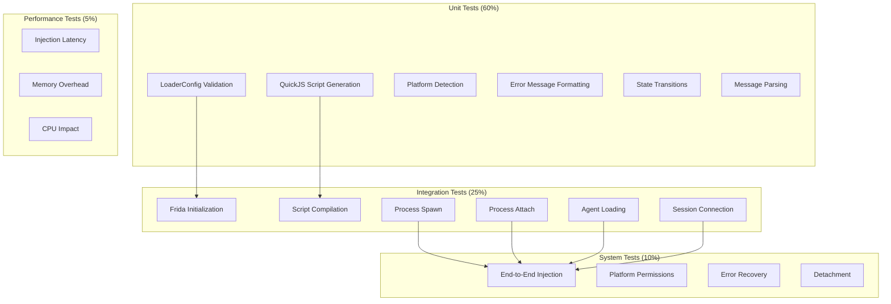

# M1_E1_I4 Test Plan: Agent Loader

## Test Coverage Map



## Test Matrix

| Category | Test Case | Priority | Coverage Target |
|----------|-----------|----------|-----------------|
| **Platform** | macOS code signing | P0 | 100% |
| **Platform** | Linux ptrace permissions | P0 | 100% |
| **Platform** | Unsupported platform detection | P1 | 100% |
| **Frida** | Device initialization | P0 | 100% |
| **Frida** | Session creation (spawn) | P0 | 100% |
| **Frida** | Session creation (attach) | P0 | 100% |
| **Frida** | Script compilation | P0 | 100% |
| **Frida** | Script loading | P0 | 100% |
| **Agent** | Native library loading | P0 | 100% |
| **Agent** | Initialization with session | P0 | 100% |
| **Agent** | Ready message receipt | P0 | 100% |
| **Agent** | Error message handling | P0 | 100% |
| **Agent** | Status updates | P1 | 100% |
| **Agent** | Graceful detachment | P1 | 100% |
| **Config** | Valid configuration | P0 | 100% |
| **Config** | Invalid paths | P0 | 100% |
| **Config** | Missing session ID | P0 | 100% |
| **Config** | Development vs production | P1 | 100% |
| **Error** | Permission denied | P0 | 100% |
| **Error** | Library not found | P0 | 100% |
| **Error** | Timeout handling | P0 | 100% |
| **Error** | User-friendly messages | P0 | 100% |

## Unit Tests

### LoaderConfig Tests

```c
// test_loader_config.c
#include <gtest/gtest.h>
#include "agent_loader.h"

TEST(LoaderConfig, valid_config__all_fields_set__then_validates) {
    loader_config_t config = {
        .session_id = "test_session_123",
        .agent_path = "/path/to/agent.js",
        .native_path = "/path/to/libada.so",
        .platform = PLATFORM_LINUX,
        .development_mode = false,
        .timeout_ms = 5000
    };
    
    EXPECT_EQ(validate_loader_config(&config), 0);
}

TEST(LoaderConfig, invalid_config__empty_session_id__then_fails) {
    loader_config_t config = {
        .session_id = "",
        .agent_path = "/path/to/agent.js",
        .native_path = "/path/to/libada.so",
        .platform = PLATFORM_LINUX,
        .development_mode = false,
        .timeout_ms = 5000
    };
    
    EXPECT_EQ(validate_loader_config(&config), ERR_SESSION_INVALID);
}

TEST(LoaderConfig, invalid_config__missing_agent_path__then_fails) {
    loader_config_t config = {
        .session_id = "test_session_123",
        .agent_path = "",
        .native_path = "/path/to/libada.so",
        .platform = PLATFORM_LINUX,
        .development_mode = false,
        .timeout_ms = 5000
    };
    
    EXPECT_EQ(validate_loader_config(&config), ERR_AGENT_NOT_FOUND);
}

TEST(LoaderConfig, invalid_config__zero_timeout__then_uses_default) {
    loader_config_t config = {
        .session_id = "test_session_123",
        .agent_path = "/path/to/agent.js",
        .native_path = "/path/to/libada.so",
        .platform = PLATFORM_LINUX,
        .development_mode = false,
        .timeout_ms = 0
    };
    
    EXPECT_EQ(validate_loader_config(&config), 0);
    EXPECT_EQ(config.timeout_ms, 5000); // Default timeout
}
```

### QuickJS Script Generation Tests

```c
// test_quickjs_loader.c
TEST(QuickJSLoader, generate_script__valid_params__then_contains_values) {
    const char* session_id = "test_123";
    pid_t pid = 12345;
    const char* native_path = "/usr/lib/ada";
    
    char* script = generate_quickjs_script(session_id, pid, native_path);
    
    ASSERT_NE(script, nullptr);
    EXPECT_NE(strstr(script, "test_123"), nullptr);
    EXPECT_NE(strstr(script, "12345"), nullptr);
    EXPECT_NE(strstr(script, "/usr/lib/ada"), nullptr);
    
    free(script);
}

TEST(QuickJSLoader, generate_script__special_chars__then_escapes_properly) {
    const char* session_id = "test\"with'quotes";
    pid_t pid = 12345;
    const char* native_path = "/path with spaces/lib";
    
    char* script = generate_quickjs_script(session_id, pid, native_path);
    
    ASSERT_NE(script, nullptr);
    // Check for proper escaping
    EXPECT_NE(strstr(script, "test\\\"with\\'quotes"), nullptr);
    EXPECT_NE(strstr(script, "/path with spaces/lib"), nullptr);
    
    free(script);
}

TEST(QuickJSLoader, validate_syntax__valid_script__then_succeeds) {
    const char* valid_script = "(function() { return 42; })();";
    
    EXPECT_EQ(validate_quickjs_syntax(valid_script), 0);
}

TEST(QuickJSLoader, validate_syntax__invalid_script__then_fails) {
    const char* invalid_script = "(function() { return 42; }); // Missing closing paren";
    
    EXPECT_NE(validate_quickjs_syntax(invalid_script), 0);
}
```

### Platform Detection Tests

```c
// test_platform.c
TEST(Platform, detect_platform__on_macos__then_returns_macos) {
    #ifdef __APPLE__
    EXPECT_EQ(detect_platform(), PLATFORM_MACOS);
    #endif
}

TEST(Platform, detect_platform__on_linux__then_returns_linux) {
    #ifdef __linux__
    EXPECT_EQ(detect_platform(), PLATFORM_LINUX);
    #endif
}

TEST(Platform, macos_handler__unsigned_binary__then_signs_it) {
    #ifdef __APPLE__
    const char* test_binary = "/tmp/test_binary";
    
    // Create test binary
    system("cp /bin/echo /tmp/test_binary");
    
    int ret = macos_prepare_injection(test_binary);
    
    EXPECT_EQ(ret, 0);
    
    // Verify it's signed
    char cmd[256];
    snprintf(cmd, sizeof(cmd), "codesign -v %s 2>/dev/null", test_binary);
    EXPECT_EQ(system(cmd), 0);
    
    unlink(test_binary);
    #endif
}

TEST(Platform, linux_handler__check_ptrace__then_reports_scope) {
    #ifdef __linux__
    int scope = get_ptrace_scope();
    
    EXPECT_GE(scope, 0);
    EXPECT_LE(scope, 3);
    
    if (scope >= 2) {
        printf("Warning: ptrace_scope=%d may prevent injection\n", scope);
    }
    #endif
}
```

### State Transition Tests

```c
// test_agent_state.c
TEST(AgentState, state_transition__init_to_loading__then_succeeds) {
    agent_context_t ctx = { .state = AGENT_INITIALIZING };
    
    EXPECT_TRUE(agent_transition_state(&ctx, AGENT_LOADING));
    EXPECT_EQ(atomic_load(&ctx.state), AGENT_LOADING);
}

TEST(AgentState, state_transition__loading_to_ready__then_succeeds) {
    agent_context_t ctx = { .state = AGENT_LOADING };
    
    EXPECT_TRUE(agent_transition_state(&ctx, AGENT_READY));
    EXPECT_EQ(atomic_load(&ctx.state), AGENT_READY);
}

TEST(AgentState, state_transition__ready_to_loading__then_fails) {
    agent_context_t ctx = { .state = AGENT_READY };
    
    EXPECT_FALSE(agent_transition_state(&ctx, AGENT_LOADING));
    EXPECT_EQ(atomic_load(&ctx.state), AGENT_READY);
}

TEST(AgentState, state_transition__any_to_error__then_succeeds) {
    agent_context_t ctx = { .state = AGENT_READY };
    
    EXPECT_TRUE(agent_transition_state(&ctx, AGENT_ERROR));
    EXPECT_EQ(atomic_load(&ctx.state), AGENT_ERROR);
}
```

## Integration Tests

### Frida Integration Tests

```c
// test_frida_integration.c
TEST(FridaIntegration, initialize_frida__valid_setup__then_succeeds) {
    frida_init();
    
    FridaDeviceManager* manager = frida_device_manager_new();
    ASSERT_NE(manager, nullptr);
    
    GError* error = NULL;
    FridaDevice* device = frida_device_manager_get_device_by_type_sync(
        manager, FRIDA_DEVICE_TYPE_LOCAL, -1, NULL, &error);
    
    ASSERT_EQ(error, nullptr);
    ASSERT_NE(device, nullptr);
    
    g_object_unref(device);
    g_object_unref(manager);
    frida_deinit();
}

TEST(FridaIntegration, spawn_process__valid_executable__then_creates_session) {
    frida_init();
    
    FridaDevice* device = get_local_device();
    ASSERT_NE(device, nullptr);
    
    GError* error = NULL;
    FridaSpawnOptions* options = frida_spawn_options_new();
    
    guint pid = frida_device_spawn_sync(device, "/bin/echo", 
                                        options, NULL, &error);
    
    ASSERT_EQ(error, nullptr);
    ASSERT_GT(pid, 0);
    
    FridaSession* session = frida_device_attach_sync(device, pid, 
                                                     NULL, NULL, &error);
    
    ASSERT_EQ(error, nullptr);
    ASSERT_NE(session, nullptr);
    
    frida_session_detach_sync(session, NULL, NULL);
    frida_device_kill_sync(device, pid, NULL, NULL);
    
    g_object_unref(session);
    g_object_unref(options);
    g_object_unref(device);
    frida_deinit();
}

TEST(FridaIntegration, compile_script__valid_js__then_succeeds) {
    const char* script_source = "console.log('test');";
    
    frida_init();
    FridaDevice* device = get_local_device();
    
    GError* error = NULL;
    FridaScript* script = compile_quickjs_script(device, script_source, &error);
    
    ASSERT_EQ(error, nullptr);
    ASSERT_NE(script, nullptr);
    
    g_object_unref(script);
    g_object_unref(device);
    frida_deinit();
}
```

### Agent Loading Tests

```c
// test_agent_loading.c
TEST(AgentLoading, load_native_agent__valid_library__then_succeeds) {
    // Build test agent
    system("gcc -shared -fPIC test_agent.c -o /tmp/test_agent.so");
    
    void* handle = dlopen("/tmp/test_agent.so", RTLD_NOW);
    ASSERT_NE(handle, nullptr);
    
    // Get init function
    ada_agent_init_fn init = (ada_agent_init_fn)dlsym(handle, "ada_agent_init");
    ASSERT_NE(init, nullptr);
    
    // Call init
    int ret = init("test_session", getpid());
    EXPECT_EQ(ret, 0);
    
    dlclose(handle);
    unlink("/tmp/test_agent.so");
}

TEST(AgentLoading, load_native_agent__missing_library__then_fails) {
    void* handle = dlopen("/tmp/nonexistent.so", RTLD_NOW);
    EXPECT_EQ(handle, nullptr);
    
    const char* error = dlerror();
    EXPECT_NE(error, nullptr);
    EXPECT_NE(strstr(error, "cannot open"), nullptr);
}

TEST(AgentLoading, connect_session__valid_shm__then_maps_memory) {
    // Create test shared memory
    const char* shm_name = "/test_ada_session";
    int fd = shm_open(shm_name, O_CREAT | O_RDWR, 0666);
    ASSERT_GE(fd, 0);
    
    size_t size = 4096;
    ASSERT_EQ(ftruncate(fd, size), 0);
    
    // Test connection
    void* addr = agent_connect_session("test_session", getpid());
    ASSERT_NE(addr, MAP_FAILED);
    
    // Verify we can write
    *((int*)addr) = 42;
    EXPECT_EQ(*((int*)addr), 42);
    
    munmap(addr, size);
    close(fd);
    shm_unlink(shm_name);
}
```

## System Tests

### End-to-End Injection Test

```c
// test_e2e_injection.c
TEST(E2EInjection, spawn_and_inject__echo_command__then_receives_ready) {
    // Setup
    loader_config_t config = {
        .session_id = "e2e_test",
        .agent_path = "target/debug/ada_agent.js",
        .native_path = "target/debug",
        .platform = detect_platform(),
        .development_mode = true,
        .timeout_ms = 10000
    };
    
    agent_loader_t* loader = agent_loader_new(&config);
    ASSERT_NE(loader, nullptr);
    
    // Spawn and inject
    pid_t pid = 0;
    int ret = agent_loader_spawn(loader, "/bin/echo", "test", &pid);
    ASSERT_EQ(ret, 0);
    ASSERT_GT(pid, 0);
    
    // Wait for ready message
    agent_message_t msg;
    ret = agent_loader_wait_ready(loader, &msg, 5000);
    ASSERT_EQ(ret, 0);
    ASSERT_EQ(msg.type, MSG_READY);
    ASSERT_EQ(msg.data.ready.pid, pid);
    
    // Cleanup
    agent_loader_detach(loader);
    agent_loader_free(loader);
}

TEST(E2EInjection, attach_and_inject__running_process__then_receives_ready) {
    // Start target process
    pid_t target = fork();
    if (target == 0) {
        // Child: sleep for testing
        sleep(10);
        exit(0);
    }
    
    // Parent: inject into child
    loader_config_t config = {
        .session_id = "attach_test",
        .agent_path = "target/debug/ada_agent.js",
        .native_path = "target/debug",
        .platform = detect_platform(),
        .development_mode = true,
        .timeout_ms = 10000
    };
    
    agent_loader_t* loader = agent_loader_new(&config);
    ASSERT_NE(loader, nullptr);
    
    // Attach and inject
    int ret = agent_loader_attach(loader, target);
    ASSERT_EQ(ret, 0);
    
    // Wait for ready
    agent_message_t msg;
    ret = agent_loader_wait_ready(loader, &msg, 5000);
    ASSERT_EQ(ret, 0);
    ASSERT_EQ(msg.type, MSG_READY);
    
    // Cleanup
    agent_loader_detach(loader);
    agent_loader_free(loader);
    kill(target, SIGTERM);
    waitpid(target, NULL, 0);
}
```

### Platform Permission Tests

```c
// test_platform_permissions.c
TEST(PlatformPermissions, macos_unsigned__injection_attempt__then_fails_with_clear_error) {
    #ifdef __APPLE__
    // Create unsigned binary
    system("gcc -o /tmp/unsigned_test test_program.c");
    
    loader_config_t config = {
        .session_id = "unsigned_test",
        .agent_path = "target/debug/ada_agent.js",
        .native_path = "target/debug",
        .platform = PLATFORM_MACOS,
        .development_mode = false,
        .timeout_ms = 5000
    };
    
    agent_loader_t* loader = agent_loader_new(&config);
    pid_t pid = 0;
    
    int ret = agent_loader_spawn(loader, "/tmp/unsigned_test", NULL, &pid);
    
    EXPECT_EQ(ret, ERR_PLATFORM_CODESIGN);
    
    const char* error_msg = agent_loader_get_error(loader);
    EXPECT_NE(strstr(error_msg, "Code signing failed"), nullptr);
    EXPECT_NE(strstr(error_msg, "./utils/sign_binary.sh"), nullptr);
    
    agent_loader_free(loader);
    unlink("/tmp/unsigned_test");
    #endif
}

TEST(PlatformPermissions, linux_ptrace_restricted__attach_attempt__then_reports_scope) {
    #ifdef __linux__
    // This test requires ptrace_scope > 0
    int scope = get_ptrace_scope();
    if (scope == 0) {
        GTEST_SKIP() << "ptrace_scope=0, test not applicable";
    }
    
    // Try to attach to init (PID 1) - should fail
    loader_config_t config = {
        .session_id = "ptrace_test",
        .agent_path = "target/debug/ada_agent.js",
        .native_path = "target/debug",
        .platform = PLATFORM_LINUX,
        .development_mode = false,
        .timeout_ms = 5000
    };
    
    agent_loader_t* loader = agent_loader_new(&config);
    
    int ret = agent_loader_attach(loader, 1);
    
    EXPECT_EQ(ret, ERR_PLATFORM_PTRACE);
    
    const char* error_msg = agent_loader_get_error(loader);
    EXPECT_NE(strstr(error_msg, "ptrace"), nullptr);
    EXPECT_NE(strstr(error_msg, "CAP_SYS_PTRACE"), nullptr);
    
    agent_loader_free(loader);
    #endif
}
```

## Performance Tests

### Injection Latency Tests

```c
// test_performance.c
TEST(Performance, injection_latency__spawn_mode__then_under_target) {
    loader_config_t config = default_loader_config();
    agent_loader_t* loader = agent_loader_new(&config);
    
    struct timespec start, end;
    clock_gettime(CLOCK_MONOTONIC, &start);
    
    pid_t pid = 0;
    int ret = agent_loader_spawn(loader, "/bin/true", NULL, &pid);
    ASSERT_EQ(ret, 0);
    
    agent_message_t msg;
    ret = agent_loader_wait_ready(loader, &msg, 5000);
    ASSERT_EQ(ret, 0);
    
    clock_gettime(CLOCK_MONOTONIC, &end);
    
    uint64_t elapsed_ms = (end.tv_sec - start.tv_sec) * 1000 +
                          (end.tv_nsec - start.tv_nsec) / 1000000;
    
    EXPECT_LT(elapsed_ms, TARGET_TOTAL_MS);
    
    printf("Injection completed in %lu ms (target: %d ms)\n",
           elapsed_ms, TARGET_TOTAL_MS);
    
    // Get detailed metrics
    injection_metrics_t* metrics = agent_loader_get_metrics(loader);
    printf("  Frida init: %lu ms\n", metrics->frida_init_ns / 1000000);
    printf("  Session create: %lu ms\n", metrics->session_create_ns / 1000000);
    printf("  Script compile: %lu ms\n", metrics->script_compile_ns / 1000000);
    printf("  Script load: %lu ms\n", metrics->script_load_ns / 1000000);
    printf("  Agent init: %lu ms\n", metrics->agent_init_ns / 1000000);
    
    agent_loader_detach(loader);
    agent_loader_free(loader);
}

TEST(Performance, memory_overhead__after_injection__then_under_limit) {
    loader_config_t config = default_loader_config();
    agent_loader_t* loader = agent_loader_new(&config);
    
    // Get baseline memory
    size_t baseline_rss = get_process_rss(getpid());
    
    // Perform injection
    pid_t pid = 0;
    int ret = agent_loader_spawn(loader, "/bin/sleep", "10", &pid);
    ASSERT_EQ(ret, 0);
    
    agent_message_t msg;
    ret = agent_loader_wait_ready(loader, &msg, 5000);
    ASSERT_EQ(ret, 0);
    
    // Measure target process memory
    size_t target_rss = get_process_rss(pid);
    size_t overhead_kb = target_rss / 1024;
    
    EXPECT_LT(overhead_kb, MAX_AGENT_MEMORY_KB + MAX_BUFFER_MEMORY_MB * 1024);
    
    printf("Agent memory overhead: %zu KB\n", overhead_kb);
    
    agent_loader_detach(loader);
    agent_loader_free(loader);
    kill(pid, SIGTERM);
}
```

## Behavioral Test Cases

### Happy Path Scenarios

```c
// test_happy_path.c
TEST(HappyPath, development_mode__with_debug_symbols__then_loads_successfully) {
    loader_config_t config = {
        .session_id = "dev_test",
        .agent_path = "target/debug/ada_agent.js",
        .native_path = "target/debug",
        .platform = detect_platform(),
        .development_mode = true,
        .timeout_ms = 30000  // Longer timeout for debug builds
    };
    
    agent_loader_t* loader = agent_loader_new(&config);
    pid_t pid = 0;
    
    EXPECT_EQ(agent_loader_spawn(loader, "/bin/echo", "test", &pid), 0);
    
    agent_message_t msg;
    EXPECT_EQ(agent_loader_wait_ready(loader, &msg, 30000), 0);
    EXPECT_EQ(msg.type, MSG_READY);
    
    agent_loader_free(loader);
}

TEST(HappyPath, production_mode__optimized_build__then_loads_quickly) {
    loader_config_t config = {
        .session_id = "prod_test",
        .agent_path = "target/release/ada_agent.js",
        .native_path = "target/release",
        .platform = detect_platform(),
        .development_mode = false,
        .timeout_ms = 5000  // Strict timeout for release builds
    };
    
    agent_loader_t* loader = agent_loader_new(&config);
    pid_t pid = 0;
    
    struct timespec start, end;
    clock_gettime(CLOCK_MONOTONIC, &start);
    
    EXPECT_EQ(agent_loader_spawn(loader, "/bin/true", NULL, &pid), 0);
    
    agent_message_t msg;
    EXPECT_EQ(agent_loader_wait_ready(loader, &msg, 5000), 0);
    
    clock_gettime(CLOCK_MONOTONIC, &end);
    
    uint64_t elapsed_ms = (end.tv_sec - start.tv_sec) * 1000 +
                          (end.tv_nsec - start.tv_nsec) / 1000000;
    
    EXPECT_LT(elapsed_ms, 120);  // Production target
    
    agent_loader_free(loader);
}
```

### Error Scenarios

```c
// test_error_scenarios.c
TEST(ErrorScenarios, timeout__agent_hangs__then_returns_timeout_error) {
    // Use a mock agent that never sends ready
    loader_config_t config = {
        .session_id = "timeout_test",
        .agent_path = "test/mock_hanging_agent.js",
        .native_path = "target/debug",
        .platform = detect_platform(),
        .development_mode = true,
        .timeout_ms = 1000  // Short timeout
    };
    
    agent_loader_t* loader = agent_loader_new(&config);
    pid_t pid = 0;
    
    EXPECT_EQ(agent_loader_spawn(loader, "/bin/sleep", "10", &pid), 0);
    
    agent_message_t msg;
    int ret = agent_loader_wait_ready(loader, &msg, 1000);
    
    EXPECT_EQ(ret, ERR_AGENT_TIMEOUT);
    
    const char* error = agent_loader_get_error(loader);
    EXPECT_NE(strstr(error, "timeout"), nullptr);
    
    kill(pid, SIGTERM);
    agent_loader_free(loader);
}

TEST(ErrorScenarios, crash__agent_segfaults__then_reports_crash) {
    // Use a mock agent that crashes
    loader_config_t config = {
        .session_id = "crash_test",
        .agent_path = "test/mock_crashing_agent.js",
        .native_path = "target/debug",
        .platform = detect_platform(),
        .development_mode = true,
        .timeout_ms = 5000
    };
    
    agent_loader_t* loader = agent_loader_new(&config);
    pid_t pid = 0;
    
    EXPECT_EQ(agent_loader_spawn(loader, "/bin/echo", "test", &pid), 0);
    
    agent_message_t msg;
    int ret = agent_loader_wait_ready(loader, &msg, 5000);
    
    EXPECT_EQ(ret, ERR_AGENT_CRASHED);
    
    const char* error = agent_loader_get_error(loader);
    EXPECT_NE(strstr(error, "crashed"), nullptr);
    
    agent_loader_free(loader);
}
```

## Acceptance Criteria

### Functional Acceptance

| Criterion | Test Method | Pass Criteria |
|-----------|-------------|---------------|
| Spawn injection works | E2E test with /bin/echo | Agent sends ready message |
| Attach injection works | E2E test with forked process | Agent sends ready message |
| Session connection | Integration test | Shared memory mapped successfully |
| Platform handling | Platform-specific tests | Appropriate errors for permissions |
| Error messages | Unit tests | User-friendly messages provided |
| Development mode | Happy path test | Extended timeouts work |
| Production mode | Happy path test | Meets performance targets |

### Performance Acceptance

| Metric | Target | Test Method |
|--------|--------|-------------|
| Total injection time | < 120ms | Performance benchmark |
| Frida init time | < 50ms | Detailed metrics |
| Script compile time | < 10ms | Detailed metrics |
| Agent init time | < 10ms | Detailed metrics |
| Memory overhead | < 3MB | RSS measurement |
| CPU impact | < 1% | CPU monitoring |

### Platform Acceptance

| Platform | Requirement | Test Method |
|----------|------------|-------------|
| macOS | Handle code signing | Platform test |
| macOS | Clear signing errors | Error message test |
| Linux | Detect ptrace scope | Platform test |
| Linux | Report CAP_SYS_PTRACE | Error message test |
| Both | Graceful fallback | Integration test |

## Test Execution Plan

### Phase 1: Unit Tests (Day 1)
1. LoaderConfig validation tests
2. QuickJS script generation tests
3. Platform detection tests
4. State transition tests
5. Error message tests

### Phase 2: Integration Tests (Day 2)
1. Frida initialization tests
2. Script compilation tests
3. Process spawn tests
4. Process attach tests
5. Agent loading tests
6. Session connection tests

### Phase 3: System & Performance Tests (Day 3)
1. End-to-end injection tests
2. Platform permission tests
3. Error recovery tests
4. Performance benchmarks
5. Memory overhead tests
6. Acceptance validation

## Coverage Requirements

```bash
# Run unit tests with coverage
cmake -DCMAKE_BUILD_TYPE=Debug -DENABLE_COVERAGE=ON ..
make
./tests/unit_tests
lcov --capture --directory . --output-file coverage.info
lcov --remove coverage.info '/usr/*' --output-file coverage.info
genhtml coverage.info --output-directory coverage

# Target: 100% line coverage for new code
# Required: 100% branch coverage for error paths
```

## Risk Mitigation

| Risk | Mitigation | Test Coverage |
|------|------------|---------------|
| Platform permissions | Clear error messages, documentation | Platform tests |
| Frida compatibility | Version pinning, CI testing | Integration tests |
| Agent crashes | Timeout handling, error recovery | Error scenario tests |
| Memory leaks | Valgrind testing, ASAN | Memory tests |
| Race conditions | Thread sanitizer, stress tests | Concurrency tests |
| Code signing issues | Automated signing script | Platform tests |
# Exit Criteria

- All new and existing loader tests pass (spawn/attach injection, missing library, shared memory verification).
- Integration gate passes with code signing enabled (local/SSH/CI as applicable).
- QuickJS-script-based injection scheduled for removal (post-I4) with no functional gaps remaining.
