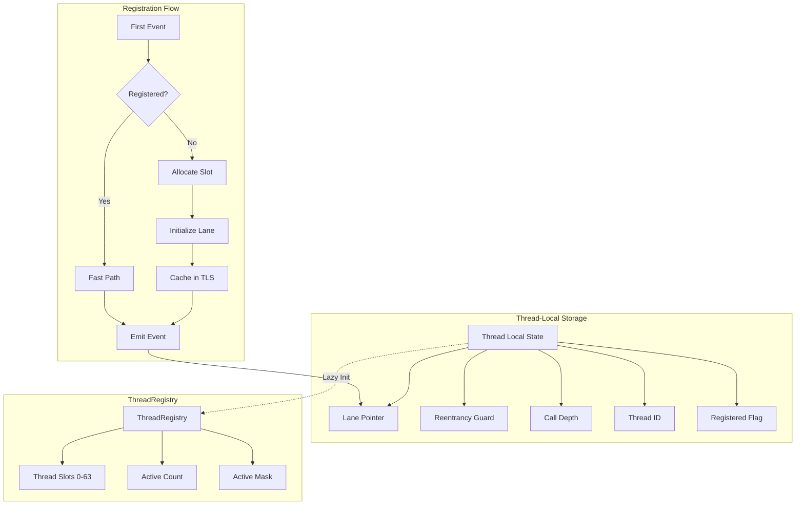
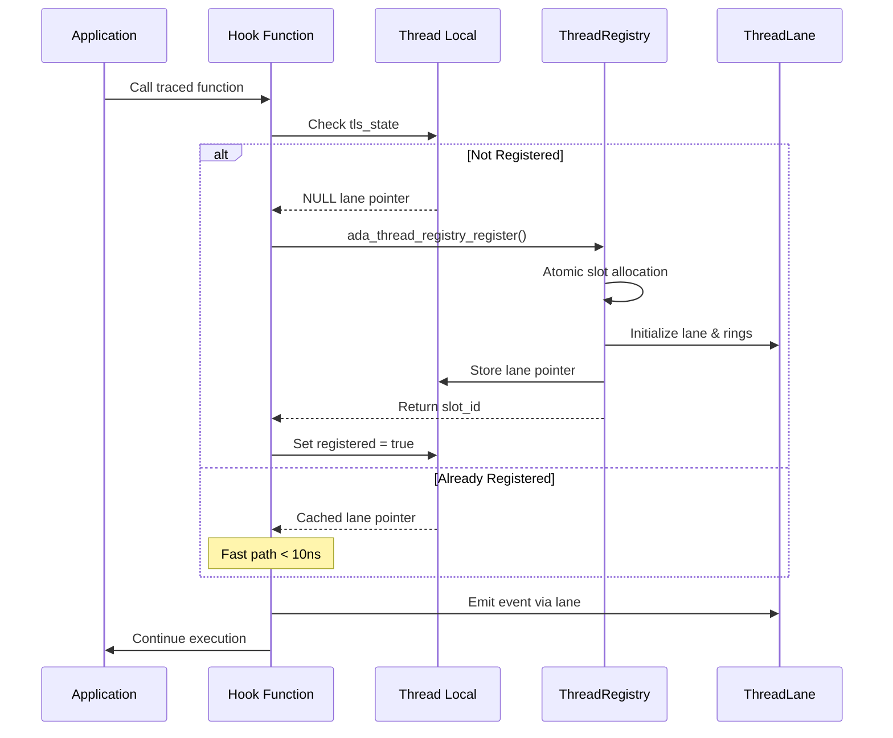
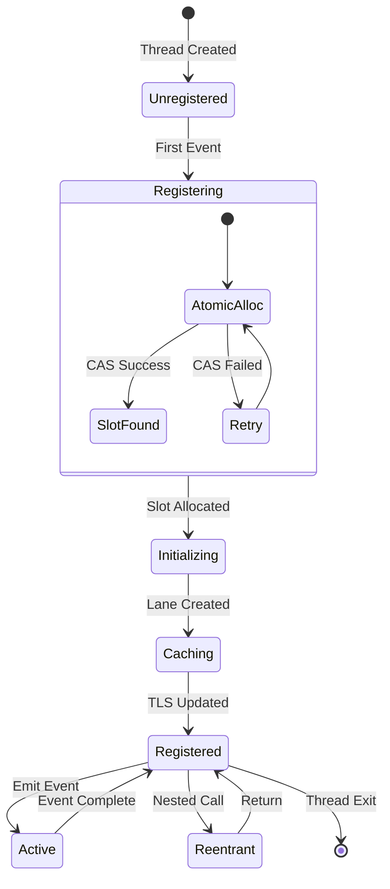

# M1_E1_I5 Technical Design: Thread Registration

## Overview
Implementation of thread-local storage for lane access with automatic thread registration on first event emission. This iteration establishes the fast path for trace event emission with zero contention between threads.

## Architecture

### Component Diagram


### Sequence Diagram: First Event Registration


### State Machine: Thread Registration State


## Data Structures

### Thread-Local Storage Structure
```c
// Thread-local storage for fast path access
typedef struct ada_tls_state {
    // Primary fields (cache line 1)
    ThreadLane* lane;              // Cached lane pointer (NULL = unregistered)
    _Atomic(uint32_t) reentrancy;  // Reentrancy guard counter
    uint32_t call_depth;            // Current call stack depth
    uint64_t thread_id;             // Platform thread ID
    
    // Registration state (cache line 2)
    _Atomic(bool) registered;       // Registration complete flag
    uint8_t slot_id;                // Assigned slot (0-63)
    uint8_t _pad1[6];               // Padding
    uint64_t registration_time;     // Timestamp of registration
    
    // Statistics (cache line 3)
    uint64_t event_count;           // Events emitted by thread
    uint64_t reentry_count;         // Reentrancy occurrences
    uint64_t overflow_count;        // Ring buffer overflows
    uint64_t _pad2;                 // Padding
} ada_tls_state_t;

// Thread-local declaration
static __thread ada_tls_state_t tls_state = {0};
```

### Registration Functions
```c
// Fast path check (inlined)
static inline ThreadLane* ada_get_thread_lane(void) {
    // Fast path: already registered
    if (ADA_LIKELY(tls_state.lane != NULL)) {
        return tls_state.lane;
    }
    
    // Slow path: register thread
    return ada_register_current_thread();
}

// Thread registration (slow path)
ThreadLane* ada_register_current_thread(void) {
    // Already registered check (double-check pattern)
    if (atomic_load_explicit(&tls_state.registered, 
                            memory_order_acquire)) {
        return tls_state.lane;
    }
    
    // Allocate slot from registry
    uint8_t slot_id;
    ThreadLane* lane = ada_thread_registry_register(&slot_id);
    if (!lane) {
        return NULL; // All slots occupied
    }
    
    // Initialize TLS state
    tls_state.lane = lane;
    tls_state.slot_id = slot_id;
    tls_state.thread_id = ada_get_thread_id();
    tls_state.registration_time = ada_get_timestamp();
    
    // Mark as registered (release semantics)
    atomic_store_explicit(&tls_state.registered, true, 
                         memory_order_release);
    
    return lane;
}
```

### Atomic Slot Allocation
```c
// Thread registry slot allocation
ThreadLane* ada_thread_registry_register(uint8_t* out_slot_id) {
    ThreadRegistry* registry = &g_thread_registry;
    
    // Try to find free slot
    for (uint8_t slot = 0; slot < MAX_THREADS; slot++) {
        uint64_t mask = 1ULL << slot;
        uint64_t old_active = atomic_load_explicit(
            &registry->active_mask, memory_order_acquire);
        
        // Check if slot is free
        if (old_active & mask) {
            continue; // Slot occupied
        }
        
        // Try to claim slot
        if (atomic_compare_exchange_weak_explicit(
                &registry->active_mask,
                &old_active,
                old_active | mask,
                memory_order_acq_rel,
                memory_order_acquire)) {
            
            // Slot acquired - initialize lane
            ThreadLane* lane = &registry->lanes[slot];
            ada_thread_lane_init(lane, slot);
            
            // Update active count
            atomic_fetch_add_explicit(&registry->active_count, 1,
                                     memory_order_relaxed);
            
            *out_slot_id = slot;
            return lane;
        }
        // CAS failed, retry
    }
    
    return NULL; // No free slots
}
```

### Reentrancy Guard
```c
// Reentrancy guard for recursive calls
typedef struct ada_reentrancy_guard {
    uint32_t prev_depth;
    bool was_reentrant;
} ada_reentrancy_guard_t;

static inline ada_reentrancy_guard_t ada_enter_trace(void) {
    ada_reentrancy_guard_t guard = {
        .prev_depth = tls_state.call_depth,
        .was_reentrant = false
    };
    
    // Check reentrancy
    uint32_t reentry = atomic_fetch_add_explicit(
        &tls_state.reentrancy, 1, memory_order_acquire);
    
    if (reentry > 0) {
        guard.was_reentrant = true;
        tls_state.reentry_count++;
    }
    
    tls_state.call_depth++;
    return guard;
}

static inline void ada_exit_trace(ada_reentrancy_guard_t guard) {
    tls_state.call_depth = guard.prev_depth;
    atomic_fetch_sub_explicit(&tls_state.reentrancy, 1,
                             memory_order_release);
}
```

## Memory Ordering

### Registration Path
```c
// Registration sequence with proper ordering
// 1. Allocate slot (acquire-release on active_mask)
// 2. Initialize lane (no atomics needed - exclusive access)
// 3. Update TLS (release on registered flag)
// 4. Future accesses (acquire on registered flag)

// Writer (registration)
lane = allocate_and_init_lane();
tls_state.lane = lane;  // Plain store
atomic_store_explicit(&tls_state.registered, true, 
                     memory_order_release);

// Reader (fast path)
if (atomic_load_explicit(&tls_state.registered,
                        memory_order_acquire)) {
    // All TLS fields visible here
    return tls_state.lane;
}
```

### Fast Path Optimization
```c
// Optimized fast path with minimal overhead
static inline int ada_trace_enter(const char* function) {
    // Fast path: no atomic operations
    ThreadLane* lane = tls_state.lane;
    if (ADA_UNLIKELY(!lane)) {
        lane = ada_register_current_thread();
        if (!lane) return -1;
    }
    
    // Check reentrancy (single atomic)
    if (ADA_UNLIKELY(atomic_load_explicit(&tls_state.reentrancy,
                                         memory_order_relaxed) > 0)) {
        return ada_handle_reentrant_call(function);
    }
    
    // Emit event (lock-free)
    return ada_emit_enter_event(lane, function);
}
```

## Performance Characteristics

### Fast Path Metrics
- **Already registered**: < 10ns (2-3 instructions)
- **TLS access**: ~1ns (register-relative addressing)
- **Lane pointer check**: 1 cycle (predictable branch)
- **No atomic operations** on fast path
- **No memory barriers** after registration

### Registration Cost (One-time)
- **Slot allocation**: ~100ns (atomic CAS loop)
- **Lane initialization**: ~500ns (memory allocation)
- **TLS update**: ~10ns (local writes)
- **Total registration**: < 1μs per thread

### Memory Layout
```
Thread Local Storage (per thread):
┌─────────────────────┐ 0x00
│ lane pointer        │ 8 bytes
├─────────────────────┤ 0x08
│ reentrancy counter  │ 4 bytes
├─────────────────────┤ 0x0C
│ call depth          │ 4 bytes
├─────────────────────┤ 0x10
│ thread ID           │ 8 bytes
├─────────────────────┤ 0x18
│ registered flag     │ 1 byte
├─────────────────────┤ 0x19
│ slot ID             │ 1 byte
├─────────────────────┤ 0x1A
│ padding             │ 6 bytes
├─────────────────────┤ 0x20
│ registration time   │ 8 bytes
├─────────────────────┤ 0x28
│ event count         │ 8 bytes
├─────────────────────┤ 0x30
│ reentry count       │ 8 bytes
├─────────────────────┤ 0x38
│ overflow count      │ 8 bytes
└─────────────────────┘ 0x40 (64 bytes total)
```

## Integration Points

### With ThreadRegistry (M1_E1_I2)
- Atomic slot allocation from registry
- Lane initialization through registry
- Active mask updates

### With Ring Buffers (M1_E1_I3)
- Lane contains ring buffer instances
- Ring buffer initialization on registration
- Per-thread buffer management

### With Agent Loading (M1_E1_I4)
- TLS initialized on library load
- Registration triggered by hooks
- Cleanup on library unload

## Error Handling

### Registration Failures
```c
enum ada_registration_error {
    ADA_REG_SUCCESS = 0,
    ADA_REG_NO_SLOTS = -1,      // All 64 slots occupied
    ADA_REG_INIT_FAILED = -2,   // Lane initialization failed
    ADA_REG_ALREADY_REG = -3,   // Thread already registered
};

// Graceful degradation on failure
if (!ada_register_current_thread()) {
    // Continue without tracing this thread
    tls_state.registered = true;  // Prevent retry
    tls_state.lane = NULL;        // Mark as failed
    return;
}
```

## Thread Cleanup

### Thread Exit Handler
```c
// Automatic cleanup on thread exit
static void ada_thread_cleanup(void) __attribute__((destructor));

static void ada_thread_cleanup(void) {
    if (!tls_state.registered || !tls_state.lane) {
        return;
    }
    
    // Flush remaining events
    ada_thread_lane_flush(tls_state.lane);
    
    // Release slot in registry
    ada_thread_registry_unregister(tls_state.slot_id);
    
    // Clear TLS
    memset(&tls_state, 0, sizeof(tls_state));
}
```

## Success Criteria

1. **Performance**: Fast path < 10ns overhead
2. **Correctness**: No race conditions in registration
3. **Scalability**: Support 64 concurrent threads
4. **Reliability**: Graceful handling of all edge cases
5. **Zero contention**: No inter-thread synchronization on fast path