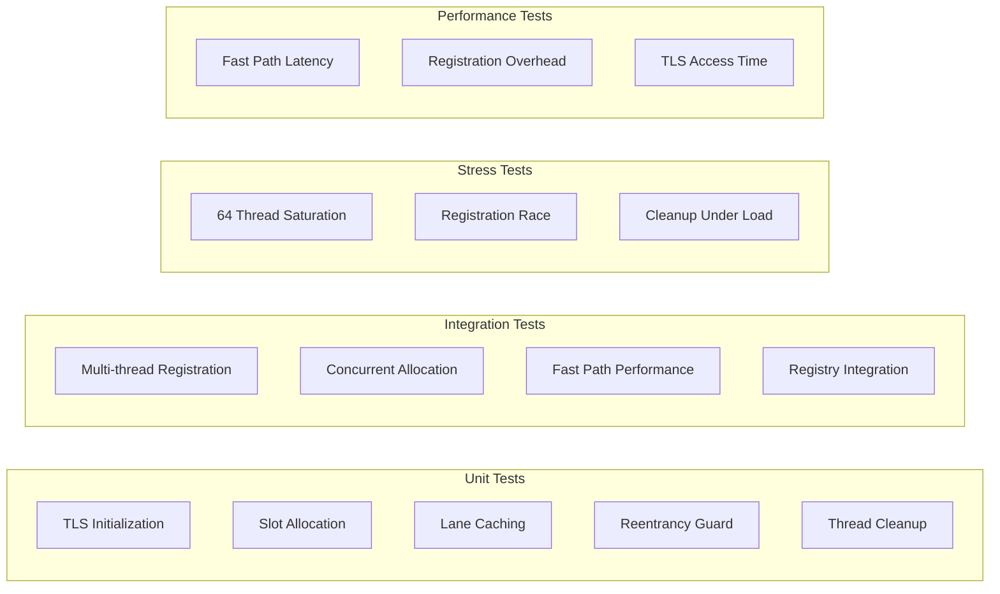

# M1_E1_I5 Test Plan: Thread Registration

## Test Coverage Map



## Test Matrix

| Test Category | Test Case | Priority | Coverage Target |
|--------------|-----------|----------|-----------------|
| **TLS State** | | | |
| | Initial state zeroed | P0 | tls_state initialization |
| | Lane pointer caching | P0 | Fast path optimization |
| | Reentrancy counter | P0 | Recursive call handling |
| | Thread ID capture | P1 | Thread identification |
| **Registration** | | | |
| | First event triggers | P0 | Lazy registration |
| | Atomic slot allocation | P0 | Thread safety |
| | Lane initialization | P0 | Resource setup |
| | Double registration prevented | P1 | Idempotency |
| **Fast Path** | | | |
| | Cached lane access | P0 | < 10ns requirement |
| | No atomics needed | P0 | Performance critical |
| | Branch prediction friendly | P1 | CPU optimization |
| **Concurrency** | | | |
| | 64 threads register | P0 | Scalability limit |
| | No slot conflicts | P0 | Atomic correctness |
| | Active mask consistency | P0 | State tracking |
| **Cleanup** | | | |
| | Thread exit handling | P1 | Resource cleanup |
| | Slot release | P1 | Resource recycling |
| | TLS clearing | P2 | Memory hygiene |

## Detailed Test Cases

### Unit Tests

#### Test: tls_state__uninitialized__then_all_fields_zero
```c
TEST(ThreadRegistration, tls_state__uninitialized__then_all_fields_zero) {
    // Verify TLS starts in clean state
    ada_tls_state_t* state = ada_get_tls_state();
    
    EXPECT_EQ(state->lane, nullptr);
    EXPECT_EQ(state->reentrancy, 0);
    EXPECT_EQ(state->call_depth, 0);
    EXPECT_EQ(state->thread_id, 0);
    EXPECT_FALSE(state->registered);
    EXPECT_EQ(state->slot_id, 0);
    EXPECT_EQ(state->event_count, 0);
}
```

#### Test: ada_get_thread_lane__not_registered__then_triggers_registration
```c
TEST(ThreadRegistration, ada_get_thread_lane__not_registered__then_triggers_registration) {
    // Clear TLS state
    ada_reset_tls_state();
    
    // First call should trigger registration
    ThreadLane* lane = ada_get_thread_lane();
    
    ASSERT_NE(lane, nullptr);
    EXPECT_TRUE(ada_get_tls_state()->registered);
    EXPECT_EQ(ada_get_tls_state()->lane, lane);
    EXPECT_NE(ada_get_tls_state()->thread_id, 0);
    EXPECT_LT(ada_get_tls_state()->slot_id, MAX_THREADS);
}
```

#### Test: ada_get_thread_lane__already_registered__then_returns_cached
```c
TEST(ThreadRegistration, ada_get_thread_lane__already_registered__then_returns_cached) {
    // Ensure registered
    ThreadLane* first_lane = ada_get_thread_lane();
    ASSERT_NE(first_lane, nullptr);
    
    // Second call should return cached
    auto start = std::chrono::high_resolution_clock::now();
    ThreadLane* second_lane = ada_get_thread_lane();
    auto end = std::chrono::high_resolution_clock::now();
    
    EXPECT_EQ(second_lane, first_lane);
    
    // Verify fast path performance
    auto duration = std::chrono::duration_cast<std::chrono::nanoseconds>(end - start);
    EXPECT_LT(duration.count(), 10); // < 10ns
}
```

#### Test: ada_enter_trace__no_reentrancy__then_increments_depth
```c
TEST(ThreadRegistration, ada_enter_trace__no_reentrancy__then_increments_depth) {
    ada_reset_tls_state();
    
    ada_reentrancy_guard_t guard = ada_enter_trace();
    
    EXPECT_EQ(guard.prev_depth, 0);
    EXPECT_FALSE(guard.was_reentrant);
    EXPECT_EQ(ada_get_tls_state()->call_depth, 1);
    EXPECT_EQ(ada_get_tls_state()->reentrancy, 1);
    
    ada_exit_trace(guard);
    
    EXPECT_EQ(ada_get_tls_state()->call_depth, 0);
    EXPECT_EQ(ada_get_tls_state()->reentrancy, 0);
}
```

#### Test: ada_enter_trace__with_reentrancy__then_marks_reentrant
```c
TEST(ThreadRegistration, ada_enter_trace__with_reentrancy__then_marks_reentrant) {
    ada_reset_tls_state();
    
    // First entry
    ada_reentrancy_guard_t guard1 = ada_enter_trace();
    EXPECT_FALSE(guard1.was_reentrant);
    
    // Reentrant call
    ada_reentrancy_guard_t guard2 = ada_enter_trace();
    EXPECT_TRUE(guard2.was_reentrant);
    EXPECT_EQ(ada_get_tls_state()->reentrancy, 2);
    EXPECT_EQ(ada_get_tls_state()->reentry_count, 1);
    
    ada_exit_trace(guard2);
    ada_exit_trace(guard1);
    
    EXPECT_EQ(ada_get_tls_state()->reentrancy, 0);
}
```

### Integration Tests

#### Test: thread_registry__multiple_threads__then_unique_slots
```c
TEST(ThreadRegistration, thread_registry__multiple_threads__then_unique_slots) {
    const int NUM_THREADS = 16;
    std::vector<std::thread> threads;
    std::atomic<int> slot_mask{0};
    
    ada_thread_registry_reset();
    
    for (int i = 0; i < NUM_THREADS; i++) {
        threads.emplace_back([&slot_mask]() {
            ThreadLane* lane = ada_get_thread_lane();
            ASSERT_NE(lane, nullptr);
            
            uint8_t slot = ada_get_tls_state()->slot_id;
            int mask = 1 << slot;
            
            // Verify unique slot
            int old_mask = slot_mask.fetch_or(mask);
            EXPECT_EQ(old_mask & mask, 0) << "Slot conflict detected";
        });
    }
    
    for (auto& t : threads) {
        t.join();
    }
    
    // Verify all threads got different slots
    EXPECT_EQ(__builtin_popcount(slot_mask.load()), NUM_THREADS);
}
```

#### Test: thread_registry__concurrent_registration__then_no_races
```c
TEST(ThreadRegistration, thread_registry__concurrent_registration__then_no_races) {
    const int NUM_THREADS = 32;
    std::vector<std::thread> threads;
    std::barrier sync_point(NUM_THREADS);
    
    ada_thread_registry_reset();
    
    for (int i = 0; i < NUM_THREADS; i++) {
        threads.emplace_back([&sync_point]() {
            // Synchronize all threads
            sync_point.arrive_and_wait();
            
            // Race to register
            ThreadLane* lane = ada_get_thread_lane();
            ASSERT_NE(lane, nullptr);
            
            // Verify registration succeeded
            EXPECT_TRUE(ada_get_tls_state()->registered);
            EXPECT_NE(ada_get_tls_state()->thread_id, 0);
        });
    }
    
    for (auto& t : threads) {
        t.join();
    }
    
    // Verify registry state
    EXPECT_EQ(ada_thread_registry_get_active_count(), NUM_THREADS);
}
```

#### Test: thread_registry__max_threads__then_registration_fails_gracefully
```c
TEST(ThreadRegistration, thread_registry__max_threads__then_registration_fails_gracefully) {
    std::vector<std::thread> threads;
    std::atomic<int> success_count{0};
    std::atomic<int> failure_count{0};
    
    ada_thread_registry_reset();
    
    // Try to register more than MAX_THREADS
    for (int i = 0; i < MAX_THREADS + 10; i++) {
        threads.emplace_back([&success_count, &failure_count]() {
            ThreadLane* lane = ada_register_current_thread();
            if (lane) {
                success_count++;
            } else {
                failure_count++;
            }
        });
    }
    
    for (auto& t : threads) {
        t.join();
    }
    
    EXPECT_EQ(success_count.load(), MAX_THREADS);
    EXPECT_EQ(failure_count.load(), 10);
}
```

### Performance Benchmarks

#### Benchmark: Fast Path Access Time
```c
TEST(ThreadRegistrationPerf, fast_path_access_time) {
    // Ensure registered
    ada_get_thread_lane();
    
    const int ITERATIONS = 1000000;
    auto start = std::chrono::high_resolution_clock::now();
    
    for (int i = 0; i < ITERATIONS; i++) {
        ThreadLane* lane = ada_get_thread_lane();
        benchmark::DoNotOptimize(lane);
    }
    
    auto end = std::chrono::high_resolution_clock::now();
    auto total_ns = std::chrono::duration_cast<std::chrono::nanoseconds>(end - start);
    double avg_ns = total_ns.count() / (double)ITERATIONS;
    
    EXPECT_LT(avg_ns, 10.0) << "Fast path exceeded 10ns target";
    
    RecordProperty("avg_latency_ns", avg_ns);
    RecordProperty("ops_per_second", 1e9 / avg_ns);
}
```

#### Benchmark: Registration Overhead
```c
TEST(ThreadRegistrationPerf, registration_overhead) {
    const int ITERATIONS = 100;
    std::vector<double> latencies;
    
    for (int i = 0; i < ITERATIONS; i++) {
        ada_thread_registry_reset();
        ada_reset_tls_state();
        
        auto start = std::chrono::high_resolution_clock::now();
        ThreadLane* lane = ada_get_thread_lane(); // Triggers registration
        auto end = std::chrono::high_resolution_clock::now();
        
        ASSERT_NE(lane, nullptr);
        
        auto duration = std::chrono::duration_cast<std::chrono::nanoseconds>(end - start);
        latencies.push_back(duration.count());
    }
    
    // Calculate statistics
    double avg = std::accumulate(latencies.begin(), latencies.end(), 0.0) / latencies.size();
    std::sort(latencies.begin(), latencies.end());
    double p50 = latencies[latencies.size() / 2];
    double p99 = latencies[latencies.size() * 99 / 100];
    
    EXPECT_LT(avg, 1000.0) << "Registration exceeded 1μs target";
    
    RecordProperty("avg_registration_ns", avg);
    RecordProperty("p50_registration_ns", p50);
    RecordProperty("p99_registration_ns", p99);
}
```

#### Benchmark: TLS Access Pattern
```c
TEST(ThreadRegistrationPerf, tls_access_pattern) {
    const int ITERATIONS = 10000000;
    
    // Measure TLS field access
    auto start = std::chrono::high_resolution_clock::now();
    
    for (int i = 0; i < ITERATIONS; i++) {
        ada_tls_state_t* state = ada_get_tls_state();
        benchmark::DoNotOptimize(state->lane);
        benchmark::DoNotOptimize(state->call_depth);
        benchmark::DoNotOptimize(state->reentrancy);
    }
    
    auto end = std::chrono::high_resolution_clock::now();
    auto total_ns = std::chrono::duration_cast<std::chrono::nanoseconds>(end - start);
    double avg_ns = total_ns.count() / (double)ITERATIONS;
    
    EXPECT_LT(avg_ns, 2.0) << "TLS access exceeded 2ns target";
    
    RecordProperty("tls_access_ns", avg_ns);
}
```

### Stress Tests

#### Test: Maximum Thread Saturation
```c
TEST(ThreadRegistrationStress, maximum_thread_saturation) {
    std::vector<std::thread> threads;
    std::atomic<bool> all_registered{true};
    
    ada_thread_registry_reset();
    
    // Create exactly MAX_THREADS threads
    for (int i = 0; i < MAX_THREADS; i++) {
        threads.emplace_back([&all_registered, i]() {
            ThreadLane* lane = ada_get_thread_lane();
            if (!lane) {
                all_registered = false;
                FAIL() << "Thread " << i << " failed to register";
            }
            
            // Simulate work
            for (int j = 0; j < 1000; j++) {
                ada_emit_event(lane, "test_event", j);
            }
        });
    }
    
    for (auto& t : threads) {
        t.join();
    }
    
    EXPECT_TRUE(all_registered.load());
    EXPECT_EQ(ada_thread_registry_get_active_count(), MAX_THREADS);
}
```

## Acceptance Criteria

### Functional Requirements
- [ ] Thread-local storage properly initialized
- [ ] Automatic registration on first event
- [ ] Atomic slot allocation without races
- [ ] Lane pointer cached in TLS
- [ ] Reentrancy guard functioning
- [ ] Call depth tracking accurate
- [ ] Thread ID captured correctly

### Performance Requirements
- [ ] Fast path < 10ns latency
- [ ] Registration < 1μs one-time cost
- [ ] TLS access < 2ns
- [ ] No atomic operations on fast path
- [ ] Zero inter-thread contention

### Reliability Requirements
- [ ] Support 64 concurrent threads
- [ ] Graceful handling when slots full
- [ ] Thread cleanup on exit
- [ ] No memory leaks
- [ ] No race conditions

## Test Execution Strategy

### Phase 1: Unit Testing
```bash
# Run unit tests with coverage
cargo test --package tracer_backend \
    --test thread_registration_test \
    -- --nocapture

# Verify coverage
./utils/run_coverage.sh tracer_backend
```

### Phase 2: Integration Testing
```bash
# Run integration tests
cargo test --package tracer_backend \
    --test thread_registration_integration \
    -- --test-threads=1

# Run with thread sanitizer
RUSTFLAGS="-Z sanitizer=thread" cargo test
```

### Phase 3: Performance Testing
```bash
# Run benchmarks
cargo bench --package tracer_backend \
    --bench thread_registration_bench

# Profile fast path
perf record -g cargo test fast_path_access_time
perf report
```

### Phase 4: Stress Testing
```bash
# Run stress tests with monitoring
cargo test --release \
    --test thread_registration_stress \
    -- --nocapture
```

## Risk Mitigation

| Risk | Mitigation | Test Coverage |
|------|------------|---------------|
| TLS not portable | Use __thread with fallback | Platform tests |
| Registration races | Atomic CAS operations | Concurrent tests |
| Slot exhaustion | Graceful failure handling | Saturation tests |
| Memory ordering bugs | Explicit acquire/release | TSan validation |
| Fast path regression | Continuous benchmarking | Perf tests |