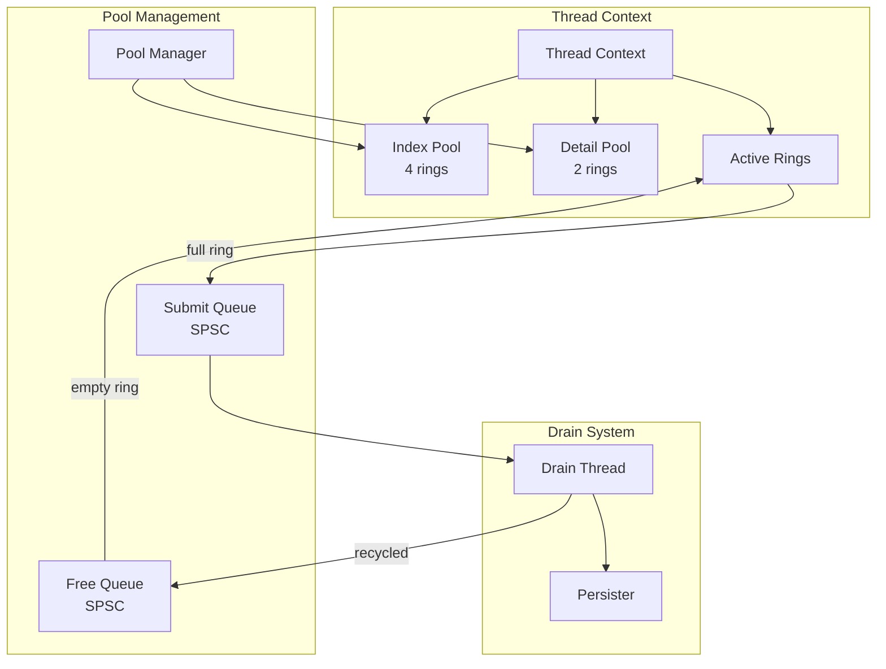
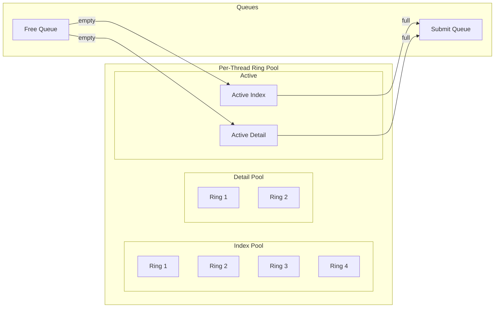
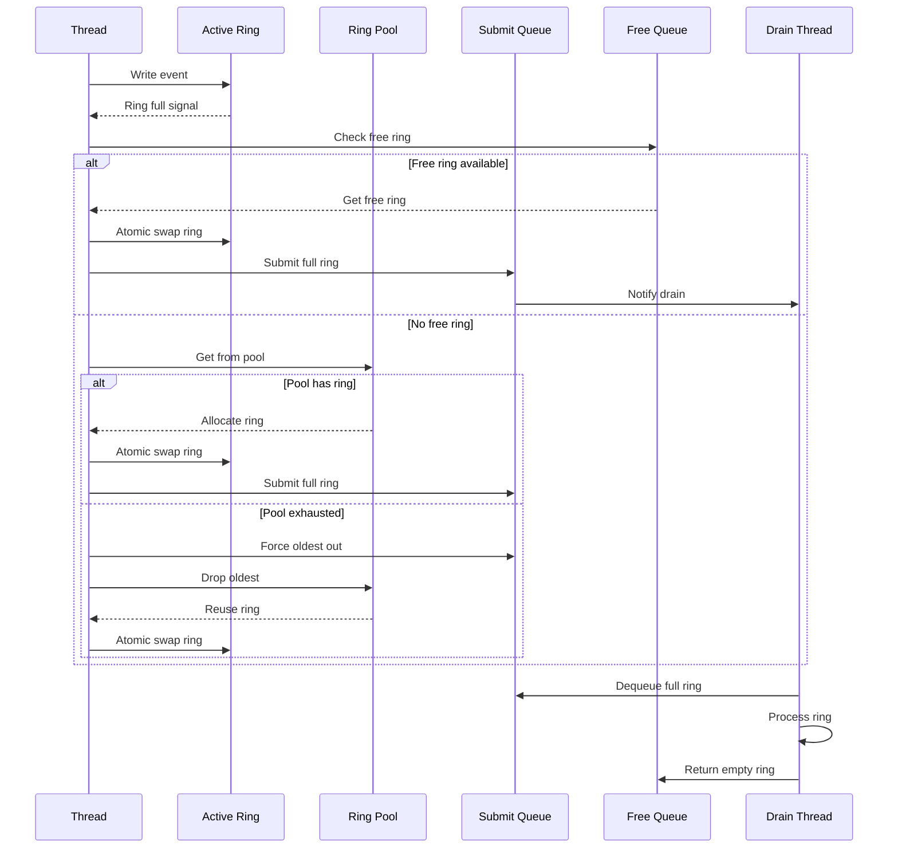
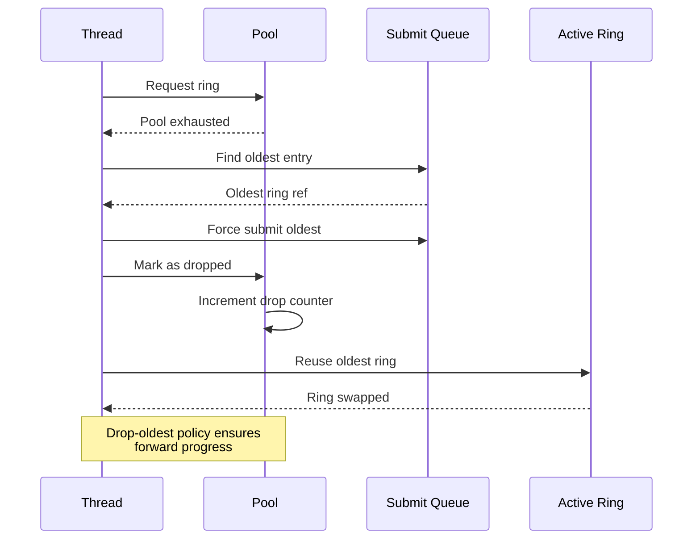
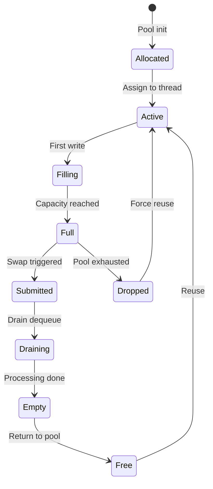
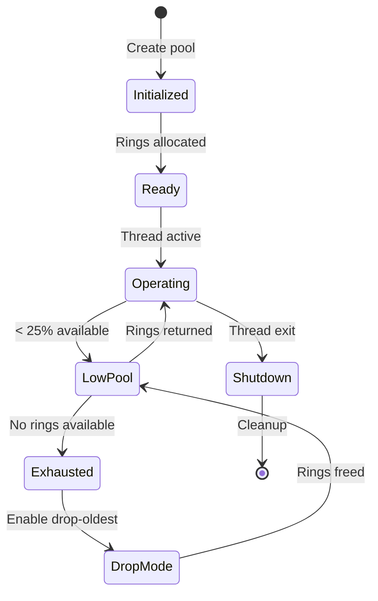

# M1_E1_I9 Technical Design: Ring Pool Swap Protocol

## Overview

This iteration implements per-thread ring pool management with atomic swap protocol for handling full rings. Each thread maintains pools of pre-allocated rings with lock-free submission and retrieval mechanisms.

Addressing note: All SHM references use offsets-only as established in I6. Accessors compute addresses per call from `base + offset`; no persistent materialized-address caches are kept.

## Architecture

### Component Diagram



### Ring Pool Architecture



## Data Structures

### Ring Pool Structure

```c
typedef struct ada_ring_pool {
    // Pool configuration
    uint32_t capacity;              // Max rings in pool
    uint32_t ring_size;             // Size of each ring
    _Atomic(uint32_t) available;    // Available ring count
    
    // Ring storage
    ada_ring_buffer_t** rings;      // Pre-allocated rings
    _Atomic(uint32_t) head;         // Next available index
    _Atomic(uint32_t) tail;         // Return position
    
    // Statistics
    _Atomic(uint64_t) allocations;  // Total allocations
    _Atomic(uint64_t) exhaustions;  // Pool exhaustion count
    _Atomic(uint64_t) drops;        // Dropped rings count
} ada_ring_pool_t;

typedef struct ada_thread_pools {
    // Thread identification
    pthread_t thread_id;
    uint32_t thread_index;
    
    // Ring pools
    ada_ring_pool_t* index_pool;    // Index lane pool (4 rings)
    ada_ring_pool_t* detail_pool;   // Detail lane pool (2 rings)
    
    // Active rings
    _Atomic(ada_ring_buffer_t*) active_index;
    _Atomic(ada_ring_buffer_t*) active_detail;
    
    // Submit/Free queues (SPSC)
    ada_spsc_queue_t* submit_queue;  // Full rings to drain
    ada_spsc_queue_t* free_queue;    // Empty rings from drain
    
    // Pool state
    _Atomic(uint32_t) state;         // Pool state flags
    _Atomic(uint64_t) swap_count;    // Total swaps performed
} ada_thread_pools_t;
```

### Submit Queue Entry

```c
typedef struct ada_submit_entry {
    ada_ring_buffer_t* ring;         // Ring to submit
    uint32_t thread_index;           // Source thread
    uint32_t lane_type;              // INDEX_LANE or DETAIL_LANE
    uint64_t submit_time;            // Submission timestamp
    uint32_t sequence;               // Ring sequence number
    uint32_t flags;                  // Marking flags
} ada_submit_entry_t;
```

### SPSC Queue Implementation

```c
typedef struct ada_spsc_queue {
    // Queue storage
    void** buffer;
    uint32_t capacity;
    uint32_t mask;                   // capacity - 1 for wrap
    
    // Producer state (single writer)
    alignas(64) struct {
        _Atomic(uint32_t) head;
        uint32_t cached_tail;        // Cached consumer position
    } producer;
    
    // Consumer state (single reader)
    alignas(64) struct {
        _Atomic(uint32_t) tail;
        uint32_t cached_head;        // Cached producer position
    } consumer;
    
    // Statistics
    _Atomic(uint64_t) enqueues;
    _Atomic(uint64_t) dequeues;
    _Atomic(uint64_t) failures;
} ada_spsc_queue_t;
```

## Sequence Diagrams

### Ring Swap Sequence



### Pool Exhaustion Handling



## State Machines

### Ring Lifecycle State Machine



### Pool State Machine



## Implementation Details

### Atomic Ring Swap

```c
int ada_ring_swap_atomic(ada_thread_pools_t* pools, 
                         uint32_t lane_type,
                         ada_ring_buffer_t** full_ring) {
    ada_ring_buffer_t* current;
    ada_ring_buffer_t* replacement = NULL;
    
    // Get current active ring
    if (lane_type == INDEX_LANE) {
        current = atomic_load_explicit(&pools->active_index, 
                                      memory_order_acquire);
    } else {
        current = atomic_load_explicit(&pools->active_detail,
                                      memory_order_acquire);
    }
    
    // Try free queue first
    if (ada_spsc_dequeue(pools->free_queue, (void**)&replacement) != 0) {
        // Try pool allocation
        ada_ring_pool_t* pool = (lane_type == INDEX_LANE) ? 
                                pools->index_pool : pools->detail_pool;
        
        if (ada_pool_allocate(pool, &replacement) != 0) {
            // Pool exhausted - force drop oldest
            ada_handle_pool_exhaustion(pools, lane_type, &replacement);
        }
    }
    
    // Atomic swap
    if (lane_type == INDEX_LANE) {
        replacement = atomic_exchange_explicit(&pools->active_index,
                                              replacement,
                                              memory_order_acq_rel);
    } else {
        replacement = atomic_exchange_explicit(&pools->active_detail,
                                              replacement,
                                              memory_order_acq_rel);
    }
    
    *full_ring = current;
    
    // Submit full ring
    ada_submit_entry_t entry = {
        .ring = current,
        .thread_index = pools->thread_index,
        .lane_type = lane_type,
        .submit_time = ada_get_timestamp(),
        .sequence = current->sequence,
        .flags = 0
    };
    
    return ada_spsc_enqueue(pools->submit_queue, &entry);
}
```

### SPSC Queue Operations

```c
int ada_spsc_enqueue(ada_spsc_queue_t* queue, void* item) {
    uint32_t head = atomic_load_explicit(&queue->producer.head,
                                        memory_order_relaxed);
    uint32_t next = (head + 1) & queue->mask;
    
    // Check if queue is full (cached tail)
    if (next == queue->producer.cached_tail) {
        // Update cached tail
        queue->producer.cached_tail = 
            atomic_load_explicit(&queue->consumer.tail,
                               memory_order_acquire);
        
        if (next == queue->producer.cached_tail) {
            // Queue is truly full
            atomic_fetch_add_explicit(&queue->failures, 1,
                                    memory_order_relaxed);
            return -1;
        }
    }
    
    // Store item
    queue->buffer[head] = item;
    
    // Update head with release semantics
    atomic_store_explicit(&queue->producer.head, next,
                         memory_order_release);
    
    atomic_fetch_add_explicit(&queue->enqueues, 1,
                            memory_order_relaxed);
    return 0;
}

int ada_spsc_dequeue(ada_spsc_queue_t* queue, void** item) {
    uint32_t tail = atomic_load_explicit(&queue->consumer.tail,
                                        memory_order_relaxed);
    
    // Check if queue is empty (cached head)
    if (tail == queue->consumer.cached_head) {
        // Update cached head
        queue->consumer.cached_head = 
            atomic_load_explicit(&queue->producer.head,
                               memory_order_acquire);
        
        if (tail == queue->consumer.cached_head) {
            // Queue is truly empty
            return -1;
        }
    }
    
    // Load item
    *item = queue->buffer[tail];
    
    // Update tail with release semantics
    uint32_t next = (tail + 1) & queue->mask;
    atomic_store_explicit(&queue->consumer.tail, next,
                         memory_order_release);
    
    atomic_fetch_add_explicit(&queue->dequeues, 1,
                            memory_order_relaxed);
    return 0;
}
```

### Pool Exhaustion Handler

```c
void ada_handle_pool_exhaustion(ada_thread_pools_t* pools,
                                uint32_t lane_type,
                                ada_ring_buffer_t** ring) {
    ada_ring_pool_t* pool = (lane_type == INDEX_LANE) ?
                            pools->index_pool : pools->detail_pool;
    
    // Increment exhaustion counter
    atomic_fetch_add_explicit(&pool->exhaustions, 1,
                            memory_order_relaxed);
    
    // Find oldest submitted ring
    ada_submit_entry_t* oldest = NULL;
    uint64_t oldest_time = UINT64_MAX;
    
    // Scan submit queue for oldest entry
    for (uint32_t i = 0; i < pools->submit_queue->capacity; i++) {
        ada_submit_entry_t* entry = 
            (ada_submit_entry_t*)pools->submit_queue->buffer[i];
        
        if (entry && entry->lane_type == lane_type &&
            entry->submit_time < oldest_time) {
            oldest = entry;
            oldest_time = entry->submit_time;
        }
    }
    
    if (oldest) {
        // Force drop oldest ring
        *ring = oldest->ring;
        oldest->flags |= RING_DROPPED;
        
        // Update statistics
        atomic_fetch_add_explicit(&pool->drops, 1,
                                memory_order_relaxed);
        
        // Clear and reuse ring
        ada_ring_buffer_reset(*ring);
    } else {
        // Critical error - no rings available
        *ring = NULL;
    }
}
```

### Detail Lane Marking

```c
typedef struct ada_detail_marker {
    _Atomic(uint32_t) mark_depth;    // Current marking depth
    uint32_t max_depth;               // Maximum depth (2)
    
    // Mark stack
    struct {
        ada_ring_buffer_t* ring;
        uint32_t position;
        uint64_t timestamp;
    } marks[2];
} ada_detail_marker_t;

int ada_detail_mark_push(ada_thread_pools_t* pools) {
    ada_detail_marker_t* marker = &pools->detail_marker;
    
    uint32_t depth = atomic_load_explicit(&marker->mark_depth,
                                         memory_order_acquire);
    
    if (depth >= marker->max_depth) {
        return -1;  // Max depth reached
    }
    
    // Save current ring state
    ada_ring_buffer_t* current = 
        atomic_load_explicit(&pools->active_detail,
                           memory_order_acquire);
    
    marker->marks[depth].ring = current;
    marker->marks[depth].position = current->head;
    marker->marks[depth].timestamp = ada_get_timestamp();
    
    // Increment depth
    atomic_store_explicit(&marker->mark_depth, depth + 1,
                         memory_order_release);
    
    // Force new ring allocation
    ada_ring_buffer_t* full_ring;
    return ada_ring_swap_atomic(pools, DETAIL_LANE, &full_ring);
}

int ada_detail_mark_pop(ada_thread_pools_t* pools) {
    ada_detail_marker_t* marker = &pools->detail_marker;
    
    uint32_t depth = atomic_load_explicit(&marker->mark_depth,
                                         memory_order_acquire);
    
    if (depth == 0) {
        return -1;  // No marks to pop
    }
    
    // Restore previous ring state
    depth--;
    ada_ring_buffer_t* restore = marker->marks[depth].ring;
    
    // Swap back to marked ring
    ada_ring_buffer_t* current = 
        atomic_exchange_explicit(&pools->active_detail, restore,
                                memory_order_acq_rel);
    
    // Submit intermediate ring if it has data
    if (current != restore && current->head > 0) {
        ada_submit_entry_t entry = {
            .ring = current,
            .thread_index = pools->thread_index,
            .lane_type = DETAIL_LANE,
            .submit_time = ada_get_timestamp(),
            .flags = RING_MARKED
        };
        
        ada_spsc_enqueue(pools->submit_queue, &entry);
    }
    
    // Update depth
    atomic_store_explicit(&marker->mark_depth, depth,
                         memory_order_release);
    
    return 0;
}
```

## Memory Ordering Specifications

### Critical Orderings

1. **Ring Swap**: `memory_order_acq_rel`
   - Ensures all writes to old ring visible before swap
   - Ensures new ring state visible after swap

2. **Queue Operations**: 
   - Enqueue: `memory_order_release` on head update
   - Dequeue: `memory_order_acquire` on head read
   - Ensures FIFO ordering and data visibility

3. **Pool Counters**: `memory_order_relaxed`
   - Statistics don't require strict ordering
   - Performance optimization for hot paths

4. **State Transitions**: `memory_order_acq_rel`
   - Ensures state consistency across threads
   - Critical for pool exhaustion handling

## Performance Targets

- Ring swap latency: < 1μs
- SPSC enqueue: < 100ns
- SPSC dequeue: < 100ns
- Pool allocation: < 200ns
- Pool exhaustion handling: < 5μs
- Memory overhead per thread: < 512KB
- Zero contention between threads

## Integration Points

### ThreadRegistry Integration

```c
// Extended thread context
typedef struct ada_thread_context {
    // Existing fields...
    
    // Ring pool management
    ada_thread_pools_t* pools;
    
    // Per-thread queues
    ada_spsc_queue_t* submit_queue;
    ada_spsc_queue_t* free_queue;
} ada_thread_context_t;
```

### Drain System Integration

```c
// Drain thread processes submit queues
void ada_drain_process_submits(ada_drain_context_t* drain) {
    for (uint32_t i = 0; i < MAX_THREADS; i++) {
        ada_thread_context_t* ctx = &registry->threads[i];
        
        if (!ctx->active) continue;
        
        ada_submit_entry_t entry;
        while (ada_spsc_dequeue(ctx->submit_queue, &entry) == 0) {
            // Process full ring
            ada_drain_ring(drain, &entry);
            
            // Return empty ring to free queue
            ada_ring_buffer_reset(entry.ring);
            ada_spsc_enqueue(ctx->free_queue, entry.ring);
        }
    }
}
```

## Error Handling

1. **Pool Exhaustion**: Drop oldest with statistics
2. **Queue Full**: Return error, increment counter
3. **Invalid State**: Atomic state validation
4. **Memory Allocation**: Pre-allocate all pools
5. **Thread Safety**: Per-thread isolation

## Success Criteria

1. Zero-contention ring swaps
2. Sub-microsecond swap latency
3. Successful pool exhaustion recovery
4. Correct SPSC queue operation
5. Proper memory ordering
6. Mark/restore functionality
7. Integration with drain system
