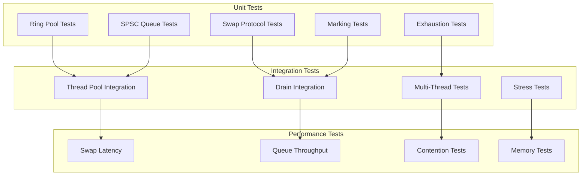

# M1_E1_I9 Test Plan: Ring Pool Swap Protocol

## Test Coverage Map



## Test Matrix

| Component | Test Type | Test Cases | Priority | Coverage Target |
|-----------|-----------|------------|----------|-----------------|
| Ring Pool | Unit | 8 | P0 | 100% |
| SPSC Queue | Unit | 10 | P0 | 100% |
| Swap Protocol | Unit | 6 | P0 | 100% |
| Pool Exhaustion | Unit | 5 | P0 | 100% |
| Detail Marking | Unit | 4 | P0 | 100% |
| Thread Integration | Integration | 6 | P0 | 100% |
| Drain Integration | Integration | 4 | P0 | 100% |
| Multi-Thread | Integration | 5 | P0 | 100% |
| Performance | Benchmark | 8 | P1 | N/A |
| Stress | Load | 4 | P1 | N/A |

## Unit Test Cases

### Ring Pool Tests

```c
// Test: pool__initialization__then_capacity_correct
TEST(RingPoolTest, pool__initialization__then_capacity_correct) {
    ada_ring_pool_t* pool = ada_ring_pool_create(4, 4096);
    
    ASSERT_NE(pool, nullptr);
    EXPECT_EQ(pool->capacity, 4);
    EXPECT_EQ(pool->ring_size, 4096);
    EXPECT_EQ(atomic_load(&pool->available), 4);
    
    // Verify all rings are pre-allocated
    for (uint32_t i = 0; i < 4; i++) {
        EXPECT_NE(pool->rings[i], nullptr);
        EXPECT_EQ(pool->rings[i]->capacity, 4096);
    }
    
    ada_ring_pool_destroy(pool);
}

// Test: pool__allocate_ring__then_available_decrements
TEST(RingPoolTest, pool__allocate_ring__then_available_decrements) {
    ada_ring_pool_t* pool = ada_ring_pool_create(4, 4096);
    ada_ring_buffer_t* ring = NULL;
    
    uint32_t initial = atomic_load(&pool->available);
    EXPECT_EQ(ada_pool_allocate(pool, &ring), 0);
    EXPECT_NE(ring, nullptr);
    EXPECT_EQ(atomic_load(&pool->available), initial - 1);
    
    ada_ring_pool_destroy(pool);
}

// Test: pool__exhausted__then_returns_error
TEST(RingPoolTest, pool__exhausted__then_returns_error) {
    ada_ring_pool_t* pool = ada_ring_pool_create(2, 4096);
    ada_ring_buffer_t* rings[3];
    
    // Allocate all available
    EXPECT_EQ(ada_pool_allocate(pool, &rings[0]), 0);
    EXPECT_EQ(ada_pool_allocate(pool, &rings[1]), 0);
    
    // Pool exhausted
    EXPECT_EQ(ada_pool_allocate(pool, &rings[2]), -ENOMEM);
    EXPECT_EQ(atomic_load(&pool->exhaustions), 1);
    
    ada_ring_pool_destroy(pool);
}

// Test: pool__return_ring__then_available_increments
TEST(RingPoolTest, pool__return_ring__then_available_increments) {
    ada_ring_pool_t* pool = ada_ring_pool_create(4, 4096);
    ada_ring_buffer_t* ring = NULL;
    
    ada_pool_allocate(pool, &ring);
    uint32_t after_alloc = atomic_load(&pool->available);
    
    EXPECT_EQ(ada_pool_return(pool, ring), 0);
    EXPECT_EQ(atomic_load(&pool->available), after_alloc + 1);
    
    ada_ring_pool_destroy(pool);
}
```

### SPSC Queue Tests

```c
// Test: spsc__enqueue_single__then_dequeue_matches
TEST(SPSCQueueTest, spsc__enqueue_single__then_dequeue_matches) {
    ada_spsc_queue_t* queue = ada_spsc_create(16);
    
    int value = 42;
    EXPECT_EQ(ada_spsc_enqueue(queue, &value), 0);
    
    void* result = NULL;
    EXPECT_EQ(ada_spsc_dequeue(queue, &result), 0);
    EXPECT_EQ(*(int*)result, 42);
    
    ada_spsc_destroy(queue);
}

// Test: spsc__queue_full__then_enqueue_fails
TEST(SPSCQueueTest, spsc__queue_full__then_enqueue_fails) {
    ada_spsc_queue_t* queue = ada_spsc_create(4);
    
    int values[4] = {1, 2, 3, 4};
    for (int i = 0; i < 4; i++) {
        EXPECT_EQ(ada_spsc_enqueue(queue, &values[i]), 0);
    }
    
    int extra = 5;
    EXPECT_EQ(ada_spsc_enqueue(queue, &extra), -1);
    EXPECT_EQ(atomic_load(&queue->failures), 1);
    
    ada_spsc_destroy(queue);
}

// Test: spsc__queue_empty__then_dequeue_fails
TEST(SPSCQueueTest, spsc__queue_empty__then_dequeue_fails) {
    ada_spsc_queue_t* queue = ada_spsc_create(16);
    
    void* result = NULL;
    EXPECT_EQ(ada_spsc_dequeue(queue, &result), -1);
    EXPECT_EQ(result, nullptr);
    
    ada_spsc_destroy(queue);
}

// Test: spsc__concurrent_operations__then_fifo_order
TEST(SPSCQueueTest, spsc__concurrent_operations__then_fifo_order) {
    ada_spsc_queue_t* queue = ada_spsc_create(1024);
    const int count = 1000;
    
    // Producer thread
    std::thread producer([&]() {
        for (int i = 0; i < count; i++) {
            int* value = new int(i);
            while (ada_spsc_enqueue(queue, value) != 0) {
                std::this_thread::yield();
            }
        }
    });
    
    // Consumer thread
    std::thread consumer([&]() {
        for (int i = 0; i < count; i++) {
            void* result = NULL;
            while (ada_spsc_dequeue(queue, &result) != 0) {
                std::this_thread::yield();
            }
            EXPECT_EQ(*(int*)result, i);
            delete (int*)result;
        }
    });
    
    producer.join();
    consumer.join();
    
    ada_spsc_destroy(queue);
}
```

### Swap Protocol Tests

```c
// Test: swap__ring_full__then_new_ring_active
TEST(SwapProtocolTest, swap__ring_full__then_new_ring_active) {
    ada_thread_pools_t* pools = ada_thread_pools_create(0);
    
    // Fill current ring
    ada_ring_buffer_t* current = 
        atomic_load(&pools->active_index);
    current->head = current->capacity - 1;  // Simulate full
    
    ada_ring_buffer_t* full_ring = NULL;
    EXPECT_EQ(ada_ring_swap_atomic(pools, INDEX_LANE, &full_ring), 0);
    
    // Verify swap occurred
    EXPECT_EQ(full_ring, current);
    EXPECT_NE(atomic_load(&pools->active_index), current);
    
    ada_thread_pools_destroy(pools);
}

// Test: swap__with_free_ring__then_uses_free_queue
TEST(SwapProtocolTest, swap__with_free_ring__then_uses_free_queue) {
    ada_thread_pools_t* pools = ada_thread_pools_create(0);
    
    // Add ring to free queue
    ada_ring_buffer_t* free_ring = ada_ring_buffer_create(4096);
    ada_spsc_enqueue(pools->free_queue, free_ring);
    
    ada_ring_buffer_t* full_ring = NULL;
    ada_ring_swap_atomic(pools, INDEX_LANE, &full_ring);
    
    // Verify free ring was used
    EXPECT_EQ(atomic_load(&pools->active_index), free_ring);
    
    ada_thread_pools_destroy(pools);
}

// Test: swap__submits_full__then_appears_in_queue
TEST(SwapProtocolTest, swap__submits_full__then_appears_in_queue) {
    ada_thread_pools_t* pools = ada_thread_pools_create(0);
    
    ada_ring_buffer_t* original = 
        atomic_load(&pools->active_index);
    original->head = original->capacity - 1;
    
    ada_ring_buffer_t* full_ring = NULL;
    ada_ring_swap_atomic(pools, INDEX_LANE, &full_ring);
    
    // Check submit queue
    ada_submit_entry_t* entry = NULL;
    EXPECT_EQ(ada_spsc_dequeue(pools->submit_queue, (void**)&entry), 0);
    EXPECT_EQ(entry->ring, original);
    EXPECT_EQ(entry->lane_type, INDEX_LANE);
    
    ada_thread_pools_destroy(pools);
}
```

### Pool Exhaustion Tests

```c
// Test: exhaustion__no_rings__then_drops_oldest
TEST(ExhaustionTest, exhaustion__no_rings__then_drops_oldest) {
    ada_thread_pools_t* pools = ada_thread_pools_create(0);
    
    // Exhaust pool
    ada_ring_pool_t* pool = pools->index_pool;
    while (atomic_load(&pool->available) > 0) {
        ada_ring_buffer_t* ring;
        ada_pool_allocate(pool, &ring);
    }
    
    // Add old entry to submit queue
    ada_submit_entry_t old_entry = {
        .ring = ada_ring_buffer_create(4096),
        .submit_time = 1000,
        .lane_type = INDEX_LANE
    };
    ada_spsc_enqueue(pools->submit_queue, &old_entry);
    
    // Trigger exhaustion handling
    ada_ring_buffer_t* ring = NULL;
    ada_handle_pool_exhaustion(pools, INDEX_LANE, &ring);
    
    EXPECT_EQ(ring, old_entry.ring);
    EXPECT_EQ(atomic_load(&pool->drops), 1);
    EXPECT_TRUE(old_entry.flags & RING_DROPPED);
    
    ada_thread_pools_destroy(pools);
}

// Test: exhaustion__statistics__then_counters_increment
TEST(ExhaustionTest, exhaustion__statistics__then_counters_increment) {
    ada_thread_pools_t* pools = ada_thread_pools_create(0);
    ada_ring_pool_t* pool = pools->index_pool;
    
    // Exhaust and trigger handling
    while (atomic_load(&pool->available) > 0) {
        ada_ring_buffer_t* ring;
        ada_pool_allocate(pool, &ring);
    }
    
    ada_ring_buffer_t* ring = NULL;
    ada_pool_allocate(pool, &ring);  // Triggers exhaustion
    
    EXPECT_EQ(atomic_load(&pool->exhaustions), 1);
    
    ada_thread_pools_destroy(pools);
}
```

### Detail Marking Tests

```c
// Test: mark__push__then_new_ring_active
TEST(MarkingTest, mark__push__then_new_ring_active) {
    ada_thread_pools_t* pools = ada_thread_pools_create(0);
    
    ada_ring_buffer_t* original = 
        atomic_load(&pools->active_detail);
    
    EXPECT_EQ(ada_detail_mark_push(pools), 0);
    
    ada_ring_buffer_t* new_ring = 
        atomic_load(&pools->active_detail);
    
    EXPECT_NE(new_ring, original);
    EXPECT_EQ(pools->detail_marker.marks[0].ring, original);
    
    ada_thread_pools_destroy(pools);
}

// Test: mark__pop__then_restores_ring
TEST(MarkingTest, mark__pop__then_restores_ring) {
    ada_thread_pools_t* pools = ada_thread_pools_create(0);
    
    ada_ring_buffer_t* original = 
        atomic_load(&pools->active_detail);
    
    ada_detail_mark_push(pools);
    ada_ring_buffer_t* marked = 
        atomic_load(&pools->active_detail);
    
    ada_detail_mark_pop(pools);
    ada_ring_buffer_t* restored = 
        atomic_load(&pools->active_detail);
    
    EXPECT_EQ(restored, original);
    EXPECT_NE(marked, original);
    
    ada_thread_pools_destroy(pools);
}

// Test: mark__max_depth__then_push_fails
TEST(MarkingTest, mark__max_depth__then_push_fails) {
    ada_thread_pools_t* pools = ada_thread_pools_create(0);
    
    EXPECT_EQ(ada_detail_mark_push(pools), 0);
    EXPECT_EQ(ada_detail_mark_push(pools), 0);
    EXPECT_EQ(ada_detail_mark_push(pools), -1);  // Max depth = 2
    
    ada_thread_pools_destroy(pools);
}
```

## Integration Test Cases

### Thread Pool Integration

```c
// Test: thread_pools__initialization__then_structures_valid
TEST(ThreadPoolIntegrationTest, thread_pools__initialization__then_structures_valid) {
    ada_thread_pools_t* pools = ada_thread_pools_create(0);
    
    ASSERT_NE(pools, nullptr);
    ASSERT_NE(pools->index_pool, nullptr);
    ASSERT_NE(pools->detail_pool, nullptr);
    ASSERT_NE(pools->submit_queue, nullptr);
    ASSERT_NE(pools->free_queue, nullptr);
    
    EXPECT_EQ(pools->index_pool->capacity, 4);
    EXPECT_EQ(pools->detail_pool->capacity, 2);
    
    ada_thread_pools_destroy(pools);
}

// Test: thread_pools__concurrent_swaps__then_no_contention
TEST(ThreadPoolIntegrationTest, thread_pools__concurrent_swaps__then_no_contention) {
    const int num_threads = 4;
    ada_thread_pools_t* pools[num_threads];
    
    for (int i = 0; i < num_threads; i++) {
        pools[i] = ada_thread_pools_create(i);
    }
    
    std::vector<std::thread> threads;
    std::atomic<int> total_swaps(0);
    
    for (int i = 0; i < num_threads; i++) {
        threads.emplace_back([&, i]() {
            for (int j = 0; j < 1000; j++) {
                ada_ring_buffer_t* full;
                if (ada_ring_swap_atomic(pools[i], INDEX_LANE, &full) == 0) {
                    total_swaps.fetch_add(1);
                }
            }
        });
    }
    
    for (auto& t : threads) {
        t.join();
    }
    
    EXPECT_GT(total_swaps.load(), 0);
    
    for (int i = 0; i < num_threads; i++) {
        ada_thread_pools_destroy(pools[i]);
    }
}
```

### Drain Integration

```c
// Test: drain__processes_submits__then_returns_to_free
TEST(DrainIntegrationTest, drain__processes_submits__then_returns_to_free) {
    ada_thread_pools_t* pools = ada_thread_pools_create(0);
    ada_drain_context_t* drain = ada_drain_create();
    
    // Submit a full ring
    ada_ring_buffer_t* full_ring = ada_ring_buffer_create(4096);
    full_ring->head = 100;  // Some data
    
    ada_submit_entry_t entry = {
        .ring = full_ring,
        .thread_index = 0,
        .lane_type = INDEX_LANE
    };
    ada_spsc_enqueue(pools->submit_queue, &entry);
    
    // Process drain
    ada_drain_process_thread(drain, pools);
    
    // Check ring returned to free queue
    void* returned = NULL;
    EXPECT_EQ(ada_spsc_dequeue(pools->free_queue, &returned), 0);
    EXPECT_EQ(returned, full_ring);
    EXPECT_EQ(full_ring->head, 0);  // Reset
    
    ada_thread_pools_destroy(pools);
    ada_drain_destroy(drain);
}
```

## Performance Benchmarks

### Swap Latency Benchmark

```c
BENCHMARK(BM_RingSwapLatency) {
    ada_thread_pools_t* pools = ada_thread_pools_create(0);
    
    auto start = std::chrono::high_resolution_clock::now();
    
    for (int i = 0; i < 10000; i++) {
        ada_ring_buffer_t* full;
        ada_ring_swap_atomic(pools, INDEX_LANE, &full);
    }
    
    auto end = std::chrono::high_resolution_clock::now();
    auto duration = std::chrono::duration_cast<std::chrono::nanoseconds>(end - start);
    
    double avg_latency = duration.count() / 10000.0;
    EXPECT_LT(avg_latency, 1000);  // < 1μs
    
    ada_thread_pools_destroy(pools);
}
```

### SPSC Queue Throughput

```c
BENCHMARK(BM_SPSCThroughput) {
    ada_spsc_queue_t* queue = ada_spsc_create(1024);
    const int iterations = 1000000;
    
    std::thread producer([&]() {
        for (int i = 0; i < iterations; i++) {
            while (ada_spsc_enqueue(queue, (void*)(intptr_t)i) != 0) {
                // Spin
            }
        }
    });
    
    auto start = std::chrono::high_resolution_clock::now();
    
    for (int i = 0; i < iterations; i++) {
        void* value;
        while (ada_spsc_dequeue(queue, &value) != 0) {
            // Spin
        }
    }
    
    auto end = std::chrono::high_resolution_clock::now();
    auto duration = std::chrono::duration_cast<std::chrono::microseconds>(end - start);
    
    double ops_per_sec = (iterations * 1000000.0) / duration.count();
    EXPECT_GT(ops_per_sec, 10000000);  // > 10M ops/sec
    
    producer.join();
    ada_spsc_destroy(queue);
}
```

### Memory Overhead Test

```c
TEST(MemoryTest, thread_pools__memory_overhead__then_under_limit) {
    size_t initial_rss = get_current_rss();
    
    ada_thread_pools_t* pools = ada_thread_pools_create(0);
    
    size_t after_create = get_current_rss();
    size_t overhead = after_create - initial_rss;
    
    // Expected: 4 index rings * 4KB + 2 detail rings * 8KB + queues
    // Total should be < 512KB per thread
    EXPECT_LT(overhead, 512 * 1024);
    
    ada_thread_pools_destroy(pools);
}
```

## Stress Tests

### Continuous Swap Stress

```c
TEST(StressTest, continuous_swaps__high_rate__then_stable) {
    ada_thread_pools_t* pools = ada_thread_pools_create(0);
    std::atomic<bool> stop(false);
    std::atomic<uint64_t> swap_count(0);
    
    std::thread swapper([&]() {
        while (!stop.load()) {
            ada_ring_buffer_t* full;
            if (ada_ring_swap_atomic(pools, INDEX_LANE, &full) == 0) {
                swap_count.fetch_add(1);
            }
        }
    });
    
    std::this_thread::sleep_for(std::chrono::seconds(10));
    stop.store(true);
    swapper.join();
    
    EXPECT_GT(swap_count.load(), 1000000);  // > 100K swaps/sec
    
    // Verify no memory leaks
    EXPECT_EQ(atomic_load(&pools->index_pool->allocations),
              atomic_load(&pools->index_pool->available) + 
              swap_count.load());
    
    ada_thread_pools_destroy(pools);
}
```

### Pool Exhaustion Recovery

```c
TEST(StressTest, exhaustion__repeated__then_recovers) {
    ada_thread_pools_t* pools = ada_thread_pools_create(0);
    
    for (int round = 0; round < 100; round++) {
        // Exhaust pool
        std::vector<ada_ring_buffer_t*> allocated;
        ada_ring_buffer_t* ring;
        
        while (ada_pool_allocate(pools->index_pool, &ring) == 0) {
            allocated.push_back(ring);
        }
        
        // Trigger exhaustion handling
        ada_ring_buffer_t* emergency;
        ada_handle_pool_exhaustion(pools, INDEX_LANE, &emergency);
        
        // Return all rings
        for (auto r : allocated) {
            ada_pool_return(pools->index_pool, r);
        }
        
        // Verify recovery
        EXPECT_GT(atomic_load(&pools->index_pool->available), 0);
    }
    
    ada_thread_pools_destroy(pools);
}
```

## Acceptance Criteria

### Functional Requirements

- [ ] Per-thread ring pools initialized correctly
- [ ] Atomic ring swap completes < 1μs
- [ ] SPSC queues maintain FIFO ordering
- [ ] Pool exhaustion triggers drop-oldest
- [ ] Detail marking supports 2-level depth
- [ ] Submit queue delivers to drain thread
- [ ] Free queue returns empty rings
- [ ] Zero contention between threads

### Performance Requirements

- [ ] Ring swap latency < 1μs (measured)
- [ ] SPSC throughput > 10M ops/sec
- [ ] Memory overhead < 512KB per thread
- [ ] Pool allocation < 200ns
- [ ] No performance degradation under load

### Reliability Requirements

- [ ] Correct memory ordering semantics
- [ ] No data races (ThreadSanitizer clean)
- [ ] No memory leaks (AddressSanitizer clean)
- [ ] Graceful exhaustion recovery
- [ ] Stable under continuous stress

## Test Execution Strategy

### Phase 1: Unit Tests
```bash
# Run unit tests with sanitizers
cargo test --package ada_ring_pool -- --test-threads=1
cargo test --package ada_spsc_queue -- --test-threads=1
```

### Phase 2: Integration Tests
```bash
# Run integration tests
cargo test --package ada_thread_pools --test integration
```

### Phase 3: Performance Tests
```bash
# Run benchmarks
cargo bench --package ada_ring_pool
cargo bench --package ada_spsc_queue
```

### Phase 4: Stress Tests
```bash
# Run stress tests with monitoring
cargo test --package ada_thread_pools --test stress -- --nocapture
```

## Coverage Requirements

- Line Coverage: 100%
- Branch Coverage: 100%
- Function Coverage: 100%
- Memory ordering paths: 100%

## Risk Mitigation

1. **ABA Problem**: Use sequence numbers in rings
2. **Memory Ordering**: Explicit acquire/release semantics
3. **Pool Exhaustion**: Drop-oldest policy with stats
4. **Queue Overflow**: Bounded queues with failure handling
5. **Thread Safety**: Per-thread isolation by design
