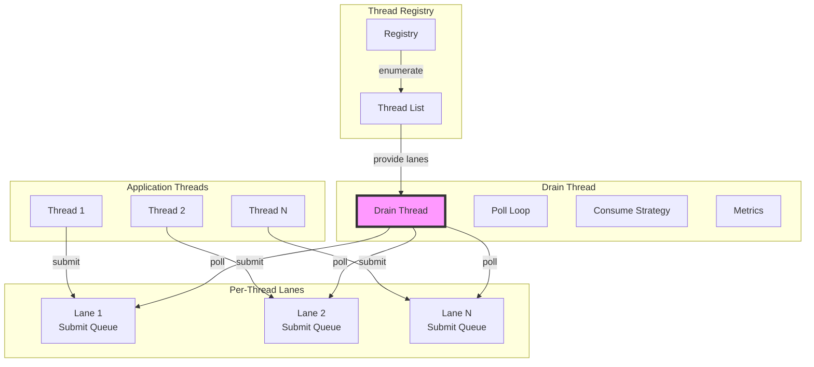
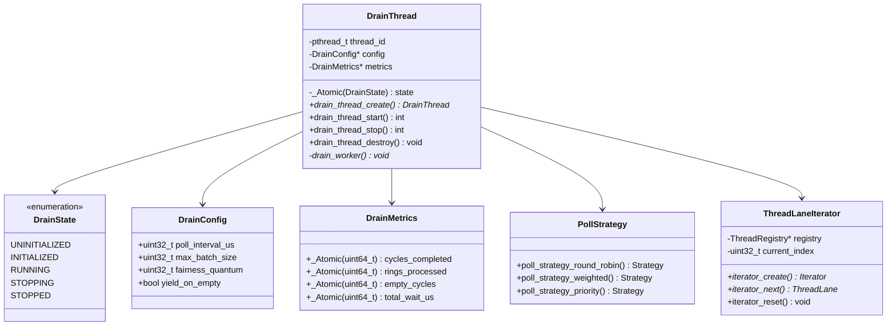
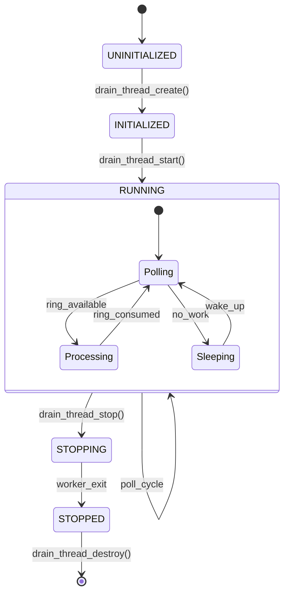
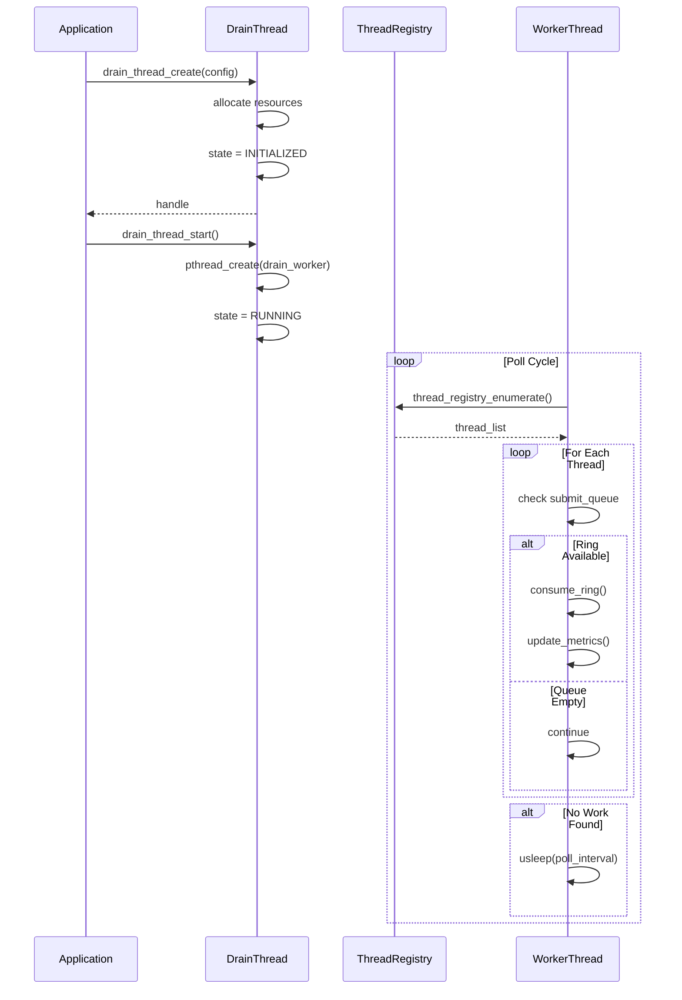
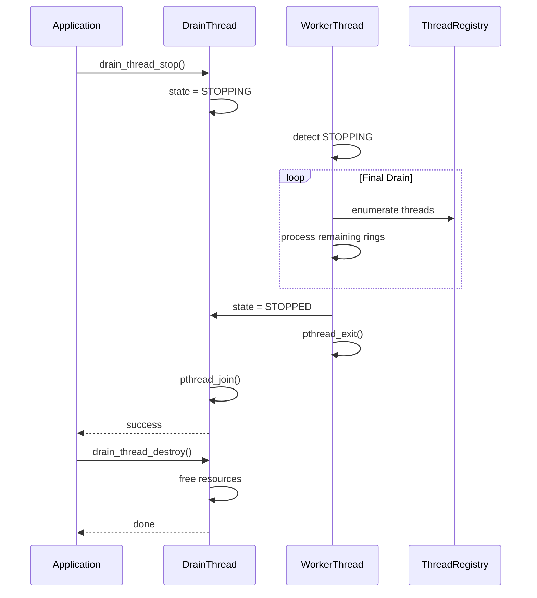

# M1_E2_I1 Technical Design: Drain Thread Implementation

## Overview
This iteration implements a dedicated drain thread that continuously polls all thread lanes for filled rings, processes them fairly, and coordinates shutdown. The drain thread is the core consumer in our SPSC architecture, ensuring filled rings are processed without contention.

## Architecture

### System Context


### Component Architecture


## Detailed Design

### State Machine


### Sequence Diagrams

#### Startup Sequence


#### Shutdown Sequence


## Data Structures

### Core Structures
```c
// Drain thread state enumeration
typedef enum {
    DRAIN_STATE_UNINITIALIZED = 0,
    DRAIN_STATE_INITIALIZED   = 1,
    DRAIN_STATE_RUNNING       = 2,
    DRAIN_STATE_STOPPING      = 3,
    DRAIN_STATE_STOPPED       = 4
} DrainState;

// Configuration for drain behavior
typedef struct DrainConfig {
    uint32_t poll_interval_us;    // Microseconds to sleep when idle
    uint32_t max_batch_size;       // Max rings to process per thread per cycle
    uint32_t fairness_quantum;     // Rings to process before switching threads
    bool     yield_on_empty;       // Whether to yield CPU on empty cycle
} DrainConfig;

// Runtime metrics
typedef struct DrainMetrics {
    _Atomic(uint64_t) cycles_completed;   // Total poll cycles
    _Atomic(uint64_t) rings_processed;    // Total rings consumed
    _Atomic(uint64_t) empty_cycles;       // Cycles with no work
    _Atomic(uint64_t) total_wait_us;      // Total time spent sleeping
    
    // Per-thread metrics
    _Atomic(uint64_t) rings_per_thread[MAX_THREADS];
    _Atomic(uint64_t) last_seen_us[MAX_THREADS];
} DrainMetrics;

// Main drain thread structure
typedef struct DrainThread {
    pthread_t         thread_id;
    _Atomic(DrainState) state;
    DrainConfig*      config;
    DrainMetrics*     metrics;
    ThreadRegistry*   registry;
    
    // Synchronization
    pthread_mutex_t   state_mutex;
    pthread_cond_t    state_cond;
} DrainThread;

// Poll context for fair scheduling
typedef struct PollContext {
    uint32_t thread_count;
    uint32_t current_index;
    uint32_t rings_this_quantum;
    uint64_t cycle_start_ns;
    
    // Round-robin state
    ThreadLane* lanes[MAX_THREADS];
    uint32_t    last_processed[MAX_THREADS];
} PollContext;
```

## Implementation Details

### Core APIs
```c
// Lifecycle management
DrainThread* drain_thread_create(const DrainConfig* config, ThreadRegistry* registry);
int drain_thread_start(DrainThread* dt);
int drain_thread_stop(DrainThread* dt);
void drain_thread_destroy(DrainThread* dt);

// Worker thread entry point
static void* drain_worker(void* arg);

// Polling implementation
static int poll_all_threads(DrainThread* dt, PollContext* ctx);
static int consume_ring(ThreadLane* lane, RingBuffer* ring);
static void update_metrics(DrainThread* dt, uint32_t thread_id, uint32_t rings);

// Fair scheduling
static ThreadLane* select_next_lane(PollContext* ctx);
static bool should_switch_thread(PollContext* ctx);
static void reset_quantum(PollContext* ctx);
```

### Memory Ordering Specifications

#### State Transitions
```c
// Starting the drain thread
int drain_thread_start(DrainThread* dt) {
    DrainState expected = DRAIN_STATE_INITIALIZED;
    if (!atomic_compare_exchange_strong_explicit(
            &dt->state, &expected, DRAIN_STATE_RUNNING,
            memory_order_acq_rel, memory_order_acquire)) {
        return -EINVAL;
    }
    
    // Create worker thread
    return pthread_create(&dt->thread_id, NULL, drain_worker, dt);
}

// Stopping the drain thread
int drain_thread_stop(DrainThread* dt) {
    DrainState expected = DRAIN_STATE_RUNNING;
    if (!atomic_compare_exchange_strong_explicit(
            &dt->state, &expected, DRAIN_STATE_STOPPING,
            memory_order_acq_rel, memory_order_acquire)) {
        return -EINVAL;
    }
    
    // Wait for worker to finish
    pthread_join(dt->thread_id, NULL);
    return 0;
}
```

#### Ring Consumption
```c
static int poll_all_threads(DrainThread* dt, PollContext* ctx) {
    int total_consumed = 0;
    
    // Enumerate all threads
    uint32_t thread_count = thread_registry_count(dt->registry);
    
    for (uint32_t i = 0; i < thread_count; i++) {
        ThreadLane* lane = thread_registry_get_lane(dt->registry, i);
        if (!lane) continue;
        
        // Check submit queue (acquire semantics)
        uint32_t available = atomic_load_explicit(
            &lane->submit_queue->count, memory_order_acquire);
        
        if (available > 0) {
            // Process up to batch size
            uint32_t to_process = MIN(available, dt->config->max_batch_size);
            
            for (uint32_t j = 0; j < to_process; j++) {
                RingBuffer* ring = submit_queue_dequeue(lane->submit_queue);
                if (ring) {
                    consume_ring(lane, ring);
                    total_consumed++;
                    
                    // Update metrics with relaxed ordering
                    atomic_fetch_add_explicit(&dt->metrics->rings_processed, 
                                             1, memory_order_relaxed);
                }
            }
            
            // Check fairness quantum
            ctx->rings_this_quantum += to_process;
            if (ctx->rings_this_quantum >= dt->config->fairness_quantum) {
                reset_quantum(ctx);
                break;  // Switch to next thread
            }
        }
    }
    
    return total_consumed;
}
```

### Worker Thread Implementation
```c
static void* drain_worker(void* arg) {
    DrainThread* dt = (DrainThread*)arg;
    PollContext ctx = {0};
    
    // Set thread name for debugging
    pthread_setname_np("ada_drain");
    
    while (atomic_load_explicit(&dt->state, memory_order_acquire) == DRAIN_STATE_RUNNING) {
        uint64_t cycle_start = get_time_ns();
        
        // Poll all threads
        int consumed = poll_all_threads(dt, &ctx);
        
        // Update metrics
        atomic_fetch_add_explicit(&dt->metrics->cycles_completed, 
                                 1, memory_order_relaxed);
        
        if (consumed == 0) {
            // No work found
            atomic_fetch_add_explicit(&dt->metrics->empty_cycles, 
                                     1, memory_order_relaxed);
            
            if (dt->config->yield_on_empty) {
                // Yield CPU to other threads
                sched_yield();
            } else if (dt->config->poll_interval_us > 0) {
                // Sleep for configured interval
                usleep(dt->config->poll_interval_us);
                atomic_fetch_add_explicit(&dt->metrics->total_wait_us,
                                         dt->config->poll_interval_us, 
                                         memory_order_relaxed);
            }
        }
        
        // Update cycle time
        uint64_t cycle_duration = get_time_ns() - cycle_start;
        // Store for monitoring (could add to metrics)
    }
    
    // Final drain before exit
    DrainState expected = DRAIN_STATE_STOPPING;
    while (poll_all_threads(dt, &ctx) > 0) {
        // Keep draining
    }
    
    // Mark as stopped
    atomic_store_explicit(&dt->state, DRAIN_STATE_STOPPED, memory_order_release);
    
    return NULL;
}
```

## Performance Considerations

### Optimization Strategies
1. **Cache-line alignment**: Ensure frequently accessed fields are cache-aligned
2. **NUMA awareness**: Consider thread affinity for drain thread
3. **Batch processing**: Process multiple rings per poll to amortize overhead
4. **Adaptive polling**: Adjust sleep duration based on workload

### Scalability Targets
- Support 64 concurrent threads
- Poll cycle < 100us under load
- Zero contention on thread lanes (SPSC guarantee)
- Fair scheduling within 10% variance

## Integration Points

### Dependencies
- **ThreadRegistry**: Enumerate and access thread lanes
- **SubmitQueue**: SPSC queue for filled rings
- **RingBuffer**: Ring buffer consumption interface

### Consumers
- **Persistence Layer** (future): Will receive consumed rings
- **Metrics System**: Exposes drain performance metrics
- **Control Plane**: Start/stop commands

## Error Handling

### Failure Modes
1. **Thread creation failure**: Return error, stay in INITIALIZED
2. **Registry access failure**: Skip thread, continue polling
3. **Ring corruption**: Log error, skip ring, continue
4. **State transition race**: Return error, maintain current state

### Recovery Strategies
- Automatic retry on transient failures
- Graceful degradation on persistent errors
- Final drain on shutdown ensures no data loss

## Security Considerations

1. **Thread isolation**: No cross-thread access except through registry
2. **Memory safety**: All atomics use explicit ordering
3. **Resource limits**: Bounded memory usage via batch size
4. **Priority inheritance**: Avoid priority inversion with proper scheduling

## Future Extensions

1. **Multiple drain threads**: Partition threads across drainers
2. **Priority-based polling**: Prioritize hot threads
3. **Backpressure**: Slow down producers when drain falls behind
4. **Dynamic tuning**: Adjust poll interval based on workload