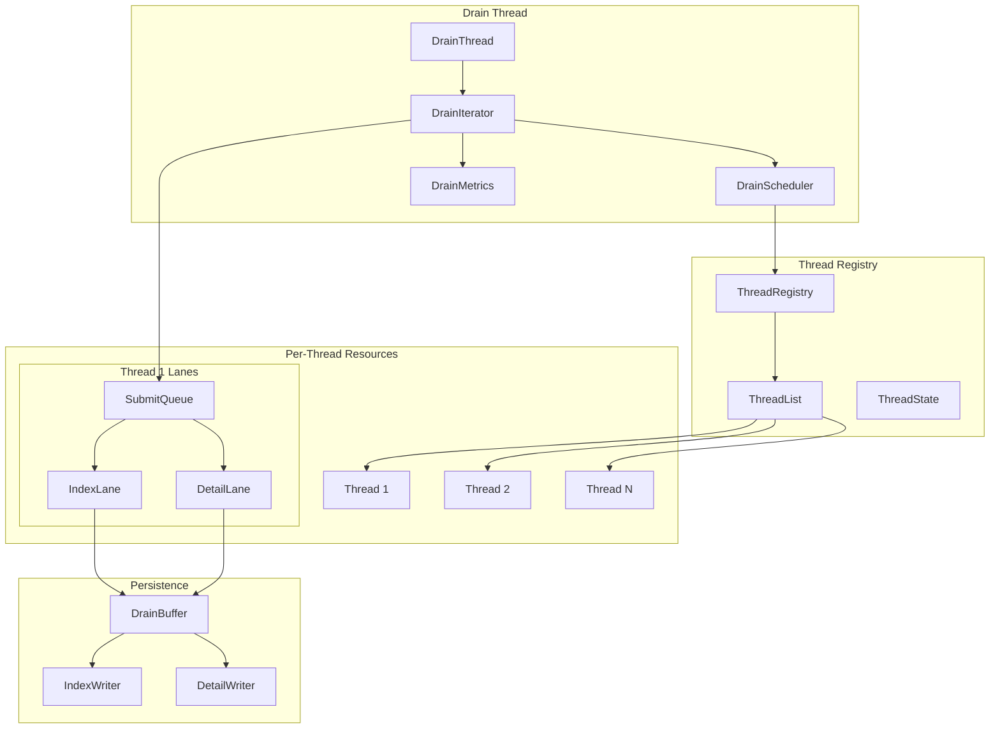
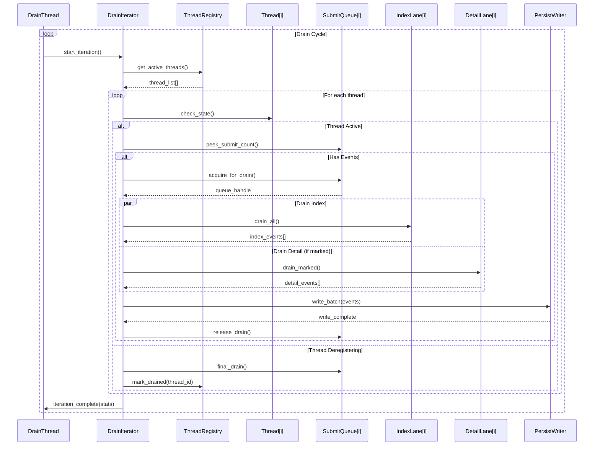
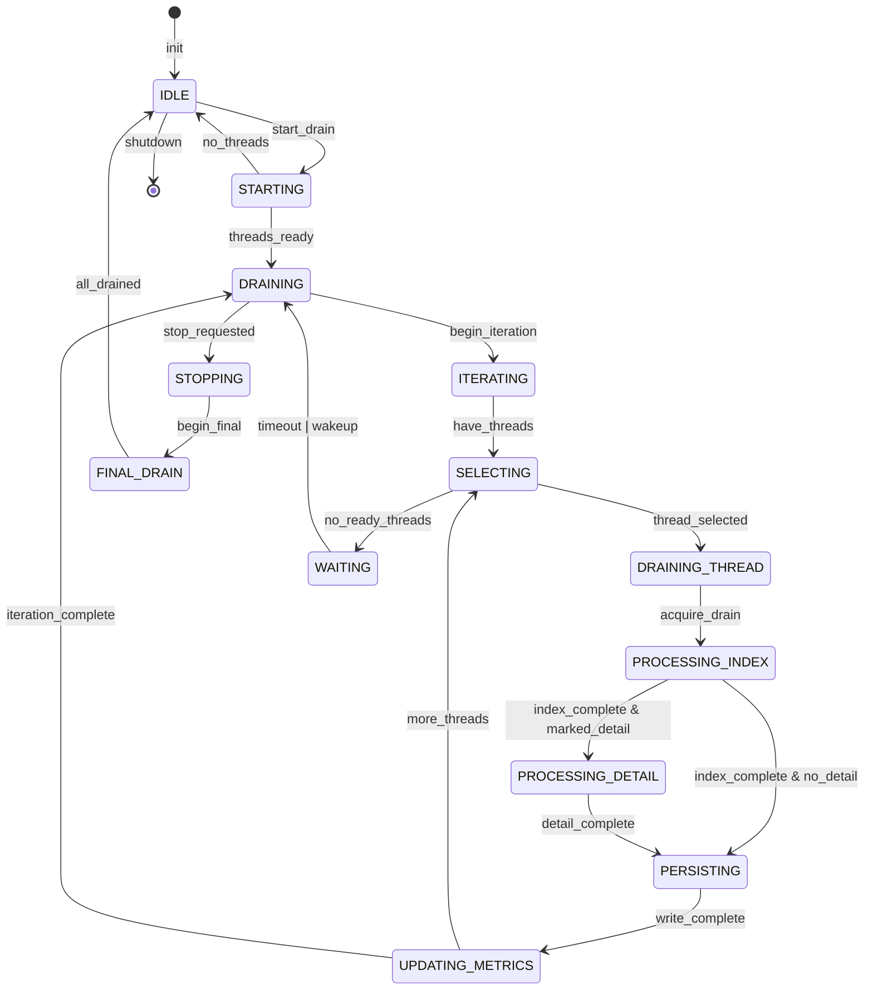
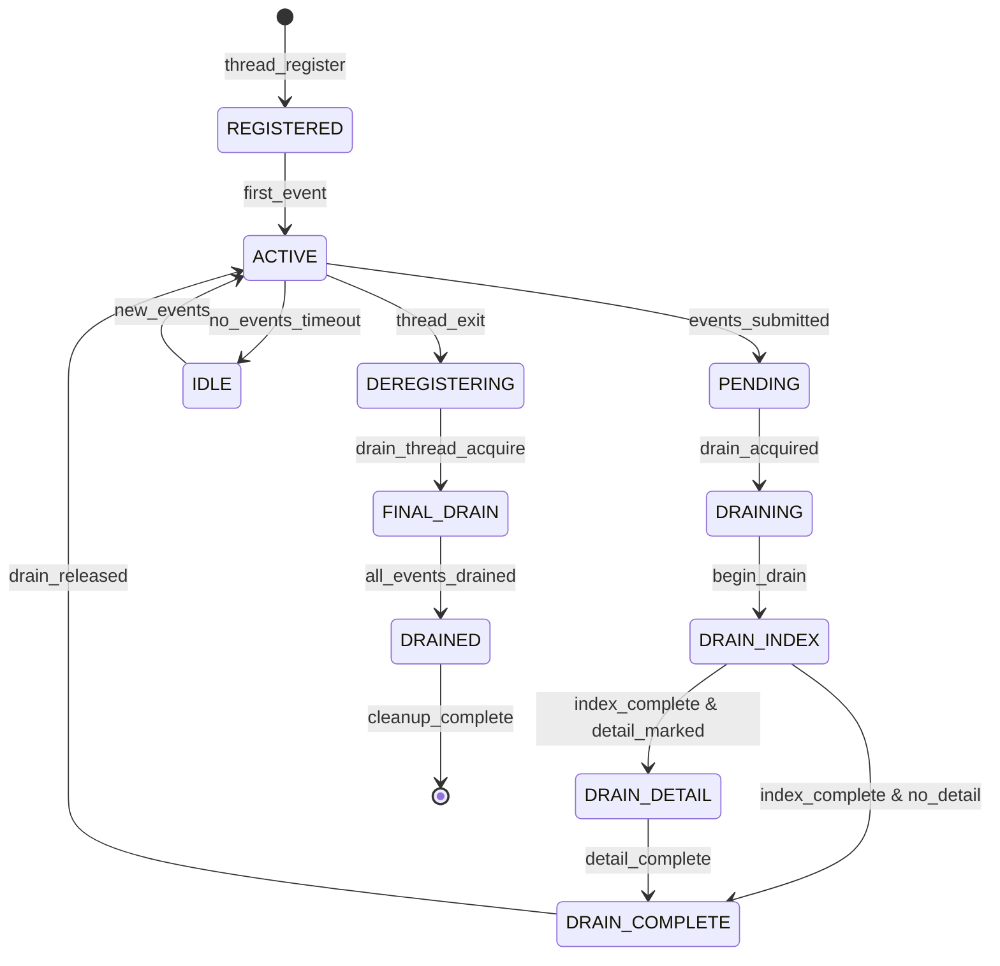

# M1_E2_I2: Per-Thread Drain - Technical Design

## Overview
Implement iteration logic to drain all registered threads' lanes fairly, ensuring complete event capture with zero loss while maintaining thread isolation.

## Architecture

### Component Architecture


### Drain Iteration Flow


## Data Structures

### DrainIterator
```c
typedef struct DrainIterator {
    // Configuration
    uint32_t max_threads_per_cycle;    // Max threads to drain per iteration
    uint32_t max_events_per_thread;    // Max events per thread per iteration
    uint32_t iteration_interval_ms;    // Time between iterations
    
    // State
    _Atomic(uint64_t) current_iteration;
    _Atomic(uint32_t) active_thread_count;
    uint32_t last_drained_idx;         // For round-robin fairness
    
    // Thread tracking
    ThreadDrainState* thread_states;   // Per-thread drain state
    uint32_t thread_states_capacity;
    
    // Metrics
    DrainMetrics* metrics;
    
    // Synchronization
    _Atomic(uint32_t) state;           // IDLE, DRAINING, STOPPING
} DrainIterator;
```

### ThreadDrainState
```c
typedef struct ThreadDrainState {
    uint32_t thread_id;
    _Atomic(uint64_t) last_drain_time;
    _Atomic(uint64_t) events_drained;
    _Atomic(uint64_t) bytes_drained;
    _Atomic(uint32_t) consecutive_empty;   // Track empty drains
    _Atomic(uint32_t) priority;            // Dynamic priority
    
    // Lane states
    _Atomic(uint32_t) index_pending;
    _Atomic(uint32_t) detail_pending;
    _Atomic(uint32_t) detail_marked;       // Marked detail windows
    
    // Performance
    uint64_t avg_drain_latency_ns;
    uint64_t max_drain_latency_ns;
} ThreadDrainState;
```

### DrainScheduler
```c
typedef struct DrainScheduler {
    // Scheduling algorithm
    enum {
        SCHED_ROUND_ROBIN,
        SCHED_WEIGHTED_FAIR,
        SCHED_PRIORITY_BASED,
        SCHED_ADAPTIVE
    } algorithm;
    
    // Thread selection
    uint32_t (*select_next_thread)(DrainScheduler* sched);
    void (*update_priority)(DrainScheduler* sched, uint32_t thread_id, 
                          DrainResult* result);
    
    // Fairness tracking
    uint64_t* thread_credits;          // Fair share credits
    uint64_t total_credits;
    
    // Adaptive parameters
    double load_factor;                // System load estimate
    uint32_t high_priority_threshold;  // Events pending for high priority
} DrainScheduler;
```

### DrainMetrics
```c
typedef struct DrainMetrics {
    // Global metrics
    _Atomic(uint64_t) total_iterations;
    _Atomic(uint64_t) total_events_drained;
    _Atomic(uint64_t) total_bytes_drained;
    
    // Per-iteration metrics
    _Atomic(uint64_t) current_iteration_start;
    _Atomic(uint32_t) threads_processed;
    _Atomic(uint32_t) threads_skipped;
    _Atomic(uint64_t) iteration_duration_ns;
    
    // Fairness metrics
    _Atomic(uint64_t) max_thread_wait_ns;
    _Atomic(uint64_t) avg_thread_wait_ns;
    double fairness_index;             // Jain's fairness index
    
    // Performance metrics
    _Atomic(uint64_t) events_per_second;
    _Atomic(uint64_t) bytes_per_second;
    _Atomic(uint32_t) cpu_usage_percent;
} DrainMetrics;
```

## Core Algorithms

### Fair Thread Selection
```c
uint32_t select_next_thread_fair(DrainScheduler* sched, 
                                ThreadDrainState* states,
                                uint32_t thread_count) {
    uint32_t selected = INVALID_THREAD_ID;
    double min_share = DBL_MAX;
    
    // Calculate fair share based on credits and pending work
    for (uint32_t i = 0; i < thread_count; i++) {
        if (atomic_load(&states[i].index_pending) == 0 &&
            atomic_load(&states[i].detail_marked) == 0) {
            continue;  // Skip threads with no work
        }
        
        // Calculate normalized share (credits / pending_work)
        uint64_t pending = atomic_load(&states[i].index_pending) +
                          atomic_load(&states[i].detail_marked);
        double share = (double)sched->thread_credits[i] / pending;
        
        if (share < min_share) {
            min_share = share;
            selected = i;
        }
    }
    
    // Update credits for selected thread
    if (selected != INVALID_THREAD_ID) {
        sched->thread_credits[selected] += CREDIT_INCREMENT;
    }
    
    return selected;
}
```

### Drain Iteration Algorithm
```c
DrainResult drain_iteration(DrainIterator* iter) {
    DrainResult result = {0};
    
    // Get active threads snapshot
    ThreadList* threads = thread_registry_get_active();
    uint32_t thread_count = threads->count;
    
    // Update active count
    atomic_store(&iter->active_thread_count, thread_count);
    
    // Determine threads to process this iteration
    uint32_t threads_to_process = MIN(thread_count, 
                                     iter->max_threads_per_cycle);
    
    // Select and drain threads
    for (uint32_t i = 0; i < threads_to_process; i++) {
        // Fair selection
        uint32_t thread_idx = iter->scheduler->select_next_thread(
            iter->scheduler);
        
        if (thread_idx == INVALID_THREAD_ID) {
            break;  // No more threads with work
        }
        
        // Drain selected thread
        ThreadDrainResult thread_result = drain_thread_lanes(
            iter, threads->threads[thread_idx]);
        
        // Update metrics
        update_thread_metrics(&iter->thread_states[thread_idx], 
                            &thread_result);
        
        // Update scheduler priority
        iter->scheduler->update_priority(iter->scheduler, 
                                        thread_idx, &thread_result);
        
        // Aggregate results
        result.events_drained += thread_result.events_drained;
        result.bytes_drained += thread_result.bytes_drained;
        result.threads_processed++;
    }
    
    // Update iteration metrics
    atomic_fetch_add(&iter->current_iteration, 1);
    update_iteration_metrics(iter->metrics, &result);
    
    return result;
}
```

### Per-Thread Lane Drainage
```c
ThreadDrainResult drain_thread_lanes(DrainIterator* iter, 
                                    ThreadHandle* thread) {
    ThreadDrainResult result = {0};
    uint64_t start_time = get_monotonic_ns();
    
    // Get thread's submit queue
    SubmitQueue* queue = thread_get_submit_queue(thread);
    if (!queue) {
        return result;  // Thread deregistered
    }
    
    // Try to acquire for draining (non-blocking)
    if (!submit_queue_try_acquire_drain(queue)) {
        result.skipped = true;
        return result;  // Thread busy submitting
    }
    
    // Always drain index lane
    IndexLane* index_lane = thread_get_index_lane(thread);
    uint32_t index_count = index_lane_drain(index_lane, 
                                           iter->drain_buffer,
                                           iter->max_events_per_thread);
    result.index_events = index_count;
    
    // Conditionally drain detail lane
    DetailLane* detail_lane = thread_get_detail_lane(thread);
    if (detail_lane_has_marked_windows(detail_lane)) {
        uint32_t detail_count = detail_lane_drain_marked(detail_lane,
                                                        iter->drain_buffer,
                                                        iter->max_events_per_thread);
        result.detail_events = detail_count;
    }
    
    // Release drain lock
    submit_queue_release_drain(queue);
    
    // Calculate metrics
    result.events_drained = result.index_events + result.detail_events;
    result.drain_latency_ns = get_monotonic_ns() - start_time;
    
    return result;
}
```

## Memory Ordering

### Thread State Synchronization
```c
// Thread registration visibility
void register_thread_for_drain(DrainIterator* iter, uint32_t thread_id) {
    ThreadDrainState* state = &iter->thread_states[thread_id];
    
    // Initialize state
    state->thread_id = thread_id;
    atomic_store_explicit(&state->last_drain_time, 0, 
                         memory_order_relaxed);
    atomic_store_explicit(&state->events_drained, 0, 
                         memory_order_relaxed);
    
    // Make visible to drain thread
    atomic_store_explicit(&state->priority, INITIAL_PRIORITY,
                         memory_order_release);
}

// Check thread readiness
bool is_thread_ready_for_drain(ThreadDrainState* state) {
    // Acquire to see all updates from producer
    uint32_t pending = atomic_load_explicit(&state->index_pending,
                                           memory_order_acquire);
    uint32_t marked = atomic_load_explicit(&state->detail_marked,
                                          memory_order_acquire);
    return (pending > 0) || (marked > 0);
}
```

### Submit Queue Coordination
```c
// Producer side - signal pending events
void submit_queue_notify_pending(SubmitQueue* queue, uint32_t count) {
    // Update pending count
    atomic_fetch_add_explicit(&queue->pending_events, count,
                              memory_order_release);
    
    // Wake drain thread if needed
    if (atomic_load_explicit(&queue->drain_waiting, 
                            memory_order_acquire)) {
        futex_wake(&queue->pending_events, 1);
    }
}

// Consumer side - wait for events
uint32_t drain_wait_for_events(SubmitQueue* queue, uint32_t timeout_ms) {
    // Mark waiting
    atomic_store_explicit(&queue->drain_waiting, 1, 
                         memory_order_release);
    
    // Check pending with acquire
    uint32_t pending = atomic_load_explicit(&queue->pending_events,
                                           memory_order_acquire);
    if (pending > 0) {
        atomic_store_explicit(&queue->drain_waiting, 0,
                            memory_order_relaxed);
        return pending;
    }
    
    // Wait on futex
    futex_wait(&queue->pending_events, 0, timeout_ms);
    
    // Clear waiting flag
    atomic_store_explicit(&queue->drain_waiting, 0,
                         memory_order_relaxed);
    
    return atomic_load_explicit(&queue->pending_events,
                               memory_order_acquire);
}
```

## State Machines

### Drain Iterator State Machine


### Thread Drain State Machine


## Performance Optimizations

### Batch Processing
```c
typedef struct BatchDrainConfig {
    uint32_t min_batch_size;       // Minimum events for batch
    uint32_t max_batch_size;       // Maximum events per batch
    uint32_t batch_timeout_us;     // Max wait for batch fill
    bool adaptive_batching;        // Adjust based on load
} BatchDrainConfig;

// Adaptive batch sizing
uint32_t calculate_batch_size(DrainIterator* iter, ThreadDrainState* state) {
    // Base on pending events and recent throughput
    uint32_t pending = atomic_load(&state->index_pending);
    uint64_t throughput = atomic_load(&iter->metrics->events_per_second);
    
    // Larger batches for high throughput
    if (throughput > HIGH_THROUGHPUT_THRESHOLD) {
        return MIN(pending, iter->batch_config.max_batch_size);
    }
    
    // Smaller batches for low latency
    return MAX(iter->batch_config.min_batch_size,
              MIN(pending / 2, iter->batch_config.max_batch_size / 2));
}
```

### CPU Affinity
```c
void set_drain_thread_affinity(DrainThread* drain) {
    cpu_set_t cpuset;
    CPU_ZERO(&cpuset);
    
    // Pin to dedicated core for consistent performance
    int drain_cpu = get_config_drain_cpu();
    if (drain_cpu >= 0) {
        CPU_SET(drain_cpu, &cpuset);
        pthread_setaffinity_np(drain->thread_handle, 
                              sizeof(cpu_set_t), &cpuset);
    }
}
```

## Error Handling

### Drain Failure Recovery
```c
typedef enum DrainError {
    DRAIN_OK = 0,
    DRAIN_QUEUE_BUSY,
    DRAIN_PERSIST_FAILED,
    DRAIN_THREAD_DEAD,
    DRAIN_BUFFER_FULL,
    DRAIN_TIMEOUT
} DrainError;

DrainError handle_drain_failure(DrainIterator* iter, 
                               uint32_t thread_id,
                               DrainError error) {
    ThreadDrainState* state = &iter->thread_states[thread_id];
    
    switch (error) {
        case DRAIN_QUEUE_BUSY:
            // Increase priority for next iteration
            atomic_fetch_add(&state->priority, PRIORITY_BOOST);
            return DRAIN_OK;  // Retry next iteration
            
        case DRAIN_PERSIST_FAILED:
            // Buffer events for retry
            buffer_failed_events(iter, thread_id);
            return DRAIN_OK;
            
        case DRAIN_THREAD_DEAD:
            // Force final drain
            force_drain_dead_thread(iter, thread_id);
            return DRAIN_OK;
            
        case DRAIN_BUFFER_FULL:
            // Emergency flush
            emergency_flush_buffers(iter);
            return DRAIN_OK;
            
        default:
            log_error("Unhandled drain error: %d", error);
            return error;
    }
}
```

## Integration Points

### Thread Registry Integration
```c
// Callback for thread registration
void on_thread_registered(ThreadRegistry* registry, uint32_t thread_id) {
    DrainIterator* iter = get_drain_iterator();
    register_thread_for_drain(iter, thread_id);
    
    // Wake drain thread if idle
    if (atomic_load(&iter->state) == DRAIN_IDLE) {
        drain_thread_wakeup(iter->drain_thread);
    }
}

// Callback for thread deregistration  
void on_thread_deregistering(ThreadRegistry* registry, uint32_t thread_id) {
    DrainIterator* iter = get_drain_iterator();
    
    // Mark for final drain
    ThreadDrainState* state = &iter->thread_states[thread_id];
    atomic_store(&state->priority, PRIORITY_FINAL_DRAIN);
    
    // Ensure drain completes before allowing deregistration
    wait_for_thread_drain_complete(iter, thread_id);
}
```

### Persistence Integration
```c
// Batch write to persistence layer
PersistResult persist_drain_batch(DrainBuffer* buffer) {
    PersistResult result = {0};
    
    // Separate by event type
    IndexEvent* index_events[MAX_BATCH];
    DetailEvent* detail_events[MAX_BATCH];
    
    uint32_t index_count = 0;
    uint32_t detail_count = 0;
    
    drain_buffer_separate(buffer, index_events, &index_count,
                         detail_events, &detail_count);
    
    // Write index events
    if (index_count > 0) {
        result.index_written = index_writer_write_batch(
            get_index_writer(), index_events, index_count);
    }
    
    // Write detail events
    if (detail_count > 0) {
        result.detail_written = detail_writer_write_batch(
            get_detail_writer(), detail_events, detail_count);
    }
    
    return result;
}
```

## Success Criteria

1. **Fairness**: Jain's fairness index > 0.9
2. **Zero Loss**: No events missed during normal operation
3. **Latency**: P99 drain latency < 10ms
4. **Throughput**: > 1M events/second aggregate
5. **CPU Usage**: < 5% in steady state
6. **Memory**: Bounded memory usage regardless of thread count