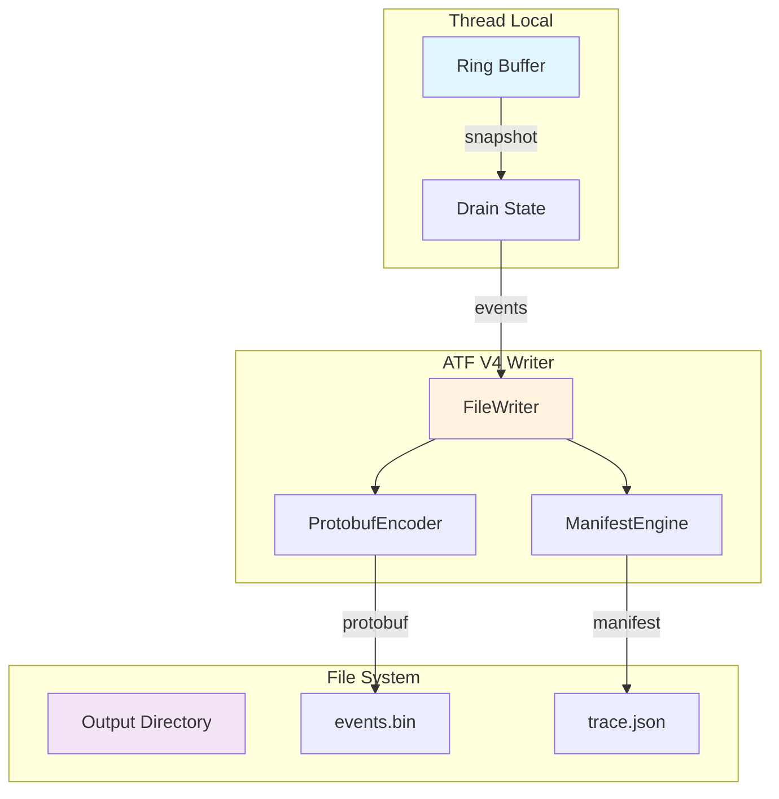
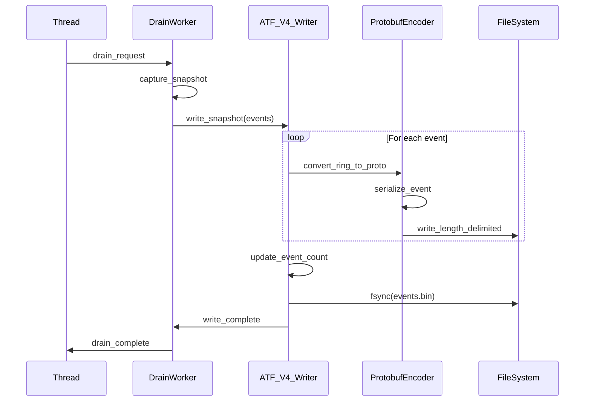
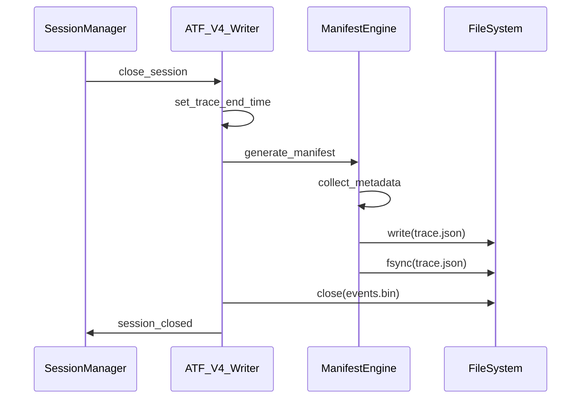
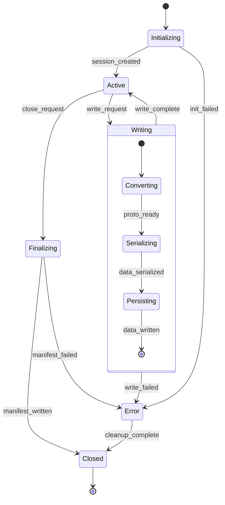

# M1_E2_I3 Technical Design: ATF V4 Writer

## Overview

This iteration implements ATF V4 Protobuf-compliant file persistence for drained ring buffer snapshots. It replaces the custom binary format with standard Protocol Buffer serialization, creating length-delimited Event streams with minimal JSON manifest files for efficient trace storage and cross-platform compatibility.

## Architecture

### Component Architecture



### Directory Structure (ATF V4 Format)

```mermaid
graph TB
    ROOT[ada_traces/]
    ROOT --> SESSION[session_YYYYMMDD_HHMMSS/]
    SESSION --> PID[pid_12345/]
    PID --> MANIFEST[trace.json]
    PID --> EVENTS[events.bin]
    
    MANIFEST --> |"metadata"| META{{
        os: "darwin"
        arch: "x86_64"
        timeStartNs: 1234567890
        timeEndNs: 1234567999
        eventCount: 10000
        modules: [UUID...]
    }}
    
    EVENTS --> |"length-delimited"| STREAM{{
        [varint_len][Event proto]
        [varint_len][Event proto]
        [varint_len][Event proto]
        ...
    }}
    
    style ROOT fill:#e8f5e9
    style SESSION fill:#e1f5fe
    style PID fill:#fff3e0
```

## Sequence Diagrams

### ATF V4 Write Sequence



### ATF V4 Session Close Sequence



## State Machines

### ATF V4 Writer State Machine



## Data Structures

### ATF V4 Protobuf Integration

```c
// ATF V4 Protobuf C structures (generated from .proto)
// Uses protobuf-c library for serialization
#include "trace_schema.pb-c.h"

// Writer state for ATF V4 format
typedef struct {
    // Configuration
    char base_path[PATH_MAX];
    char session_dir[PATH_MAX];
    
    // Session metadata
    uint64_t session_id;
    uint32_t pid;
    uint64_t trace_start_ns;
    uint64_t trace_end_ns;
    _Atomic uint64_t event_count;
    
    // File handles
    int events_fd;           // events.bin file
    FILE* manifest_fp;       // trace.json file
    
    // Protobuf encoder state
    ProtobufCAllocator allocator;
    Event current_event;
    
    // Event ID generation
    _Atomic uint64_t next_event_id;
    
    // Statistics
    _Atomic uint64_t bytes_written;
    _Atomic uint32_t write_errors;
    
    // Module tracking for manifest
    char modules_uuid[MAX_MODULES][37];  // UUID strings
    _Atomic uint32_t module_count;
    
} atf_v4_writer_t;

// Ring buffer event -> Protobuf Event conversion
typedef struct {
    ring_event_t* ring_event;
    Event* proto_event;
    size_t serialized_size;
} event_conversion_t;
```

### ATF V4 Manifest Structure

```c
// JSON manifest structure (trace.json)
typedef struct {
    char os[32];                    // "darwin", "linux"
    char arch[32];                  // "x86_64", "aarch64"
    uint64_t timeStartNs;          // Trace start timestamp
    uint64_t timeEndNs;            // Trace end timestamp  
    uint64_t eventCount;           // Total events written
    char modules[MAX_MODULES][37]; // Module UUID array
    uint32_t moduleCount;          // Number of modules
} atf_manifest_t;

// Length-delimited protobuf format
// File format: events.bin contains sequence of:
// [varint length][Event protobuf message]
// [varint length][Event protobuf message]
// ...

// Varint encoding for length prefixes (protobuf standard)
static inline size_t encode_varint(uint64_t value, uint8_t* buffer) {
    size_t pos = 0;
    while (value >= 0x80) {
        buffer[pos++] = (value & 0x7F) | 0x80;
        value >>= 7;
    }
    buffer[pos++] = value & 0x7F;
    return pos;
}
```

## Memory Ordering

### Atomic Event Counting

```c
// Thread-safe event counting for statistics
static inline void increment_event_count(atf_v4_writer_t* writer) {
    atomic_fetch_add_explicit(&writer->event_count, 1, memory_order_relaxed);
}

// Thread-safe byte counting
static inline void add_bytes_written(atf_v4_writer_t* writer, uint64_t bytes) {
    atomic_fetch_add_explicit(&writer->bytes_written, bytes, memory_order_relaxed);
}

// Wait for all writes to complete before finalization
static inline void wait_writes_complete(atf_v4_writer_t* writer) {
    // Use memory fence to ensure all writes are visible
    atomic_thread_fence(memory_order_seq_cst);
}
```

## Implementation Details

### ATF V4 Session Initialization

```c
int init_atf_v4_session(atf_v4_writer_t* writer) {
    char path[PATH_MAX];
    struct tm timeinfo;
    time_t now = time(NULL);
    
    // Generate session timestamp
    localtime_r(&now, &timeinfo);
    
    // Create base directory
    snprintf(path, sizeof(path), "%s/ada_traces", writer->base_path);
    mkdir(path, 0755);  // Ignore if exists
    
    // Create session directory
    snprintf(path, sizeof(path), 
             "%s/ada_traces/session_%04d%02d%02d_%02d%02d%02d",
             writer->base_path,
             timeinfo.tm_year + 1900,
             timeinfo.tm_mon + 1,
             timeinfo.tm_mday,
             timeinfo.tm_hour,
             timeinfo.tm_min,
             timeinfo.tm_sec);
    
    if (mkdir(path, 0755) != 0) {
        return -1;
    }
    
    // Create PID directory
    snprintf(writer->session_dir, sizeof(writer->session_dir),
             "%s/pid_%d", path, writer->pid);
    
    if (mkdir(writer->session_dir, 0755) != 0) {
        return -1;
    }
    
    // Open events.bin file
    char events_path[PATH_MAX];
    snprintf(events_path, sizeof(events_path), "%s/events.bin", writer->session_dir);
    writer->events_fd = open(events_path, O_CREAT | O_WRONLY | O_TRUNC, 0644);
    if (writer->events_fd < 0) {
        return -1;
    }
    
    // Initialize manifest file (will be updated on close)
    writer->trace_start_ns = get_timestamp_ns();
    atomic_store(&writer->event_count, 0);
    atomic_store(&writer->module_count, 0);
    
    // Get OS and architecture
    get_system_info(writer);
    
    return 0;
}

// Get system information for manifest
static void get_system_info(atf_v4_writer_t* writer) {
#ifdef __APPLE__
    strncpy(writer->manifest.os, "darwin", sizeof(writer->manifest.os));
#elif __linux__
    strncpy(writer->manifest.os, "linux", sizeof(writer->manifest.os));
#endif

#ifdef __x86_64__
    strncpy(writer->manifest.arch, "x86_64", sizeof(writer->manifest.arch));
#elif __aarch64__
    strncpy(writer->manifest.arch, "aarch64", sizeof(writer->manifest.arch));
#endif
}
```

### ATF V4 Event Writing

```c
// Write length-delimited Protobuf events
int write_atf_v4_events(atf_v4_writer_t* writer,
                       ring_event_t* ring_events,
                       uint32_t count) {
    uint8_t buffer[MAX_EVENT_SIZE];
    uint8_t varint_buffer[10];  // Max varint size
    
    for (uint32_t i = 0; i < count; i++) {
        // Convert ring buffer event to Protobuf Event
        Event proto_event = EVENT__INIT;
        if (convert_ring_to_proto(&ring_events[i], &proto_event) != 0) {
            atomic_fetch_add_explicit(&writer->write_errors, 1, memory_order_relaxed);
            continue;
        }
        
        // Serialize Protobuf Event
        size_t serialized_size = event__get_packed_size(&proto_event);
        if (serialized_size > sizeof(buffer)) {
            atomic_fetch_add_explicit(&writer->write_errors, 1, memory_order_relaxed);
            continue;
        }
        
        size_t packed_size = event__pack(&proto_event, buffer);
        assert(packed_size == serialized_size);
        
        // Encode length as varint
        size_t varint_size = encode_varint(serialized_size, varint_buffer);
        
        // Write length-delimited format: [varint length][protobuf message]
        ssize_t written = write(writer->events_fd, varint_buffer, varint_size);
        if (written != varint_size) {
            atomic_fetch_add_explicit(&writer->write_errors, 1, memory_order_relaxed);
            continue;
        }
        
        written = write(writer->events_fd, buffer, serialized_size);
        if (written != serialized_size) {
            atomic_fetch_add_explicit(&writer->write_errors, 1, memory_order_relaxed);
            continue;
        }
        
        // Update statistics
        atomic_fetch_add_explicit(&writer->bytes_written,
                                 varint_size + serialized_size,
                                 memory_order_relaxed);
        atomic_fetch_add_explicit(&writer->event_count, 1, memory_order_relaxed);
        
        // Free any allocated protobuf data
        cleanup_proto_event(&proto_event);
    }
    
    // Periodic fsync for durability
    if (atomic_load(&writer->event_count) % FSYNC_INTERVAL == 0) {
        fsync(writer->events_fd);
    }
    
    return 0;
}

// Convert ring buffer event to Protobuf Event
static int convert_ring_to_proto(ring_event_t* ring_event, Event* proto_event) {
    proto_event->event_id = atomic_fetch_add_explicit(&writer->next_event_id, 1, memory_order_relaxed);
    proto_event->thread_id = ring_event->thread_id;
    
    // Convert timestamp to protobuf Timestamp
    proto_event->timestamp = malloc(sizeof(Google__Protobuf__Timestamp));
    google__protobuf__timestamp__init(proto_event->timestamp);
    proto_event->timestamp->seconds = ring_event->timestamp_ns / 1000000000ULL;
    proto_event->timestamp->nanos = ring_event->timestamp_ns % 1000000000ULL;
    
    // Convert payload based on event type
    switch (ring_event->type) {
        case RING_EVENT_FUNCTION_CALL:
            return convert_function_call(ring_event, proto_event);
        case RING_EVENT_FUNCTION_RETURN:
            return convert_function_return(ring_event, proto_event);
        case RING_EVENT_SIGNAL_DELIVERY:
            return convert_signal_delivery(ring_event, proto_event);
        default:
            return -1;
    }
}

static int convert_function_call(ring_event_t* ring_event, Event* proto_event) {
    FunctionCall* call = malloc(sizeof(FunctionCall));
    function_call__init(call);
    
    call->symbol = strdup(ring_event->data.function_call.symbol);
    call->address = ring_event->data.function_call.address;
    
    // Convert argument registers
    call->n_argument_registers = ring_event->data.function_call.register_count;
    call->argument_registers = malloc(call->n_argument_registers * sizeof(char*));
    // ... populate argument_registers map ...
    
    // Copy shallow stack
    if (ring_event->data.function_call.stack_size > 0) {
        call->stack_shallow_copy.len = ring_event->data.function_call.stack_size;
        call->stack_shallow_copy.data = malloc(call->stack_shallow_copy.len);
        memcpy(call->stack_shallow_copy.data, 
               ring_event->data.function_call.stack_data, 
               call->stack_shallow_copy.len);
    }
    
    proto_event->payload_case = EVENT__PAYLOAD_FUNCTION_CALL;
    proto_event->function_call = call;
    
    return 0;
}
```

### ATF V4 Manifest Generation

```c
// Generate trace.json manifest on session close
int finalize_atf_v4_manifest(atf_v4_writer_t* writer) {
    writer->trace_end_ns = get_timestamp_ns();
    
    char manifest_path[PATH_MAX];
    snprintf(manifest_path, sizeof(manifest_path), "%s/trace.json", writer->session_dir);
    
    FILE* fp = fopen(manifest_path, "w");
    if (!fp) {
        return -1;
    }
    
    // Write JSON manifest
    fprintf(fp, "{\n");
    fprintf(fp, "  \"os\": \"%s\",\n", writer->manifest.os);
    fprintf(fp, "  \"arch\": \"%s\",\n", writer->manifest.arch);
    fprintf(fp, "  \"timeStartNs\": %llu,\n", writer->trace_start_ns);
    fprintf(fp, "  \"timeEndNs\": %llu,\n", writer->trace_end_ns);
    fprintf(fp, "  \"eventCount\": %llu,\n", atomic_load(&writer->event_count));
    fprintf(fp, "  \"modules\": [\n");
    
    uint32_t module_count = atomic_load(&writer->module_count);
    for (uint32_t i = 0; i < module_count; i++) {
        fprintf(fp, "    \"%s\"%s\n", 
               writer->modules_uuid[i],
               (i < module_count - 1) ? "," : "");
    }
    
    fprintf(fp, "  ]\n");
    fprintf(fp, "}\n");
    
    fclose(fp);
    return 0;
}
```

## Performance Considerations

### Protobuf Serialization Optimization

```c
// Pre-allocated protobuf allocator for performance
typedef struct {
    uint8_t* memory_pool;
    size_t pool_size;
    size_t pool_offset;
    ProtobufCAllocator allocator;
} protobuf_pool_allocator_t;

// Custom allocator for protobuf to reduce malloc overhead
static void* pool_alloc(void* data, size_t size) {
    protobuf_pool_allocator_t* pool = (protobuf_pool_allocator_t*)data;
    
    if (pool->pool_offset + size > pool->pool_size) {
        // Pool exhausted - fall back to malloc
        return malloc(size);
    }
    
    void* ptr = pool->memory_pool + pool->pool_offset;
    pool->pool_offset += size;
    return ptr;
}

static void pool_free(void* data, void* ptr) {
    protobuf_pool_allocator_t* pool = (protobuf_pool_allocator_t*)data;
    
    // Check if pointer is in our pool
    if (ptr >= (void*)pool->memory_pool && 
        ptr < (void*)(pool->memory_pool + pool->pool_size)) {
        // In pool - no action needed
        return;
    }
    
    // Outside pool - was malloc'd
    free(ptr);
}

// Initialize pool allocator
int init_protobuf_pool(protobuf_pool_allocator_t* pool, size_t size) {
    pool->memory_pool = malloc(size);
    if (!pool->memory_pool) {
        return -1;
    }
    
    pool->pool_size = size;
    pool->pool_offset = 0;
    pool->allocator.alloc = pool_alloc;
    pool->allocator.free = pool_free;
    pool->allocator.allocator_data = pool;
    
    return 0;
}
```

### Batch Writing for Performance

```c
// Batch events for efficient I/O
typedef struct {
    Event* events[BATCH_SIZE];
    uint32_t count;
    uint64_t batch_start_time;
} event_batch_t;

int write_event_batch(atf_v4_writer_t* writer, event_batch_t* batch) {
    uint8_t write_buffer[BATCH_BUFFER_SIZE];
    size_t buffer_offset = 0;
    
    // Serialize all events into buffer first
    for (uint32_t i = 0; i < batch->count; i++) {
        size_t event_size = event__get_packed_size(batch->events[i]);
        uint8_t varint_buf[10];
        size_t varint_size = encode_varint(event_size, varint_buf);
        
        // Check buffer space
        if (buffer_offset + varint_size + event_size > sizeof(write_buffer)) {
            // Flush current buffer
            write(writer->events_fd, write_buffer, buffer_offset);
            buffer_offset = 0;
        }
        
        // Add varint length
        memcpy(write_buffer + buffer_offset, varint_buf, varint_size);
        buffer_offset += varint_size;
        
        // Add serialized event
        event__pack(batch->events[i], write_buffer + buffer_offset);
        buffer_offset += event_size;
    }
    
    // Write final buffer
    if (buffer_offset > 0) {
        ssize_t written = write(writer->events_fd, write_buffer, buffer_offset);
        if (written != buffer_offset) {
            return -1;
        }
        
        add_bytes_written(writer, buffer_offset);
    }
    
    // Update event count
    atomic_fetch_add_explicit(&writer->event_count, batch->count, memory_order_relaxed);
    
    return 0;
}
```

## Error Handling

### Protobuf Error Handling

```c
typedef enum {
    ATF_WRITE_SUCCESS = 0,
    ATF_CONVERSION_ERROR,
    ATF_SERIALIZATION_ERROR,
    ATF_IO_ERROR,
    ATF_DISK_FULL
} atf_write_result_t;

atf_write_result_t handle_atf_error(atf_v4_writer_t* writer, 
                                   int error_type, 
                                   const char* context) {
    atomic_fetch_add_explicit(&writer->write_errors, 1, memory_order_relaxed);
    
    switch (error_type) {
        case ATF_CONVERSION_ERROR:
            log_error("Failed to convert ring event to protobuf: %s", context);
            return ATF_CONVERSION_ERROR;
            
        case ATF_SERIALIZATION_ERROR:
            log_error("Protobuf serialization failed: %s", context);
            return ATF_SERIALIZATION_ERROR;
            
        case ENOSPC:
            log_error("Disk full while writing ATF events");
            // Try to finalize manifest with current state
            finalize_atf_v4_manifest(writer);
            return ATF_DISK_FULL;
            
        default:
            log_error("ATF write error: %s", strerror(error_type));
            return ATF_IO_ERROR;
    }
}

// Schema validation for debugging
int validate_proto_event(Event* event) {
    if (!event) return -1;
    if (event->event_id == 0) return -1;
    if (!event->timestamp) return -1;
    
    switch (event->payload_case) {
        case EVENT__PAYLOAD_FUNCTION_CALL:
            if (!event->function_call || !event->function_call->symbol) return -1;
            break;
        case EVENT__PAYLOAD_FUNCTION_RETURN:
            if (!event->function_return || !event->function_return->symbol) return -1;
            break;
        case EVENT__PAYLOAD_SIGNAL_DELIVERY:
            if (!event->signal_delivery) return -1;
            break;
        default:
            return -1;
    }
    
    return 0;
}
```

## Integration Points

### Thread Registry Integration

```c
// Register ATF V4 writer with thread
void register_atf_writer(thread_registry_t* registry,
                        atf_v4_writer_t* writer) {
    thread_local_t* tls = get_thread_local();
    
    // Store writer reference
    tls->atf_writer = writer;
    
    // Initialize per-thread protobuf allocator
    init_protobuf_pool(&tls->proto_pool, PROTOBUF_POOL_SIZE);
}
```

### Drain Worker Integration

```c
// Called from drain worker after snapshot
void persist_atf_snapshot(drain_worker_t* worker,
                         ring_snapshot_t* snapshot) {
    atf_v4_writer_t* writer = worker->atf_writer;
    
    // Write all events as ATF V4 protobuf
    if (snapshot->event_count > 0) {
        write_atf_v4_events(writer,
                           snapshot->events,
                           snapshot->event_count);
    }
    
    // Update module tracking if new modules discovered
    update_module_manifest(writer, snapshot->modules, snapshot->module_count);
}
```

## Success Criteria

1. **ATF V4 Compliance**
   - Protobuf Event schema conformance
   - Length-delimited stream format
   - Valid trace.json manifest
   - Cross-platform compatibility

2. **Protobuf Integration**
   - Correct protobuf-c library usage
   - Proper message initialization/cleanup
   - Efficient serialization/deserialization
   - Varint length encoding

3. **File Format Correctness**
   - events.bin with length-delimited Events
   - trace.json with complete metadata
   - Atomic manifest write on close
   - Schema validation compatibility

4. **Performance Targets**
   - < 2ms write latency for 1KB protobuf batch
   - < 10ms for fsync operations
   - Minimal allocation in write path
   - Efficient varint encoding

5. **Thread Safety**
   - Single events.bin file with synchronized writes
   - Lock-free event counting
   - Atomic manifest updates
   - SPSC semantics preserved