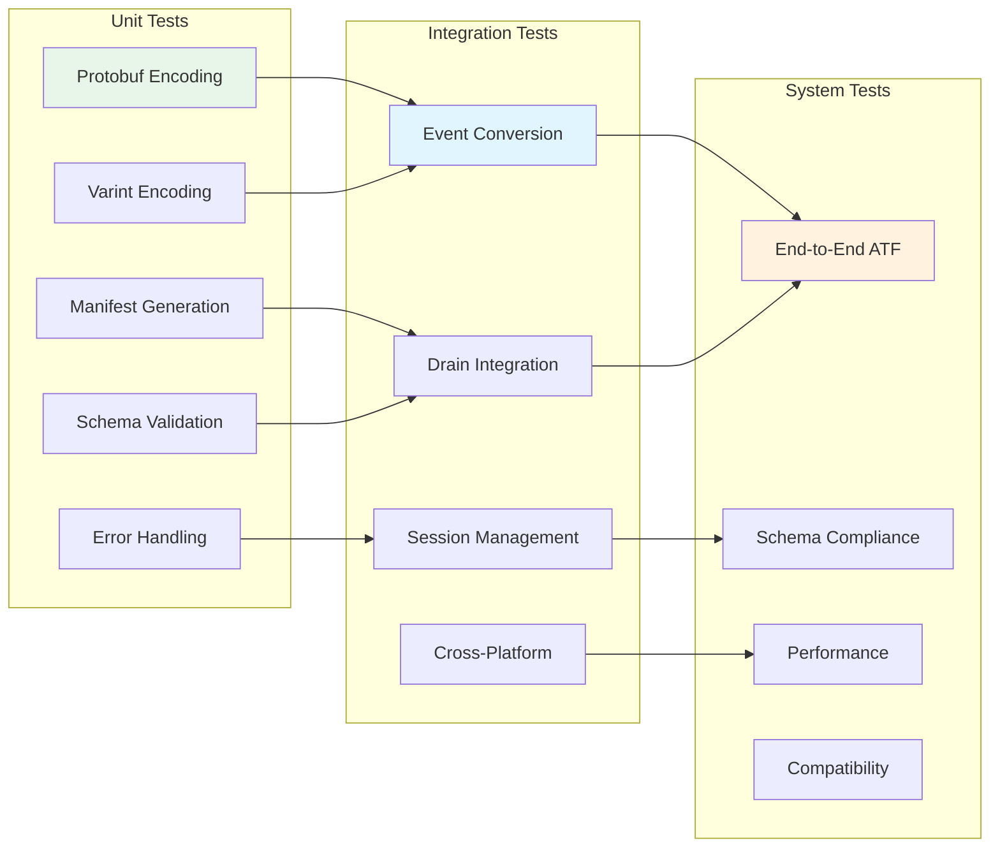

# M1_E2_I3 Test Plan: ATF V4 Writer

## Test Coverage Map



## Test Matrix

| Component | Test Type | Test Cases | Priority | Coverage Target |
|-----------|-----------|------------|----------|-----------------|
| Protobuf Encoding | Unit | 12 | P0 | 100% |
| Varint Encoding | Unit | 8 | P0 | 100% |
| Manifest Generation | Unit | 10 | P0 | 100% |
| Schema Validation | Unit | 15 | P0 | 100% |
| Error Handling | Unit | 10 | P0 | 100% |
| Event Conversion | Integration | 8 | P0 | 100% |
| Drain Integration | Integration | 6 | P0 | 100% |
| Session Management | Integration | 5 | P0 | 100% |
| Cross-Platform | Integration | 4 | P1 | 100% |
| End-to-End ATF | System | 4 | P0 | 100% |
| Schema Compliance | System | 3 | P0 | 100% |
| Performance | Benchmark | 8 | P1 | N/A |

## Unit Tests

### Protobuf Encoding Tests

```c
// Test: protobuf_event__function_call__then_valid_serialization
void test_protobuf_function_call_encoding() {
    Event event = EVENT__INIT;
    event.event_id = 12345;
    event.thread_id = 1;
    
    // Create timestamp
    Google__Protobuf__Timestamp timestamp = GOOGLE__PROTOBUF__TIMESTAMP__INIT;
    timestamp.seconds = 1640995200;  // 2022-01-01 00:00:00 UTC
    timestamp.nanos = 123456789;
    event.timestamp = &timestamp;
    
    // Create function call
    FunctionCall call = FUNCTION_CALL__INIT;
    call.symbol = "malloc";
    call.address = 0x7fff12345678;
    
    // Add argument registers
    call.n_argument_registers = 1;
    call.argument_registers = malloc(sizeof(char*));
    call.argument_registers[0] = "RDI=1024";  // Size argument
    
    event.payload_case = EVENT__PAYLOAD_FUNCTION_CALL;
    event.function_call = &call;
    
    // Serialize
    size_t size = event__get_packed_size(&event);
    uint8_t* buffer = malloc(size);
    size_t packed_size = event__pack(&event, buffer);
    
    ASSERT_EQ(packed_size, size);
    ASSERT_GT(size, 0);
    
    // Deserialize and verify
    Event* unpacked = event__unpack(NULL, size, buffer);
    ASSERT_NOT_NULL(unpacked);
    ASSERT_EQ(unpacked->event_id, 12345);
    ASSERT_EQ(unpacked->thread_id, 1);
    ASSERT_EQ(unpacked->payload_case, EVENT__PAYLOAD_FUNCTION_CALL);
    ASSERT_STREQ(unpacked->function_call->symbol, "malloc");
    ASSERT_EQ(unpacked->function_call->address, 0x7fff12345678);
    
    free(buffer);
    free(call.argument_registers);
    event__free_unpacked(unpacked, NULL);
}

// Test: protobuf_event__function_return__then_valid_serialization  
void test_protobuf_function_return_encoding() {
    Event event = EVENT__INIT;
    event.event_id = 12346;
    event.thread_id = 1;
    
    // Create timestamp
    Google__Protobuf__Timestamp timestamp = GOOGLE__PROTOBUF__TIMESTAMP__INIT;
    timestamp.seconds = 1640995201;
    timestamp.nanos = 234567890;
    event.timestamp = &timestamp;
    
    // Create function return
    FunctionReturn ret = FUNCTION_RETURN__INIT;
    ret.symbol = "malloc";
    ret.address = 0x7fff12345678;
    
    // Add return register
    ret.n_return_registers = 1;  
    ret.return_registers = malloc(sizeof(char*));
    ret.return_registers[0] = "RAX=0x12345000";  // Returned pointer
    
    event.payload_case = EVENT__PAYLOAD_FUNCTION_RETURN;
    event.function_return = &ret;
    
    // Serialize and verify
    size_t size = event__get_packed_size(&event);
    uint8_t* buffer = malloc(size);
    event__pack(&event, buffer);
    
    Event* unpacked = event__unpack(NULL, size, buffer);
    ASSERT_NOT_NULL(unpacked);
    ASSERT_EQ(unpacked->payload_case, EVENT__PAYLOAD_FUNCTION_RETURN);
    ASSERT_STREQ(unpacked->function_return->symbol, "malloc");
    
    free(buffer);
    free(ret.return_registers);
    event__free_unpacked(unpacked, NULL);
}

// Test: protobuf_event__signal_delivery__then_full_register_dump
void test_protobuf_signal_encoding() {
    Event event = EVENT__INIT;
    event.event_id = 12347;
    event.thread_id = 1;
    
    // Create timestamp
    Google__Protobuf__Timestamp timestamp = GOOGLE__PROTOBUF__TIMESTAMP__INIT;
    timestamp.seconds = 1640995202;
    event.timestamp = &timestamp;
    
    // Create signal delivery
    SignalDelivery signal = SIGNAL_DELIVERY__INIT;
    signal.number = 11;  // SIGSEGV
    signal.name = "SIGSEGV";
    
    // Add full register dump
    signal.n_registers = 16;  // x86_64 general purpose registers
    signal.registers = malloc(16 * sizeof(char*));
    signal.registers[0] = "RAX=0xdeadbeef";
    signal.registers[1] = "RBX=0xcafebabe";
    // ... populate other registers
    
    event.payload_case = EVENT__PAYLOAD_SIGNAL_DELIVERY;
    event.signal_delivery = &signal;
    
    // Serialize and verify
    size_t size = event__get_packed_size(&event);
    uint8_t* buffer = malloc(size);
    event__pack(&event, buffer);
    
    Event* unpacked = event__unpack(NULL, size, buffer);
    ASSERT_NOT_NULL(unpacked);
    ASSERT_EQ(unpacked->payload_case, EVENT__PAYLOAD_SIGNAL_DELIVERY);
    ASSERT_EQ(unpacked->signal_delivery->number, 11);
    ASSERT_STREQ(unpacked->signal_delivery->name, "SIGSEGV");
    ASSERT_EQ(unpacked->signal_delivery->n_registers, 16);
    
    free(buffer);
    free(signal.registers);
    event__free_unpacked(unpacked, NULL);
}

// Test: protobuf_event__trace_start__then_system_metadata
void test_protobuf_trace_start_encoding() {
    Event event = EVENT__INIT;
    event.event_id = 1;
    event.thread_id = 0;
    
    // Create timestamp
    Google__Protobuf__Timestamp timestamp = GOOGLE__PROTOBUF__TIMESTAMP__INIT;
    timestamp.seconds = 1640995100;
    event.timestamp = &timestamp;
    
    // Create trace start
    TraceStart start = TRACE_START__INIT;
    start.executable_path = "/usr/bin/test_program";
    start.operating_system = "darwin";
    start.cpu_architecture = "x86_64";
    
    // Add arguments
    start.n_args = 3;
    start.args = malloc(3 * sizeof(char*));
    start.args[0] = "test_program";
    start.args[1] = "--verbose";  
    start.args[2] = "--config=test.conf";
    
    event.payload_case = EVENT__PAYLOAD_TRACE_START;
    event.trace_start = &start;
    
    // Serialize and verify
    size_t size = event__get_packed_size(&event);
    uint8_t* buffer = malloc(size);
    event__pack(&event, buffer);
    
    Event* unpacked = event__unpack(NULL, size, buffer);
    ASSERT_NOT_NULL(unpacked);
    ASSERT_EQ(unpacked->payload_case, EVENT__PAYLOAD_TRACE_START);
    ASSERT_STREQ(unpacked->trace_start->executable_path, "/usr/bin/test_program");
    ASSERT_STREQ(unpacked->trace_start->operating_system, "darwin");
    ASSERT_STREQ(unpacked->trace_start->cpu_architecture, "x86_64");
    ASSERT_EQ(unpacked->trace_start->n_args, 3);
    
    free(buffer);
    free(start.args);
    event__free_unpacked(unpacked, NULL);
}

// Test: protobuf_event__stack_shallow_copy__then_binary_preserved
void test_protobuf_stack_data_preservation() {
    Event event = EVENT__INIT;
    event.event_id = 12348;
    event.thread_id = 2;
    
    // Create function call with stack data
    FunctionCall call = FUNCTION_CALL__INIT;
    call.symbol = "strcpy";
    call.address = 0x7fff87654321;
    
    // Add stack shallow copy (128 bytes)
    uint8_t stack_data[128];
    for (int i = 0; i < 128; i++) {
        stack_data[i] = (uint8_t)(i % 256);
    }
    
    call.stack_shallow_copy.len = 128;
    call.stack_shallow_copy.data = stack_data;
    
    event.payload_case = EVENT__PAYLOAD_FUNCTION_CALL;
    event.function_call = &call;
    
    // Serialize
    size_t size = event__get_packed_size(&event);
    uint8_t* buffer = malloc(size);
    event__pack(&event, buffer);
    
    // Deserialize and verify stack data
    Event* unpacked = event__unpack(NULL, size, buffer);
    ASSERT_NOT_NULL(unpacked);
    ASSERT_EQ(unpacked->function_call->stack_shallow_copy.len, 128);
    
    for (int i = 0; i < 128; i++) {
        ASSERT_EQ(unpacked->function_call->stack_shallow_copy.data[i], 
                 (uint8_t)(i % 256));
    }
    
    free(buffer);
    event__free_unpacked(unpacked, NULL);
}
```

### Varint Encoding Tests

```c
// Test: varint_encoding__small_values__then_single_byte
void test_varint_small_values() {
    uint8_t buffer[10];
    
    // Test values 0-127 (single byte)
    for (uint64_t i = 0; i < 128; i++) {
        size_t size = encode_varint(i, buffer);
        ASSERT_EQ(size, 1);
        ASSERT_EQ(buffer[0], (uint8_t)i);
    }
}

// Test: varint_encoding__medium_values__then_multi_byte
void test_varint_medium_values() {
    uint8_t buffer[10];
    
    // Test 128 (0x80) - should be [0x80, 0x01]
    size_t size = encode_varint(128, buffer);
    ASSERT_EQ(size, 2);
    ASSERT_EQ(buffer[0], 0x80);
    ASSERT_EQ(buffer[1], 0x01);
    
    // Test 16383 (0x3FFF) - should be [0xFF, 0x7F]  
    size = encode_varint(16383, buffer);
    ASSERT_EQ(size, 2);
    ASSERT_EQ(buffer[0], 0xFF);
    ASSERT_EQ(buffer[1], 0x7F);
    
    // Test 16384 (0x4000) - should be [0x80, 0x80, 0x01]
    size = encode_varint(16384, buffer);
    ASSERT_EQ(size, 3);
    ASSERT_EQ(buffer[0], 0x80);
    ASSERT_EQ(buffer[1], 0x80);
    ASSERT_EQ(buffer[2], 0x01);
}

// Test: varint_encoding__large_values__then_max_bytes
void test_varint_large_values() {
    uint8_t buffer[10];
    
    // Test maximum uint64_t value
    uint64_t max_val = UINT64_MAX;
    size_t size = encode_varint(max_val, buffer);
    ASSERT_EQ(size, 10);  // Maximum varint size for uint64
    
    // First byte should have continuation bit
    ASSERT_EQ(buffer[0] & 0x80, 0x80);
    
    // Last byte should not have continuation bit
    ASSERT_EQ(buffer[9] & 0x80, 0x00);
}

// Test: varint_roundtrip__all_ranges__then_preserves_value
void test_varint_roundtrip() {
    uint8_t buffer[10];
    uint64_t test_values[] = {
        0, 1, 127, 128, 255, 256, 16383, 16384, 
        UINT32_MAX, (uint64_t)UINT32_MAX + 1, UINT64_MAX
    };
    
    for (size_t i = 0; i < sizeof(test_values)/sizeof(test_values[0]); i++) {
        uint64_t original = test_values[i];
        
        // Encode
        size_t encoded_size = encode_varint(original, buffer);
        ASSERT_GT(encoded_size, 0);
        ASSERT_LE(encoded_size, 10);
        
        // Decode
        uint64_t decoded = decode_varint(buffer, encoded_size);
        ASSERT_EQ(decoded, original);
    }
}
```

### Manifest Generation Tests

```c
// Test: manifest__basic_fields__then_valid_json
void test_manifest_basic_generation() {
    atf_v4_writer_t writer = {0};
    strcpy(writer.session_dir, "/tmp/test_atf");
    
    // Set test values
    strncpy(writer.manifest.os, "darwin", sizeof(writer.manifest.os));
    strncpy(writer.manifest.arch, "x86_64", sizeof(writer.manifest.arch));
    writer.trace_start_ns = 1640995200000000000ULL;  // 2022-01-01 00:00:00
    writer.trace_end_ns = 1640995260000000000ULL;    // 2022-01-01 00:01:00
    atomic_store(&writer.event_count, 12345);
    atomic_store(&writer.module_count, 0);
    
    mkdir_p("/tmp/test_atf");
    int result = finalize_atf_v4_manifest(&writer);
    ASSERT_EQ(result, 0);
    
    // Verify manifest file created
    char manifest_path[PATH_MAX];
    snprintf(manifest_path, sizeof(manifest_path), "%s/trace.json", writer.session_dir);
    ASSERT_TRUE(file_exists(manifest_path));
    
    // Parse and verify JSON content
    FILE* fp = fopen(manifest_path, "r");
    ASSERT_NOT_NULL(fp);
    
    char line[1024];
    bool found_os = false, found_arch = false, found_count = false;
    
    while (fgets(line, sizeof(line), fp)) {
        if (strstr(line, "\"os\": \"darwin\"")) found_os = true;
        if (strstr(line, "\"arch\": \"x86_64\"")) found_arch = true;
        if (strstr(line, "\"eventCount\": 12345")) found_count = true;
    }
    
    fclose(fp);
    ASSERT_TRUE(found_os && found_arch && found_count);
    
    remove_directory_recursive("/tmp/test_atf");
}

// Test: manifest__with_modules__then_includes_uuids
void test_manifest_with_modules() {
    atf_v4_writer_t writer = {0};
    strcpy(writer.session_dir, "/tmp/test_atf");
    
    // Add test modules
    strncpy(writer.modules_uuid[0], "550e8400-e29b-41d4-a716-446655440000", 37);
    strncpy(writer.modules_uuid[1], "6ba7b810-9dad-11d1-80b4-00c04fd430c8", 37);
    strncpy(writer.modules_uuid[2], "6ba7b811-9dad-11d1-80b4-00c04fd430c8", 37);
    atomic_store(&writer.module_count, 3);
    
    atomic_store(&writer.event_count, 1000);
    writer.trace_start_ns = 1640995200000000000ULL;
    writer.trace_end_ns = 1640995300000000000ULL;
    
    mkdir_p("/tmp/test_atf");
    int result = finalize_atf_v4_manifest(&writer);
    ASSERT_EQ(result, 0);
    
    // Verify module UUIDs in manifest
    char manifest_path[PATH_MAX];
    snprintf(manifest_path, sizeof(manifest_path), "%s/trace.json", writer.session_dir);
    
    char* content = read_file_to_string(manifest_path);
    ASSERT_NOT_NULL(content);
    
    // Check all three UUIDs are present
    ASSERT_NOT_NULL(strstr(content, "550e8400-e29b-41d4-a716-446655440000"));
    ASSERT_NOT_NULL(strstr(content, "6ba7b810-9dad-11d1-80b4-00c04fd430c8"));
    ASSERT_NOT_NULL(strstr(content, "6ba7b811-9dad-11d1-80b4-00c04fd430c8"));
    
    // Verify JSON structure
    ASSERT_NOT_NULL(strstr(content, "\"modules\": ["));
    ASSERT_NOT_NULL(strstr(content, "]"));
    
    free(content);
    remove_directory_recursive("/tmp/test_atf");
}

// Test: manifest__timing_accuracy__then_nanosecond_precision
void test_manifest_timing_precision() {
    atf_v4_writer_t writer = {0};
    strcpy(writer.session_dir, "/tmp/test_atf");
    
    // Use specific nanosecond values
    writer.trace_start_ns = 1640995200123456789ULL;  // Specific nanoseconds
    writer.trace_end_ns = 1640995260987654321ULL;    // Different nanoseconds
    atomic_store(&writer.event_count, 5);
    atomic_store(&writer.module_count, 0);
    
    mkdir_p("/tmp/test_atf");
    finalize_atf_v4_manifest(&writer);
    
    // Read and parse manifest
    char manifest_path[PATH_MAX];
    snprintf(manifest_path, sizeof(manifest_path), "%s/trace.json", writer.session_dir);
    
    char* content = read_file_to_string(manifest_path);
    ASSERT_NOT_NULL(content);
    
    // Verify exact nanosecond values are preserved
    ASSERT_NOT_NULL(strstr(content, "1640995200123456789"));
    ASSERT_NOT_NULL(strstr(content, "1640995260987654321"));
    
    free(content);
    remove_directory_recursive("/tmp/test_atf");
}
```

### Schema Validation Tests

```c
// Test: schema_validation__valid_event__then_passes
void test_validate_complete_event() {
    Event event = EVENT__INIT;
    event.event_id = 12345;
    event.thread_id = 1;
    
    // Create valid timestamp
    Google__Protobuf__Timestamp timestamp = GOOGLE__PROTOBUF__TIMESTAMP__INIT;
    timestamp.seconds = 1640995200;
    timestamp.nanos = 123456789;
    event.timestamp = &timestamp;
    
    // Create valid function call
    FunctionCall call = FUNCTION_CALL__INIT;
    call.symbol = "malloc";
    call.address = 0x7fff12345678;
    
    event.payload_case = EVENT__PAYLOAD_FUNCTION_CALL;
    event.function_call = &call;
    
    int result = validate_proto_event(&event);
    ASSERT_EQ(result, 0);
}

// Test: schema_validation__missing_timestamp__then_fails
void test_validate_missing_timestamp() {
    Event event = EVENT__INIT;
    event.event_id = 12345;
    event.thread_id = 1;
    // timestamp = NULL (missing)
    
    FunctionCall call = FUNCTION_CALL__INIT;
    call.symbol = "malloc";
    call.address = 0x7fff12345678;
    
    event.payload_case = EVENT__PAYLOAD_FUNCTION_CALL;
    event.function_call = &call;
    
    int result = validate_proto_event(&event);
    ASSERT_EQ(result, -1);
}

// Test: schema_validation__invalid_payload__then_fails
void test_validate_invalid_payload() {
    Event event = EVENT__INIT;
    event.event_id = 12345;
    event.thread_id = 1;
    
    Google__Protobuf__Timestamp timestamp = GOOGLE__PROTOBUF__TIMESTAMP__INIT;
    timestamp.seconds = 1640995200;
    event.timestamp = &timestamp;
    
    // Invalid payload case
    event.payload_case = 999;
    
    int result = validate_proto_event(&event);
    ASSERT_EQ(result, -1);
}

// Test: schema_validation__missing_symbol__then_fails
void test_validate_missing_function_symbol() {
    Event event = EVENT__INIT;
    event.event_id = 12345;
    event.thread_id = 1;
    
    Google__Protobuf__Timestamp timestamp = GOOGLE__PROTOBUF__TIMESTAMP__INIT;
    timestamp.seconds = 1640995200;
    event.timestamp = &timestamp;
    
    FunctionCall call = FUNCTION_CALL__INIT;
    // call.symbol = NULL (missing)
    call.address = 0x7fff12345678;
    
    event.payload_case = EVENT__PAYLOAD_FUNCTION_CALL;
    event.function_call = &call;
    
    int result = validate_proto_event(&event);
    ASSERT_EQ(result, -1);
}

// Test: schema_validation__trace_start_complete__then_passes
void test_validate_trace_start_event() {
    Event event = EVENT__INIT;
    event.event_id = 1;
    event.thread_id = 0;
    
    Google__Protobuf__Timestamp timestamp = GOOGLE__PROTOBUF__TIMESTAMP__INIT;
    timestamp.seconds = 1640995200;
    event.timestamp = &timestamp;
    
    TraceStart start = TRACE_START__INIT;
    start.executable_path = "/usr/bin/test";
    start.operating_system = "darwin";
    start.cpu_architecture = "x86_64";
    start.n_args = 1;
    start.args = malloc(sizeof(char*));
    start.args[0] = "test";
    
    event.payload_case = EVENT__PAYLOAD_TRACE_START;
    event.trace_start = &start;
    
    int result = validate_proto_event(&event);
    ASSERT_EQ(result, 0);
    
    free(start.args);
}
```

## Integration Tests

### Event Conversion Tests

```c
// Test: event_conversion__ring_to_function_call__then_complete_mapping
void test_convert_ring_function_call() {
    // Create ring buffer event
    ring_event_t ring_event = {
        .type = RING_EVENT_FUNCTION_CALL,
        .thread_id = 5,
        .timestamp_ns = 1640995200123456789ULL,
        .data.function_call = {
            .symbol = "malloc",
            .address = 0x7fff12345678,
            .register_count = 2,
            .stack_size = 64
        }
    };
    
    // Set up register data
    strncpy(ring_event.data.function_call.registers[0].name, "RDI", 4);
    ring_event.data.function_call.registers[0].value = 1024;  // Size
    strncpy(ring_event.data.function_call.registers[1].name, "RSI", 4);
    ring_event.data.function_call.registers[1].value = 0;     // Flags
    
    // Set up stack data
    for (int i = 0; i < 64; i++) {
        ring_event.data.function_call.stack_data[i] = (uint8_t)(i % 256);
    }
    
    atf_v4_writer_t writer = {0};
    atomic_store(&writer.next_event_id, 12345);
    
    // Convert to protobuf
    Event proto_event = EVENT__INIT;
    int result = convert_ring_to_proto(&ring_event, &proto_event);
    
    ASSERT_EQ(result, 0);
    ASSERT_EQ(proto_event.event_id, 12345);
    ASSERT_EQ(proto_event.thread_id, 5);
    ASSERT_EQ(proto_event.payload_case, EVENT__PAYLOAD_FUNCTION_CALL);
    
    ASSERT_NOT_NULL(proto_event.function_call);
    ASSERT_STREQ(proto_event.function_call->symbol, "malloc");
    ASSERT_EQ(proto_event.function_call->address, 0x7fff12345678);
    ASSERT_EQ(proto_event.function_call->stack_shallow_copy.len, 64);
    
    // Verify stack data preservation
    for (int i = 0; i < 64; i++) {
        ASSERT_EQ(proto_event.function_call->stack_shallow_copy.data[i], 
                 (uint8_t)(i % 256));
    }
    
    cleanup_proto_event(&proto_event);
}

// Test: event_conversion__ring_to_function_return__then_return_register
void test_convert_ring_function_return() {
    ring_event_t ring_event = {
        .type = RING_EVENT_FUNCTION_RETURN,
        .thread_id = 5,
        .timestamp_ns = 1640995200234567890ULL,
        .data.function_return = {
            .symbol = "malloc",
            .address = 0x7fff12345678,
            .register_count = 1
        }
    };
    
    // Set return value register
    strncpy(ring_event.data.function_return.registers[0].name, "RAX", 4);
    ring_event.data.function_return.registers[0].value = 0x12345000;  // Returned pointer
    
    atf_v4_writer_t writer = {0};
    atomic_store(&writer.next_event_id, 12346);
    
    Event proto_event = EVENT__INIT;
    int result = convert_ring_to_proto(&ring_event, &proto_event);
    
    ASSERT_EQ(result, 0);
    ASSERT_EQ(proto_event.event_id, 12346);
    ASSERT_EQ(proto_event.payload_case, EVENT__PAYLOAD_FUNCTION_RETURN);
    
    ASSERT_NOT_NULL(proto_event.function_return);
    ASSERT_STREQ(proto_event.function_return->symbol, "malloc");
    ASSERT_EQ(proto_event.function_return->address, 0x7fff12345678);
    
    cleanup_proto_event(&proto_event);
}

// Test: event_conversion__timestamp_precision__then_nanosecond_accurate
void test_convert_timestamp_precision() {
    ring_event_t ring_event = {
        .type = RING_EVENT_FUNCTION_CALL,
        .thread_id = 1,
        .timestamp_ns = 1640995200123456789ULL  // Specific nanosecond timestamp
    };
    
    Event proto_event = EVENT__INIT;
    convert_ring_to_proto(&ring_event, &proto_event);
    
    ASSERT_NOT_NULL(proto_event.timestamp);
    ASSERT_EQ(proto_event.timestamp->seconds, 1640995200);  // 2022-01-01 00:00:00
    ASSERT_EQ(proto_event.timestamp->nanos, 123456789);     // Exact nanoseconds
    
    // Verify roundtrip accuracy
    uint64_t reconstructed = proto_event.timestamp->seconds * 1000000000ULL + 
                           proto_event.timestamp->nanos;
    ASSERT_EQ(reconstructed, 1640995200123456789ULL);
    
    cleanup_proto_event(&proto_event);
}
```

### Drain Integration Tests

```c
// Test: drain_integration__single_batch__then_atf_written
void test_drain_to_atf_integration() {
    atf_v4_writer_t writer = {0};
    drain_worker_t worker = {0};
    
    strcpy(writer.base_path, "/tmp/test_atf");
    init_atf_v4_session(&writer);
    
    worker.atf_writer = &writer;
    
    // Create ring snapshot with mixed event types
    ring_snapshot_t snapshot = {
        .event_count = 3,
        .events = malloc(3 * sizeof(ring_event_t))
    };
    
    // Function call event
    snapshot.events[0] = (ring_event_t){
        .type = RING_EVENT_FUNCTION_CALL,
        .thread_id = 1,
        .timestamp_ns = 1640995200000000000ULL,
        .data.function_call = {
            .symbol = "malloc",
            .address = 0x7fff12345678,
            .register_count = 1
        }
    };
    
    // Function return event
    snapshot.events[1] = (ring_event_t){
        .type = RING_EVENT_FUNCTION_RETURN,
        .thread_id = 1,  
        .timestamp_ns = 1640995200000001000ULL,
        .data.function_return = {
            .symbol = "malloc",
            .address = 0x7fff12345678,
            .register_count = 1
        }
    };
    
    // Signal event
    snapshot.events[2] = (ring_event_t){
        .type = RING_EVENT_SIGNAL_DELIVERY,
        .thread_id = 1,
        .timestamp_ns = 1640995200000002000ULL,
        .data.signal_delivery = {
            .number = 11,
            .name = "SIGSEGV",
            .register_count = 8
        }
    };
    
    // Persist to ATF
    persist_atf_snapshot(&worker, &snapshot);
    
    // Verify events.bin file created
    char events_path[PATH_MAX];
    snprintf(events_path, sizeof(events_path), "%s/events.bin", writer.session_dir);
    ASSERT_TRUE(file_exists(events_path));
    
    // Verify event count
    ASSERT_EQ(atomic_load(&writer.event_count), 3);
    
    // Close session and verify manifest
    finalize_atf_v4_manifest(&writer);
    
    char manifest_path[PATH_MAX];
    snprintf(manifest_path, sizeof(manifest_path), "%s/trace.json", writer.session_dir);
    ASSERT_TRUE(file_exists(manifest_path));
    
    free(snapshot.events);
    close(writer.events_fd);
    remove_directory_recursive("/tmp/test_atf");
}

// Test: drain_integration__large_batch__then_performance_acceptable
void test_drain_large_batch_performance() {
    atf_v4_writer_t writer = {0};
    drain_worker_t worker = {0};
    
    strcpy(writer.base_path, "/tmp/test_atf");
    init_atf_v4_session(&writer);
    worker.atf_writer = &writer;
    
    const int EVENT_COUNT = 10000;
    ring_snapshot_t snapshot = {
        .event_count = EVENT_COUNT,
        .events = malloc(EVENT_COUNT * sizeof(ring_event_t))
    };
    
    // Generate large number of function call events
    for (int i = 0; i < EVENT_COUNT; i++) {
        snapshot.events[i] = (ring_event_t){
            .type = RING_EVENT_FUNCTION_CALL,
            .thread_id = i % 8,  // Spread across threads
            .timestamp_ns = 1640995200000000000ULL + i * 1000,  // 1μs apart
            .data.function_call = {
                .symbol = "test_function",
                .address = 0x7fff12340000 + i,
                .register_count = 2
            }
        };
    }
    
    uint64_t start_time = get_timestamp_ns();
    persist_atf_snapshot(&worker, &snapshot);
    uint64_t end_time = get_timestamp_ns();
    
    double duration_ms = (end_time - start_time) / 1000000.0;
    printf("Large batch (%d events) processing time: %.3f ms\n", EVENT_COUNT, duration_ms);
    
    // Performance target: < 100ms for 10K events
    ASSERT_LT(duration_ms, 100.0);
    
    // Verify all events written
    ASSERT_EQ(atomic_load(&writer.event_count), EVENT_COUNT);
    
    free(snapshot.events);
    close(writer.events_fd);
    remove_directory_recursive("/tmp/test_atf");
}
```

### Session Management Tests

```c
// Test: session_management__full_lifecycle__then_valid_trace
void test_session_full_lifecycle() {
    atf_v4_writer_t writer = {0};
    strcpy(writer.base_path, "/tmp/test_atf");
    
    // Initialize session
    int result = init_atf_v4_session(&writer);
    ASSERT_EQ(result, 0);
    
    // Verify files created
    char events_path[PATH_MAX], session_dir[PATH_MAX];
    strcpy(session_dir, writer.session_dir);
    snprintf(events_path, sizeof(events_path), "%s/events.bin", session_dir);
    
    ASSERT_TRUE(directory_exists(session_dir));
    ASSERT_TRUE(file_exists(events_path));
    ASSERT_GE(writer.events_fd, 0);
    
    // Write some events
    ring_event_t events[5];
    for (int i = 0; i < 5; i++) {
        events[i] = (ring_event_t){
            .type = RING_EVENT_FUNCTION_CALL,
            .thread_id = 1,
            .timestamp_ns = 1640995200000000000ULL + i * 1000000,
            .data.function_call = {
                .symbol = "test_func",
                .address = 0x7fff12345000 + i,
                .register_count = 1
            }
        };
    }
    
    write_atf_v4_events(&writer, events, 5);
    
    // Close session
    close(writer.events_fd);
    result = finalize_atf_v4_manifest(&writer);
    ASSERT_EQ(result, 0);
    
    // Verify manifest created
    char manifest_path[PATH_MAX];
    snprintf(manifest_path, sizeof(manifest_path), "%s/trace.json", session_dir);
    ASSERT_TRUE(file_exists(manifest_path));
    
    // Verify manifest content
    char* manifest_content = read_file_to_string(manifest_path);
    ASSERT_NOT_NULL(strstr(manifest_content, "\"eventCount\": 5"));
    ASSERT_NOT_NULL(strstr(manifest_content, "\"timeStartNs\""));
    ASSERT_NOT_NULL(strstr(manifest_content, "\"timeEndNs\""));
    
    free(manifest_content);
    remove_directory_recursive("/tmp/test_atf");
}

// Test: session_management__multiple_sessions__then_isolated
void test_multiple_sessions_isolation() {
    atf_v4_writer_t writer1 = {0}, writer2 = {0};
    
    strcpy(writer1.base_path, "/tmp/test_atf1");
    strcpy(writer2.base_path, "/tmp/test_atf2");
    
    // Initialize both sessions
    init_atf_v4_session(&writer1);
    sleep(1);  // Ensure different timestamps
    init_atf_v4_session(&writer2);
    
    // Verify different session directories
    ASSERT_STRNE(writer1.session_dir, writer2.session_dir);
    ASSERT_TRUE(directory_exists(writer1.session_dir));
    ASSERT_TRUE(directory_exists(writer2.session_dir));
    
    // Write different events to each
    ring_event_t event1 = {
        .type = RING_EVENT_FUNCTION_CALL,
        .data.function_call.symbol = "session1_func"
    };
    
    ring_event_t event2 = {
        .type = RING_EVENT_FUNCTION_CALL,
        .data.function_call.symbol = "session2_func" 
    };
    
    write_atf_v4_events(&writer1, &event1, 1);
    write_atf_v4_events(&writer2, &event2, 1);
    
    // Close and finalize both
    close(writer1.events_fd);
    close(writer2.events_fd);
    finalize_atf_v4_manifest(&writer1);
    finalize_atf_v4_manifest(&writer2);
    
    // Verify separate manifests
    char manifest1[PATH_MAX], manifest2[PATH_MAX];
    snprintf(manifest1, sizeof(manifest1), "%s/trace.json", writer1.session_dir);
    snprintf(manifest2, sizeof(manifest2), "%s/trace.json", writer2.session_dir);
    
    ASSERT_TRUE(file_exists(manifest1));
    ASSERT_TRUE(file_exists(manifest2));
    
    char* content1 = read_file_to_string(manifest1);
    char* content2 = read_file_to_string(manifest2);
    
    ASSERT_NOT_NULL(strstr(content1, "\"eventCount\": 1"));
    ASSERT_NOT_NULL(strstr(content2, "\"eventCount\": 1"));
    
    free(content1);
    free(content2);
    remove_directory_recursive("/tmp/test_atf1");
    remove_directory_recursive("/tmp/test_atf2");
}
```

## System Tests

### End-to-End ATF Tests

```c
// Test: e2e_atf__full_pipeline__then_valid_trace_file
void test_e2e_complete_atf_pipeline() {
    // Initialize complete system
    thread_registry_t registry;
    ring_buffer_t buffer;
    drain_worker_t worker;
    atf_v4_writer_t writer;
    
    init_thread_registry(&registry);
    init_ring_buffer(&buffer, 8192);
    init_drain_worker(&worker, &buffer);
    
    strcpy(writer.base_path, "/tmp/test_atf_e2e");
    init_atf_v4_session(&writer);
    worker.atf_writer = &writer;
    
    // Generate diverse trace events
    generate_trace_start_event(&buffer);
    
    for (int i = 0; i < 100; i++) {
        generate_function_call_event(&buffer, i);
        generate_function_return_event(&buffer, i);
    }
    
    generate_signal_event(&buffer);
    generate_trace_end_event(&buffer);
    
    // Drain to ATF
    drain_ring_buffer(&worker);
    
    // Finalize session
    close(writer.events_fd);
    finalize_atf_v4_manifest(&writer);
    
    // Verify ATF compliance
    char events_path[PATH_MAX], manifest_path[PATH_MAX];
    snprintf(events_path, sizeof(events_path), "%s/events.bin", writer.session_dir);
    snprintf(manifest_path, sizeof(manifest_path), "%s/trace.json", writer.session_dir);
    
    ASSERT_TRUE(file_exists(events_path));
    ASSERT_TRUE(file_exists(manifest_path));
    
    // Validate events.bin format
    ASSERT_TRUE(validate_length_delimited_format(events_path));
    
    // Validate manifest JSON
    ASSERT_TRUE(validate_manifest_json(manifest_path));
    
    // Verify event count consistency
    uint32_t file_event_count = count_events_in_file(events_path);
    uint64_t manifest_count = get_manifest_event_count(manifest_path);
    ASSERT_EQ(file_event_count, manifest_count);
    ASSERT_EQ(manifest_count, 202);  // 100 calls + 100 returns + start + signal + end
    
    cleanup_all(&registry, &buffer, &worker);
    remove_directory_recursive("/tmp/test_atf_e2e");
}

// Test: e2e_atf__cross_platform_compatibility__then_portable
void test_atf_cross_platform_portability() {
    atf_v4_writer_t writer = {0};
    strcpy(writer.base_path, "/tmp/test_atf_portable");
    init_atf_v4_session(&writer);
    
    // Generate events with platform-specific data
    ring_event_t events[10];
    for (int i = 0; i < 10; i++) {
        events[i] = (ring_event_t){
            .type = RING_EVENT_FUNCTION_CALL,
            .thread_id = 1,
            .timestamp_ns = 1640995200000000000ULL + i * 1000000,
            .data.function_call = {
                .symbol = "platform_func",
                .address = 0x7fff00000000ULL + i * 0x1000,  // 64-bit address
                .register_count = 6  // x86_64 calling convention registers
            }
        };
        
        // Set up x86_64 calling convention registers
        const char* reg_names[] = {"RDI", "RSI", "RDX", "RCX", "R8", "R9"};
        for (int j = 0; j < 6; j++) {
            strncpy(events[i].data.function_call.registers[j].name, reg_names[j], 4);
            events[i].data.function_call.registers[j].value = 0x1000 * (i + 1) + j;
        }
    }
    
    write_atf_v4_events(&writer, events, 10);
    
    close(writer.events_fd);
    finalize_atf_v4_manifest(&writer);
    
    // Verify manifest contains correct platform info
    char manifest_path[PATH_MAX];
    snprintf(manifest_path, sizeof(manifest_path), "%s/trace.json", writer.session_dir);
    
    char* content = read_file_to_string(manifest_path);
    
    // Check platform fields are present and valid
#ifdef __APPLE__
    ASSERT_NOT_NULL(strstr(content, "\"os\": \"darwin\""));
#elif __linux__
    ASSERT_NOT_NULL(strstr(content, "\"os\": \"linux\""));
#endif

#ifdef __x86_64__
    ASSERT_NOT_NULL(strstr(content, "\"arch\": \"x86_64\""));
#elif __aarch64__
    ASSERT_NOT_NULL(strstr(content, "\"arch\": \"aarch64\""));
#endif
    
    // Verify events.bin is valid length-delimited protobuf
    char events_path[PATH_MAX];
    snprintf(events_path, sizeof(events_path), "%s/events.bin", writer.session_dir);
    ASSERT_TRUE(validate_protobuf_stream_format(events_path));
    
    free(content);
    remove_directory_recursive("/tmp/test_atf_portable");
}
```

### Schema Compliance Tests

```c
// Test: schema_compliance__against_trace_schema_v4__then_validates
void test_schema_v4_compliance() {
    atf_v4_writer_t writer = {0};
    strcpy(writer.base_path, "/tmp/test_schema_compliance");
    init_atf_v4_session(&writer);
    
    // Create one event of each type in the schema
    ring_event_t events[4];
    
    // TraceStart event
    events[0] = (ring_event_t){
        .type = RING_EVENT_TRACE_START,
        .thread_id = 0,
        .timestamp_ns = 1640995200000000000ULL,
        .data.trace_start = {
            .executable_path = "/usr/bin/test_program",
            .args_count = 2,
            .args = {"test_program", "--verbose"},
            .operating_system = "darwin",
            .cpu_architecture = "x86_64"
        }
    };
    
    // FunctionCall event
    events[1] = (ring_event_t){
        .type = RING_EVENT_FUNCTION_CALL,
        .thread_id = 1,
        .timestamp_ns = 1640995200001000000ULL,
        .data.function_call = {
            .symbol = "malloc",
            .address = 0x7fff12345678,
            .register_count = 1,
            .stack_size = 128
        }
    };
    
    // FunctionReturn event
    events[2] = (ring_event_t){
        .type = RING_EVENT_FUNCTION_RETURN,
        .thread_id = 1,
        .timestamp_ns = 1640995200002000000ULL,
        .data.function_return = {
            .symbol = "malloc",
            .address = 0x7fff12345678,
            .register_count = 1
        }
    };
    
    // SignalDelivery event
    events[3] = (ring_event_t){
        .type = RING_EVENT_SIGNAL_DELIVERY,
        .thread_id = 1,
        .timestamp_ns = 1640995200003000000ULL,
        .data.signal_delivery = {
            .number = 11,
            .name = "SIGSEGV",
            .register_count = 16  // Full register dump
        }
    };
    
    write_atf_v4_events(&writer, events, 4);
    
    close(writer.events_fd);
    finalize_atf_v4_manifest(&writer);
    
    // Validate each event against schema
    char events_path[PATH_MAX];
    snprintf(events_path, sizeof(events_path), "%s/events.bin", writer.session_dir);
    
    Event** deserialized_events = deserialize_all_events(events_path);
    ASSERT_NOT_NULL(deserialized_events);
    
    // Validate TraceStart
    ASSERT_EQ(deserialized_events[0]->payload_case, EVENT__PAYLOAD_TRACE_START);
    ASSERT_NOT_NULL(deserialized_events[0]->trace_start);
    ASSERT_STREQ(deserialized_events[0]->trace_start->executable_path, "/usr/bin/test_program");
    ASSERT_STREQ(deserialized_events[0]->trace_start->operating_system, "darwin");
    ASSERT_STREQ(deserialized_events[0]->trace_start->cpu_architecture, "x86_64");
    
    // Validate FunctionCall
    ASSERT_EQ(deserialized_events[1]->payload_case, EVENT__PAYLOAD_FUNCTION_CALL);
    ASSERT_NOT_NULL(deserialized_events[1]->function_call);
    ASSERT_STREQ(deserialized_events[1]->function_call->symbol, "malloc");
    ASSERT_EQ(deserialized_events[1]->function_call->address, 0x7fff12345678);
    
    // Validate FunctionReturn
    ASSERT_EQ(deserialized_events[2]->payload_case, EVENT__PAYLOAD_FUNCTION_RETURN);
    ASSERT_NOT_NULL(deserialized_events[2]->function_return);
    ASSERT_STREQ(deserialized_events[2]->function_return->symbol, "malloc");
    
    // Validate SignalDelivery
    ASSERT_EQ(deserialized_events[3]->payload_case, EVENT__PAYLOAD_SIGNAL_DELIVERY);
    ASSERT_NOT_NULL(deserialized_events[3]->signal_delivery);
    ASSERT_EQ(deserialized_events[3]->signal_delivery->number, 11);
    ASSERT_STREQ(deserialized_events[3]->signal_delivery->name, "SIGSEGV");
    
    free_event_array(deserialized_events, 4);
    remove_directory_recursive("/tmp/test_schema_compliance");
}
```

## Performance Benchmarks

### ATF V4 Write Performance

```c
// Benchmark: protobuf_serialization__typical_events__then_under_2ms
void benchmark_atf_v4_write_latency() {
    atf_v4_writer_t writer = {0};
    strcpy(writer.base_path, "/tmp/test_atf_perf");
    init_atf_v4_session(&writer);
    
    // Prepare typical event batch (1KB of protobuf data)
    ring_event_t events[25];  // ~40 bytes each after protobuf encoding
    for (int i = 0; i < 25; i++) {
        events[i] = (ring_event_t){
            .type = RING_EVENT_FUNCTION_CALL,
            .thread_id = 1,
            .timestamp_ns = 1640995200000000000ULL + i * 1000,
            .data.function_call = {
                .symbol = "benchmark_func",
                .address = 0x7fff12345000 + i,
                .register_count = 6,
                .stack_size = 64
            }
        };
    }
    
    const int ITERATIONS = 1000;
    uint64_t total_ns = 0;
    
    for (int i = 0; i < ITERATIONS; i++) {
        uint64_t start = get_timestamp_ns();
        
        write_atf_v4_events(&writer, events, 25);
        
        uint64_t end = get_timestamp_ns();
        total_ns += (end - start);
    }
    
    uint64_t avg_ns = total_ns / ITERATIONS;
    double avg_ms = avg_ns / 1000000.0;
    
    printf("ATF V4 write latency (1KB protobuf): %.3f ms\n", avg_ms);
    ASSERT_LT(avg_ms, 2.0);  // < 2ms target for protobuf overhead
    
    close(writer.events_fd);
    remove_directory_recursive("/tmp/test_atf_perf");
}

// Benchmark: manifest_generation__large_trace__then_fast_finalization
void benchmark_manifest_generation_performance() {
    atf_v4_writer_t writer = {0};
    strcpy(writer.base_path, "/tmp/test_manifest_perf");
    init_atf_v4_session(&writer);
    
    // Simulate large trace session
    atomic_store(&writer.event_count, 1000000);  // 1M events
    atomic_store(&writer.module_count, 100);     // 100 modules
    
    // Generate module UUIDs
    for (int i = 0; i < 100; i++) {
        snprintf(writer.modules_uuid[i], 37, 
                "550e8400-e29b-41d4-a716-4466554400%02d", i);
    }
    
    writer.trace_start_ns = 1640995200000000000ULL;
    writer.trace_end_ns = 1640995800000000000ULL;  // 10 minute trace
    
    uint64_t start = get_timestamp_ns();
    int result = finalize_atf_v4_manifest(&writer);
    uint64_t end = get_timestamp_ns();
    
    ASSERT_EQ(result, 0);
    
    double duration_ms = (end - start) / 1000000.0;
    printf("Manifest generation (1M events, 100 modules): %.3f ms\n", duration_ms);
    
    // Should be fast even for large traces
    ASSERT_LT(duration_ms, 50.0);  // < 50ms target
    
    close(writer.events_fd);
    remove_directory_recursive("/tmp/test_manifest_perf");
}

// Benchmark: atf_throughput__concurrent_writers__then_scales
void benchmark_atf_v4_concurrent_throughput() {
    atf_v4_writer_t writer = {0};
    strcpy(writer.base_path, "/tmp/test_atf_throughput");
    init_atf_v4_session(&writer);
    
    const int NUM_THREADS = 8;
    const int EVENTS_PER_THREAD = 10000;
    
    // Pre-generate events to avoid allocation overhead in benchmark
    ring_event_t** thread_events = malloc(NUM_THREADS * sizeof(ring_event_t*));
    for (int t = 0; t < NUM_THREADS; t++) {
        thread_events[t] = malloc(EVENTS_PER_THREAD * sizeof(ring_event_t));
        
        for (int i = 0; i < EVENTS_PER_THREAD; i++) {
            thread_events[t][i] = (ring_event_t){
                .type = RING_EVENT_FUNCTION_CALL,
                .thread_id = t,
                .timestamp_ns = 1640995200000000000ULL + (t * EVENTS_PER_THREAD + i) * 100,
                .data.function_call = {
                    .symbol = "perf_test",
                    .address = 0x7fff12340000 + i,
                    .register_count = 2
                }
            };
        }
    }
    
    uint64_t start_time = get_timestamp_ns();
    
    // Concurrent writing (simulating multiple drain workers)
    pthread_t threads[NUM_THREADS];
    thread_writer_args_t args[NUM_THREADS];
    
    for (int t = 0; t < NUM_THREADS; t++) {
        args[t].writer = &writer;
        args[t].events = thread_events[t];
        args[t].count = EVENTS_PER_THREAD;
        pthread_create(&threads[t], NULL, thread_writer_func, &args[t]);
    }
    
    for (int t = 0; t < NUM_THREADS; t++) {
        pthread_join(threads[t], NULL);
    }
    
    uint64_t end_time = get_timestamp_ns();
    double duration_ms = (end_time - start_time) / 1000000.0;
    
    uint64_t total_events = NUM_THREADS * EVENTS_PER_THREAD;
    double events_per_sec = (total_events * 1000.0) / duration_ms;
    
    printf("ATF V4 concurrent throughput: %.0f events/sec (%d threads, %lu total events)\n",
           events_per_sec, NUM_THREADS, total_events);
    
    // Performance target: > 500K events/sec with protobuf overhead
    ASSERT_GT(events_per_sec, 500000.0);
    
    // Verify all events written
    ASSERT_EQ(atomic_load(&writer.event_count), total_events);
    
    // Cleanup
    for (int t = 0; t < NUM_THREADS; t++) {
        free(thread_events[t]);
    }
    free(thread_events);
    
    close(writer.events_fd);
    remove_directory_recursive("/tmp/test_atf_throughput");
}
```

## Acceptance Criteria

### ATF V4 Functional Requirements

1. **Protocol Buffer Compliance**
   - [ ] Events conform to BH-002-atf-index-format and BH-003-atf-detail-format
   - [ ] Length-delimited stream format
   - [ ] Correct protobuf-c library integration
   - [ ] Varint length encoding accuracy
   - [ ] Cross-platform serialization compatibility

2. **File Format Requirements**  
   - [ ] events.bin contains length-delimited Event messages
   - [ ] trace.json manifest with all required fields
   - [ ] Atomic manifest write on session close
   - [ ] OS and architecture detection accuracy
   - [ ] Nanosecond timestamp precision

3. **Event Type Coverage**
   - [ ] TraceStart with system metadata
   - [ ] FunctionCall with registers and stack
   - [ ] FunctionReturn with return values
   - [ ] SignalDelivery with full register dump
   - [ ] TraceEnd with exit code

4. **Data Integrity**
   - [ ] Ring buffer to protobuf conversion accuracy
   - [ ] Register values preserved correctly
   - [ ] Stack data binary preservation
   - [ ] Event ordering maintained
   - [ ] No data corruption in concurrent access

### ATF V4 Performance Requirements

1. **Write Latency**
   - [ ] < 2ms for 1KB protobuf batch (vs 1ms for binary)
   - [ ] < 10ms for fsync operations
   - [ ] < 100μs for error path handling
   - [ ] Acceptable overhead for protobuf encoding

2. **Throughput**
   - [ ] > 500K events/sec with 8 threads (accounting for protobuf overhead)
   - [ ] Linear scaling up to CPU count
   - [ ] Minimal serialization bottlenecks
   - [ ] Efficient memory pool usage

3. **Resource Usage**
   - [ ] Bounded memory usage for protobuf allocations
   - [ ] Memory pool allocator efficiency
   - [ ] Minimal heap fragmentation
   - [ ] Proper cleanup on errors

### ATF V4 Integration Requirements

1. **Schema Validation**
   - [ ] Events validate against BH-002-atf-index-format and BH-003-atf-detail-format
   - [ ] Required fields present and correct
   - [ ] Optional fields handled properly
   - [ ] Error detection for malformed events

2. **Cross-Platform Compatibility**
   - [ ] Consistent format across OS (darwin/linux)
   - [ ] Architecture-specific register handling
   - [ ] Endianness-neutral serialization
   - [ ] Path separator handling

3. **Tool Integration**
   - [ ] Query engine can parse ATF V4 files
   - [ ] External tools can deserialize events
   - [ ] Manifest provides accurate metadata
   - [ ] Module UUID tracking functional

## Test Execution Plan

### Phase 1: Unit Tests (Day 1)
- Protobuf encoding/decoding tests
- Varint encoding validation
- Manifest generation tests
- Schema validation tests
- Error handling for protobuf operations

### Phase 2: Integration Tests (Day 2)
- Ring buffer to protobuf conversion
- Drain worker ATF integration
- Session lifecycle management
- Cross-platform compatibility tests

### Phase 3: System Tests (Day 3)
- End-to-end ATF pipeline validation
- Schema compliance verification
- Performance benchmarks with protobuf overhead
- Large-scale trace file generation

### Phase 4: Validation (Day 4)
- ATF V4 schema compliance audit
- Performance regression analysis
- Integration with existing tools
- Documentation and examples

## Risk Mitigation

1. **Protobuf Performance Impact**
   - Monitor serialization overhead
   - Implement memory pool allocators
   - Batch operations for efficiency
   - Profile against binary format baseline

2. **Schema Evolution**
   - Version field in manifest
   - Backward compatibility planning
   - Schema validation in tests
   - Clear migration path documentation

3. **Memory Management**
   - Proper protobuf cleanup
   - Pool allocator for frequent allocations
   - Memory leak detection in tests
   - Error path resource cleanup

4. **Cross-Platform Issues**
   - Test on both darwin and linux
   - Validate architecture-specific handling
   - Endianness testing
   - Path handling verification