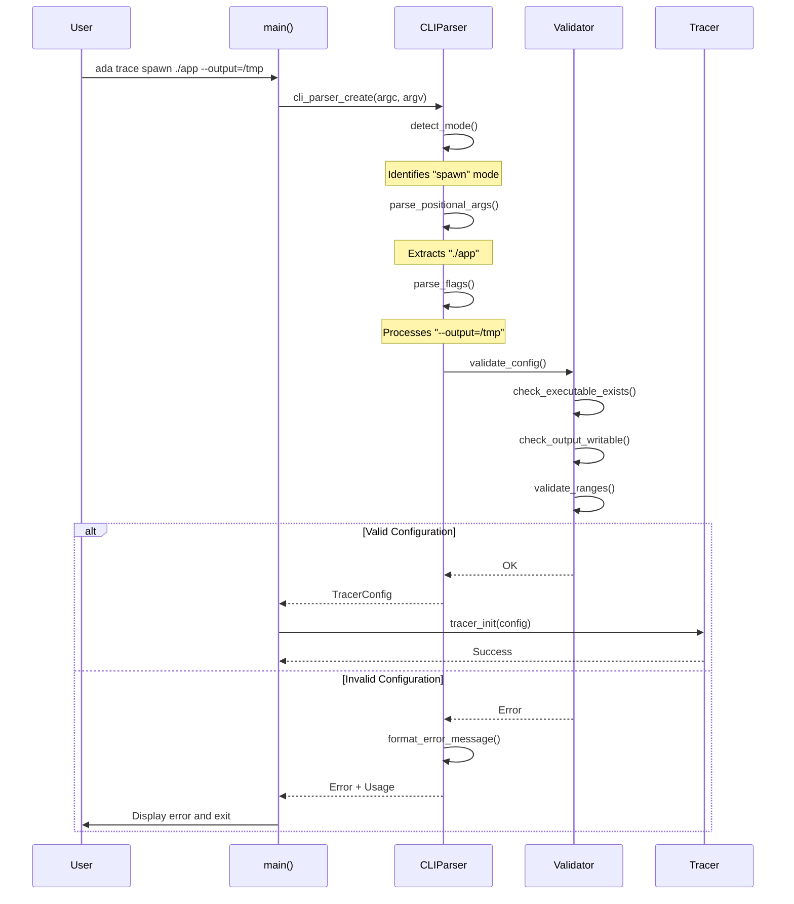
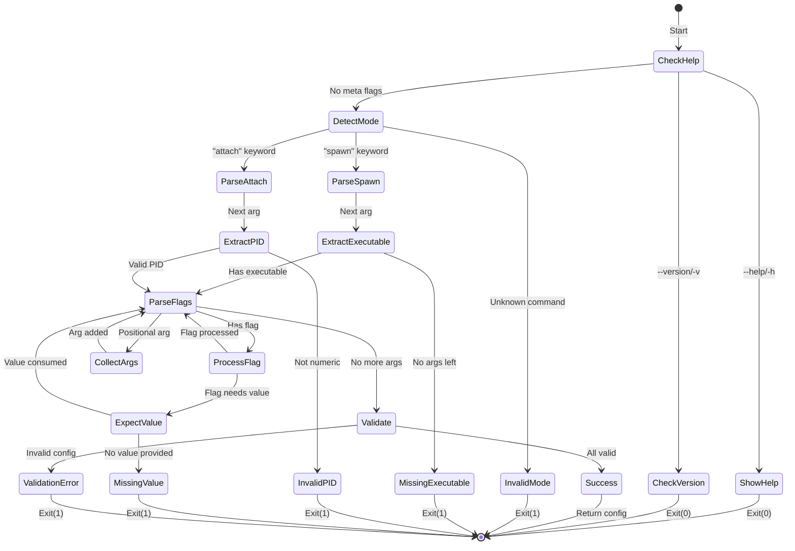

# Tech Design — M1 E2 I4 CLI Parser

## Objective
Implement command-line interface with robust argument parsing for tracer commands, supporting both spawn and attach modes with configurable output, duration, stack capture, selective persistence, trigger conditions, and module exclusions.

## Architecture Diagram

```mermaid
graph TB
    subgraph "CLI Parser Components"
        MAIN[main()]
        MAIN --> PARSER[CLIParser]
        
        PARSER --> MODE[Mode Detection]
        MODE --> SPAWN[Spawn Mode]
        MODE --> ATTACH[Attach Mode]
        
        PARSER --> FLAGS[Flag Parser]
        FLAGS --> OUTPUT[--output]
        FLAGS --> DURATION[--duration]
        FLAGS --> STACK[--stack-bytes]
        FLAGS --> PERSIST[--pre-roll-sec/--post-roll-sec]
        FLAGS --> TRIGGERS[--trigger]
        FLAGS --> EXCLUDE[--exclude]
        
        PARSER --> VALIDATOR[Argument Validator]
        VALIDATOR --> PERMS[Permission Check]
        VALIDATOR --> PATHS[Path Validation]
        VALIDATOR --> RANGES[Range Validation]
    end
    
    subgraph "Parsed Configuration"
        CONFIG[TracerConfig]
        CONFIG --> MCONF[Mode Config]
        CONFIG --> OCONF[Output Config]
        CONFIG --> TCONF[Timing Config]
        CONFIG --> SCONF[Stack Config]
        CONFIG --> PCONF[Persistence Config]
        CONFIG --> TRIGCONF[Trigger Config]
        CONFIG --> EXCONF[Exclude Config]
    end
    
    subgraph "Error Handling"
        ERRORS[Error Reporter]
        ERRORS --> USAGE[Usage Help]
        ERRORS --> HINTS[Error Hints]
        ERRORS --> EXAMPLES[Examples]
    end
    
    PARSER --> CONFIG
    VALIDATOR --> ERRORS
```

## Data Structures

```c
// Command execution modes
typedef enum {
    MODE_SPAWN,      // Launch new process
    MODE_ATTACH,     // Attach to existing process
    MODE_HELP,       // Show help text
    MODE_VERSION,    // Show version info
    MODE_INVALID     // Parse error
} ExecutionMode;

// Trigger types
typedef enum {
    TRIGGER_SYMBOL,  // Function/symbol trigger
    TRIGGER_CRASH,   // Process crash trigger
    TRIGGER_TIME     // Time-based trigger
} TriggerType;

// Individual trigger configuration
typedef struct {
    TriggerType type;
    union {
        struct {
            char* symbol_name;
            char* module_name;  // Optional, for scoped symbols
        } symbol;
        
        struct {
            uint32_t timeout_seconds;
        } time;
        // crash trigger has no additional data
    } params;
} TriggerConfig;

// Dynamic array of triggers
typedef struct {
    TriggerConfig* triggers;
    size_t count;
    size_t capacity;
} TriggerArray;

// Parsed configuration
typedef struct {
    ExecutionMode mode;
    
    // Mode-specific data
    union {
        struct {
            const char* executable;
            char** argv;
            int argc;
        } spawn;
        
        struct {
            pid_t pid;
            const char* process_name;  // Optional, for validation
        } attach;
    } target;
    
    // Common flags
    struct {
        const char* output_dir;        // Default: "./ada_traces"
        bool output_specified;
    } output;
    
    struct {
        uint32_t duration_seconds;     // 0 = unlimited
        bool duration_specified;
    } timing;
    
    struct {
        uint32_t stack_bytes;          // Default: 128, range: 0-512
        bool stack_specified;
    } stack;
    
    // Selective persistence settings
    struct {
        uint32_t pre_roll_seconds;     // Default: 0, buffer before trigger
        uint32_t post_roll_seconds;    // Default: 0, buffer after trigger
        bool pre_roll_specified;
        bool post_roll_specified;
    } persistence;
    
    // Trigger configuration
    struct {
        TriggerArray triggers;         // Array of trigger conditions
        bool triggers_specified;
    } trigger_config;
    
    // Module exclusion
    struct {
        char** excluded_modules;       // NULL-terminated array
        size_t module_count;
        bool exclude_specified;
    } exclusions;
    
    // Validation results
    struct {
        bool valid;
        char error_message[256];
        int error_code;
    } validation;
} TracerConfig;

// Parser state machine
typedef struct {
    int argc;
    char** argv;
    int current_arg;
    TracerConfig* config;
    
    // Parser state
    bool expecting_value;
    const char* current_flag;
    
    // Error tracking
    char parse_error[256];
    bool has_error;
} CLIParser;

// Flag definitions
typedef struct {
    const char* long_form;     // e.g., "--output"
    const char* short_form;    // e.g., "-o"
    bool requires_value;
    void (*handler)(CLIParser*, const char* value);
    const char* help_text;
    const char* value_name;    // e.g., "DIR" for display
} FlagDefinition;

// Global flag registry
static const FlagDefinition FLAGS[] = {
    {
        .long_form = "--output",
        .short_form = "-o",
        .requires_value = true,
        .handler = handle_output_flag,
        .help_text = "Directory for trace output files",
        .value_name = "DIR"
    },
    {
        .long_form = "--duration",
        .short_form = "-d",
        .requires_value = true,
        .handler = handle_duration_flag,
        .help_text = "Maximum tracing duration in seconds",
        .value_name = "SECONDS"
    },
    {
        .long_form = "--stack-bytes",
        .short_form = "-s",
        .requires_value = true,
        .handler = handle_stack_flag,
        .help_text = "Number of stack bytes to capture (0-512)",
        .value_name = "BYTES"
    },
    {
        .long_form = "--pre-roll-sec",
        .short_form = NULL,
        .requires_value = true,
        .handler = handle_pre_roll_flag,
        .help_text = "Seconds of buffer before trigger activation",
        .value_name = "SECONDS"
    },
    {
        .long_form = "--post-roll-sec",
        .short_form = NULL,
        .requires_value = true,
        .handler = handle_post_roll_flag,
        .help_text = "Seconds of buffer after trigger activation",
        .value_name = "SECONDS"
    },
    {
        .long_form = "--trigger",
        .short_form = "-t",
        .requires_value = true,
        .handler = handle_trigger_flag,
        .help_text = "Trigger condition (symbol=name, crash, time=N)",
        .value_name = "CONDITION"
    },
    {
        .long_form = "--exclude",
        .short_form = "-x",
        .requires_value = true,
        .handler = handle_exclude_flag,
        .help_text = "Comma-separated modules to exclude from tracing",
        .value_name = "MODULES"
    },
    {
        .long_form = "--help",
        .short_form = "-h",
        .requires_value = false,
        .handler = handle_help_flag,
        .help_text = "Show this help message",
        .value_name = NULL
    },
    {
        .long_form = "--version",
        .short_form = "-v",
        .requires_value = false,
        .handler = handle_version_flag,
        .help_text = "Show version information",
        .value_name = NULL
    },
    { NULL }  // Sentinel
};
```

## Sequence Diagram: Command Parsing Flow



## State Machine: Parser States



## API Functions

```c
// Main parser entry point
TracerConfig* cli_parse_args(int argc, char** argv);

// Parser lifecycle
CLIParser* cli_parser_create(int argc, char** argv);
void cli_parser_destroy(CLIParser* parser);

// Parsing stages
ExecutionMode cli_detect_mode(CLIParser* parser);
bool cli_parse_mode_args(CLIParser* parser);
bool cli_parse_flags(CLIParser* parser);
bool cli_validate_config(CLIParser* parser);

// Flag handlers
void handle_output_flag(CLIParser* parser, const char* value);
void handle_duration_flag(CLIParser* parser, const char* value);
void handle_stack_flag(CLIParser* parser, const char* value);
void handle_pre_roll_flag(CLIParser* parser, const char* value);
void handle_post_roll_flag(CLIParser* parser, const char* value);
void handle_trigger_flag(CLIParser* parser, const char* value);
void handle_exclude_flag(CLIParser* parser, const char* value);
void handle_help_flag(CLIParser* parser, const char* value);
void handle_version_flag(CLIParser* parser, const char* value);

// Trigger parsing helpers
bool parse_trigger_symbol(const char* value, TriggerConfig* trigger);
bool parse_trigger_time(const char* value, TriggerConfig* trigger);
bool add_trigger_to_config(TracerConfig* config, const TriggerConfig* trigger);

// Module exclusion helpers
char** parse_module_list(const char* module_string, size_t* count);
void free_module_list(char** modules, size_t count);

// Validation helpers
bool validate_executable_path(const char* path, char* error, size_t error_size);
bool validate_output_directory(const char* path, char* error, size_t error_size);
bool validate_pid(pid_t pid, char* error, size_t error_size);
bool validate_duration(uint32_t seconds, char* error, size_t error_size);
bool validate_stack_bytes(uint32_t bytes, char* error, size_t error_size);
bool validate_persistence_settings(uint32_t pre_roll, uint32_t post_roll, char* error, size_t error_size);
bool validate_trigger_config(const TriggerConfig* trigger, char* error, size_t error_size);
bool validate_module_names(char** modules, size_t count, char* error, size_t error_size);

// Error handling
void cli_print_usage(FILE* stream);
void cli_print_error(const char* error);
void cli_print_examples(FILE* stream);
const char* cli_get_last_error(CLIParser* parser);

// Configuration access
TracerConfig* cli_get_config(CLIParser* parser);
void cli_config_set_defaults(TracerConfig* config);
void cli_config_destroy(TracerConfig* config);

// Dynamic memory management for config
void init_trigger_array(TriggerArray* array);
void destroy_trigger_array(TriggerArray* array);
void destroy_module_list(char** modules, size_t count);
```

## Memory Ordering Guarantees

```c
// No atomics needed for CLI parsing (single-threaded)
// But prepare for multi-threaded tracer handoff

typedef struct {
    // Immutable after parsing - safe to share
    TracerConfig config;
    
    // Transfer ownership atomically
    _Atomic(bool) config_ready;        // memory_order_release on write
    _Atomic(bool) config_consumed;     // memory_order_acquire on read
    
    // Error state (written once)
    _Atomic(int) parse_result;         // 0 = success, errno otherwise
} CLIResult;

// Thread-safe config handoff
void cli_publish_config(CLIResult* result, TracerConfig* config) {
    memcpy(&result->config, config, sizeof(TracerConfig));
    atomic_thread_fence(memory_order_release);
    atomic_store_explicit(&result->config_ready, true, memory_order_release);
}

bool cli_consume_config(CLIResult* result, TracerConfig* out) {
    if (!atomic_load_explicit(&result->config_ready, memory_order_acquire)) {
        return false;
    }
    
    memcpy(out, &result->config, sizeof(TracerConfig));
    atomic_store_explicit(&result->config_consumed, true, memory_order_release);
    return true;
}
```

## Error Messages and Help Text

```c
// Error message templates
static const char* ERROR_MESSAGES[] = {
    [ERR_NO_COMMAND] = "No command specified. Use 'spawn' or 'attach'.",
    [ERR_INVALID_COMMAND] = "Invalid command '%s'. Use 'spawn' or 'attach'.",
    [ERR_NO_EXECUTABLE] = "No executable specified for spawn mode.",
    [ERR_NO_PID] = "No process ID specified for attach mode.",
    [ERR_INVALID_PID] = "Invalid process ID '%s'. Must be a positive integer.",
    [ERR_EXECUTABLE_NOT_FOUND] = "Executable '%s' not found or not accessible.",
    [ERR_INVALID_OUTPUT_DIR] = "Output directory '%s' does not exist or is not writable.",
    [ERR_INVALID_DURATION] = "Invalid duration '%s'. Must be 0-86400 seconds.",
    [ERR_INVALID_STACK_BYTES] = "Invalid stack bytes '%s'. Must be 0-512.",
    [ERR_INVALID_PRE_ROLL] = "Invalid pre-roll seconds '%s'. Must be a positive integer.",
    [ERR_INVALID_POST_ROLL] = "Invalid post-roll seconds '%s'. Must be a positive integer.",
    [ERR_INVALID_TRIGGER_FORMAT] = "Invalid trigger format '%s'. Use symbol=name, crash, or time=N.",
    [ERR_INVALID_SYMBOL_NAME] = "Invalid symbol name '%s'. Must be a valid identifier.",
    [ERR_INVALID_MODULE_NAME] = "Invalid module name '%s'. Must not contain special characters.",
    [ERR_DUPLICATE_TRIGGER] = "Duplicate trigger condition '%s'. Each trigger can only be specified once.",
    [ERR_UNKNOWN_FLAG] = "Unknown flag '%s'. Use --help for available options.",
    [ERR_MISSING_VALUE] = "Flag '%s' requires a value.",
    [ERR_PERMISSION_DENIED] = "Permission denied. Tracing requires appropriate privileges.",
};

// Usage text
static const char* USAGE_TEXT = 
    "Usage: ada trace <command> [options]\n"
    "\n"
    "Commands:\n"
    "  spawn <executable> [args...]  Launch and trace a new process\n"
    "  attach <pid>                  Attach to an existing process\n"
    "\n"
    "Options:\n"
    "  -o, --output DIR             Output directory for traces (default: ./ada_traces)\n"
    "  -d, --duration SECONDS       Maximum duration in seconds (default: unlimited)\n"
    "  -s, --stack-bytes BYTES      Stack bytes to capture (0-512, default: 128)\n"
    "\n"
    "Selective Persistence:\n"
    "      --pre-roll-sec SECONDS   Buffer seconds before trigger (default: 0)\n"
    "      --post-roll-sec SECONDS  Buffer seconds after trigger (default: 0)\n"
    "\n"
    "Triggers (can specify multiple):\n"
    "  -t, --trigger symbol=NAME    Trigger on function/symbol entry\n"
    "  -t, --trigger crash          Trigger on process crash\n"
    "  -t, --trigger time=SECONDS   Trigger after time delay\n"
    "\n"
    "Exclusions:\n"
    "  -x, --exclude MODULES        Comma-separated modules to exclude\n"
    "\n"
    "General:\n"
    "  -h, --help                   Show this help message\n"
    "  -v, --version                Show version information\n"
    "\n"
    "Examples:\n"
    "  ada trace spawn ./myapp --output=/tmp/traces\n"
    "  ada trace attach 1234 --duration=60\n"
    "  ada trace spawn python script.py -s 256\n"
    "  ada trace spawn ./app --trigger symbol=main --pre-roll-sec=5\n"
    "  ada trace attach 1234 --trigger crash --post-roll-sec=10\n"
    "  ada trace spawn ./app --exclude=libc.so,libssl.so --trigger time=30\n";

// Version text
static const char* VERSION_TEXT = 
    "ADA Tracer v0.1.0-alpha\n"
    "Per-thread ring buffer architecture\n"
    "Copyright (c) 2024 ADA Project\n";
```

## Integration Points

```c
// Integration with existing tracer
typedef struct {
    // From CLI parser
    TracerConfig* config;
    
    // To ThreadRegistry
    uint32_t max_threads;       // Derived from config
    size_t shm_size;            // Calculated from config
    
    // To DrainThread
    const char* output_path;    // From config->output.output_dir
    uint32_t drain_interval_ms; // Derived from duration
    
    // To Hooks
    uint32_t stack_capture_size; // From config->stack.stack_bytes
    
    // Selective persistence
    uint32_t pre_roll_buffer_ms; // From config->persistence (converted to ms)
    uint32_t post_roll_buffer_ms; // From config->persistence (converted to ms)
    
    // Trigger configuration
    TriggerArray* triggers;      // From config->trigger_config
    
    // Module exclusions
    char** excluded_modules;     // From config->exclusions
    size_t excluded_module_count; // From config->exclusions
    
    // Process management
    pid_t target_pid;           // From config (spawn or attach)
    bool should_spawn;          // Based on mode
} TracerInitParams;

// Convert CLI config to tracer params
TracerInitParams* cli_to_tracer_params(TracerConfig* config) {
    TracerInitParams* params = calloc(1, sizeof(TracerInitParams));
    
    params->config = config;
    params->max_threads = MAX_THREADS;
    params->shm_size = calculate_shm_size(config);
    params->output_path = config->output.output_dir;
    
    if (config->timing.duration_seconds > 0) {
        params->drain_interval_ms = 100;  // Drain every 100ms
    } else {
        params->drain_interval_ms = 1000; // Default 1 second
    }
    
    params->stack_capture_size = config->stack.stack_bytes;
    
    // Convert persistence settings to milliseconds
    params->pre_roll_buffer_ms = config->persistence.pre_roll_seconds * 1000;
    params->post_roll_buffer_ms = config->persistence.post_roll_seconds * 1000;
    
    // Transfer trigger configuration (shallow copy - caller owns memory)
    params->triggers = &config->trigger_config.triggers;
    
    // Transfer exclusion list (shallow copy - caller owns memory)
    params->excluded_modules = config->exclusions.excluded_modules;
    params->excluded_module_count = config->exclusions.module_count;
    
    if (config->mode == MODE_SPAWN) {
        params->should_spawn = true;
        params->target_pid = 0;  // Will be set after fork
    } else {
        params->should_spawn = false;
        params->target_pid = config->target.attach.pid;
    }
    
    return params;
}
```

## Performance Characteristics

- **Parsing overhead**: < 1ms for typical command lines
- **Validation overhead**: < 5ms including file system checks
- **Memory usage**: < 4KB for parser state
- **Error formatting**: < 1ms per error message

## Security Considerations

1. **Path traversal prevention**: Validate all file paths
2. **Command injection**: Never use shell expansion
3. **PID validation**: Check process exists and is accessible
4. **Privilege checking**: Verify tracing permissions early
5. **Integer overflow**: Validate all numeric inputs
6. **Buffer limits**: Fixed-size buffers for all strings

## Success Criteria

1. Parse all supported command formats correctly
2. Provide clear error messages for invalid input
3. Validate all arguments before tracer initialization
4. Support both long and short flag forms
5. Handle edge cases (empty args, malformed flags)
6. Integration with existing tracer components
7. Thread-safe config handoff to tracer
8. < 10ms total parsing + validation time