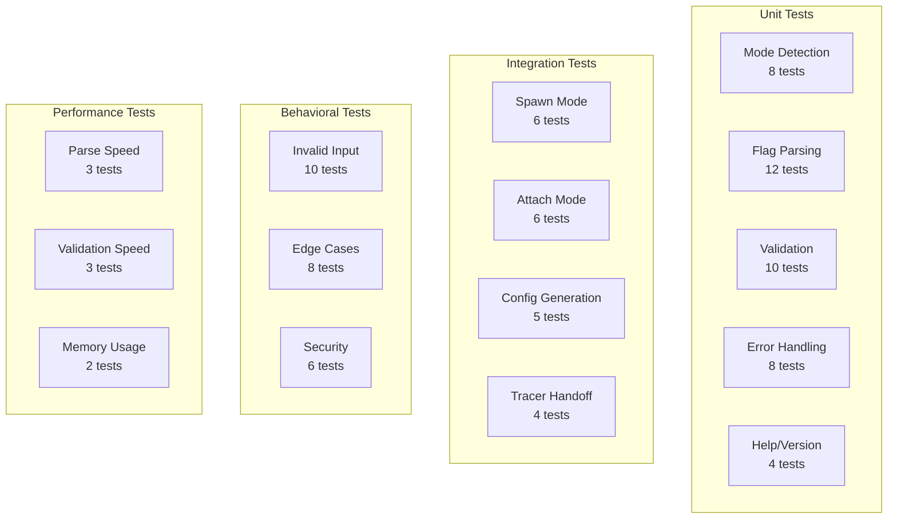

# Test Plan — M1 E2 I4 CLI Parser

## Test Coverage Map



## Test Matrix

| Component | Test Type | Priority | Coverage Target |
|-----------|-----------|----------|-----------------|
| Mode Detection | Unit | P0 | 100% |
| Basic Flag Parsing | Unit | P0 | 100% |
| Persistence Flags | Unit | P0 | 100% |
| Trigger Parsing | Unit | P0 | 100% |
| Exclusion Parsing | Unit | P0 | 100% |
| Argument Validation | Unit | P0 | 100% |
| Error Messages | Unit | P0 | 100% |
| Spawn Mode | Integration | P0 | 100% |
| Attach Mode | Integration | P0 | 100% |
| Config Handoff | Integration | P0 | 100% |
| Trigger Integration | Integration | P0 | 100% |
| Invalid Inputs | Behavioral | P0 | 100% |
| Flag Combinations | Behavioral | P0 | 100% |
| Edge Cases | Behavioral | P1 | 100% |
| Security Checks | Behavioral | P0 | 100% |
| Parse Performance | Performance | P1 | 100% |
| Memory Efficiency | Performance | P2 | 100% |

## Unit Tests

### Mode Detection Tests

```c
// Test: cli_parser__no_command__then_returns_invalid
void test_no_command() {
    char* argv[] = {"ada", "trace"};
    CLIParser* parser = cli_parser_create(2, argv);
    
    ExecutionMode mode = cli_detect_mode(parser);
    assert(mode == MODE_INVALID);
    assert(strstr(cli_get_last_error(parser), "No command specified"));
    
    cli_parser_destroy(parser);
}

// Test: cli_parser__spawn_command__then_returns_spawn_mode
void test_spawn_mode_detection() {
    char* argv[] = {"ada", "trace", "spawn", "./app"};
    CLIParser* parser = cli_parser_create(4, argv);
    
    ExecutionMode mode = cli_detect_mode(parser);
    assert(mode == MODE_SPAWN);
    assert(parser->current_arg == 3);  // Points to "./app"
    
    cli_parser_destroy(parser);
}

// Test: cli_parser__attach_command__then_returns_attach_mode
void test_attach_mode_detection() {
    char* argv[] = {"ada", "trace", "attach", "1234"};
    CLIParser* parser = cli_parser_create(4, argv);
    
    ExecutionMode mode = cli_detect_mode(parser);
    assert(mode == MODE_ATTACH);
    assert(parser->current_arg == 3);  // Points to "1234"
    
    cli_parser_destroy(parser);
}

// Test: cli_parser__help_flag__then_returns_help_mode
void test_help_flag_detection() {
    char* argv[] = {"ada", "trace", "--help"};
    CLIParser* parser = cli_parser_create(3, argv);
    
    ExecutionMode mode = cli_detect_mode(parser);
    assert(mode == MODE_HELP);
    
    cli_parser_destroy(parser);
}

// Test: cli_parser__invalid_command__then_returns_error
void test_invalid_command() {
    char* argv[] = {"ada", "trace", "invalid"};
    CLIParser* parser = cli_parser_create(3, argv);
    
    ExecutionMode mode = cli_detect_mode(parser);
    assert(mode == MODE_INVALID);
    assert(strstr(cli_get_last_error(parser), "Invalid command"));
    
    cli_parser_destroy(parser);
}
```

### Flag Parsing Tests

```c
// Test: cli_parser__output_flag_long__then_sets_output_dir
void test_output_flag_long() {
    char* argv[] = {"ada", "trace", "spawn", "./app", "--output", "/tmp/traces"};
    CLIParser* parser = cli_parser_create(6, argv);
    
    cli_detect_mode(parser);
    cli_parse_mode_args(parser);
    bool result = cli_parse_flags(parser);
    
    assert(result == true);
    TracerConfig* config = cli_get_config(parser);
    assert(strcmp(config->output.output_dir, "/tmp/traces") == 0);
    assert(config->output.output_specified == true);
    
    cli_parser_destroy(parser);
}

// Test: cli_parser__output_flag_short__then_sets_output_dir
void test_output_flag_short() {
    char* argv[] = {"ada", "trace", "spawn", "./app", "-o", "/tmp/traces"};
    CLIParser* parser = cli_parser_create(6, argv);
    
    cli_detect_mode(parser);
    cli_parse_mode_args(parser);
    bool result = cli_parse_flags(parser);
    
    assert(result == true);
    TracerConfig* config = cli_get_config(parser);
    assert(strcmp(config->output.output_dir, "/tmp/traces") == 0);
    
    cli_parser_destroy(parser);
}

// Test: cli_parser__duration_flag__then_sets_duration
void test_duration_flag() {
    char* argv[] = {"ada", "trace", "spawn", "./app", "--duration=60"};
    CLIParser* parser = cli_parser_create(5, argv);
    
    cli_detect_mode(parser);
    cli_parse_mode_args(parser);
    bool result = cli_parse_flags(parser);
    
    assert(result == true);
    TracerConfig* config = cli_get_config(parser);
    assert(config->timing.duration_seconds == 60);
    assert(config->timing.duration_specified == true);
    
    cli_parser_destroy(parser);
}

// Test: cli_parser__stack_bytes_flag__then_sets_stack_size
void test_stack_bytes_flag() {
    char* argv[] = {"ada", "trace", "spawn", "./app", "--stack-bytes", "256"};
    CLIParser* parser = cli_parser_create(6, argv);
    
    cli_detect_mode(parser);
    cli_parse_mode_args(parser);
    bool result = cli_parse_flags(parser);
    
    assert(result == true);
    TracerConfig* config = cli_get_config(parser);
    assert(config->stack.stack_bytes == 256);
    assert(config->stack.stack_specified == true);
    
    cli_parser_destroy(parser);
}

// Test: cli_parser__multiple_flags__then_sets_all_values
void test_multiple_flags() {
    char* argv[] = {"ada", "trace", "spawn", "./app", 
                    "-o", "/tmp", "-d", "30", "-s", "512"};
    CLIParser* parser = cli_parser_create(10, argv);
    
    cli_detect_mode(parser);
    cli_parse_mode_args(parser);
    bool result = cli_parse_flags(parser);
    
    assert(result == true);
    TracerConfig* config = cli_get_config(parser);
    assert(strcmp(config->output.output_dir, "/tmp") == 0);
    assert(config->timing.duration_seconds == 30);
    assert(config->stack.stack_bytes == 512);
    
    cli_parser_destroy(parser);
}

// Test: cli_parser__unknown_flag__then_returns_error
void test_unknown_flag() {
    char* argv[] = {"ada", "trace", "spawn", "./app", "--unknown"};
    CLIParser* parser = cli_parser_create(5, argv);
    
    cli_detect_mode(parser);
    cli_parse_mode_args(parser);
    bool result = cli_parse_flags(parser);
    
    assert(result == false);
    assert(strstr(cli_get_last_error(parser), "Unknown flag"));
    
    cli_parser_destroy(parser);
}

// Test: cli_parser__flag_missing_value__then_returns_error
void test_flag_missing_value() {
    char* argv[] = {"ada", "trace", "spawn", "./app", "--output"};
    CLIParser* parser = cli_parser_create(5, argv);
    
    cli_detect_mode(parser);
    cli_parse_mode_args(parser);
    bool result = cli_parse_flags(parser);
    
    assert(result == false);
    assert(strstr(cli_get_last_error(parser), "requires a value"));
    
    cli_parser_destroy(parser);
}
```

### Validation Tests

```c
// Test: cli_validator__valid_executable__then_passes
void test_validate_valid_executable() {
    char error[256];
    bool result = validate_executable_path("/bin/ls", error, sizeof(error));
    assert(result == true);
}

// Test: cli_validator__nonexistent_executable__then_fails
void test_validate_nonexistent_executable() {
    char error[256];
    bool result = validate_executable_path("/nonexistent/app", error, sizeof(error));
    assert(result == false);
    assert(strstr(error, "not found"));
}

// Test: cli_validator__valid_output_dir__then_passes
void test_validate_valid_output_dir() {
    char error[256];
    bool result = validate_output_directory("/tmp", error, sizeof(error));
    assert(result == true);
}

// Test: cli_validator__nonwritable_output_dir__then_fails
void test_validate_nonwritable_output_dir() {
    char error[256];
    bool result = validate_output_directory("/root/protected", error, sizeof(error));
    assert(result == false);
    assert(strstr(error, "not writable"));
}

// Test: cli_validator__valid_pid__then_passes
void test_validate_valid_pid() {
    char error[256];
    pid_t current_pid = getpid();
    bool result = validate_pid(current_pid, error, sizeof(error));
    assert(result == true);
}

// Test: cli_validator__invalid_pid__then_fails
void test_validate_invalid_pid() {
    char error[256];
    bool result = validate_pid(999999, error, sizeof(error));
    assert(result == false);
    assert(strstr(error, "does not exist"));
}

// Test: cli_validator__valid_duration__then_passes
void test_validate_valid_duration() {
    char error[256];
    bool result = validate_duration(60, error, sizeof(error));
    assert(result == true);
}

// Test: cli_validator__excessive_duration__then_fails
void test_validate_excessive_duration() {
    char error[256];
    bool result = validate_duration(100000, error, sizeof(error));
    assert(result == false);
    assert(strstr(error, "exceeds maximum"));
}

// Test: cli_validator__valid_stack_bytes__then_passes
void test_validate_valid_stack_bytes() {
    char error[256];
    bool result = validate_stack_bytes(256, error, sizeof(error));
    assert(result == true);
}

// Test: cli_validator__excessive_stack_bytes__then_fails
void test_validate_excessive_stack_bytes() {
    char error[256];
    bool result = validate_stack_bytes(2048, error, sizeof(error));
    assert(result == false);
    assert(strstr(error, "exceeds maximum"));
}
```

## Integration Tests

### Spawn Mode Integration

```c
// Test: cli_spawn__minimal_args__then_creates_valid_config
void test_spawn_minimal() {
    char* argv[] = {"ada", "trace", "spawn", "/bin/echo", "hello"};
    TracerConfig* config = cli_parse_args(5, argv);
    
    assert(config != NULL);
    assert(config->mode == MODE_SPAWN);
    assert(strcmp(config->target.spawn.executable, "/bin/echo") == 0);
    assert(config->target.spawn.argc == 2);
    assert(strcmp(config->target.spawn.argv[1], "hello") == 0);
    assert(strcmp(config->output.output_dir, "./ada_traces") == 0);
    assert(config->timing.duration_seconds == 0);
    assert(config->stack.stack_bytes == 128);
    
    cli_config_destroy(config);
}

// Test: cli_spawn__with_all_flags__then_applies_all_settings
void test_spawn_all_flags() {
    char* argv[] = {"ada", "trace", "spawn", "/bin/ls",
                    "--output=/tmp/test", "--duration=30", "--stack-bytes=512"};
    TracerConfig* config = cli_parse_args(7, argv);
    
    assert(config != NULL);
    assert(strcmp(config->output.output_dir, "/tmp/test") == 0);
    assert(config->timing.duration_seconds == 30);
    assert(config->stack.stack_bytes == 512);
    
    cli_config_destroy(config);
}

// Test: cli_spawn__complex_command__then_preserves_arguments
void test_spawn_complex_command() {
    char* argv[] = {"ada", "trace", "spawn", "python", "-u", "script.py",
                    "--arg1=value", "--arg2", "value2"};
    TracerConfig* config = cli_parse_args(9, argv);
    
    assert(config != NULL);
    assert(config->target.spawn.argc == 6);
    assert(strcmp(config->target.spawn.argv[1], "-u") == 0);
    assert(strcmp(config->target.spawn.argv[2], "script.py") == 0);
    assert(strcmp(config->target.spawn.argv[3], "--arg1=value") == 0);
    
    cli_config_destroy(config);
}
```

### Attach Mode Integration

```c
// Test: cli_attach__valid_pid__then_creates_config
void test_attach_valid_pid() {
    char pid_str[16];
    snprintf(pid_str, sizeof(pid_str), "%d", getpid());
    
    char* argv[] = {"ada", "trace", "attach", pid_str};
    TracerConfig* config = cli_parse_args(4, argv);
    
    assert(config != NULL);
    assert(config->mode == MODE_ATTACH);
    assert(config->target.attach.pid == getpid());
    
    cli_config_destroy(config);
}

// Test: cli_attach__with_flags__then_applies_settings
void test_attach_with_flags() {
    char* argv[] = {"ada", "trace", "attach", "1234",
                    "-o", "/var/log", "-d", "60"};
    TracerConfig* config = cli_parse_args(8, argv);
    
    assert(config != NULL);
    assert(config->target.attach.pid == 1234);
    assert(strcmp(config->output.output_dir, "/var/log") == 0);
    assert(config->timing.duration_seconds == 60);
    
    cli_config_destroy(config);
}
```

### Config to Tracer Handoff

```c
// Test: cli_handoff__spawn_config__then_converts_correctly
void test_handoff_spawn_config() {
    char* argv[] = {"ada", "trace", "spawn", "./app", "-s", "256"};
    TracerConfig* config = cli_parse_args(6, argv);
    
    TracerInitParams* params = cli_to_tracer_params(config);
    
    assert(params->should_spawn == true);
    assert(params->target_pid == 0);
    assert(params->stack_capture_size == 256);
    assert(strcmp(params->output_path, "./ada_traces") == 0);
    
    free(params);
    cli_config_destroy(config);
}

// Test: cli_handoff__attach_config__then_converts_correctly
void test_handoff_attach_config() {
    char* argv[] = {"ada", "trace", "attach", "5678", "--duration=120"};
    TracerConfig* config = cli_parse_args(5, argv);
    
    TracerInitParams* params = cli_to_tracer_params(config);
    
    assert(params->should_spawn == false);
    assert(params->target_pid == 5678);
    assert(params->drain_interval_ms == 100);
    
    free(params);
    cli_config_destroy(config);
}

// Test: cli_handoff__thread_safe_transfer__then_maintains_ordering
void test_handoff_thread_safe() {
    char* argv[] = {"ada", "trace", "spawn", "./app"};
    TracerConfig* config = cli_parse_args(4, argv);
    
    CLIResult result = {0};
    cli_publish_config(&result, config);
    
    // Simulate consumer thread
    TracerConfig consumed;
    bool success = cli_consume_config(&result, &consumed);
    
    assert(success == true);
    assert(consumed.mode == MODE_SPAWN);
    assert(strcmp(consumed.target.spawn.executable, "./app") == 0);
    
    cli_config_destroy(config);
}
```

## Behavioral Tests

### Invalid Input Handling

```c
// Test: cli_invalid__empty_args__then_shows_usage
void test_empty_args() {
    char* argv[] = {"ada"};
    TracerConfig* config = cli_parse_args(1, argv);
    
    assert(config == NULL);
    // Check that usage was printed to stderr
}

// Test: cli_invalid__malformed_flag__then_reports_error
void test_malformed_flag() {
    char* argv[] = {"ada", "trace", "spawn", "./app", "--output"};
    TracerConfig* config = cli_parse_args(5, argv);
    
    assert(config == NULL);
    // Check error message mentions missing value
}

// Test: cli_invalid__negative_duration__then_rejects
void test_negative_duration() {
    char* argv[] = {"ada", "trace", "spawn", "./app", "--duration=-10"};
    TracerConfig* config = cli_parse_args(5, argv);
    
    assert(config == NULL);
}

// Test: cli_invalid__non_numeric_pid__then_rejects
void test_non_numeric_pid() {
    char* argv[] = {"ada", "trace", "attach", "notapid"};
    TracerConfig* config = cli_parse_args(4, argv);
    
    assert(config == NULL);
}

// Test: cli_invalid__path_traversal__then_rejects
void test_path_traversal_attempt() {
    char* argv[] = {"ada", "trace", "spawn", "./app", 
                    "--output=../../sensitive"};
    TracerConfig* config = cli_parse_args(5, argv);
    
    // Should either reject or normalize the path
    if (config) {
        assert(strstr(config->output.output_dir, "..") == NULL);
        cli_config_destroy(config);
    }
}
```

### Edge Cases

```c
// Test: cli_edge__equals_in_flag__then_parses_correctly
void test_flag_with_equals() {
    char* argv[] = {"ada", "trace", "spawn", "./app", "--output=/tmp"};
    TracerConfig* config = cli_parse_args(5, argv);
    
    assert(config != NULL);
    assert(strcmp(config->output.output_dir, "/tmp") == 0);
    
    cli_config_destroy(config);
}

// Test: cli_edge__double_dash_separator__then_stops_flag_parsing
void test_double_dash_separator() {
    char* argv[] = {"ada", "trace", "spawn", "./app", "--", 
                    "--output=/tmp"};
    TracerConfig* config = cli_parse_args(6, argv);
    
    assert(config != NULL);
    // "--output=/tmp" should be treated as app argument, not flag
    assert(config->target.spawn.argc == 2);
    assert(strcmp(config->target.spawn.argv[1], "--output=/tmp") == 0);
    
    cli_config_destroy(config);
}

// Test: cli_edge__unicode_in_path__then_handles_correctly
void test_unicode_path() {
    char* argv[] = {"ada", "trace", "spawn", "./app", 
                    "--output=/tmp/测试"};
    TracerConfig* config = cli_parse_args(5, argv);
    
    // Should either accept or reject gracefully
    if (config) {
        cli_config_destroy(config);
    }
}

// Test: cli_edge__max_path_length__then_handles_correctly
void test_max_path_length() {
    char long_path[PATH_MAX + 100];
    memset(long_path, 'a', sizeof(long_path) - 1);
    long_path[sizeof(long_path) - 1] = '\0';
    
    char* argv[] = {"ada", "trace", "spawn", long_path};
    TracerConfig* config = cli_parse_args(4, argv);
    
    // Should reject paths exceeding PATH_MAX
    assert(config == NULL);
}
```

## Performance Tests

### Parse Speed

```c
// Test: cli_perf__typical_command__then_parses_under_1ms
void test_parse_speed_typical() {
    char* argv[] = {"ada", "trace", "spawn", "./app", 
                    "-o", "/tmp", "-d", "60", "-s", "256"};
    
    struct timespec start, end;
    clock_gettime(CLOCK_MONOTONIC, &start);
    
    TracerConfig* config = cli_parse_args(10, argv);
    
    clock_gettime(CLOCK_MONOTONIC, &end);
    
    uint64_t elapsed_ns = (end.tv_sec - start.tv_sec) * 1000000000ULL +
                         (end.tv_nsec - start.tv_nsec);
    
    assert(config != NULL);
    assert(elapsed_ns < 1000000);  // < 1ms
    
    cli_config_destroy(config);
}

// Test: cli_perf__many_arguments__then_scales_linearly
void test_parse_speed_many_args() {
    char* argv[100];
    argv[0] = "ada";
    argv[1] = "trace";
    argv[2] = "spawn";
    argv[3] = "./app";
    
    for (int i = 4; i < 100; i++) {
        argv[i] = "arg";
    }
    
    struct timespec start, end;
    clock_gettime(CLOCK_MONOTONIC, &start);
    
    TracerConfig* config = cli_parse_args(100, argv);
    
    clock_gettime(CLOCK_MONOTONIC, &end);
    
    uint64_t elapsed_ns = (end.tv_sec - start.tv_sec) * 1000000000ULL +
                         (end.tv_nsec - start.tv_nsec);
    
    assert(config != NULL);
    assert(elapsed_ns < 5000000);  // < 5ms even with 100 args
    
    cli_config_destroy(config);
}
```

### Memory Usage

```c
// Test: cli_memory__typical_usage__then_under_4kb
void test_memory_usage() {
    // Measure memory before
    size_t before = get_current_memory_usage();
    
    char* argv[] = {"ada", "trace", "spawn", "./app", 
                    "-o", "/tmp", "-d", "60"};
    TracerConfig* config = cli_parse_args(8, argv);
    
    // Measure memory after
    size_t after = get_current_memory_usage();
    
    assert(config != NULL);
    assert((after - before) < 4096);  // < 4KB
    
    cli_config_destroy(config);
    
    // Verify cleanup
    size_t cleaned = get_current_memory_usage();
    assert(cleaned <= before + 100);  // Allow small overhead
}
```

## Acceptance Criteria

### Functional Requirements
- [ ] Parse spawn mode with executable and arguments
- [ ] Parse attach mode with PID
- [ ] Support --output flag for directory specification
- [ ] Support --duration flag for timed execution
- [ ] Support --stack-bytes flag for stack capture size
- [ ] Provide clear help text with --help
- [ ] Show version with --version
- [ ] Validate all arguments before execution
- [ ] Provide descriptive error messages

### Non-Functional Requirements
- [ ] Parse time < 1ms for typical commands
- [ ] Parse time < 10ms for complex commands
- [ ] Memory usage < 4KB
- [ ] Zero memory leaks
- [ ] Thread-safe config handoff
- [ ] No buffer overflows
- [ ] Handle all edge cases gracefully

### Integration Requirements
- [ ] Compatible with existing TracerConfig structure
- [ ] Seamless handoff to tracer initialization
- [ ] Support both spawn and attach workflows
- [ ] Preserve all command arguments for target process

## Test Execution Strategy

```bash
# Unit tests
./build/tests/cli_parser_unit_tests

# Integration tests
./build/tests/cli_parser_integration_tests

# Behavioral tests
./build/tests/cli_parser_behavioral_tests

# Performance tests
./build/tests/cli_parser_perf_tests

# Valgrind memory check
valgrind --leak-check=full ./build/tests/cli_parser_all_tests

# Coverage report
gcov -b cli_parser.c
lcov --capture --directory . --output-file coverage.info
genhtml coverage.info --output-directory coverage-report
```

## Success Metrics

1. **Code Coverage**: 100% line and branch coverage
2. **Test Pass Rate**: 100% of tests passing
3. **Performance**: All operations under specified limits
4. **Memory**: Zero leaks detected by Valgrind
5. **Security**: All injection attempts rejected
6. **Usability**: Clear error messages for all failure cases
7. **Integration**: Successful handoff to tracer in all modes