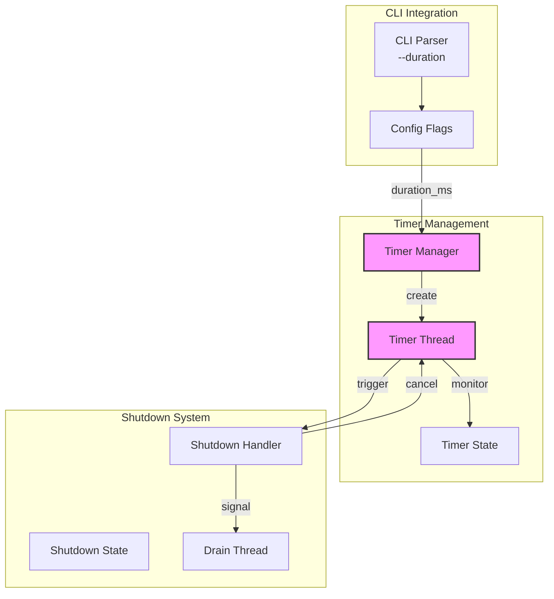
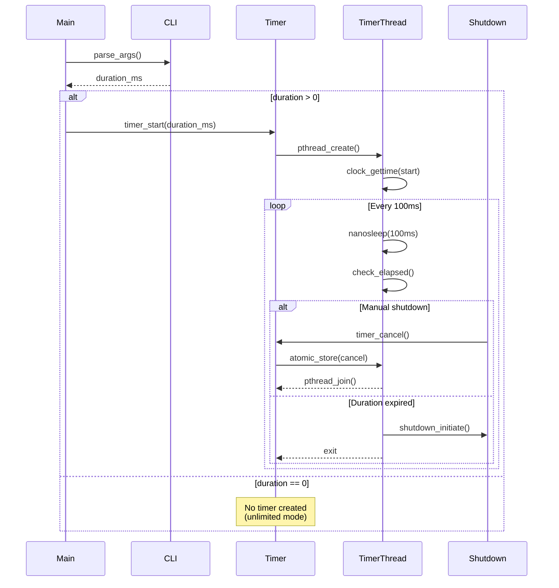
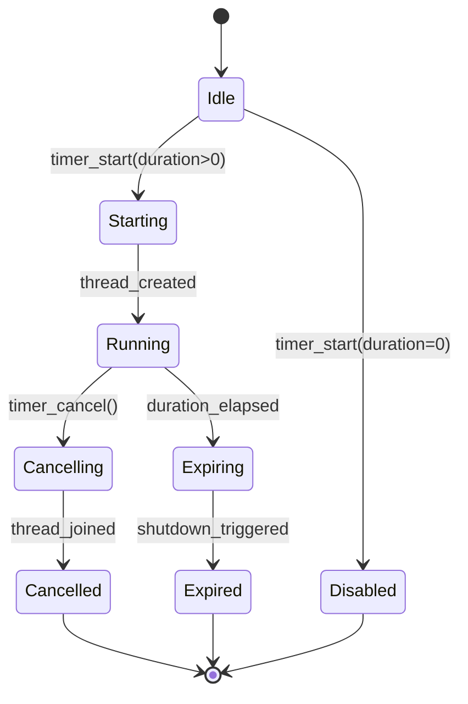

# M1_E2_I5 Technical Design: Duration Timer

## Overview
This iteration implements duration-based automatic shutdown for timed tracing sessions. The timer thread monitors elapsed time and triggers graceful shutdown when the specified duration expires, supporting sub-second precision and proper coordination with manual shutdown.

## Architecture

### Component Diagram


### Sequence Diagram: Timer Lifecycle


### State Machine: Timer States


## Data Structures

### Timer Manager
```c
typedef struct timer_manager {
    // Configuration
    uint64_t duration_ms;           // Target duration in milliseconds
    
    // Thread management
    pthread_t timer_thread;          // Timer thread handle
    _Atomic(bool) thread_active;    // Thread running flag
    
    // Timing control
    struct timespec start_time;      // Start timestamp
    _Atomic(bool) cancel_requested;  // Cancellation flag
    
    // Statistics
    _Atomic(uint64_t) checks_count;  // Number of elapsed checks
    _Atomic(uint64_t) actual_ms;     // Actual elapsed time
} timer_manager_t;

// Global instance
static timer_manager_t g_timer = {0};
```

### Timer Configuration
```c
typedef struct timer_config {
    uint64_t duration_ms;        // Duration in milliseconds (0 = unlimited)
    uint32_t check_interval_ms;  // Check interval (default: 100ms)
    bool high_precision;         // Use high-precision timing
} timer_config_t;
```

## API Design

### Timer Management API
```c
// Initialize timer subsystem
int timer_init(void);

// Start timer with specified duration
// Returns 0 on success, -1 on error
// duration_ms: Duration in milliseconds (0 = no timer)
int timer_start(uint64_t duration_ms);

// Cancel running timer
// Returns 0 on success, -1 if no timer running
int timer_cancel(void);

// Get remaining time in milliseconds
// Returns 0 if timer expired or not running
uint64_t timer_remaining_ms(void);

// Check if timer is active
bool timer_is_active(void);

// Cleanup timer resources
void timer_cleanup(void);
```

### Internal Functions
```c
// Timer thread entry point
static void* timer_thread_func(void* arg);

// Calculate elapsed time since start
static uint64_t calculate_elapsed_ms(struct timespec* start);

// Sleep for specified milliseconds with cancellation check
static int interruptible_sleep_ms(uint32_t ms);

// Trigger shutdown when timer expires
static void trigger_timed_shutdown(void);
```

## Implementation Details

### Timer Thread Implementation
```c
static void* timer_thread_func(void* arg) {
    timer_config_t* config = (timer_config_t*)arg;
    struct timespec now;
    uint64_t elapsed_ms;
    
    // Record start time
    clock_gettime(CLOCK_MONOTONIC, &g_timer.start_time);
    atomic_store(&g_timer.thread_active, true);
    
    // Main timer loop
    while (!atomic_load(&g_timer.cancel_requested)) {
        // Sleep for check interval
        if (interruptible_sleep_ms(config->check_interval_ms) < 0) {
            break;  // Cancellation requested
        }
        
        // Calculate elapsed time
        clock_gettime(CLOCK_MONOTONIC, &now);
        elapsed_ms = calculate_elapsed_ms(&g_timer.start_time);
        atomic_fetch_add(&g_timer.checks_count, 1);
        
        // Check if duration expired
        if (elapsed_ms >= config->duration_ms) {
            atomic_store(&g_timer.actual_ms, elapsed_ms);
            trigger_timed_shutdown();
            break;
        }
    }
    
    atomic_store(&g_timer.thread_active, false);
    return NULL;
}
```

### High-Precision Sleep
```c
static int interruptible_sleep_ms(uint32_t ms) {
    struct timespec req, rem;
    req.tv_sec = ms / 1000;
    req.tv_nsec = (ms % 1000) * 1000000L;
    
    // Check cancellation before sleep
    if (atomic_load(&g_timer.cancel_requested)) {
        return -1;
    }
    
    // Sleep with ability to resume after interruption
    while (nanosleep(&req, &rem) == -1) {
        if (errno != EINTR) {
            return -1;  // Unexpected error
        }
        
        // Check cancellation after interruption
        if (atomic_load(&g_timer.cancel_requested)) {
            return -1;
        }
        
        req = rem;  // Resume with remaining time
    }
    
    return 0;
}
```

### Time Calculation
```c
static uint64_t calculate_elapsed_ms(struct timespec* start) {
    struct timespec now;
    clock_gettime(CLOCK_MONOTONIC, &now);
    
    // Calculate difference
    int64_t sec_diff = now.tv_sec - start->tv_sec;
    int64_t nsec_diff = now.tv_nsec - start->tv_nsec;
    
    // Handle nanosecond underflow
    if (nsec_diff < 0) {
        sec_diff--;
        nsec_diff += 1000000000L;
    }
    
    // Convert to milliseconds
    return (uint64_t)(sec_diff * 1000 + nsec_diff / 1000000);
}
```

## Memory Ordering Specifications

### Atomic Operations
```c
// Timer state flags - relaxed ordering sufficient
atomic_store_explicit(&g_timer.cancel_requested, true, memory_order_relaxed);
bool active = atomic_load_explicit(&g_timer.thread_active, memory_order_relaxed);

// Statistics counters - relaxed ordering
atomic_fetch_add_explicit(&g_timer.checks_count, 1, memory_order_relaxed);

// Shutdown coordination - acquire/release for synchronization
if (atomic_load_explicit(&g_shutdown.initiated, memory_order_acquire)) {
    // Shutdown already in progress
    return;
}
```

## Integration Points

### CLI Integration
```c
// In main initialization
cli_args_t args;
if (cli_parse(&args) == 0 && args.duration_ms > 0) {
    if (timer_start(args.duration_ms) < 0) {
        fprintf(stderr, "Failed to start duration timer\n");
        return -1;
    }
    printf("Timer started: %lu ms\n", args.duration_ms);
}
```

### Shutdown Integration
```c
static void trigger_timed_shutdown(void) {
    printf("Duration expired after %lu ms\n", 
           atomic_load(&g_timer.actual_ms));
    
    // Initiate graceful shutdown
    shutdown_initiate(SHUTDOWN_REASON_TIMER);
    
    // Timer thread will exit naturally
}
```

### Signal Handler Integration
```c
// In SIGINT/SIGTERM handler
void signal_handler(int sig) {
    // Cancel timer if running
    if (timer_is_active()) {
        timer_cancel();
    }
    
    // Proceed with manual shutdown
    shutdown_initiate(SHUTDOWN_REASON_SIGNAL);
}
```

## Error Handling

### Timer Creation Errors
```c
int timer_start(uint64_t duration_ms) {
    if (duration_ms == 0) {
        // No timer needed
        return 0;
    }
    
    if (atomic_load(&g_timer.thread_active)) {
        // Timer already running
        errno = EBUSY;
        return -1;
    }
    
    // Create timer thread
    if (pthread_create(&g_timer.timer_thread, NULL, 
                      timer_thread_func, &config) != 0) {
        perror("Failed to create timer thread");
        return -1;
    }
    
    return 0;
}
```

### Cancellation Handling
```c
int timer_cancel(void) {
    if (!atomic_load(&g_timer.thread_active)) {
        // No timer running
        return 0;
    }
    
    // Request cancellation
    atomic_store(&g_timer.cancel_requested, true);
    
    // Wait for thread to exit
    if (pthread_join(g_timer.timer_thread, NULL) != 0) {
        perror("Failed to join timer thread");
        return -1;
    }
    
    // Reset state
    atomic_store(&g_timer.cancel_requested, false);
    atomic_store(&g_timer.thread_active, false);
    
    return 0;
}
```

## Performance Characteristics

### Timing Accuracy
- Check interval: 100ms default (configurable)
- Clock source: CLOCK_MONOTONIC (immune to time adjustments)
- Overhead: < 0.1% CPU for checking
- Accuracy: ±check_interval_ms

### Resource Usage
- Memory: ~256 bytes for timer state
- Thread: 1 dedicated timer thread when active
- Stack size: Default pthread stack (typically 8MB)
- Synchronization: Lock-free atomic operations

## Testing Considerations

### Unit Test Coverage
- Timer creation and cancellation
- Duration expiration detection
- Time calculation accuracy
- Cancellation during sleep
- Edge cases (0 duration, overflow)

### Integration Tests
- Timer with shutdown coordination
- Signal handler cancellation
- Multiple timer start attempts
- Resource cleanup verification

### Performance Tests
- Timing accuracy measurement
- CPU usage during timing
- Memory usage validation
- Thread lifecycle timing

## Success Criteria

1. **Functional Requirements**
   - Timer thread creates successfully when duration > 0
   - No timer created when duration = 0
   - Accurate time tracking with < 100ms error
   - Proper shutdown trigger on expiration
   - Clean cancellation on manual shutdown

2. **Performance Requirements**
   - < 0.1% CPU overhead
   - < 256 bytes memory overhead
   - < 10ms thread creation time
   - < 10ms cancellation time

3. **Reliability Requirements**
   - No race conditions
   - No resource leaks
   - Proper cleanup on all paths
   - Handles clock adjustments (CLOCK_MONOTONIC)

## Dependencies

- POSIX threads (pthread)
- POSIX time functions (clock_gettime, nanosleep)
- C11 atomics (_Atomic)
- Shutdown handler system
- CLI parser (duration flag)