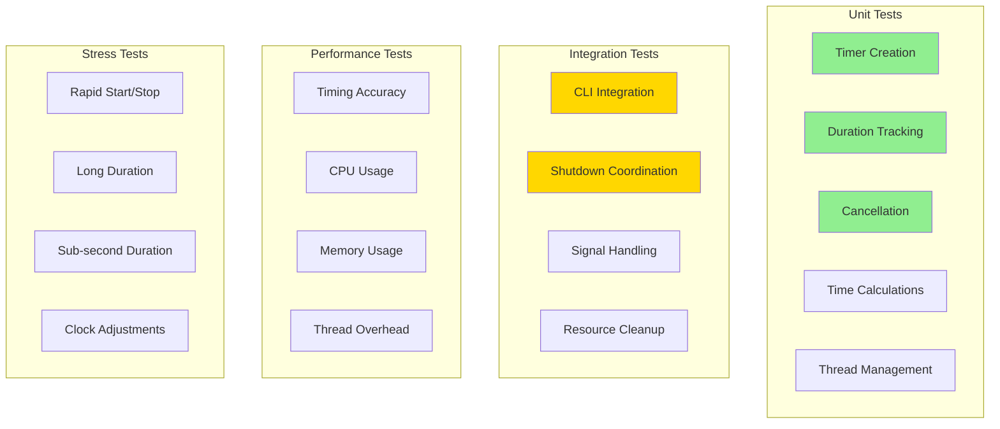

# M1_E2_I5 Test Plan: Duration Timer

## Test Coverage Map



## Test Matrix

| Test Category | Test Case | Priority | Coverage Target |
|--------------|-----------|----------|-----------------|
| Timer Creation | Valid duration | P0 | timer_start() |
| Timer Creation | Zero duration | P0 | timer_start() |
| Timer Creation | Already running | P0 | timer_start() |
| Duration Tracking | Short duration (100ms) | P0 | timer_thread_func() |
| Duration Tracking | Medium duration (5s) | P0 | timer_thread_func() |
| Duration Tracking | Long duration (60s) | P1 | timer_thread_func() |
| Cancellation | Cancel before expiry | P0 | timer_cancel() |
| Cancellation | Cancel after expiry | P0 | timer_cancel() |
| Cancellation | Multiple cancels | P1 | timer_cancel() |
| Time Calculation | Elapsed time accuracy | P0 | calculate_elapsed_ms() |
| Time Calculation | Remaining time | P0 | timer_remaining_ms() |
| Time Calculation | Overflow handling | P1 | calculate_elapsed_ms() |
| Thread Management | Thread creation | P0 | pthread_create() |
| Thread Management | Thread cleanup | P0 | pthread_join() |
| Thread Management | Thread state tracking | P0 | atomic operations |
| CLI Integration | Parse duration flag | P0 | main() integration |
| CLI Integration | Invalid duration | P0 | error handling |
| Shutdown | Timer-triggered shutdown | P0 | trigger_timed_shutdown() |
| Shutdown | Manual shutdown cancels timer | P0 | signal_handler() |

## Unit Tests

### Timer Creation Tests

```c
// Test: timer_start__valid_duration__then_creates_thread
TEST(TimerTest, timer_start__valid_duration__then_creates_thread) {
    // Arrange
    timer_init();
    uint64_t duration_ms = 5000;  // 5 seconds
    
    // Act
    int result = timer_start(duration_ms);
    
    // Assert
    EXPECT_EQ(result, 0);
    EXPECT_TRUE(timer_is_active());
    
    // Cleanup
    timer_cancel();
    timer_cleanup();
}

// Test: timer_start__zero_duration__then_no_timer
TEST(TimerTest, timer_start__zero_duration__then_no_timer) {
    // Arrange
    timer_init();
    uint64_t duration_ms = 0;  // Unlimited
    
    // Act
    int result = timer_start(duration_ms);
    
    // Assert
    EXPECT_EQ(result, 0);
    EXPECT_FALSE(timer_is_active());
    
    // Cleanup
    timer_cleanup();
}

// Test: timer_start__already_running__then_returns_error
TEST(TimerTest, timer_start__already_running__then_returns_error) {
    // Arrange
    timer_init();
    timer_start(5000);
    
    // Act
    int result = timer_start(3000);
    
    // Assert
    EXPECT_EQ(result, -1);
    EXPECT_EQ(errno, EBUSY);
    
    // Cleanup
    timer_cancel();
    timer_cleanup();
}
```

### Duration Tracking Tests

```c
// Test: timer_thread__short_duration__then_expires_accurately
TEST(TimerTest, timer_thread__short_duration__then_expires_accurately) {
    // Arrange
    timer_init();
    uint64_t duration_ms = 200;
    struct timespec start, end;
    
    // Act
    clock_gettime(CLOCK_MONOTONIC, &start);
    timer_start(duration_ms);
    
    // Wait for expiration
    while (timer_is_active()) {
        usleep(10000);  // 10ms
    }
    clock_gettime(CLOCK_MONOTONIC, &end);
    
    // Assert
    uint64_t elapsed = calculate_test_elapsed_ms(&start, &end);
    EXPECT_NEAR(elapsed, duration_ms, 100);  // Within 100ms accuracy
    
    // Cleanup
    timer_cleanup();
}

// Test: timer_remaining__during_execution__then_decreases
TEST(TimerTest, timer_remaining__during_execution__then_decreases) {
    // Arrange
    timer_init();
    uint64_t duration_ms = 1000;
    timer_start(duration_ms);
    
    // Act
    usleep(200000);  // 200ms
    uint64_t remaining1 = timer_remaining_ms();
    usleep(200000);  // Another 200ms
    uint64_t remaining2 = timer_remaining_ms();
    
    // Assert
    EXPECT_LT(remaining2, remaining1);
    EXPECT_GT(remaining1, 600);  // Should have ~800ms left
    EXPECT_GT(remaining2, 400);  // Should have ~600ms left
    
    // Cleanup
    timer_cancel();
    timer_cleanup();
}
```

### Cancellation Tests

```c
// Test: timer_cancel__while_running__then_stops_thread
TEST(TimerTest, timer_cancel__while_running__then_stops_thread) {
    // Arrange
    timer_init();
    timer_start(10000);  // 10 seconds
    ASSERT_TRUE(timer_is_active());
    
    // Act
    int result = timer_cancel();
    
    // Assert
    EXPECT_EQ(result, 0);
    EXPECT_FALSE(timer_is_active());
    
    // Cleanup
    timer_cleanup();
}

// Test: timer_cancel__not_running__then_succeeds
TEST(TimerTest, timer_cancel__not_running__then_succeeds) {
    // Arrange
    timer_init();
    
    // Act
    int result = timer_cancel();
    
    // Assert
    EXPECT_EQ(result, 0);
    
    // Cleanup
    timer_cleanup();
}

// Test: timer_cancel__multiple_times__then_idempotent
TEST(TimerTest, timer_cancel__multiple_times__then_idempotent) {
    // Arrange
    timer_init();
    timer_start(5000);
    
    // Act
    int result1 = timer_cancel();
    int result2 = timer_cancel();
    int result3 = timer_cancel();
    
    // Assert
    EXPECT_EQ(result1, 0);
    EXPECT_EQ(result2, 0);
    EXPECT_EQ(result3, 0);
    
    // Cleanup
    timer_cleanup();
}
```

### Time Calculation Tests

```c
// Test: calculate_elapsed__various_intervals__then_accurate
TEST(TimerTest, calculate_elapsed__various_intervals__then_accurate) {
    // Arrange
    struct timespec start, end;
    
    // Test cases
    struct {
        uint32_t sleep_ms;
        uint32_t tolerance_ms;
    } test_cases[] = {
        {100, 20},   // 100ms ± 20ms
        {500, 30},   // 500ms ± 30ms
        {1000, 50},  // 1s ± 50ms
    };
    
    for (int i = 0; i < 3; i++) {
        // Act
        clock_gettime(CLOCK_MONOTONIC, &start);
        usleep(test_cases[i].sleep_ms * 1000);
        clock_gettime(CLOCK_MONOTONIC, &end);
        
        uint64_t elapsed = calculate_elapsed_ms(&start);
        
        // Assert
        EXPECT_NEAR(elapsed, test_cases[i].sleep_ms, 
                   test_cases[i].tolerance_ms);
    }
}

// Test: interruptible_sleep__with_cancellation__then_returns_early
TEST(TimerTest, interruptible_sleep__with_cancellation__then_returns_early) {
    // Arrange
    atomic_store(&g_timer.cancel_requested, false);
    
    // Act - Start sleep in background thread
    pthread_t sleep_thread;
    pthread_create(&sleep_thread, NULL, sleep_test_func, (void*)5000);
    
    usleep(100000);  // Let it start sleeping
    atomic_store(&g_timer.cancel_requested, true);
    pthread_kill(sleep_thread, SIGUSR1);  // Interrupt sleep
    
    // Wait for thread
    void* ret;
    pthread_join(sleep_thread, &ret);
    
    // Assert
    EXPECT_EQ((intptr_t)ret, -1);  // Should return early
}
```

## Integration Tests

### CLI Integration Tests

```c
// Test: main__with_duration_flag__then_starts_timer
TEST(IntegrationTest, main__with_duration_flag__then_starts_timer) {
    // Arrange
    const char* argv[] = {"program", "--duration", "2000"};
    int argc = 3;
    
    // Act
    cli_args_t args;
    int parse_result = cli_parse(argc, argv, &args);
    int timer_result = 0;
    if (args.duration_ms > 0) {
        timer_result = timer_start(args.duration_ms);
    }
    
    // Assert
    EXPECT_EQ(parse_result, 0);
    EXPECT_EQ(args.duration_ms, 2000);
    EXPECT_EQ(timer_result, 0);
    EXPECT_TRUE(timer_is_active());
    
    // Cleanup
    timer_cancel();
}

// Test: main__without_duration_flag__then_no_timer
TEST(IntegrationTest, main__without_duration_flag__then_no_timer) {
    // Arrange
    const char* argv[] = {"program", "--output", "trace.atf"};
    int argc = 3;
    
    // Act
    cli_args_t args;
    cli_parse(argc, argv, &args);
    
    // Assert
    EXPECT_EQ(args.duration_ms, 0);
    EXPECT_FALSE(timer_is_active());
}
```

### Shutdown Coordination Tests

```c
// Test: timer_expiry__triggers_shutdown__then_drain_completes
TEST(IntegrationTest, timer_expiry__triggers_shutdown__then_drain_completes) {
    // Arrange
    shutdown_init();
    drain_init();
    drain_start();
    
    // Act
    timer_start(100);  // 100ms timer
    
    // Wait for timer to trigger shutdown
    usleep(200000);  // 200ms
    
    // Assert
    EXPECT_TRUE(shutdown_is_initiated());
    EXPECT_EQ(shutdown_get_reason(), SHUTDOWN_REASON_TIMER);
    
    // Verify drain completes
    drain_wait();
    EXPECT_FALSE(drain_is_active());
    
    // Cleanup
    drain_cleanup();
    shutdown_cleanup();
}

// Test: manual_shutdown__cancels_timer__then_timer_stops
TEST(IntegrationTest, manual_shutdown__cancels_timer__then_timer_stops) {
    // Arrange
    shutdown_init();
    timer_start(10000);  // 10 second timer
    ASSERT_TRUE(timer_is_active());
    
    // Act - Simulate SIGINT
    signal_handler(SIGINT);
    
    // Assert
    EXPECT_FALSE(timer_is_active());
    EXPECT_TRUE(shutdown_is_initiated());
    EXPECT_EQ(shutdown_get_reason(), SHUTDOWN_REASON_SIGNAL);
    
    // Cleanup
    shutdown_cleanup();
}
```

## Performance Tests

### Timing Accuracy Benchmarks

```c
// Benchmark: Measure timer accuracy across different durations
TEST(PerfTest, timer_accuracy_benchmark) {
    struct {
        uint64_t duration_ms;
        uint64_t tolerance_ms;
    } test_cases[] = {
        {100, 50},     // 100ms ± 50ms
        {500, 50},     // 500ms ± 50ms
        {1000, 100},   // 1s ± 100ms
        {5000, 100},   // 5s ± 100ms
    };
    
    for (int i = 0; i < 4; i++) {
        timer_init();
        
        struct timespec start, end;
        clock_gettime(CLOCK_MONOTONIC, &start);
        
        timer_start(test_cases[i].duration_ms);
        while (timer_is_active()) {
            usleep(10000);
        }
        
        clock_gettime(CLOCK_MONOTONIC, &end);
        uint64_t actual = calculate_test_elapsed_ms(&start, &end);
        
        printf("Duration: %lu ms, Actual: %lu ms, Error: %ld ms\n",
               test_cases[i].duration_ms, actual,
               (int64_t)actual - (int64_t)test_cases[i].duration_ms);
        
        EXPECT_NEAR(actual, test_cases[i].duration_ms,
                   test_cases[i].tolerance_ms);
        
        timer_cleanup();
    }
}
```

### Resource Usage Tests

```c
// Test: timer_thread__cpu_usage__then_under_threshold
TEST(PerfTest, timer_thread__cpu_usage__then_under_threshold) {
    // Arrange
    timer_init();
    timer_start(5000);  // 5 second timer
    
    // Act - Measure CPU usage
    struct rusage usage_start, usage_end;
    getrusage(RUSAGE_SELF, &usage_start);
    
    usleep(1000000);  // Measure for 1 second
    
    getrusage(RUSAGE_SELF, &usage_end);
    
    // Calculate CPU percentage
    double cpu_time = calculate_cpu_usage(&usage_start, &usage_end);
    double cpu_percent = (cpu_time / 1.0) * 100;  // Over 1 second
    
    // Assert
    EXPECT_LT(cpu_percent, 0.1);  // Less than 0.1% CPU
    
    // Cleanup
    timer_cancel();
    timer_cleanup();
}

// Test: timer_memory__allocation__then_minimal
TEST(PerfTest, timer_memory__allocation__then_minimal) {
    // Arrange
    size_t initial_mem = get_current_memory_usage();
    
    // Act
    timer_init();
    timer_start(1000);
    size_t timer_mem = get_current_memory_usage();
    
    // Assert
    size_t overhead = timer_mem - initial_mem;
    EXPECT_LT(overhead, 1024);  // Less than 1KB overhead
    
    // Cleanup
    timer_cancel();
    timer_cleanup();
}
```

## Stress Tests

### Rapid Start/Stop Tests

```c
// Test: timer__rapid_start_stop__then_no_leaks
TEST(StressTest, timer__rapid_start_stop__then_no_leaks) {
    // Arrange
    timer_init();
    
    // Act - Rapid start/stop cycles
    for (int i = 0; i < 100; i++) {
        timer_start(100 + i);  // Varying durations
        usleep(1000);          // 1ms
        timer_cancel();
        usleep(1000);          // 1ms between cycles
    }
    
    // Assert - Check for resource leaks
    // Valgrind or sanitizers will detect leaks
    EXPECT_FALSE(timer_is_active());
    
    // Cleanup
    timer_cleanup();
}
```

### Long Duration Tests

```c
// Test: timer__long_duration__then_accurate
TEST(StressTest, timer__long_duration__then_accurate) {
    // Note: This test takes 30 seconds
    if (getenv("SKIP_LONG_TESTS")) {
        GTEST_SKIP();
    }
    
    // Arrange
    timer_init();
    uint64_t duration_ms = 30000;  // 30 seconds
    
    // Act
    struct timespec start, end;
    clock_gettime(CLOCK_MONOTONIC, &start);
    timer_start(duration_ms);
    
    while (timer_is_active()) {
        sleep(1);
    }
    
    clock_gettime(CLOCK_MONOTONIC, &end);
    
    // Assert
    uint64_t actual = calculate_test_elapsed_ms(&start, &end);
    EXPECT_NEAR(actual, duration_ms, 500);  // ±500ms for 30s
    
    // Cleanup
    timer_cleanup();
}
```

## Test Helpers

```c
// Helper: Calculate elapsed time for tests
static uint64_t calculate_test_elapsed_ms(
    struct timespec* start, 
    struct timespec* end) {
    int64_t sec_diff = end->tv_sec - start->tv_sec;
    int64_t nsec_diff = end->tv_nsec - start->tv_nsec;
    
    if (nsec_diff < 0) {
        sec_diff--;
        nsec_diff += 1000000000L;
    }
    
    return (uint64_t)(sec_diff * 1000 + nsec_diff / 1000000);
}

// Helper: Get current memory usage
static size_t get_current_memory_usage(void) {
    struct rusage usage;
    getrusage(RUSAGE_SELF, &usage);
    return usage.ru_maxrss;
}

// Helper: Calculate CPU usage
static double calculate_cpu_usage(
    struct rusage* start,
    struct rusage* end) {
    double utime = (end->ru_utime.tv_sec - start->ru_utime.tv_sec) +
                   (end->ru_utime.tv_usec - start->ru_utime.tv_usec) / 1e6;
    double stime = (end->ru_stime.tv_sec - start->ru_stime.tv_sec) +
                   (end->ru_stime.tv_usec - start->ru_stime.tv_usec) / 1e6;
    return utime + stime;
}
```

## Acceptance Criteria

### Functional Acceptance
- [ ] Timer starts when duration > 0
- [ ] No timer when duration = 0
- [ ] Timer expires within ±100ms of target
- [ ] Shutdown triggered on expiration
- [ ] Timer cancelled on manual shutdown
- [ ] Resources cleaned up properly

### Performance Acceptance
- [ ] CPU usage < 0.1% during timing
- [ ] Memory overhead < 1KB
- [ ] Thread creation < 10ms
- [ ] Cancellation < 10ms
- [ ] Check interval maintains 100ms

### Integration Acceptance
- [ ] Works with CLI --duration flag
- [ ] Integrates with shutdown system
- [ ] Handles signal interruption
- [ ] Coordinates with drain thread

### Reliability Acceptance
- [ ] No race conditions (ThreadSanitizer clean)
- [ ] No memory leaks (Valgrind clean)
- [ ] No deadlocks possible
- [ ] Handles clock adjustments

## Coverage Requirements

### Line Coverage
- timer.c: 100% line coverage
- Integration points: 100% of timer-related code

### Branch Coverage
- All error conditions tested
- All state transitions covered
- All edge cases validated

### Path Coverage
- Normal timer expiration path
- Manual cancellation path
- Error handling paths
- Cleanup paths

## Test Execution Plan

### Phase 1: Unit Tests (Day 1)
1. Timer creation tests
2. Duration tracking tests
3. Cancellation tests
4. Time calculation tests

### Phase 2: Integration Tests (Day 1-2)
1. CLI integration tests
2. Shutdown coordination tests
3. Signal handling tests
4. Resource cleanup tests

### Phase 3: Performance Tests (Day 2)
1. Timing accuracy benchmarks
2. CPU usage validation
3. Memory usage validation
4. Thread overhead measurement

### Phase 4: Stress Tests (Day 2)
1. Rapid start/stop cycles
2. Long duration accuracy
3. Sub-second precision
4. Concurrent operations

## Success Metrics

### Test Success Criteria
- All unit tests pass
- All integration tests pass
- Performance within targets
- No resource leaks detected
- 100% code coverage achieved

### Quality Metrics
- Timer accuracy: ±100ms
- CPU usage: < 0.1%
- Memory overhead: < 1KB
- Thread operations: < 10ms
- Test execution: < 30 seconds (excluding long tests)