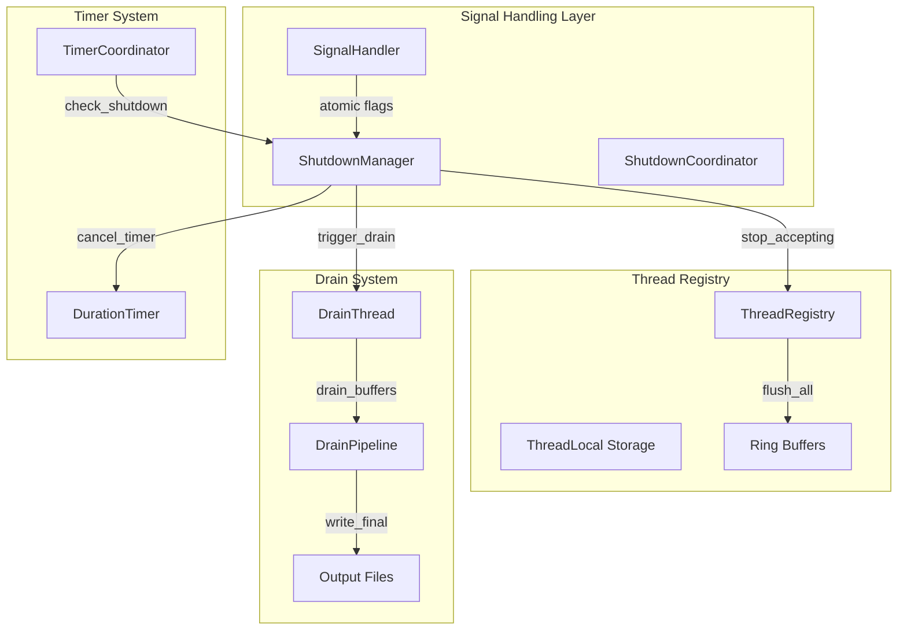
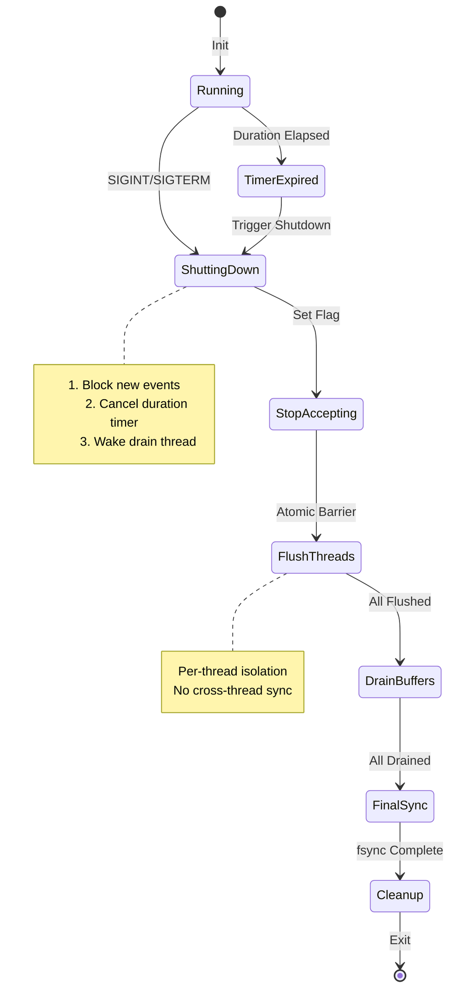
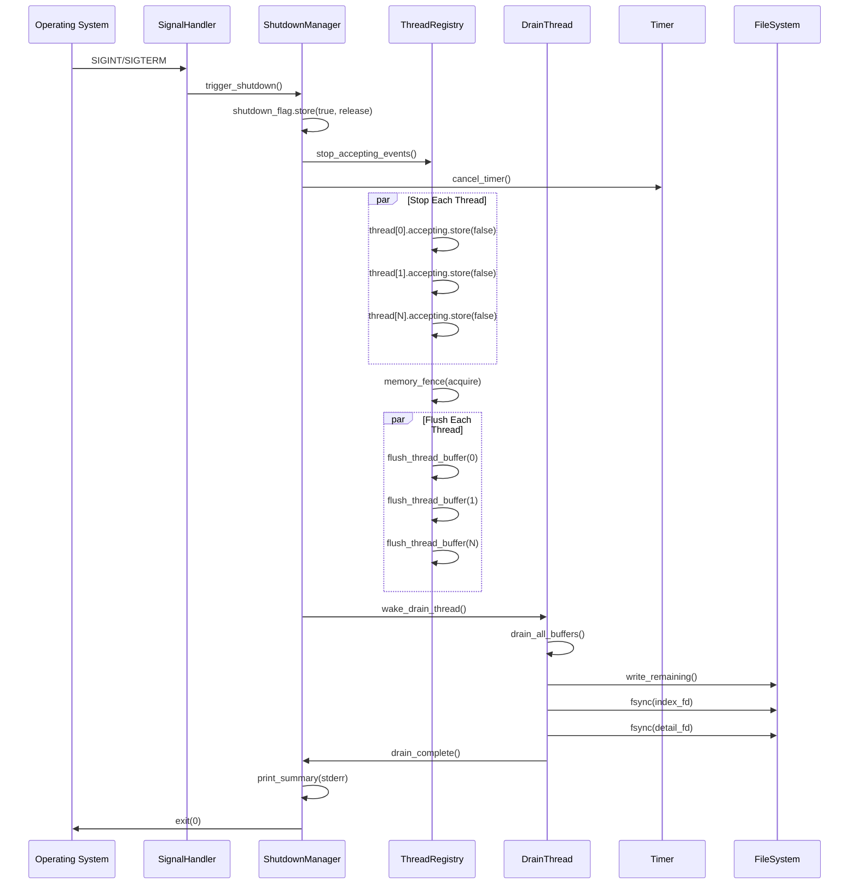

# M1_E2_I6 Technical Design: Signal-Based Shutdown Coordination

## Overview

This iteration implements robust signal handling for graceful shutdown with complete data preservation. The system ensures all per-thread ring buffers are fully drained and persisted before termination.

## Architecture

### Component Diagram



### State Machine



### Sequence Diagram



## Data Structures

### SignalHandler

```c
typedef struct signal_handler {
    // Signal configuration
    struct sigaction sa_int;
    struct sigaction sa_term;
    sigset_t block_mask;
    
    // Shutdown state
    _Atomic(bool) shutdown_requested;
    _Atomic(uint32_t) shutdown_phase;
    
    // Coordination
    shutdown_manager_t* manager;
    
    // Statistics
    _Atomic(uint64_t) events_before_shutdown;
    _Atomic(uint64_t) events_after_shutdown;
} signal_handler_t;

// Signal handler function
static void handle_shutdown_signal(int sig) {
    // Minimal work in signal handler
    signal_handler_t* handler = get_global_handler();
    atomic_store_explicit(&handler->shutdown_requested, true, 
                          memory_order_release);
    
    // Wake drain thread via eventfd or pipe
    uint64_t value = 1;
    write(handler->manager->wakeup_fd, &value, sizeof(value));
}
```

### ShutdownManager

```c
typedef struct shutdown_manager {
    // Shutdown control
    _Atomic(bool) shutdown_active;
    _Atomic(uint32_t) threads_stopped;
    _Atomic(uint32_t) threads_flushed;
    
    // Thread coordination
    thread_registry_t* registry;
    drain_thread_t* drain_thread;
    duration_timer_t* timer;
    
    // Wake mechanism
    int wakeup_fd;  // eventfd for Linux, pipe for macOS
    
    // Timing
    struct timespec shutdown_start;
    struct timespec shutdown_end;
    
    // Summary statistics
    uint64_t total_events_processed;
    uint64_t events_in_flight;
    uint64_t bytes_written;
    uint64_t files_synced;
} shutdown_manager_t;
```

### Per-Thread Shutdown State

```c
typedef struct thread_shutdown_state {
    // Control flags
    _Atomic(bool) accepting_events;
    _Atomic(bool) flush_requested;
    _Atomic(bool) flush_complete;
    
    // Statistics at shutdown
    uint64_t events_in_buffer;
    uint64_t bytes_pending;
    uint64_t last_event_timestamp;
    
    // Ring buffer state snapshot
    uint32_t write_pos;
    uint32_t read_pos;
    uint32_t wrap_count;
} thread_shutdown_state_t;
```

## Memory Ordering

### Shutdown Flag Propagation

```c
// Signal handler sets flag with release
void handle_signal(int sig) {
    atomic_store_explicit(&shutdown_requested, true, 
                          memory_order_release);
}

// Trace path checks with acquire
bool should_accept_event(thread_state_t* thread) {
    if (atomic_load_explicit(&shutdown_requested, 
                             memory_order_acquire)) {
        return false;
    }
    return atomic_load_explicit(&thread->accepting_events,
                                memory_order_acquire);
}
```

### Thread Stop Sequence

```c
// Stop accepting new events
void stop_thread_accepting(thread_state_t* thread) {
    // Store with release ensures prior events visible
    atomic_store_explicit(&thread->accepting_events, false,
                          memory_order_release);
    
    // Increment stopped counter
    atomic_fetch_add_explicit(&manager->threads_stopped, 1,
                              memory_order_acq_rel);
}

// Check if all threads stopped
bool all_threads_stopped(shutdown_manager_t* mgr) {
    uint32_t stopped = atomic_load_explicit(&mgr->threads_stopped,
                                           memory_order_acquire);
    return stopped == mgr->registry->thread_count;
}
```

### Flush Coordination

```c
// Request flush with proper ordering
void request_thread_flush(thread_state_t* thread) {
    // Ensure no new events after this point
    atomic_thread_fence(memory_order_acquire);
    
    // Mark flush requested
    atomic_store_explicit(&thread->flush_requested, true,
                          memory_order_release);
    
    // Flush ring buffer
    flush_ring_buffer(&thread->ring_buffer);
    
    // Mark complete
    atomic_store_explicit(&thread->flush_complete, true,
                          memory_order_release);
}
```

## Implementation Details

### Signal Handler Installation

```c
int install_signal_handlers(signal_handler_t* handler) {
    struct sigaction sa = {0};
    
    // Use SA_RESTART to prevent EINTR
    sa.sa_handler = handle_shutdown_signal;
    sa.sa_flags = SA_RESTART;
    
    // Block other signals during handler
    sigemptyset(&sa.sa_mask);
    sigaddset(&sa.sa_mask, SIGINT);
    sigaddset(&sa.sa_mask, SIGTERM);
    
    // Install handlers
    if (sigaction(SIGINT, &sa, &handler->sa_int) < 0) {
        return -1;
    }
    
    if (sigaction(SIGTERM, &sa, &handler->sa_term) < 0) {
        // Restore SIGINT handler
        sigaction(SIGINT, &handler->sa_int, NULL);
        return -1;
    }
    
    return 0;
}
```

### Shutdown Sequence

```c
void execute_shutdown(shutdown_manager_t* mgr) {
    clock_gettime(CLOCK_MONOTONIC, &mgr->shutdown_start);
    
    // Phase 1: Stop accepting new events
    atomic_store_explicit(&mgr->shutdown_active, true,
                          memory_order_release);
    
    // Cancel duration timer if active
    if (mgr->timer && timer_is_active(mgr->timer)) {
        cancel_duration_timer(mgr->timer);
    }
    
    // Stop all threads from accepting
    for (uint32_t i = 0; i < mgr->registry->thread_count; i++) {
        thread_state_t* thread = get_thread_state(mgr->registry, i);
        if (thread) {
            stop_thread_accepting(thread);
        }
    }
    
    // Phase 2: Wait for in-flight events
    while (!all_threads_stopped(mgr)) {
        usleep(1000);  // 1ms poll
    }
    
    // Phase 3: Flush all buffers
    for (uint32_t i = 0; i < mgr->registry->thread_count; i++) {
        thread_state_t* thread = get_thread_state(mgr->registry, i);
        if (thread) {
            request_thread_flush(thread);
        }
    }
    
    // Phase 4: Final drain
    wake_drain_thread(mgr->drain_thread);
    wait_drain_complete(mgr->drain_thread);
    
    // Phase 5: Sync files
    fsync(mgr->drain_thread->index_fd);
    fsync(mgr->drain_thread->detail_fd);
    
    clock_gettime(CLOCK_MONOTONIC, &mgr->shutdown_end);
}
```

### Shutdown Summary

```c
void print_shutdown_summary(shutdown_manager_t* mgr) {
    double elapsed = timespec_diff_ms(&mgr->shutdown_start,
                                      &mgr->shutdown_end);
    
    fprintf(stderr, "\n=== ADA Tracer Shutdown Summary ===\n");
    fprintf(stderr, "Shutdown Duration: %.2f ms\n", elapsed);
    fprintf(stderr, "Total Events Processed: %lu\n", 
            mgr->total_events_processed);
    fprintf(stderr, "Events In Flight at Shutdown: %lu\n",
            mgr->events_in_flight);
    fprintf(stderr, "Bytes Written: %lu\n", mgr->bytes_written);
    fprintf(stderr, "Files Synced: %lu\n", mgr->files_synced);
    fprintf(stderr, "Threads Flushed: %u/%u\n",
            atomic_load(&mgr->threads_flushed),
            mgr->registry->thread_count);
    fprintf(stderr, "================================\n");
}
```

## Integration Points

### Timer Integration

```c
// Timer callback checks shutdown
void timer_elapsed_callback(duration_timer_t* timer) {
    shutdown_manager_t* mgr = timer->user_data;
    
    // Check if shutdown already in progress
    if (atomic_load_explicit(&mgr->shutdown_active,
                             memory_order_acquire)) {
        return;  // Already shutting down
    }
    
    // Trigger shutdown
    atomic_store_explicit(&mgr->shutdown_active, true,
                          memory_order_release);
    execute_shutdown(mgr);
}

// Shutdown cancels timer
void shutdown_cancel_timer(shutdown_manager_t* mgr) {
    if (mgr->timer) {
        // Atomic cancel to prevent race
        atomic_store_explicit(&mgr->timer->cancelled, true,
                              memory_order_release);
        
        // Wake timer thread if sleeping
        pthread_cond_signal(&mgr->timer->cond);
    }
}
```

### Drain Thread Integration

```c
// Drain thread checks shutdown flag
void* drain_thread_main(void* arg) {
    drain_thread_t* drain = (drain_thread_t*)arg;
    
    while (1) {
        // Check shutdown with acquire
        if (atomic_load_explicit(&drain->manager->shutdown_active,
                                 memory_order_acquire)) {
            // Drain all remaining data
            drain_all_buffers_final(drain);
            break;
        }
        
        // Normal drain cycle
        drain_buffers_periodic(drain);
        
        // Wait for next cycle or wakeup
        wait_with_timeout(drain, DRAIN_INTERVAL_MS);
    }
    
    return NULL;
}
```

## Error Handling

### Signal Handler Errors

```c
typedef enum {
    SHUTDOWN_SUCCESS = 0,
    SHUTDOWN_SIGNAL_INSTALL_FAILED,
    SHUTDOWN_EVENTFD_CREATE_FAILED,
    SHUTDOWN_THREAD_STOP_TIMEOUT,
    SHUTDOWN_FLUSH_INCOMPLETE,
    SHUTDOWN_DRAIN_FAILED,
    SHUTDOWN_FSYNC_FAILED
} shutdown_error_t;

const char* shutdown_error_string(shutdown_error_t err) {
    switch (err) {
    case SHUTDOWN_SUCCESS:
        return "Success";
    case SHUTDOWN_SIGNAL_INSTALL_FAILED:
        return "Failed to install signal handlers";
    case SHUTDOWN_EVENTFD_CREATE_FAILED:
        return "Failed to create wakeup eventfd";
    case SHUTDOWN_THREAD_STOP_TIMEOUT:
        return "Timeout waiting for threads to stop";
    case SHUTDOWN_FLUSH_INCOMPLETE:
        return "Some threads failed to flush";
    case SHUTDOWN_DRAIN_FAILED:
        return "Drain thread failed to complete";
    case SHUTDOWN_FSYNC_FAILED:
        return "Failed to sync output files";
    default:
        return "Unknown error";
    }
}
```

## Performance Considerations

### Fast Path Impact

```c
// Minimal overhead in trace path
static inline bool should_trace(thread_state_t* thread) {
    // Single atomic load with acquire
    return atomic_load_explicit(&thread->accepting_events,
                                memory_order_acquire);
}

// Trace function with early exit
void trace_event(event_t* event) {
    thread_state_t* thread = get_thread_local();
    
    // Fast path: single atomic check
    if (!should_trace(thread)) {
        atomic_fetch_add(&events_dropped_shutdown, 1);
        return;
    }
    
    // Normal trace path
    write_to_ring_buffer(thread, event);
}
```

### Shutdown Performance Targets

- Signal handler latency: < 1 microsecond
- Stop accepting events: < 10 microseconds per thread
- Flush per-thread buffer: < 1 millisecond
- Total shutdown time: < 100 milliseconds for 64 threads
- File sync time: < 50 milliseconds

## Testing Considerations

### Signal Testing

```c
// Test helper to trigger signals
void trigger_test_signal(int sig) {
    kill(getpid(), sig);
    
    // Wait for signal to be handled
    usleep(1000);
}

// Verify shutdown sequence
void test_shutdown_sequence() {
    // Setup
    shutdown_manager_t* mgr = create_shutdown_manager();
    
    // Start some threads generating events
    start_test_threads(4);
    
    // Trigger shutdown
    trigger_test_signal(SIGINT);
    
    // Wait for completion
    wait_shutdown_complete(mgr);
    
    // Verify all data persisted
    assert(mgr->events_in_flight == 0);
    assert(mgr->threads_flushed == 4);
}
```

## Summary

The signal shutdown system provides robust, race-free termination with complete data preservation. Key achievements:

1. **Zero Data Loss**: All events are persisted before exit
2. **Clean Shutdown**: Proper resource cleanup and file sync
3. **Timer Integration**: Coordinated with duration timer
4. **Minimal Overhead**: Fast path unchanged during normal operation
5. **Thread Isolation**: Per-thread shutdown without contention