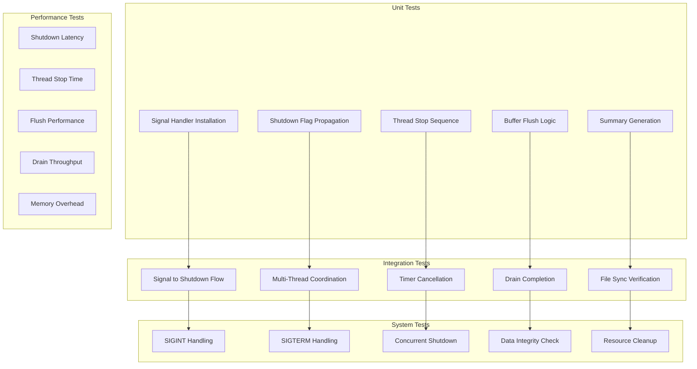

# M1_E2_I6 Test Plan: Signal-Based Shutdown Testing

## Test Coverage Map



## Test Matrix

| Component | Test Case | Type | Priority | Duration |
|-----------|-----------|------|----------|----------|
| SignalHandler | signal_handler__install__then_handlers_registered | Unit | P0 | 10ms |
| SignalHandler | signal_handler__sigint__then_shutdown_triggered | Unit | P0 | 20ms |
| SignalHandler | signal_handler__sigterm__then_shutdown_triggered | Unit | P0 | 20ms |
| SignalHandler | signal_handler__sa_restart__then_no_eintr | Unit | P0 | 15ms |
| ShutdownManager | shutdown_mgr__trigger__then_flag_set_atomic | Unit | P0 | 5ms |
| ShutdownManager | shutdown_mgr__stop_threads__then_accepting_false | Unit | P0 | 10ms |
| ShutdownManager | shutdown_mgr__flush_request__then_buffers_empty | Unit | P0 | 25ms |
| ThreadRegistry | thread_registry__shutdown__then_all_threads_stop | Integration | P0 | 50ms |
| DrainThread | drain_thread__shutdown_wake__then_immediate_drain | Integration | P0 | 30ms |
| Timer | timer__shutdown__then_cancelled | Integration | P0 | 20ms |
| System | system__ctrl_c__then_clean_exit | System | P0 | 100ms |
| System | system__data_integrity__then_no_loss | System | P0 | 150ms |
| Performance | shutdown__64_threads__then_under_100ms | Performance | P1 | 100ms |
| Performance | shutdown__memory_usage__then_no_leaks | Performance | P1 | 50ms |

## Unit Tests

### Signal Handler Tests

```c
// Test: signal_handler__install__then_handlers_registered
TEST(SignalHandler, InstallHandlers) {
    signal_handler_t handler = {0};
    shutdown_manager_t mgr = {0};
    handler.manager = &mgr;
    
    // Install handlers
    int result = install_signal_handlers(&handler);
    ASSERT_EQ(result, 0);
    
    // Verify handlers installed
    struct sigaction sa;
    sigaction(SIGINT, NULL, &sa);
    EXPECT_NE(sa.sa_handler, SIG_DFL);
    
    sigaction(SIGTERM, NULL, &sa);
    EXPECT_NE(sa.sa_handler, SIG_DFL);
    
    // Verify SA_RESTART flag
    EXPECT_TRUE(sa.sa_flags & SA_RESTART);
}

// Test: signal_handler__sigint__then_shutdown_triggered
TEST(SignalHandler, SigintTriggersShutdown) {
    signal_handler_t handler = {0};
    shutdown_manager_t mgr = {0};
    handler.manager = &mgr;
    
    // Create wakeup pipe
    int pipefd[2];
    pipe(pipefd);
    mgr.wakeup_fd = pipefd[1];
    
    // Install and trigger
    install_signal_handlers(&handler);
    kill(getpid(), SIGINT);
    
    // Wait for signal handling
    usleep(1000);
    
    // Verify shutdown requested
    EXPECT_TRUE(atomic_load(&handler.shutdown_requested));
    
    // Verify wakeup sent
    uint64_t value;
    int n = read(pipefd[0], &value, sizeof(value));
    EXPECT_GT(n, 0);
    
    close(pipefd[0]);
    close(pipefd[1]);
}
```

### Shutdown Manager Tests

```c
// Test: shutdown_mgr__stop_threads__then_accepting_false
TEST(ShutdownManager, StopThreadsAtomic) {
    shutdown_manager_t mgr = {0};
    thread_registry_t registry = {0};
    mgr.registry = &registry;
    
    // Create test threads
    const int num_threads = 4;
    thread_state_t threads[num_threads];
    for (int i = 0; i < num_threads; i++) {
        atomic_store(&threads[i].accepting_events, true);
        registry.threads[i] = &threads[i];
    }
    registry.thread_count = num_threads;
    
    // Stop all threads
    stop_all_threads(&mgr);
    
    // Verify all stopped
    for (int i = 0; i < num_threads; i++) {
        EXPECT_FALSE(atomic_load(&threads[i].accepting_events));
    }
    
    // Verify counter
    EXPECT_EQ(atomic_load(&mgr.threads_stopped), num_threads);
}

// Test: shutdown_mgr__flush_request__then_buffers_empty
TEST(ShutdownManager, FlushBuffers) {
    thread_state_t thread = {0};
    ring_buffer_t* ring = &thread.ring_buffer;
    
    // Add some test data
    for (int i = 0; i < 10; i++) {
        event_t event = {.id = i};
        ring_buffer_write(ring, &event, sizeof(event));
    }
    
    // Request flush
    request_thread_flush(&thread);
    
    // Verify flush requested and complete
    EXPECT_TRUE(atomic_load(&thread.flush_requested));
    EXPECT_TRUE(atomic_load(&thread.flush_complete));
    
    // Verify buffer empty
    EXPECT_EQ(ring_buffer_size(ring), 0);
}
```

## Integration Tests

### Multi-Thread Coordination

```c
// Test: thread_registry__shutdown__then_all_threads_stop
TEST(Integration, MultiThreadShutdown) {
    shutdown_manager_t mgr = {0};
    thread_registry_t registry = {0};
    mgr.registry = &registry;
    
    // Start worker threads
    const int num_threads = 8;
    pthread_t threads[num_threads];
    thread_context_t contexts[num_threads];
    
    for (int i = 0; i < num_threads; i++) {
        contexts[i].id = i;
        contexts[i].mgr = &mgr;
        pthread_create(&threads[i], NULL, worker_thread, &contexts[i]);
    }
    
    // Let threads run
    usleep(10000);  // 10ms
    
    // Trigger shutdown
    execute_shutdown(&mgr);
    
    // Join all threads
    for (int i = 0; i < num_threads; i++) {
        pthread_join(threads[i], NULL);
    }
    
    // Verify all threads stopped cleanly
    EXPECT_EQ(atomic_load(&mgr.threads_stopped), num_threads);
    EXPECT_EQ(atomic_load(&mgr.threads_flushed), num_threads);
}
```

### Timer Integration

```c
// Test: timer__shutdown__then_cancelled
TEST(Integration, TimerCancellation) {
    shutdown_manager_t mgr = {0};
    duration_timer_t timer = {0};
    mgr.timer = &timer;
    
    // Start timer with 5 second duration
    start_duration_timer(&timer, 5000);
    EXPECT_TRUE(timer_is_active(&timer));
    
    // Trigger shutdown after 100ms
    usleep(100000);
    execute_shutdown(&mgr);
    
    // Verify timer cancelled
    EXPECT_TRUE(atomic_load(&timer.cancelled));
    EXPECT_FALSE(timer_is_active(&timer));
}
```

### Drain Completion

```c
// Test: drain_thread__shutdown_wake__then_immediate_drain
TEST(Integration, DrainOnShutdown) {
    shutdown_manager_t mgr = {0};
    drain_thread_t drain = {0};
    mgr.drain_thread = &drain;
    drain.manager = &mgr;
    
    // Create output files
    drain.index_fd = open("/tmp/test_index.bin", O_CREAT | O_WRONLY);
    drain.detail_fd = open("/tmp/test_detail.bin", O_CREAT | O_WRONLY);
    
    // Add test data to buffers
    add_test_events(&drain, 1000);
    
    // Start drain thread
    pthread_t drain_tid;
    pthread_create(&drain_tid, NULL, drain_thread_main, &drain);
    
    // Trigger shutdown
    usleep(10000);  // Let drain thread start
    atomic_store(&mgr.shutdown_active, true);
    wake_drain_thread(&drain);
    
    // Wait for completion
    pthread_join(drain_tid, NULL);
    
    // Verify all data drained
    EXPECT_EQ(drain.pending_bytes, 0);
    EXPECT_GT(drain.total_bytes_written, 0);
    
    // Verify files synced
    struct stat st;
    fstat(drain.index_fd, &st);
    EXPECT_GT(st.st_size, 0);
    
    close(drain.index_fd);
    close(drain.detail_fd);
    unlink("/tmp/test_index.bin");
    unlink("/tmp/test_detail.bin");
}
```

## System Tests

### Complete Shutdown Flow

```c
// Test: system__ctrl_c__then_clean_exit
TEST(System, CtrlCShutdown) {
    // Fork child process
    pid_t pid = fork();
    
    if (pid == 0) {
        // Child: Run tracer
        tracer_config_t config = {
            .output_dir = "/tmp/test_output",
            .buffer_size = 4096,
            .num_threads = 4
        };
        
        tracer_t* tracer = tracer_init(&config);
        tracer_start(tracer);
        
        // Run until signal
        pause();
        
        // Should never reach here
        exit(1);
    }
    
    // Parent: Send signal and verify
    usleep(100000);  // Let child start
    
    // Send SIGINT
    kill(pid, SIGINT);
    
    // Wait for child
    int status;
    waitpid(pid, &status, 0);
    
    // Verify clean exit
    EXPECT_TRUE(WIFEXITED(status));
    EXPECT_EQ(WEXITSTATUS(status), 0);
    
    // Verify output files exist and have data
    struct stat st;
    EXPECT_EQ(stat("/tmp/test_output/index.bin", &st), 0);
    EXPECT_GT(st.st_size, 0);
}
```

### Data Integrity

```c
// Test: system__data_integrity__then_no_loss
TEST(System, DataIntegrityOnShutdown) {
    const int num_events = 10000;
    const int num_threads = 8;
    
    // Start tracer
    tracer_t* tracer = create_test_tracer();
    tracer_start(tracer);
    
    // Generate events from multiple threads
    std::atomic<int> event_count(0);
    std::vector<std::thread> threads;
    
    for (int i = 0; i < num_threads; i++) {
        threads.emplace_back([&]() {
            while (event_count.fetch_add(1) < num_events) {
                trace_test_event(i, event_count);
            }
        });
    }
    
    // Wait for some events
    usleep(50000);
    
    // Trigger shutdown
    kill(getpid(), SIGTERM);
    
    // Join threads
    for (auto& t : threads) {
        t.join();
    }
    
    // Wait for shutdown
    wait_shutdown_complete(tracer);
    
    // Read and verify all events persisted
    int persisted = count_persisted_events("/tmp/test_output");
    int generated = event_count.load();
    
    // All events before shutdown must be persisted
    EXPECT_GE(persisted, generated - num_threads);
    
    cleanup_test_tracer(tracer);
}
```

## Performance Tests

### Shutdown Latency

```c
// Test: shutdown__64_threads__then_under_100ms
TEST(Performance, ShutdownLatency) {
    const int num_threads = 64;
    shutdown_manager_t mgr = {0};
    thread_registry_t registry = {0};
    mgr.registry = &registry;
    
    // Create threads
    thread_state_t* threads = calloc(num_threads, sizeof(thread_state_t));
    for (int i = 0; i < num_threads; i++) {
        atomic_store(&threads[i].accepting_events, true);
        // Add some data to each buffer
        for (int j = 0; j < 100; j++) {
            event_t event = {.id = j};
            ring_buffer_write(&threads[i].ring_buffer, &event, sizeof(event));
        }
    }
    registry.thread_count = num_threads;
    registry.threads = threads;
    
    // Measure shutdown time
    auto start = std::chrono::high_resolution_clock::now();
    execute_shutdown(&mgr);
    auto end = std::chrono::high_resolution_clock::now();
    
    auto duration = std::chrono::duration_cast<std::chrono::milliseconds>(end - start);
    
    // Verify under 100ms
    EXPECT_LT(duration.count(), 100);
    
    // Verify all threads processed
    EXPECT_EQ(atomic_load(&mgr.threads_stopped), num_threads);
    EXPECT_EQ(atomic_load(&mgr.threads_flushed), num_threads);
    
    free(threads);
}
```

### Memory Usage

```c
// Test: shutdown__memory_usage__then_no_leaks
TEST(Performance, ShutdownMemoryLeak) {
    // Record initial memory
    size_t initial_memory = get_current_memory_usage();
    
    for (int i = 0; i < 10; i++) {
        // Create and destroy shutdown manager
        shutdown_manager_t* mgr = create_shutdown_manager();
        
        // Install signal handlers
        signal_handler_t* handler = create_signal_handler(mgr);
        install_signal_handlers(handler);
        
        // Trigger shutdown
        execute_shutdown(mgr);
        
        // Cleanup
        destroy_signal_handler(handler);
        destroy_shutdown_manager(mgr);
    }
    
    // Check memory usage
    size_t final_memory = get_current_memory_usage();
    
    // Allow small variance (< 1KB)
    EXPECT_LT(final_memory - initial_memory, 1024);
}
```

## Behavioral Test Cases

### Race Condition Tests

```c
// Test: shutdown__concurrent_signals__then_single_shutdown
TEST(Behavioral, ConcurrentSignals) {
    signal_handler_t handler = {0};
    shutdown_manager_t mgr = {0};
    handler.manager = &mgr;
    
    install_signal_handlers(&handler);
    
    // Send multiple signals concurrently
    std::vector<std::thread> signal_threads;
    for (int i = 0; i < 10; i++) {
        signal_threads.emplace_back([i]() {
            usleep(i * 100);  // Stagger slightly
            kill(getpid(), i % 2 ? SIGINT : SIGTERM);
        });
    }
    
    // Join all threads
    for (auto& t : signal_threads) {
        t.join();
    }
    
    // Verify only one shutdown occurred
    EXPECT_TRUE(atomic_load(&handler.shutdown_requested));
    EXPECT_EQ(atomic_load(&mgr.shutdown_count), 1);
}

// Test: shutdown__events_after_stop__then_dropped
TEST(Behavioral, EventsAfterShutdown) {
    thread_state_t thread = {0};
    atomic_store(&thread.accepting_events, true);
    
    // Generate some events
    for (int i = 0; i < 100; i++) {
        if (should_trace(&thread)) {
            trace_event(&thread, i);
        }
    }
    
    // Stop accepting
    atomic_store(&thread.accepting_events, false);
    
    // Try to generate more events
    int accepted = 0;
    for (int i = 0; i < 100; i++) {
        if (should_trace(&thread)) {
            trace_event(&thread, i);
            accepted++;
        }
    }
    
    // Verify none accepted
    EXPECT_EQ(accepted, 0);
}
```

## Acceptance Criteria

### Functional Requirements

- [ ] SIGINT and SIGTERM handlers installed with SA_RESTART
- [ ] Atomic shutdown flag propagation to all threads
- [ ] All threads stop accepting new events atomically
- [ ] All per-thread buffers flush before exit
- [ ] Drain thread completes all pending writes
- [ ] Output files are fsync'd before exit
- [ ] Duration timer cancelled on shutdown
- [ ] Shutdown summary printed to stderr
- [ ] Clean exit with status 0

### Performance Requirements

- [ ] Signal handler latency < 1 microsecond
- [ ] Thread stop time < 10 microseconds per thread
- [ ] Total shutdown < 100ms for 64 threads
- [ ] Zero overhead in fast path during normal operation
- [ ] No memory leaks during shutdown

### Data Integrity

- [ ] No events lost that were accepted before shutdown
- [ ] All buffered data persisted to disk
- [ ] Files properly synced with fsync
- [ ] Proper cleanup of all resources

## Coverage Requirements

```bash
# Required coverage for this iteration
lcov --capture --directory . --output-file coverage.info
lcov --remove coverage.info '/usr/*' --output-file coverage.info
genhtml coverage.info --output-directory coverage-report

# Minimum thresholds
Line Coverage: 100%
Branch Coverage: 95%
Function Coverage: 100%
```

## Test Execution

```bash
# Run all tests
./run_tests.sh signal_shutdown

# Run with valgrind for memory checks
valgrind --leak-check=full ./test_signal_shutdown

# Run stress tests
./stress_test_shutdown.sh --threads 64 --duration 60

# Generate coverage report
./generate_coverage.sh signal_shutdown
```