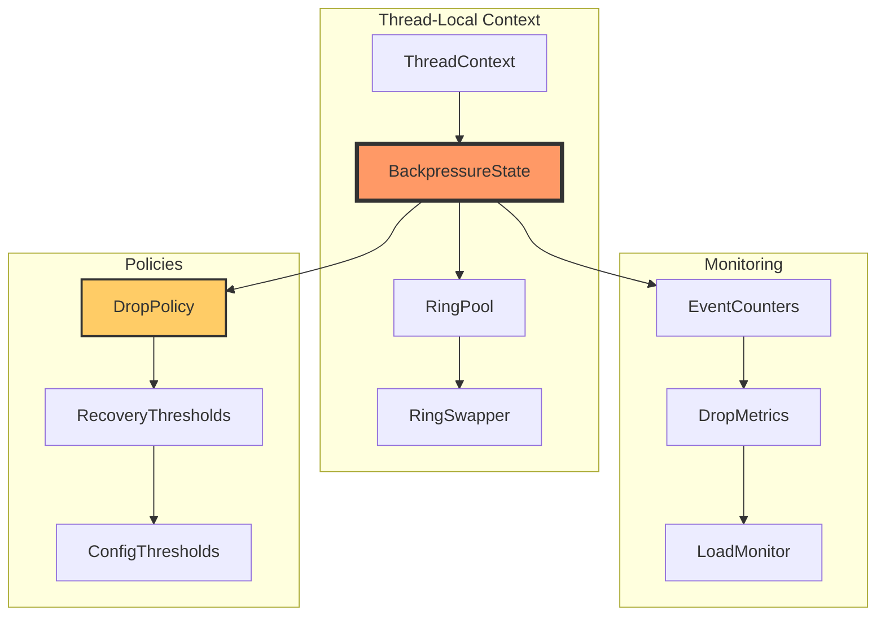
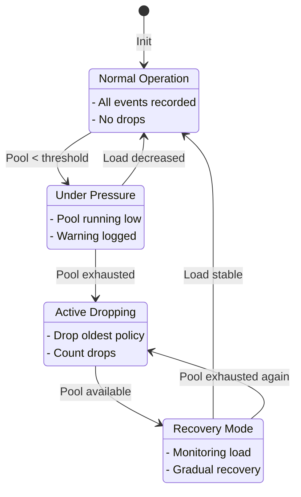

# M1_E3_I1 Technical Design: Backpressure Handling

## Overview

This iteration implements per-thread backpressure mechanisms to handle ring pool exhaustion gracefully. The system detects when a thread's ring pool is exhausted, applies a drop-oldest policy, tracks dropped events, and recovers automatically when load decreases.

## Architecture

### Component Interaction



### State Machine



## Data Structures

### BackpressureState

```c
typedef enum {
    BP_STATE_NORMAL = 0,
    BP_STATE_PRESSURE = 1,
    BP_STATE_DROPPING = 2,
    BP_STATE_RECOVERY = 3
} bp_state_t;

typedef struct backpressure_state {
    // State management
    _Atomic(bp_state_t) current_state;
    _Atomic(uint64_t) state_transitions;
    
    // Drop tracking
    _Atomic(uint64_t) events_dropped;
    _Atomic(uint64_t) bytes_dropped;
    _Atomic(uint64_t) drop_sequences;
    
    // Pool monitoring
    _Atomic(uint32_t) free_rings;
    _Atomic(uint32_t) total_rings;
    _Atomic(uint32_t) low_watermark;
    
    // Timestamps
    _Atomic(uint64_t) last_drop_ns;
    _Atomic(uint64_t) last_recovery_ns;
    _Atomic(uint64_t) pressure_start_ns;
    
    // Configuration
    uint32_t pressure_threshold;  // e.g., 25% free
    uint32_t recovery_threshold;   // e.g., 50% free
    uint32_t drop_log_interval;    // log every N drops
    
} backpressure_state_t;
```

### DropPolicy

```c
typedef enum {
    DROP_POLICY_OLDEST = 0,      // Drop oldest events first
    DROP_POLICY_NEWEST = 1,      // Drop newest events (tail drop)
    DROP_POLICY_PRIORITY = 2     // Drop by priority
} drop_policy_type_t;

typedef struct drop_policy {
    drop_policy_type_t type;
    
    // Drop decision
    bool (*should_drop)(const event_header_t* event,
                       const backpressure_state_t* state);
    
    // Drop execution
    void (*execute_drop)(ring_buffer_t* ring,
                        backpressure_state_t* state);
    
    // Recovery check
    bool (*can_recover)(const backpressure_state_t* state);
    
} drop_policy_t;
```

### ThreadBackpressure Integration

```c
typedef struct thread_context {
    // Existing fields
    uint32_t thread_id;
    ring_swapper_t* swapper;
    ring_pool_t* pool;
    
    // Backpressure management
    backpressure_state_t* bp_state;
    drop_policy_t* drop_policy;
    
    // Performance counters
    _Atomic(uint64_t) events_recorded;
    _Atomic(uint64_t) events_attempted;
    
} thread_context_t;
```

## Algorithms

### Pool Exhaustion Detection

```c
static inline bool bp_check_exhaustion(backpressure_state_t* bp,
                                       ring_pool_t* pool) {
    // Sample free rings
    uint32_t free = atomic_load_explicit(&pool->free_count,
                                         memory_order_relaxed);
    uint32_t total = pool->total_rings;
    
    // Update tracking
    atomic_store_explicit(&bp->free_rings, free,
                         memory_order_relaxed);
    
    // Check thresholds
    uint32_t free_pct = (free * 100) / total;
    bp_state_t current = atomic_load_explicit(&bp->current_state,
                                              memory_order_acquire);
    
    switch (current) {
        case BP_STATE_NORMAL:
            if (free_pct < bp->pressure_threshold) {
                bp_transition_to_pressure(bp);
                return false;
            }
            break;
            
        case BP_STATE_PRESSURE:
            if (free == 0) {
                bp_transition_to_dropping(bp);
                return true;
            } else if (free_pct > bp->recovery_threshold) {
                bp_transition_to_normal(bp);
                return false;
            }
            break;
            
        case BP_STATE_DROPPING:
            if (free > 0) {
                bp_transition_to_recovery(bp);
                return false;
            }
            return true;
            
        case BP_STATE_RECOVERY:
            if (free == 0) {
                bp_transition_to_dropping(bp);
                return true;
            } else if (free_pct > bp->recovery_threshold) {
                uint64_t now = get_timestamp_ns();
                uint64_t last_drop = atomic_load_explicit(
                    &bp->last_drop_ns, memory_order_relaxed);
                
                // Stable for 1 second
                if (now - last_drop > 1000000000ULL) {
                    bp_transition_to_normal(bp);
                }
            }
            break;
    }
    
    return false;
}
```

### Drop-Oldest Implementation

```c
static void bp_drop_oldest(ring_buffer_t* ring,
                          backpressure_state_t* bp) {
    // Get current positions
    uint64_t head = atomic_load_explicit(&ring->head_pos,
                                         memory_order_acquire);
    uint64_t tail = atomic_load_explicit(&ring->tail_pos,
                                         memory_order_acquire);
    
    if (head >= tail) {
        return; // Ring empty
    }
    
    // Find oldest event
    uint32_t head_idx = head & ring->index_mask;
    event_header_t* oldest = (event_header_t*)(ring->buffer + head_idx);
    
    // Track drop
    uint32_t event_size = oldest->total_size;
    atomic_fetch_add_explicit(&bp->events_dropped, 1,
                             memory_order_relaxed);
    atomic_fetch_add_explicit(&bp->bytes_dropped, event_size,
                             memory_order_relaxed);
    
    // Advance head to drop
    uint64_t new_head = head + event_size;
    atomic_store_explicit(&ring->head_pos, new_head,
                         memory_order_release);
    
    // Log if interval reached
    uint64_t drops = atomic_load_explicit(&bp->events_dropped,
                                          memory_order_relaxed);
    if (drops % bp->drop_log_interval == 0) {
        bp_log_drop_event(bp, drops);
    }
}
```

### Event Recording with Backpressure

```c
bool trace_record_with_backpressure(thread_context_t* ctx,
                                    const void* data,
                                    uint32_t size) {
    // Increment attempt counter
    atomic_fetch_add_explicit(&ctx->events_attempted, 1,
                             memory_order_relaxed);
    
    // Check backpressure state
    bool exhausted = bp_check_exhaustion(ctx->bp_state, ctx->pool);
    
    if (exhausted) {
        // Apply drop policy
        ring_buffer_t* current = atomic_load_explicit(
            &ctx->swapper->current_ring,
            memory_order_acquire);
            
        if (ctx->drop_policy->type == DROP_POLICY_OLDEST) {
            // Make room by dropping oldest
            bp_drop_oldest(current, ctx->bp_state);
        } else if (ctx->drop_policy->type == DROP_POLICY_NEWEST) {
            // Tail drop - just count and return
            atomic_fetch_add_explicit(&ctx->bp_state->events_dropped, 1,
                                     memory_order_relaxed);
            return false;
        }
    }
    
    // Try normal recording
    ring_buffer_t* ring = ring_swapper_get_for_write(ctx->swapper);
    if (!ring) {
        // Still no space after drop
        atomic_fetch_add_explicit(&ctx->bp_state->events_dropped, 1,
                                 memory_order_relaxed);
        return false;
    }
    
    bool success = ring_buffer_write(ring, data, size);
    if (success) {
        atomic_fetch_add_explicit(&ctx->events_recorded, 1,
                                 memory_order_relaxed);
    } else {
        atomic_fetch_add_explicit(&ctx->bp_state->events_dropped, 1,
                                 memory_order_relaxed);
    }
    
    return success;
}
```

### Recovery Detection

```c
static void bp_check_recovery(backpressure_state_t* bp,
                              ring_pool_t* pool) {
    bp_state_t state = atomic_load_explicit(&bp->current_state,
                                           memory_order_acquire);
    
    if (state != BP_STATE_RECOVERY) {
        return;
    }
    
    // Check pool health
    uint32_t free = atomic_load_explicit(&pool->free_count,
                                         memory_order_relaxed);
    uint32_t total = pool->total_rings;
    uint32_t free_pct = (free * 100) / total;
    
    if (free_pct > bp->recovery_threshold) {
        // Check stability period
        uint64_t now = get_timestamp_ns();
        uint64_t last_drop = atomic_load_explicit(&bp->last_drop_ns,
                                                  memory_order_relaxed);
        
        // Require 1 second of stability
        if (now - last_drop > 1000000000ULL) {
            bp_transition_to_normal(bp);
            
            // Log recovery
            uint64_t drops = atomic_load_explicit(&bp->events_dropped,
                                                  memory_order_relaxed);
            bp_log_recovery(bp, drops, now - last_drop);
        }
    }
}
```

## Memory Ordering

### State Transitions

```c
static void bp_transition_to_dropping(backpressure_state_t* bp) {
    bp_state_t expected = BP_STATE_PRESSURE;
    bp_state_t desired = BP_STATE_DROPPING;
    
    bool success = atomic_compare_exchange_strong_explicit(
        &bp->current_state,
        &expected,
        desired,
        memory_order_acq_rel,  // Success: acquire old, release new
        memory_order_acquire   // Failure: acquire current
    );
    
    if (success) {
        // Record transition time
        uint64_t now = get_timestamp_ns();
        atomic_store_explicit(&bp->pressure_start_ns, now,
                            memory_order_release);
        
        // Increment transition counter
        atomic_fetch_add_explicit(&bp->state_transitions, 1,
                                 memory_order_relaxed);
        
        // Log state change
        bp_log_state_change(bp, expected, desired);
    }
}
```

### Drop Counter Updates

```c
// Relaxed ordering for counters (eventual consistency OK)
atomic_fetch_add_explicit(&bp->events_dropped, 1,
                         memory_order_relaxed);

// Release ordering for timestamps (ordering matters)
atomic_store_explicit(&bp->last_drop_ns, get_timestamp_ns(),
                     memory_order_release);
```

## Configuration

### Thresholds

```c
typedef struct bp_config {
    // Pool thresholds (percentage)
    uint32_t pressure_threshold;   // Default: 25% free
    uint32_t recovery_threshold;   // Default: 50% free
    uint32_t critical_threshold;   // Default: 10% free
    
    // Drop policy
    drop_policy_type_t policy;     // Default: DROP_POLICY_OLDEST
    
    // Logging
    uint32_t drop_log_interval;    // Default: 1000 drops
    uint32_t state_log_enabled;    // Default: 1 (enabled)
    
    // Recovery
    uint64_t stability_period_ns;  // Default: 1 second
    uint32_t recovery_checks;      // Default: 10 checks
    
} bp_config_t;
```

## Integration Points

### With Ring Pool

```c
// Pool provides free count
uint32_t ring_pool_get_free_count(ring_pool_t* pool) {
    return atomic_load_explicit(&pool->free_count,
                               memory_order_relaxed);
}

// Pool notifies on exhaustion
void ring_pool_on_exhausted(ring_pool_t* pool,
                           void (*callback)(void* ctx),
                           void* ctx);
```

### With Thread Registry

```c
// Per-thread backpressure state
void thread_registry_init_backpressure(thread_registry_t* reg,
                                       const bp_config_t* config) {
    for (uint32_t i = 0; i < reg->max_threads; i++) {
        thread_context_t* ctx = &reg->contexts[i];
        ctx->bp_state = bp_state_create(config);
        ctx->drop_policy = bp_policy_create(config->policy);
    }
}
```

## Performance Considerations

### Lock-Free Operations
- All state transitions use atomic CAS
- Counter updates use relaxed ordering
- No blocking on pool exhaustion

### Cache Optimization
- Backpressure state in thread-local context
- Counters on separate cache lines
- Read-mostly config fields grouped

### Overhead
- ~5ns per event for state check
- ~20ns for drop execution
- Zero overhead in normal state

## Error Handling

### Pool Exhaustion
- Graceful degradation to drop policy
- No thread blocking
- Automatic recovery

### State Corruption
- CAS loops for safe transitions
- State validation on read
- Recovery to known state

## Testing Hooks

```c
#ifdef TESTING
// Force state transitions
void bp_test_force_state(backpressure_state_t* bp,
                         bp_state_t state);

// Inject pool exhaustion
void bp_test_exhaust_pool(ring_pool_t* pool);

// Verify drop counts
uint64_t bp_test_get_drops(backpressure_state_t* bp);
#endif
```