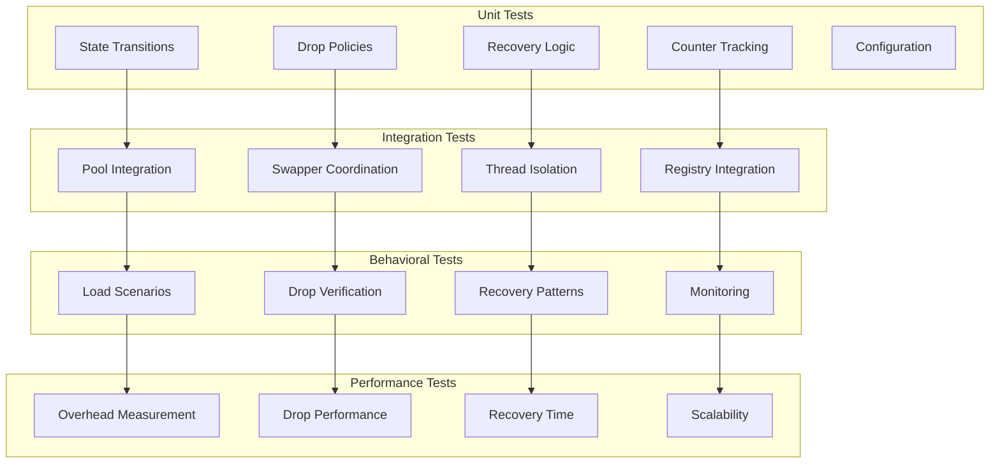

# M1_E3_I1 Test Plan: Backpressure Handling

## Test Coverage Map



## Test Matrix

| Component | Test Type | Coverage Target | Priority |
|-----------|-----------|----------------|----------|
| BackpressureState | Unit | 100% | P0 |
| DropPolicy | Unit | 100% | P0 |
| StateTransitions | Unit | 100% | P0 |
| PoolExhaustion | Integration | 100% | P0 |
| ThreadIsolation | Integration | 100% | P0 |
| Recovery | Behavioral | 95% | P0 |
| Performance | Benchmark | Key paths | P1 |
| LoadScenarios | Stress | 90% | P1 |

## Unit Tests

### State Management Tests

```c
TEST(BackpressureState, state__initial__then_normal) {
    bp_config_t config = bp_get_default_config();
    backpressure_state_t* bp = bp_state_create(&config);
    
    ASSERT_EQ(atomic_load(&bp->current_state), BP_STATE_NORMAL);
    ASSERT_EQ(atomic_load(&bp->events_dropped), 0);
    ASSERT_EQ(atomic_load(&bp->state_transitions), 0);
    
    bp_state_destroy(bp);
}

TEST(BackpressureState, state__pressure_threshold__then_transitions) {
    bp_config_t config = {
        .pressure_threshold = 25,
        .recovery_threshold = 50
    };
    backpressure_state_t* bp = bp_state_create(&config);
    mock_ring_pool_t* pool = mock_pool_create(100);
    
    // Reduce free rings below threshold
    mock_pool_set_free(pool, 20);  // 20% free
    
    bool exhausted = bp_check_exhaustion(bp, (ring_pool_t*)pool);
    
    ASSERT_FALSE(exhausted);
    ASSERT_EQ(atomic_load(&bp->current_state), BP_STATE_PRESSURE);
    ASSERT_EQ(atomic_load(&bp->state_transitions), 1);
    
    mock_pool_destroy(pool);
    bp_state_destroy(bp);
}

TEST(BackpressureState, state__exhausted__then_dropping) {
    bp_config_t config = bp_get_default_config();
    backpressure_state_t* bp = bp_state_create(&config);
    mock_ring_pool_t* pool = mock_pool_create(100);
    
    // Force pressure state first
    mock_pool_set_free(pool, 20);
    bp_check_exhaustion(bp, (ring_pool_t*)pool);
    
    // Now exhaust pool
    mock_pool_set_free(pool, 0);
    bool exhausted = bp_check_exhaustion(bp, (ring_pool_t*)pool);
    
    ASSERT_TRUE(exhausted);
    ASSERT_EQ(atomic_load(&bp->current_state), BP_STATE_DROPPING);
    ASSERT_EQ(atomic_load(&bp->state_transitions), 2);
    
    mock_pool_destroy(pool);
    bp_state_destroy(bp);
}
```

### Drop Policy Tests

```c
TEST(DropPolicy, oldest__full_ring__then_drops_head) {
    drop_policy_t* policy = bp_policy_create(DROP_POLICY_OLDEST);
    backpressure_state_t* bp = bp_state_create_default();
    ring_buffer_t* ring = ring_buffer_create(4096);
    
    // Fill ring with events
    test_event_t events[10];
    for (int i = 0; i < 10; i++) {
        events[i].seq = i;
        events[i].timestamp = i * 1000;
        ring_buffer_write(ring, &events[i], sizeof(test_event_t));
    }
    
    uint64_t old_head = atomic_load(&ring->head_pos);
    
    // Execute drop
    policy->execute_drop(ring, bp);
    
    uint64_t new_head = atomic_load(&ring->head_pos);
    ASSERT_GT(new_head, old_head);
    ASSERT_EQ(atomic_load(&bp->events_dropped), 1);
    
    // Verify oldest was dropped
    test_event_t* first = ring_buffer_peek_head(ring);
    ASSERT_EQ(first->seq, 1);  // Event 0 dropped
    
    bp_policy_destroy(policy);
    bp_state_destroy(bp);
    ring_buffer_destroy(ring);
}

TEST(DropPolicy, newest__tail_drop__then_rejects_new) {
    drop_policy_t* policy = bp_policy_create(DROP_POLICY_NEWEST);
    backpressure_state_t* bp = bp_state_create_default();
    
    test_event_t event = {.seq = 42};
    
    // Should drop decision
    bool should_drop = policy->should_drop(
        (event_header_t*)&event, bp);
    
    ASSERT_TRUE(should_drop);
    
    bp_policy_destroy(policy);
    bp_state_destroy(bp);
}
```

### Counter Tracking Tests

```c
TEST(BackpressureCounters, drops__multiple__then_accurate_count) {
    backpressure_state_t* bp = bp_state_create_default();
    
    // Simulate drops
    for (int i = 0; i < 100; i++) {
        atomic_fetch_add(&bp->events_dropped, 1);
        atomic_fetch_add(&bp->bytes_dropped, 128);
    }
    
    ASSERT_EQ(atomic_load(&bp->events_dropped), 100);
    ASSERT_EQ(atomic_load(&bp->bytes_dropped), 12800);
    
    bp_state_destroy(bp);
}

TEST(BackpressureCounters, watermark__updates__then_tracks_minimum) {
    backpressure_state_t* bp = bp_state_create_default();
    
    atomic_store(&bp->free_rings, 100);
    atomic_store(&bp->low_watermark, 100);
    
    // Update with lower values
    bp_update_watermark(bp, 50);
    ASSERT_EQ(atomic_load(&bp->low_watermark), 50);
    
    bp_update_watermark(bp, 75);
    ASSERT_EQ(atomic_load(&bp->low_watermark), 50);  // No change
    
    bp_update_watermark(bp, 25);
    ASSERT_EQ(atomic_load(&bp->low_watermark), 25);
    
    bp_state_destroy(bp);
}
```

## Integration Tests

### Pool Integration Tests

```c
TEST(PoolIntegration, exhaustion__detected__then_state_changes) {
    // Create real components
    ring_pool_t* pool = ring_pool_create(10, 4096);
    backpressure_state_t* bp = bp_state_create_default();
    
    // Exhaust pool by acquiring all rings
    ring_buffer_t* rings[10];
    for (int i = 0; i < 10; i++) {
        rings[i] = ring_pool_acquire(pool);
    }
    
    // Check exhaustion
    bool exhausted = bp_check_exhaustion(bp, pool);
    
    ASSERT_TRUE(exhausted);
    ASSERT_EQ(atomic_load(&bp->current_state), BP_STATE_DROPPING);
    
    // Return one ring
    ring_pool_release(pool, rings[0]);
    
    // Check recovery detection
    exhausted = bp_check_exhaustion(bp, pool);
    
    ASSERT_FALSE(exhausted);
    ASSERT_EQ(atomic_load(&bp->current_state), BP_STATE_RECOVERY);
    
    // Cleanup
    for (int i = 1; i < 10; i++) {
        ring_pool_release(pool, rings[i]);
    }
    
    bp_state_destroy(bp);
    ring_pool_destroy(pool);
}
```

### Thread Isolation Tests

```c
TEST(ThreadIsolation, backpressure__per_thread__then_independent) {
    thread_registry_t* registry = thread_registry_create(4);
    bp_config_t config = bp_get_default_config();
    thread_registry_init_backpressure(registry, &config);
    
    // Get contexts for different threads
    thread_context_t* ctx1 = thread_registry_get(registry, 0);
    thread_context_t* ctx2 = thread_registry_get(registry, 1);
    
    // Exhaust thread 1's pool
    mock_exhaust_pool(ctx1->pool);
    bp_check_exhaustion(ctx1->bp_state, ctx1->pool);
    
    // Thread 2 unaffected
    ASSERT_EQ(atomic_load(&ctx1->bp_state->current_state), 
              BP_STATE_DROPPING);
    ASSERT_EQ(atomic_load(&ctx2->bp_state->current_state), 
              BP_STATE_NORMAL);
    
    // Drop events on thread 1
    for (int i = 0; i < 100; i++) {
        atomic_fetch_add(&ctx1->bp_state->events_dropped, 1);
    }
    
    // Verify isolation
    ASSERT_EQ(atomic_load(&ctx1->bp_state->events_dropped), 100);
    ASSERT_EQ(atomic_load(&ctx2->bp_state->events_dropped), 0);
    
    thread_registry_destroy(registry);
}
```

## Behavioral Tests

### Load Scenario Tests

```c
TEST(LoadScenario, burst_load__pool_exhausts__then_drops_oldest) {
    thread_context_t* ctx = create_test_context();
    ctx->drop_policy = bp_policy_create(DROP_POLICY_OLDEST);
    
    // Generate burst of events
    const int burst_size = 10000;
    int recorded = 0;
    int dropped = 0;
    
    for (int i = 0; i < burst_size; i++) {
        test_event_t event = {
            .seq = i,
            .timestamp = get_timestamp_ns()
        };
        
        bool success = trace_record_with_backpressure(
            ctx, &event, sizeof(event));
        
        if (success) {
            recorded++;
        } else {
            dropped++;
        }
    }
    
    // Verify handling
    ASSERT_GT(recorded, 0);
    ASSERT_GT(dropped, 0);
    ASSERT_EQ(recorded + dropped, burst_size);
    
    // Check drop count matches
    uint64_t bp_drops = atomic_load(&ctx->bp_state->events_dropped);
    ASSERT_GE(bp_drops, dropped);  // May have internal drops too
    
    destroy_test_context(ctx);
}

TEST(LoadScenario, sustained_load__then_graceful_degradation) {
    thread_context_t* ctx = create_test_context();
    
    // Sustain high load
    const int duration_ms = 1000;
    const int rate_per_ms = 100;
    
    uint64_t start = get_timestamp_ns();
    uint64_t drops_start = 0;
    uint64_t drops_end = 0;
    
    for (int ms = 0; ms < duration_ms; ms++) {
        for (int i = 0; i < rate_per_ms; i++) {
            test_event_t event = {.seq = ms * rate_per_ms + i};
            trace_record_with_backpressure(ctx, &event, sizeof(event));
        }
        
        if (ms == 100) {
            drops_start = atomic_load(&ctx->bp_state->events_dropped);
        }
        
        usleep(1000);  // 1ms
    }
    
    drops_end = atomic_load(&ctx->bp_state->events_dropped);
    
    // Verify degradation is controlled
    ASSERT_GT(drops_end, drops_start);
    
    // Check state transitions occurred
    ASSERT_GT(atomic_load(&ctx->bp_state->state_transitions), 0);
    
    destroy_test_context(ctx);
}
```

### Recovery Tests

```c
TEST(Recovery, load_decrease__then_recovers_to_normal) {
    thread_context_t* ctx = create_test_context();
    
    // Phase 1: High load to trigger dropping
    for (int i = 0; i < 10000; i++) {
        test_event_t event = {.seq = i};
        trace_record_with_backpressure(ctx, &event, sizeof(event));
    }
    
    // Verify in dropping state
    bp_state_t state1 = atomic_load(&ctx->bp_state->current_state);
    ASSERT_EQ(state1, BP_STATE_DROPPING);
    
    // Phase 2: Reduce load
    drain_thread_rings(ctx);  // Clear some space
    
    // Phase 3: Light load for recovery
    for (int i = 0; i < 10; i++) {
        test_event_t event = {.seq = 10000 + i};
        trace_record_with_backpressure(ctx, &event, sizeof(event));
        sleep_ms(150);  // Spread out
    }
    
    // Phase 4: Wait for stability period
    sleep_ms(1100);  // > 1 second stability
    
    // Check recovery
    bp_check_recovery(ctx->bp_state, ctx->pool);
    
    bp_state_t state2 = atomic_load(&ctx->bp_state->current_state);
    ASSERT_EQ(state2, BP_STATE_NORMAL);
    
    destroy_test_context(ctx);
}

TEST(Recovery, oscillating_load__then_stays_in_recovery) {
    thread_context_t* ctx = create_test_context();
    
    // Oscillate between high and low load
    for (int cycle = 0; cycle < 5; cycle++) {
        // High load burst
        for (int i = 0; i < 1000; i++) {
            test_event_t event = {.seq = cycle * 1000 + i};
            trace_record_with_backpressure(ctx, &event, sizeof(event));
        }
        
        // Brief relief
        drain_thread_rings(ctx);
        sleep_ms(100);
    }
    
    // Should not fully recover due to oscillation
    bp_state_t state = atomic_load(&ctx->bp_state->current_state);
    ASSERT_TRUE(state == BP_STATE_RECOVERY || 
                state == BP_STATE_DROPPING);
    
    // Should have multiple transitions
    uint64_t transitions = atomic_load(&ctx->bp_state->state_transitions);
    ASSERT_GT(transitions, 5);
    
    destroy_test_context(ctx);
}
```

## Performance Benchmarks

### Overhead Measurement

```c
BENCHMARK(BackpressureOverhead, normal_state_check) {
    thread_context_t* ctx = create_test_context();
    
    // Ensure normal state
    ASSERT_EQ(atomic_load(&ctx->bp_state->current_state), 
              BP_STATE_NORMAL);
    
    const int iterations = 1000000;
    uint64_t start = get_timestamp_ns();
    
    for (int i = 0; i < iterations; i++) {
        bool exhausted = bp_check_exhaustion(ctx->bp_state, ctx->pool);
        benchmark_do_not_optimize(exhausted);
    }
    
    uint64_t end = get_timestamp_ns();
    uint64_t ns_per_check = (end - start) / iterations;
    
    ASSERT_LT(ns_per_check, 10);  // < 10ns per check
    printf("Backpressure check overhead: %lu ns\n", ns_per_check);
    
    destroy_test_context(ctx);
}

BENCHMARK(BackpressureOverhead, dropping_state_performance) {
    thread_context_t* ctx = create_test_context();
    
    // Force dropping state
    mock_exhaust_pool(ctx->pool);
    bp_check_exhaustion(ctx->bp_state, ctx->pool);
    
    const int iterations = 100000;
    uint64_t start = get_timestamp_ns();
    
    for (int i = 0; i < iterations; i++) {
        test_event_t event = {.seq = i};
        trace_record_with_backpressure(ctx, &event, sizeof(event));
    }
    
    uint64_t end = get_timestamp_ns();
    uint64_t ns_per_drop = (end - start) / iterations;
    
    ASSERT_LT(ns_per_drop, 50);  // < 50ns per drop operation
    printf("Drop execution overhead: %lu ns\n", ns_per_drop);
    
    destroy_test_context(ctx);
}
```

### Scalability Tests

```c
BENCHMARK(Scalability, concurrent_threads_with_backpressure) {
    const int num_threads = 64;
    thread_registry_t* registry = thread_registry_create(num_threads);
    bp_config_t config = bp_get_default_config();
    thread_registry_init_backpressure(registry, &config);
    
    pthread_t threads[num_threads];
    thread_workload_t workloads[num_threads];
    
    // Start threads
    for (int i = 0; i < num_threads; i++) {
        workloads[i] = (thread_workload_t){
            .thread_id = i,
            .registry = registry,
            .event_count = 10000,
            .event_size = 128
        };
        pthread_create(&threads[i], NULL, 
                      thread_worker_with_bp, &workloads[i]);
    }
    
    // Wait for completion
    for (int i = 0; i < num_threads; i++) {
        pthread_join(threads[i], NULL);
    }
    
    // Verify independent operation
    uint64_t total_drops = 0;
    uint64_t max_drops = 0;
    
    for (int i = 0; i < num_threads; i++) {
        thread_context_t* ctx = thread_registry_get(registry, i);
        uint64_t drops = atomic_load(&ctx->bp_state->events_dropped);
        total_drops += drops;
        if (drops > max_drops) max_drops = drops;
    }
    
    // Some threads should drop, but not all
    ASSERT_GT(total_drops, 0);
    ASSERT_LT(total_drops, num_threads * 10000);
    
    printf("Total drops across %d threads: %lu\n", 
           num_threads, total_drops);
    printf("Max drops per thread: %lu\n", max_drops);
    
    thread_registry_destroy(registry);
}
```

## Acceptance Criteria

### Functional Requirements
- [ ] Per-thread backpressure state management
- [ ] Pool exhaustion detection
- [ ] Drop-oldest policy implementation
- [ ] Drop-newest policy implementation  
- [ ] Event drop counting
- [ ] Automatic recovery detection
- [ ] State transition tracking
- [ ] Configurable thresholds

### Performance Requirements
- [ ] < 10ns overhead in normal state
- [ ] < 50ns for drop execution
- [ ] Zero blocking on exhaustion
- [ ] No impact on other threads
- [ ] Scales to 64 threads

### Integration Requirements
- [ ] Integrates with ring pool
- [ ] Integrates with ring swapper
- [ ] Integrates with thread registry
- [ ] Preserves thread isolation

### Monitoring Requirements
- [ ] Drop event logging
- [ ] State change logging
- [ ] Recovery logging
- [ ] Watermark tracking

## Test Execution Order

1. **Unit Tests** (30 min)
   - State management
   - Drop policies
   - Counter tracking
   - Configuration

2. **Integration Tests** (30 min)
   - Pool integration
   - Thread isolation
   - Component coordination

3. **Behavioral Tests** (45 min)
   - Load scenarios
   - Recovery patterns
   - Drop verification

4. **Performance Tests** (30 min)
   - Overhead benchmarks
   - Scalability tests
   - Recovery timing

5. **Stress Tests** (60 min)
   - Sustained load
   - Burst patterns
   - Thread storms

## Coverage Requirements

```bash
# Required coverage
lines......: 100.0%
functions..: 100.0%
branches...: 95.0%

# Critical paths requiring 100% branch coverage
- bp_check_exhaustion()
- bp_drop_oldest()
- trace_record_with_backpressure()
- State transition functions
```