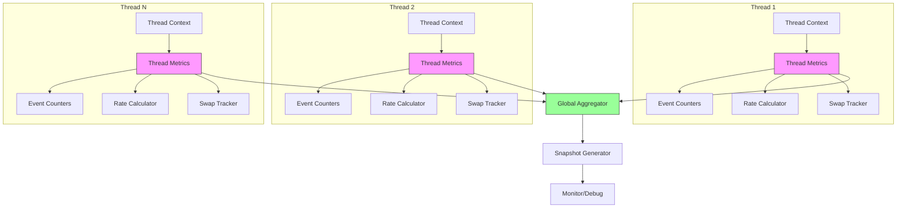
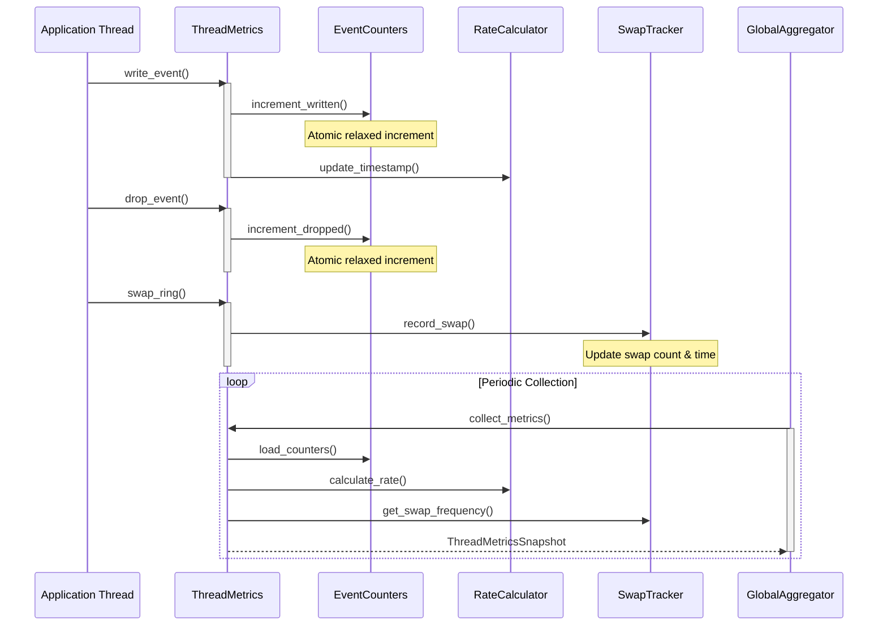
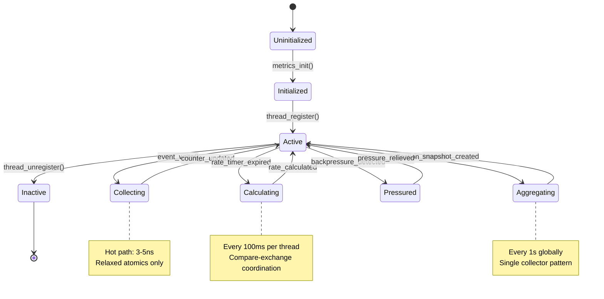

# M1_E3_I2 Technical Design: Per-Thread Metrics Collection

## 1. Overview

### Purpose
Implement comprehensive per-thread metrics collection for monitoring system health, detecting performance issues, and enabling runtime diagnostics with zero thread contention.

### Context
- Builds on M1_E1_I2 ThreadRegistry with per-thread lanes
- Extends M1_E3_I1 backpressure counters
- Provides foundation for runtime monitoring and debugging

## 2. Architecture

### 2.1 High-Level Architecture



### 2.2 Component Interaction



## 3. Data Structures

### 3.1 Per-Thread Metrics Structure

```c
typedef struct ada_thread_metrics {
    // Identity
    uint32_t thread_id;
    char thread_name[32];
    
    // Event counters (cache-line aligned)
    alignas(64) struct {
        _Atomic(uint64_t) events_written;
        _Atomic(uint64_t) events_dropped;
        _Atomic(uint64_t) events_filtered;
        _Atomic(uint64_t) bytes_written;
    } counters;
    
    // Backpressure metrics (cache-line aligned)
    alignas(64) struct {
        _Atomic(uint64_t) pool_exhaustion_count;
        _Atomic(uint64_t) ring_full_count;
        _Atomic(uint64_t) allocation_failures;
        _Atomic(uint64_t) max_queue_depth;
    } pressure;
    
    // Ring swap tracking (cache-line aligned)
    alignas(64) struct {
        _Atomic(uint64_t) swap_count;
        _Atomic(uint64_t) last_swap_timestamp;
        _Atomic(uint64_t) total_swap_duration_ns;
        _Atomic(uint32_t) rings_in_rotation;
    } swaps;
    
    // Rate calculation (cache-line aligned)
    alignas(64) struct {
        uint64_t window_start_ns;
        uint64_t window_events;
        double events_per_second;
        double bytes_per_second;
        _Atomic(uint64_t) last_update_ns;
    } rate;
    
} ada_thread_metrics_t;
```

### 3.2 Global Aggregation Structure

```c
typedef struct ada_global_metrics {
    // Global counters (read-mostly)
    alignas(64) struct {
        uint64_t total_events_written;
        uint64_t total_events_dropped;
        uint64_t total_bytes_written;
        uint64_t active_thread_count;
    } totals;
    
    // System-wide rates
    alignas(64) struct {
        double system_events_per_second;
        double system_bytes_per_second;
        uint64_t measurement_window_ns;
    } rates;
    
    // Per-thread snapshots array
    ada_thread_metrics_snapshot_t* snapshots;
    size_t snapshot_capacity;
    _Atomic(size_t) snapshot_count;
    
    // Collection control
    alignas(64) struct {
        _Atomic(uint64_t) collection_interval_ns;
        _Atomic(uint64_t) last_collection_ns;
        _Atomic(bool) collection_enabled;
    } control;
    
} ada_global_metrics_t;
```

### 3.3 Metrics Snapshot Structure

```c
typedef struct ada_thread_metrics_snapshot {
    uint32_t thread_id;
    uint64_t timestamp_ns;
    
    // Point-in-time counters
    uint64_t events_written;
    uint64_t events_dropped;
    uint64_t bytes_written;
    
    // Calculated rates
    double events_per_second;
    double bytes_per_second;
    double drop_rate_percent;
    
    // Pressure indicators
    uint64_t pool_exhaustion_count;
    uint64_t ring_full_count;
    
    // Swap statistics
    uint64_t swap_count;
    double swaps_per_second;
    uint64_t avg_swap_duration_ns;
    
} ada_thread_metrics_snapshot_t;
```

## 4. Core Operations

### 4.1 Counter Updates (Lock-Free)

```c
// Inline functions for hot path
static inline void metrics_increment_written(ada_thread_metrics_t* metrics,
                                            size_t bytes) {
    atomic_fetch_add_explicit(&metrics->counters.events_written, 1,
                              memory_order_relaxed);
    atomic_fetch_add_explicit(&metrics->counters.bytes_written, bytes,
                              memory_order_relaxed);
}

static inline void metrics_increment_dropped(ada_thread_metrics_t* metrics) {
    atomic_fetch_add_explicit(&metrics->counters.events_dropped, 1,
                              memory_order_relaxed);
}

// Rate calculation update
static void metrics_update_rate(ada_thread_metrics_t* metrics) {
    uint64_t now_ns = get_timestamp_ns();
    uint64_t last_update = atomic_load_explicit(&metrics->rate.last_update_ns,
                                                memory_order_acquire);
    
    // Update every 100ms
    if (now_ns - last_update < 100000000) return;
    
    // Try to claim the update
    if (!atomic_compare_exchange_weak_explicit(
            &metrics->rate.last_update_ns, &last_update, now_ns,
            memory_order_release, memory_order_relaxed)) {
        return; // Another thread is updating
    }
    
    // Calculate rates
    uint64_t events = atomic_load_explicit(&metrics->counters.events_written,
                                          memory_order_relaxed);
    uint64_লa bytes = atomic_load_explicit(&metrics->counters.bytes_written,
                                          memory_order_relaxed);
    
    uint64_t window_ns = now_ns - metrics->rate.window_start_ns;
    uint64_t delta_events = events - metrics->rate.window_events;
    
    if (window_ns > 0) {
        metrics->rate.events_per_second = 
            (double)delta_events * 1000000000.0 / window_ns;
        metrics->rate.bytes_per_second = 
            (double)(bytes - metrics->rate.window_events) * 1000000000.0 / window_ns;
    }
    
    metrics->rate.window_start_ns = now_ns;
    metrics->rate.window_events = events;
}
```

### 4.2 Ring Swap Tracking

```c
typedef struct ring_swap_context {
    uint64_t start_time_ns;
    ada_thread_metrics_t* metrics;
} ring_swap_context_t;

// Called before swap
ring_swap_context_t metrics_swap_begin(ada_thread_metrics_t* metrics) {
    ring_swap_context_t ctx = {
        .start_time_ns = get_timestamp_ns(),
        .metrics = metrics
    };
    return ctx;
}

// Called after swap
void metrics_swap_end(ring_swap_context_t* ctx) {
    uint64_t end_time_ns = get_timestamp_ns();
    uint64_t duration_ns = end_time_ns - ctx->start_time_ns;
    
    atomic_fetch_add_explicit(&ctx->metrics->swaps.swap_count, 1,
                              memory_order_relaxed);
    atomic_store_explicit(&ctx->metrics->swaps.last_swap_timestamp, 
                         end_time_ns, memory_order_relaxed);
    atomic_fetch_add_explicit(&ctx->metrics->swaps.total_swap_duration_ns,
                              duration_ns, memory_order_relaxed);
}
```

### 4.3 Global Aggregation

```c
// Periodic collection function
void metrics_collect_global(ada_global_metrics_t* global,
                           ada_thread_registry_t* registry) {
    uint64_t now_ns = get_timestamp_ns();
    
    // Check collection interval
    uint64_t last_collection = atomic_load_explicit(
        &global->control.last_collection_ns, memory_order_acquire);
    uint64_t interval = atomic_load_explicit(
        &global->control.collection_interval_ns, memory_order_relaxed);
    
    if (now_ns - last_collection < interval) return;
    
    // Try to claim collection
    if (!atomic_compare_exchange_weak_explicit(
            &global->control.last_collection_ns, &last_collection, now_ns,
            memory_order_release, memory_order_relaxed)) {
        return; // Another thread is collecting
    }
    
    // Reset totals
    memset(&global->totals, 0, sizeof(global->totals));
    
    // Collect from all threads
    size_t snapshot_idx = 0;
    for (size_t i = 0; i < registry->max_threads; i++) {
        ada_thread_context_t* ctx = &registry->contexts[i];
        if (!atomic_load_explicit(&ctx->active, memory_order_acquire)) {
            continue;
        }
        
        ada_thread_metrics_t* metrics = ctx->metrics;
        ada_thread_metrics_snapshot_t* snap = &global->snapshots[snapshot_idx++];
        
        // Create snapshot
        snap->thread_id = ctx->thread_id;
        snap->timestamp_ns = now_ns;
        snap->events_written = atomic_load_explicit(
            &metrics->counters.events_written, memory_order_relaxed);
        snap->events_dropped = atomic_load_explicit(
            &metrics->counters.events_dropped, memory_order_relaxed);
        snap->bytes_written = atomic_load_explicit(
            &metrics->counters.bytes_written, memory_order_relaxed);
        
        // Calculate rates
        metrics_update_rate(metrics);
        snap->events_per_second = metrics->rate.events_per_second;
        snap->bytes_per_second = metrics->rate.bytes_per_second;
        
        // Calculate drop rate
        uint64_t total_events = snap->events_written + snap->events_dropped;
        snap->drop_rate_percent = total_events > 0 ?
            (double)snap->events_dropped * 100.0 / total_events : 0.0;
        
        // Pressure indicators
        snap->pool_exhaustion_count = atomic_load_explicit(
            &metrics->pressure.pool_exhaustion_count, memory_order_relaxed);
        snap->ring_full_count = atomic_load_explicit(
            &metrics->pressure.ring_full_count, memory_order_relaxed);
        
        // Swap statistics
        snap->swap_count = atomic_load_explicit(
            &metrics->swaps.swap_count, memory_order_relaxed);
        uint64_t total_swap_ns = atomic_load_explicit(
            &metrics->swaps.total_swap_duration_ns, memory_order_relaxed);
        snap->avg_swap_duration_ns = snap->swap_count > 0 ?
            total_swap_ns / snap->swap_count : 0;
        
        // Update global totals
        global->totals.total_events_written += snap->events_written;
        global->totals.total_events_dropped += snap->events_dropped;
        global->totals.total_bytes_written += snap->bytes_written;
        global->totals.active_thread_count++;
    }
    
    atomic_store_explicit(&global->snapshot_count, snapshot_idx,
                         memory_order_release);
    
    // Calculate system-wide rates
    uint64_t window_ns = now_ns - global->rates.measurement_window_ns;
    if (window_ns > 0) {
        global->rates.system_events_per_second = 
            (double)global->totals.total_events_written * 1000000000.0 / window_ns;
        global->rates.system_bytes_per_second = 
            (double)global->totals.total_bytes_written * 1000000000.0 / window_ns;
    }
    global->rates.measurement_window_ns = now_ns;
}
```

## 5. Memory Ordering Guarantees

### 5.1 Counter Operations
- **Relaxed ordering** for increment operations (no synchronization needed)
- Single-writer principle maintained per thread
- No false sharing through cache-line alignment

### 5.2 Rate Calculations
- **Acquire-Release** for update coordination
- Compare-exchange ensures single updater
- Relaxed loads for counter sampling

### 5.3 Global Collection
- **Acquire-Release** for collection coordination
- **Release** on snapshot count update
- Readers use acquire to see complete snapshots

## 6. Performance Characteristics

### 6.1 Per-Event Overhead
```
Operation                   | Time (ns) | Memory Order
---------------------------|-----------|-------------
Increment counter          | 1-2       | Relaxed
Update bytes counter       | 1-2       | Relaxed
Check rate update needed   | 1         | Acquire
Total per event           | 3-5       | Mixed
```

### 6.2 Periodic Operations
```
Operation                   | Time (μs) | Frequency
---------------------------|-----------|------------
Rate calculation           | 0.5       | 100ms
Thread snapshot            | 1.0       | 1s
Global aggregation (64T)   | 100       | 1s
```

### 6.3 Memory Layout
```
Structure              | Size    | Alignment | Cache Lines
----------------------|---------|-----------|-------------
Thread Metrics        | 512B    | 64B       | 8
Global Metrics        | 256B    | 64B       | 4
Snapshot (per thread) | 128B    | 8B        | 2
Total (64 threads)    | 40KB    | -         | 640
```

## 7. State Machine



## 8. Integration Points

### 8.1 ThreadRegistry Integration
```c
typedef struct ada_thread_context {
    // Existing fields
    uint32_t thread_id;
    ada_ring_buffer_t* index_ring;
    ada_ring_buffer_t* detail_ring;
    
    // NEW: Metrics integration
    ada_thread_metrics_t* metrics;  // Per-thread metrics
    
} ada_thread_context_t;
```

### 8.2 Event Write Path
```c
int ada_write_event(ada_thread_context_t* ctx, 
                   const void* data, size_t size) {
    // Try to write
    int result = ring_buffer_write(ctx->index_ring, data, size);
    
    // Update metrics
    if (result == 0) {
        metrics_increment_written(ctx->metrics, size);
    } else {
        metrics_increment_dropped(ctx->metrics);
        if (result == -ENOMEM) {
            atomic_fetch_add_explicit(
                &ctx->metrics->pressure.pool_exhaustion_count, 1,
                memory_order_relaxed);
        }
    }
    
    return result;
}
```

### 8.3 Ring Swap Integration
```c
void ada_swap_ring(ada_thread_context_t* ctx) {
    ring_swap_context_t swap_ctx = metrics_swap_begin(ctx->metrics);
    
    // Perform actual swap
    ring_buffer_swap(ctx->index_ring);
    
    metrics_swap_end(&swap_ctx);
}
```

## 9. Error Handling

### 9.1 Initialization Failures
- Metrics allocation failure → Disable metrics, continue operation
- Thread metrics init failure → Log warning, operate without metrics

### 9.2 Runtime Failures
- Collection timeout → Skip collection cycle
- Snapshot buffer full → Rotate oldest snapshots

### 9.3 Overflow Handling
- Counter overflow → Use saturating arithmetic
- Rate calculation overflow → Cap at maximum representable value

## 10. Testing Strategy

### 10.1 Unit Tests
- Counter increment atomicity
- Rate calculation accuracy
- Snapshot consistency
- Memory ordering verification

### 10.2 Integration Tests
- Multi-thread metric collection
- Global aggregation correctness
- Backpressure metric tracking

### 10.3 Performance Tests
- Per-event overhead measurement
- Collection impact assessment
- Memory usage validation

## 11. Success Criteria

1. **Performance**: < 5ns overhead per event
2. **Accuracy**: 100% accurate counter tracking
3. **Isolation**: Zero contention between threads
4. **Scalability**: Linear scaling to 64 threads
5. **Memory**: < 1KB per thread overhead
6. **Latency**: < 100μs collection latency