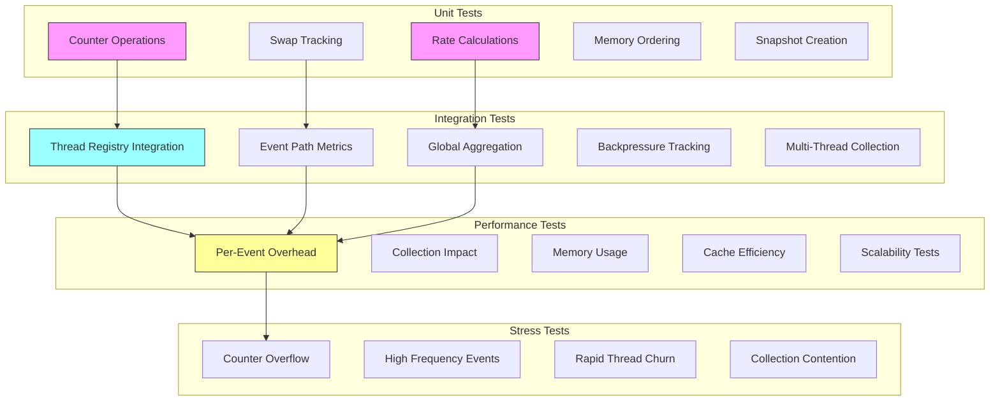

# M1_E3_I2 Test Plan: Per-Thread Metrics Collection

## 1. Test Coverage Map



## 2. Test Matrix

| Test Category | Test Case | Priority | Coverage Target | Success Criteria |
|--------------|-----------|----------|-----------------|-------------------|
| **Unit Tests** |
| Counter Ops | `metrics_counter__increment__then_increases` | P0 | 100% | Atomic increment works |
| Counter Ops | `metrics_counter__concurrent_updates__then_accurate_total` | P0 | 100% | No lost updates |
| Rate Calc | `metrics_rate__calculate__then_correct_eps` | P0 | 100% | ±1% accuracy |
| Rate Calc | `metrics_rate__window_update__then_resets_baseline` | P1 | 100% | Window sliding works |
| Swap Track | `metrics_swap__record__then_updates_count` | P0 | 100% | Swap count accurate |
| Swap Track | `metrics_swap__duration__then_measures_correctly` | P1 | 100% | ±100ns accuracy |
| Memory Order | `metrics_atomics__relaxed__then_no_tearing` | P0 | 100% | No torn reads |
| Memory Order | `metrics_atomics__acquire_release__then_synchronized` | P0 | 100% | Proper visibility |
| Snapshot | `metrics_snapshot__create__then_consistent_view` | P0 | 100% | Atomic snapshot |
| **Integration Tests** |
| Registry | `thread_registry__with_metrics__then_initialized` | P0 | 100% | Metrics allocated |
| Event Path | `write_event__success__then_metrics_updated` | P0 | 100% | Counter incremented |
| Event Path | `write_event__dropped__then_drop_count_increases` | P0 | 100% | Drop tracked |
| Aggregation | `global_metrics__collect__then_sums_all_threads` | P0 | 100% | Totals correct |
| Aggregation | `global_metrics__snapshot__then_point_in_time` | P1 | 100% | Consistent view |
| Backpressure | `pool_exhausted__event__then_pressure_counted` | P0 | 100% | Pressure tracked |
| Multi-Thread | `threads_64__concurrent_writes__then_isolated_metrics` | P0 | 100% | No interference |
| **Performance Tests** |
| Overhead | `event_write__with_metrics__then_under_5ns` | P0 | 100% | <5ns overhead |
| Collection | `aggregation__64_threads__then_under_100us` | P0 | 100% | <100μs latency |
| Memory | `metrics_per_thread__allocated__then_under_1kb` | P1 | 100% | <1KB per thread |
| Cache | `metrics_structure__accessed__then_no_false_sharing` | P1 | 100% | Cache-aligned |
| Scalability | `threads_increasing__throughput__then_linear` | P1 | 100% | Linear scaling |
| **Stress Tests** |
| Overflow | `counter__max_value__then_saturates` | P1 | 100% | No wraparound |
| High Freq | `events_1m_per_sec__sustained__then_accurate` | P0 | 100% | No data loss |
| Thread Churn | `threads__rapid_create_destroy__then_stable` | P1 | 100% | No leaks |
| Contention | `collectors_multiple__concurrent__then_one_wins` | P1 | 100% | Single collector |

## 3. Detailed Test Cases

### 3.1 Unit Test: Counter Atomicity

```c
TEST(MetricsCounter, metrics_counter__concurrent_updates__then_accurate_total) {
    // Arrange
    ada_thread_metrics_t metrics = {0};
    const int num_threads = 8;
    const int increments_per_thread = 100000;
    pthread_t threads[num_threads];
    
    typedef struct {
        ada_thread_metrics_t* metrics;
        int count;
    } thread_args_t;
    
    thread_args_t args = {
        .metrics = &metrics,
        .count = increments_per_thread
    };
    
    // Thread function
    void* increment_worker(void* arg) {
        thread_args_t* targs = (thread_args_t*)arg;
        for (int i = 0; i < targs->count; i++) {
            metrics_increment_written(targs->metrics, 100);
        }
        return NULL;
    }
    
    // Act
    for (int i = 0; i < num_threads; i++) {
        pthread_create(&threads[i], NULL, increment_worker, &args);
    }
    
    for (int i = 0; i < num_threads; i++) {
        pthread_join(threads[i], NULL);
    }
    
    // Assert
    uint64_t total_events = atomic_load_explicit(
        &metrics.counters.events_written, memory_order_relaxed);
    uint64_t total_bytes = atomic_load_explicit(
        &metrics.counters.bytes_written, memory_order_relaxed);
    
    EXPECT_EQ(total_events, num_threads * increments_per_thread);
    EXPECT_EQ(total_bytes, num_threads * increments_per_thread * 100);
}
```

### 3.2 Unit Test: Rate Calculation

```c
TEST(MetricsRate, metrics_rate__calculate__then_correct_eps) {
    // Arrange
    ada_thread_metrics_t metrics = {0};
    metrics.rate.window_start_ns = 1000000000; // 1 second ago
    metrics.rate.window_events = 1000;
    
    // Simulate 2000 more events in current window
    atomic_store_explicit(&metrics.counters.events_written, 3000,
                         memory_order_relaxed);
    atomic_store_explicit(&metrics.rate.last_update_ns, 0,
                         memory_order_relaxed);
    
    // Mock time function
    uint64_t mock_time = 2000000000; // 2 seconds (1 second window)
    set_mock_timestamp(mock_time);
    
    // Act
    metrics_update_rate(&metrics);
    
    // Assert
    EXPECT_NEAR(metrics.rate.events_per_second, 2000.0, 20.0); // ±1%
    EXPECT_EQ(metrics.rate.window_start_ns, mock_time);
    EXPECT_EQ(metrics.rate.window_events, 3000);
}
```

### 3.3 Integration Test: Event Path Metrics

```c
TEST(EventMetrics, write_event__success__then_metrics_updated) {
    // Arrange
    ada_thread_registry_t* registry = thread_registry_create(4);
    ada_thread_context_t* ctx = thread_registry_register(registry);
    ASSERT_NE(ctx, nullptr);
    ASSERT_NE(ctx->metrics, nullptr);
    
    uint64_t initial_written = atomic_load_explicit(
        &ctx->metrics->counters.events_written, memory_order_relaxed);
    uint64_t initial_bytes = atomic_load_explicit(
        &ctx->metrics->counters.bytes_written, memory_order_relaxed);
    
    const char* test_data = "test event data";
    size_t data_size = strlen(test_data) + 1;
    
    // Act
    int result = ada_write_event(ctx, test_data, data_size);
    
    // Assert
    EXPECT_EQ(result, 0);
    
    uint64_t final_written = atomic_load_explicit(
        &ctx->metrics->counters.events_written, memory_order_relaxed);
    uint64_t final_bytes = atomic_load_explicit(
        &ctx->metrics->counters.bytes_written, memory_order_relaxed);
    
    EXPECT_EQ(final_written, initial_written + 1);
    EXPECT_EQ(final_bytes, initial_bytes + data_size);
    
    // Cleanup
    thread_registry_unregister(registry, ctx);
    thread_registry_destroy(registry);
}
```

### 3.4 Integration Test: Global Aggregation

```c
TEST(GlobalMetrics, global_metrics__collect__then_sums_all_threads) {
    // Arrange
    ada_thread_registry_t* registry = thread_registry_create(4);
    ada_global_metrics_t* global = global_metrics_create(4);
    
    // Create multiple threads with different metrics
    ada_thread_context_t* ctx1 = thread_registry_register(registry);
    ada_thread_context_t* ctx2 = thread_registry_register(registry);
    
    // Simulate events on thread 1
    atomic_store_explicit(&ctx1->metrics->counters.events_written, 1000,
                         memory_order_relaxed);
    atomic_store_explicit(&ctx1->metrics->counters.bytes_written, 50000,
                         memory_order_relaxed);
    atomic_store_explicit(&ctx1->metrics->counters.events_dropped, 10,
                         memory_order_relaxed);
    
    // Simulate events on thread 2
    atomic_store_explicit(&ctx2->metrics->counters.events_written, 2000,
                         memory_order_relaxed);
    atomic_store_explicit(&ctx2->metrics->counters.bytes_written, 100000,
                         memory_order_relaxed);
    atomic_store_explicit(&ctx2->metrics->counters.events_dropped, 20,
                         memory_order_relaxed);
    
    // Act
    metrics_collect_global(global, registry);
    
    // Assert
    EXPECT_EQ(global->totals.total_events_written, 3000);
    EXPECT_EQ(global->totals.total_bytes_written, 150000);
    EXPECT_EQ(global->totals.total_events_dropped, 30);
    EXPECT_EQ(global->totals.active_thread_count, 2);
    
    size_t snapshot_count = atomic_load_explicit(
        &global->snapshot_count, memory_order_acquire);
    EXPECT_EQ(snapshot_count, 2);
    
    // Verify individual snapshots
    ada_thread_metrics_snapshot_t* snap1 = &global->snapshots[0];
    EXPECT_EQ(snap1->events_written, 1000);
    EXPECT_NEAR(snap1->drop_rate_percent, 0.99, 0.01);
    
    // Cleanup
    thread_registry_unregister(registry, ctx1);
    thread_registry_unregister(registry, ctx2);
    thread_registry_destroy(registry);
    global_metrics_destroy(global);
}
```

### 3.5 Performance Test: Per-Event Overhead

```c
TEST(MetricsPerformance, event_write__with_metrics__then_under_5ns) {
    // Arrange
    ada_thread_registry_t* registry = thread_registry_create(1);
    ada_thread_context_t* ctx = thread_registry_register(registry);
    
    const int num_events = 1000000;
    const char* data = "test";
    size_t data_size = 5;
    
    // Warmup
    for (int i = 0; i < 1000; i++) {
        ada_write_event(ctx, data, data_size);
    }
    
    // Measure baseline (without metrics)
    disable_metrics(ctx);
    uint64_t start_no_metrics = get_timestamp_ns();
    for (int i = 0; i < num_events; i++) {
        ada_write_event(ctx, data, data_size);
    }
    uint64_t duration_no_metrics = get_timestamp_ns() - start_no_metrics;
    
    // Measure with metrics
    enable_metrics(ctx);
    uint64_t start_with_metrics = get_timestamp_ns();
    for (int i = 0; i < num_events; i++) {
        ada_write_event(ctx, data, data_size);
    }
    uint64_t duration_with_metrics = get_timestamp_ns() - start_with_metrics;
    
    // Assert
    double overhead_ns = (double)(duration_with_metrics - duration_no_metrics) 
                        / num_events;
    EXPECT_LT(overhead_ns, 5.0);
    
    printf("Metrics overhead: %.2f ns per event\n", overhead_ns);
    
    // Cleanup
    thread_registry_unregister(registry, ctx);
    thread_registry_destroy(registry);
}
```

### 3.6 Performance Test: Collection Latency

```c
TEST(MetricsPerformance, aggregation__64_threads__then_under_100us) {
    // Arrange
    ada_thread_registry_t* registry = thread_registry_create(64);
    ada_global_metrics_t* global = global_metrics_create(64);
    ada_thread_context_t* contexts[64];
    
    // Register all threads
    for (int i = 0; i < 64; i++) {
        contexts[i] = thread_registry_register(registry);
        // Simulate some metrics
        atomic_store_explicit(
            &contexts[i]->metrics->counters.events_written, 
            i * 1000, memory_order_relaxed);
    }
    
    // Act - Measure collection time
    const int iterations = 1000;
    uint64_t total_duration = 0;
    
    for (int i = 0; i < iterations; i++) {
        uint64_t start = get_timestamp_ns();
        metrics_collect_global(global, registry);
        uint64_t duration = get_timestamp_ns() - start;
        total_duration += duration;
    }
    
    // Assert
    double avg_duration_us = (double)total_duration / iterations / 1000.0;
    EXPECT_LT(avg_duration_us, 100.0);
    
    printf("Average collection time for 64 threads: %.2f μs\n", 
           avg_duration_us);
    
    // Cleanup
    for (int i = 0; i < 64; i++) {
        thread_registry_unregister(registry, contexts[i]);
    }
    thread_registry_destroy(registry);
    global_metrics_destroy(global);
}
```

### 3.7 Stress Test: High Frequency Events

```c
TEST(MetricsStress, events_1m_per_sec__sustained__then_accurate) {
    // Arrange
    ada_thread_registry_t* registry = thread_registry_create(1);
    ada_thread_context_t* ctx = thread_registry_register(registry);
    
    const int duration_seconds = 5;
    const int events_per_second = 1000000;
    const char* data = "x";
    
    // Act - Generate events at target rate
    uint64_t start_time = get_timestamp_ns();
    uint64_t events_written = 0;
    
    while (true) {
        uint64_t elapsed_ns = get_timestamp_ns() - start_time;
        if (elapsed_ns >= duration_seconds * 1000000000ULL) break;
        
        // Calculate expected events by this time
        uint64_t expected_events = (elapsed_ns * events_per_second) 
                                  / 1000000000ULL;
        
        // Write events to catch up
        while (events_written < expected_events) {
            ada_write_event(ctx, data, 1);
            events_written++;
        }
    }
    
    // Assert
    uint64_t actual_events = atomic_load_explicit(
        &ctx->metrics->counters.events_written, memory_order_relaxed);
    uint64_t expected_total = duration_seconds * events_per_second;
    
    // Allow 1% variance
    EXPECT_NEAR(actual_events, expected_total, expected_total * 0.01);
    
    // Verify no drops
    uint64_t dropped = atomic_load_explicit(
        &ctx->metrics->counters.events_dropped, memory_order_relaxed);
    EXPECT_EQ(dropped, 0);
    
    // Cleanup
    thread_registry_unregister(registry, ctx);
    thread_registry_destroy(registry);
}
```

## 4. Behavioral Test Specifications

### 4.1 Counter Behavior
```gherkin
Feature: Metrics Counter Updates
  Scenario: Successful event write updates counter
    Given a thread with initialized metrics
    When an event is written successfully
    Then events_written counter increments by 1
    And bytes_written counter increments by event size
    And events_dropped counter remains unchanged

  Scenario: Dropped event updates drop counter
    Given a thread with full ring buffer
    When an event write is attempted
    Then events_dropped counter increments by 1
    And events_written counter remains unchanged
    And ring_full_count increments by 1
```

### 4.2 Rate Calculation Behavior
```gherkin
Feature: Event Rate Calculation
  Scenario: Rate calculated over time window
    Given a thread with 1000 events in last second
    When rate calculation is triggered
    Then events_per_second equals 1000 ± 1%
    And window resets to current time
    And baseline updates to current count

  Scenario: Rate calculation with no events
    Given a thread with no events written
    When rate calculation is triggered
    Then events_per_second equals 0
    And bytes_per_second equals 0
```

### 4.3 Global Aggregation Behavior
```gherkin
Feature: Global Metrics Collection
  Scenario: Aggregate metrics from all threads
    Given 4 active threads with different metrics
    When global collection is triggered
    Then total_events_written equals sum of all threads
    And total_bytes_written equals sum of all threads
    And active_thread_count equals 4
    And snapshots array contains 4 entries

  Scenario: Collection interval enforcement
    Given collection interval of 1 second
    When collection attempted twice within 100ms
    Then first collection succeeds
    And second collection is skipped
    And last_collection_ns updates only once
```

## 5. Performance Benchmarks

### 5.1 Latency Benchmarks
```yaml
benchmark_suite: metrics_latency
  - name: counter_increment
    operation: metrics_increment_written
    target_p50: 2ns
    target_p99: 5ns
    
  - name: rate_check
    operation: check_rate_update_needed
    target_p50: 1ns
    target_p99: 2ns
    
  - name: full_event_path
    operation: ada_write_event_with_metrics
    target_p50: 10ns
    target_p99: 20ns
    
  - name: snapshot_creation
    operation: create_thread_snapshot
    target_p50: 500ns
    target_p99: 1000ns
```

### 5.2 Throughput Benchmarks
```yaml
benchmark_suite: metrics_throughput
  - name: single_thread_events
    threads: 1
    operation: continuous_writes
    target: 10M events/sec
    
  - name: multi_thread_events
    threads: 64
    operation: concurrent_writes
    target: 100M events/sec total
    
  - name: collection_rate
    threads: 64
    operation: periodic_collection
    target: 1000 collections/sec
```

### 5.3 Memory Benchmarks
```yaml
benchmark_suite: metrics_memory
  - name: per_thread_overhead
    measurement: sizeof(ada_thread_metrics_t)
    target: < 1KB
    
  - name: global_overhead
    measurement: sizeof(ada_global_metrics_t)
    target: < 256B
    
  - name: snapshot_array_64
    measurement: 64 * sizeof(ada_thread_metrics_snapshot_t)
    target: < 8KB
    
  - name: total_system_64
    measurement: total_metrics_memory
    target: < 100KB
```

## 6. Test Execution Plan

### Phase 1: Unit Tests (Day 1)
1. Counter operations (2 hours)
2. Rate calculations (2 hours)
3. Swap tracking (1 hour)
4. Memory ordering (2 hours)
5. Snapshot creation (1 hour)

### Phase 2: Integration Tests (Day 2)
1. Thread registry integration (2 hours)
2. Event path metrics (2 hours)
3. Global aggregation (2 hours)
4. Multi-thread scenarios (2 hours)

### Phase 3: Performance Tests (Day 3)
1. Overhead measurement (2 hours)
2. Latency benchmarks (2 hours)
3. Throughput tests (2 hours)
4. Memory validation (2 hours)

### Phase 4: Stress Tests (Day 4)
1. High frequency events (2 hours)
2. Thread churn scenarios (2 hours)
3. Counter overflow (1 hour)
4. Long duration tests (3 hours)

## 7. Acceptance Criteria

### 7.1 Functional Requirements
- [ ] All counters update atomically
- [ ] Rate calculation accurate to ±1%
- [ ] Global aggregation sums correctly
- [ ] Snapshots provide consistent view
- [ ] Zero thread contention

### 7.2 Performance Requirements
- [ ] < 5ns overhead per event
- [ ] < 100μs collection latency
- [ ] < 1KB per thread memory
- [ ] Linear scaling to 64 threads

### 7.3 Quality Requirements
- [ ] 100% code coverage
- [ ] All tests passing
- [ ] No memory leaks
- [ ] No data races (TSan clean)

## 8. Risk Mitigation

### 8.1 Counter Overflow
- **Risk**: 64-bit counter overflow after 10^19 events
- **Mitigation**: Use saturating arithmetic, alert on approach

### 8.2 Collection Contention
- **Risk**: Multiple threads attempt collection
- **Mitigation**: Compare-exchange ensures single collector

### 8.3 Memory Ordering Issues
- **Risk**: Torn reads or stale data
- **Mitigation**: Proper atomic operations with explicit ordering

### 8.4 Performance Regression
- **Risk**: Metrics add too much overhead
- **Mitigation**: Continuous benchmarking, inline hot paths