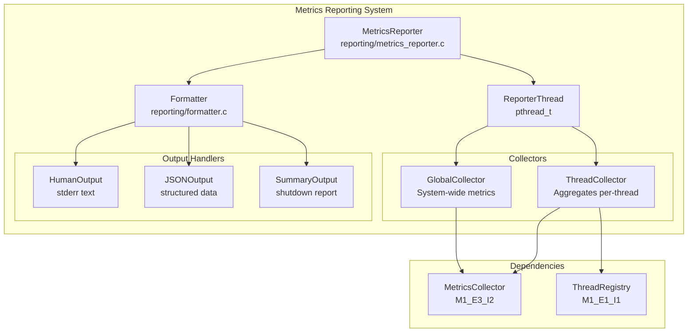
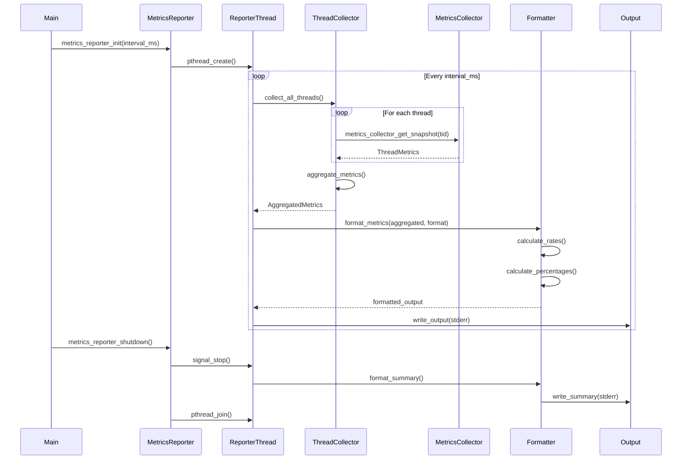
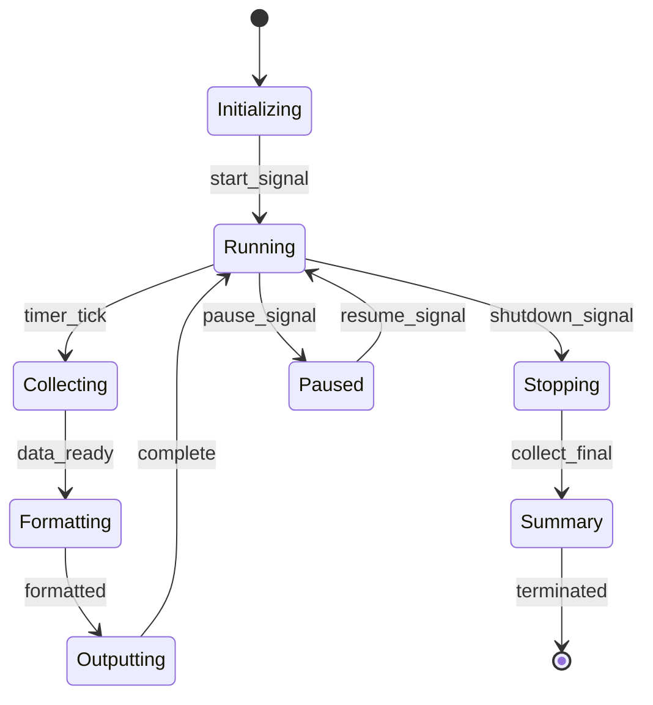

# M1_E3_I3 Technical Design: Metrics Reporting

## Overview
Implement periodic metrics reporting for visibility and monitoring of the ADA tracing system. This iteration builds on the metrics collection foundation from M1_E3_I2 to provide real-time observability through configurable reporting intervals, human-readable output formats, and JSON export capabilities.

## Architecture

### Component Diagram


### Sequence Diagram: Periodic Reporting


### State Machine: Reporter Thread


## Data Structures

### Core Types
```c
// Aggregated metrics from all threads
typedef struct {
    // Counters
    _Atomic(uint64_t) total_traces;
    _Atomic(uint64_t) total_drops;
    _Atomic(uint64_t) total_bytes;
    
    // Per-thread breakdown
    struct {
        uint64_t thread_id;
        uint64_t trace_count;
        uint64_t drop_count;
        uint64_t bytes_written;
    } threads[MAX_THREADS];
    uint32_t active_thread_count;
    
    // Timing
    uint64_t collection_timestamp_ns;
    uint64_t interval_duration_ns;
} AggregatedMetrics;

// Reporter configuration
typedef struct {
    uint32_t interval_ms;           // Reporting interval (default: 5000)
    enum {
        FORMAT_HUMAN,               // Human-readable text
        FORMAT_JSON,                // JSON output
        FORMAT_BOTH                 // Both formats
    } output_format;
    
    bool enable_rates;              // Show rates/sec
    bool enable_percentages;        // Show drop percentages
    bool summary_on_shutdown;       // Final summary report
    
    FILE* output_stream;            // Output destination (default: stderr)
    char json_file_path[256];       // Optional JSON file output
} ReporterConfig;

// Reporter state
typedef struct MetricsReporter {
    ReporterConfig config;
    
    // Thread management
    pthread_t reporter_thread;
    _Atomic(bool) running;
    pthread_mutex_t mutex;
    pthread_cond_t condition;
    
    // Metrics history for rate calculation
    AggregatedMetrics* history_ring;
    uint32_t history_size;
    uint32_t history_head;
    
    // Output formatting
    char* format_buffer;
    size_t buffer_size;
    
    // JSON output
    int json_fd;
    _Atomic(uint64_t) report_sequence;
} MetricsReporter;
```

### Format Structures
```c
// Human-readable format options
typedef struct {
    bool use_colors;                // ANSI color codes
    bool compact_mode;               // Single-line output
    uint32_t column_width;           // Fixed column widths
    char separator[8];               // Column separator
} HumanFormatOptions;

// JSON schema for metrics output
typedef struct {
    uint64_t timestamp;              // Unix timestamp in ns
    uint64_t sequence;               // Report sequence number
    struct {
        uint64_t total_traces;
        uint64_t total_drops;
        uint64_t total_bytes;
        double drop_rate_percent;
        double traces_per_second;
        double bytes_per_second;
    } global;
    
    struct {
        uint64_t thread_id;
        char thread_name[64];
        uint64_t traces;
        uint64_t drops;
        uint64_t bytes;
        double activity_percent;
    } threads[];
} JSONMetricsReport;
```

## Implementation Details

### Reporter Thread Loop
```c
static void* reporter_thread_main(void* arg) {
    MetricsReporter* reporter = (MetricsReporter*)arg;
    AggregatedMetrics current = {0};
    AggregatedMetrics previous = {0};
    
    struct timespec next_report;
    clock_gettime(CLOCK_MONOTONIC, &next_report);
    
    while (atomic_load_explicit(&reporter->running, memory_order_acquire)) {
        // Wait for next interval
        add_milliseconds(&next_report, reporter->config.interval_ms);
        
        pthread_mutex_lock(&reporter->mutex);
        int wait_result = pthread_cond_timedwait(
            &reporter->condition, 
            &reporter->mutex, 
            &next_report
        );
        pthread_mutex_unlock(&reporter->mutex);
        
        if (wait_result == ETIMEDOUT) {
            // Collect metrics from all threads
            collect_all_thread_metrics(&current);
            
            // Calculate rates if enabled
            if (reporter->config.enable_rates) {
                calculate_rates(&current, &previous);
            }
            
            // Format and output
            format_and_output(reporter, &current);
            
            // Store for next rate calculation
            previous = current;
            
            // Update history ring
            update_history_ring(reporter, &current);
        }
    }
    
    // Generate shutdown summary
    if (reporter->config.summary_on_shutdown) {
        generate_summary_report(reporter);
    }
    
    return NULL;
}
```

### Metrics Collection
```c
static void collect_all_thread_metrics(AggregatedMetrics* output) {
    memset(output, 0, sizeof(AggregatedMetrics));
    
    output->collection_timestamp_ns = get_monotonic_time_ns();
    
    ThreadRegistry* registry = thread_registry_get_instance();
    uint32_t thread_count = 0;
    
    // Iterate all registered threads
    for (size_t i = 0; i < MAX_THREADS; i++) {
        ThreadContext* ctx = thread_registry_get_context(registry, i);
        if (ctx && atomic_load_explicit(&ctx->active, memory_order_acquire)) {
            // Get thread's metrics snapshot
            ThreadMetrics snapshot;
            metrics_collector_get_snapshot(ctx->metrics, &snapshot);
            
            // Aggregate into output
            output->threads[thread_count].thread_id = ctx->thread_id;
            output->threads[thread_count].trace_count = snapshot.trace_count;
            output->threads[thread_count].drop_count = snapshot.drop_count;
            output->threads[thread_count].bytes_written = snapshot.bytes_written;
            
            // Update totals (using relaxed ordering for aggregation)
            atomic_fetch_add_explicit(&output->total_traces, 
                snapshot.trace_count, memory_order_relaxed);
            atomic_fetch_add_explicit(&output->total_drops, 
                snapshot.drop_count, memory_order_relaxed);
            atomic_fetch_add_explicit(&output->total_bytes, 
                snapshot.bytes_written, memory_order_relaxed);
            
            thread_count++;
        }
    }
    
    output->active_thread_count = thread_count;
}
```

### Human-Readable Formatting
```c
static void format_human_output(
    const AggregatedMetrics* metrics,
    const AggregatedMetrics* previous,
    char* buffer,
    size_t buffer_size
) {
    char* ptr = buffer;
    size_t remaining = buffer_size;
    
    // Header with timestamp
    struct timespec ts;
    clock_gettime(CLOCK_REALTIME, &ts);
    ptr += snprintf(ptr, remaining, 
        "\n=== ADA Metrics Report [%ld.%03ld] ===\n",
        ts.tv_sec, ts.tv_nsec / 1000000);
    
    // Global summary
    uint64_t total_traces = atomic_load_explicit(
        &metrics->total_traces, memory_order_relaxed);
    uint64_t total_drops = atomic_load_explicit(
        &metrics->total_drops, memory_order_relaxed);
    uint64_t total_bytes = atomic_load_explicit(
        &metrics->total_bytes, memory_order_relaxed);
    
    double drop_rate = (total_traces > 0) ? 
        (100.0 * total_drops / (total_traces + total_drops)) : 0.0;
    
    ptr += snprintf(ptr, remaining - (ptr - buffer),
        "Global: %lu traces | %lu drops (%.2f%%) | %.2f MB\n",
        total_traces, total_drops, drop_rate, 
        total_bytes / (1024.0 * 1024.0));
    
    // Calculate rates if we have previous data
    if (previous && previous->collection_timestamp_ns > 0) {
        uint64_t interval_ns = metrics->collection_timestamp_ns - 
                              previous->collection_timestamp_ns;
        double interval_sec = interval_ns / 1e9;
        
        uint64_t trace_delta = total_traces - 
            atomic_load_explicit(&previous->total_traces, memory_order_relaxed);
        uint64_t byte_delta = total_bytes - 
            atomic_load_explicit(&previous->total_bytes, memory_order_relaxed);
        
        double traces_per_sec = trace_delta / interval_sec;
        double mbytes_per_sec = (byte_delta / (1024.0 * 1024.0)) / interval_sec;
        
        ptr += snprintf(ptr, remaining - (ptr - buffer),
            "Rates: %.1f traces/sec | %.2f MB/sec\n",
            traces_per_sec, mbytes_per_sec);
    }
    
    // Per-thread breakdown
    if (metrics->active_thread_count > 0) {
        ptr += snprintf(ptr, remaining - (ptr - buffer),
            "\nPer-Thread Breakdown:\n");
        ptr += snprintf(ptr, remaining - (ptr - buffer),
            "%-10s %-12s %-12s %-12s %-10s\n",
            "Thread", "Traces", "Drops", "Drop%", "MB");
        
        for (uint32_t i = 0; i < metrics->active_thread_count; i++) {
            const struct thread_metrics* tm = &metrics->threads[i];
            double thread_drop_rate = (tm->trace_count > 0) ?
                (100.0 * tm->drop_count / (tm->trace_count + tm->drop_count)) : 0.0;
            
            ptr += snprintf(ptr, remaining - (ptr - buffer),
                "%-10lu %-12lu %-12lu %-12.2f %-10.2f\n",
                tm->thread_id, tm->trace_count, tm->drop_count,
                thread_drop_rate, tm->bytes_written / (1024.0 * 1024.0));
        }
    }
    
    ptr += snprintf(ptr, remaining - (ptr - buffer), "\n");
}
```

### JSON Formatting
```c
static void format_json_output(
    const AggregatedMetrics* metrics,
    const AggregatedMetrics* previous,
    char* buffer,
    size_t buffer_size,
    uint64_t sequence
) {
    // Start JSON object
    char* ptr = buffer;
    size_t remaining = buffer_size;
    
    ptr += snprintf(ptr, remaining, "{\n");
    ptr += snprintf(ptr, remaining - (ptr - buffer),
        "  \"timestamp\": %lu,\n", metrics->collection_timestamp_ns);
    ptr += snprintf(ptr, remaining - (ptr - buffer),
        "  \"sequence\": %lu,\n", sequence);
    
    // Global metrics
    uint64_t total_traces = atomic_load_explicit(
        &metrics->total_traces, memory_order_relaxed);
    uint64_t total_drops = atomic_load_explicit(
        &metrics->total_drops, memory_order_relaxed);
    uint64_t total_bytes = atomic_load_explicit(
        &metrics->total_bytes, memory_order_relaxed);
    
    ptr += snprintf(ptr, remaining - (ptr - buffer),
        "  \"global\": {\n"
        "    \"total_traces\": %lu,\n"
        "    \"total_drops\": %lu,\n"
        "    \"total_bytes\": %lu,\n"
        "    \"drop_rate_percent\": %.2f",
        total_traces, total_drops, total_bytes,
        (total_traces > 0) ? (100.0 * total_drops / (total_traces + total_drops)) : 0.0);
    
    // Add rates if available
    if (previous && previous->collection_timestamp_ns > 0) {
        uint64_t interval_ns = metrics->collection_timestamp_ns - 
                              previous->collection_timestamp_ns;
        double interval_sec = interval_ns / 1e9;
        
        uint64_t trace_delta = total_traces - 
            atomic_load_explicit(&previous->total_traces, memory_order_relaxed);
        uint64_t byte_delta = total_bytes - 
            atomic_load_explicit(&previous->total_bytes, memory_order_relaxed);
        
        ptr += snprintf(ptr, remaining - (ptr - buffer),
            ",\n"
            "    \"traces_per_second\": %.2f,\n"
            "    \"bytes_per_second\": %.2f",
            trace_delta / interval_sec,
            byte_delta / interval_sec);
    }
    
    ptr += snprintf(ptr, remaining - (ptr - buffer), "\n  },\n");
    
    // Thread array
    ptr += snprintf(ptr, remaining - (ptr - buffer), "  \"threads\": [\n");
    
    for (uint32_t i = 0; i < metrics->active_thread_count; i++) {
        const struct thread_metrics* tm = &metrics->threads[i];
        
        ptr += snprintf(ptr, remaining - (ptr - buffer),
            "    {\n"
            "      \"thread_id\": %lu,\n"
            "      \"traces\": %lu,\n"
            "      \"drops\": %lu,\n"
            "      \"bytes\": %lu,\n"
            "      \"drop_rate_percent\": %.2f\n"
            "    }%s\n",
            tm->thread_id, tm->trace_count, tm->drop_count, tm->bytes_written,
            (tm->trace_count > 0) ? 
                (100.0 * tm->drop_count / (tm->trace_count + tm->drop_count)) : 0.0,
            (i < metrics->active_thread_count - 1) ? "," : "");
    }
    
    ptr += snprintf(ptr, remaining - (ptr - buffer), "  ]\n}\n");
}
```

## Memory Ordering Specifications

### Atomic Operations
```c
// Reporter state transitions
atomic_store_explicit(&reporter->running, true, memory_order_release);
bool is_running = atomic_load_explicit(&reporter->running, memory_order_acquire);

// Metrics aggregation (relaxed for accumulation)
atomic_fetch_add_explicit(&total_traces, count, memory_order_relaxed);

// Report sequence numbering
uint64_t seq = atomic_fetch_add_explicit(&reporter->report_sequence, 1, 
                                         memory_order_acq_rel);
```

## Integration Points

### With MetricsCollector (M1_E3_I2)
- Read-only access to per-thread metrics
- Snapshot isolation for consistency
- No contention with trace path

### With ThreadRegistry (M1_E1_I1)
- Enumerate active threads
- Access thread metadata
- Thread lifecycle notifications

### With Configuration System
- Runtime interval adjustment
- Format selection
- Output redirection

## Performance Considerations

1. **Zero Impact on Trace Path**
   - Separate reporter thread
   - Read-only metric access
   - No locks in hot path

2. **Efficient Aggregation**
   - Batch collection per interval
   - Minimal atomic operations
   - Cache-friendly iteration

3. **Output Optimization**
   - Pre-allocated format buffers
   - Buffered I/O operations
   - Conditional formatting

## Error Handling

1. **Thread Creation Failure**
   - Fallback to synchronous reporting
   - Log error to stderr
   - Continue tracing without metrics

2. **Output Failures**
   - Buffer overflow protection
   - File write error recovery
   - Graceful degradation

3. **Shutdown Coordination**
   - Timeout on thread join
   - Force termination if hung
   - Always attempt summary

## Configuration API
```c
// Initialize with default settings
int metrics_reporter_init(MetricsReporter** reporter);

// Initialize with custom config
int metrics_reporter_init_with_config(
    MetricsReporter** reporter,
    const ReporterConfig* config
);

// Runtime configuration changes
int metrics_reporter_set_interval(MetricsReporter* reporter, uint32_t interval_ms);
int metrics_reporter_set_format(MetricsReporter* reporter, OutputFormat format);
int metrics_reporter_enable_json_file(MetricsReporter* reporter, const char* path);

// Control operations
int metrics_reporter_pause(MetricsReporter* reporter);
int metrics_reporter_resume(MetricsReporter* reporter);
int metrics_reporter_force_report(MetricsReporter* reporter);

// Shutdown
void metrics_reporter_shutdown(MetricsReporter* reporter);
```

## Summary

This design provides comprehensive metrics reporting with:
- Periodic automatic reporting at configurable intervals
- Multiple output formats (human-readable and JSON)
- Per-thread and system-wide aggregation
- Rate calculations and percentages
- Zero impact on trace performance
- Clean shutdown with summary reports

The implementation maintains thread isolation, uses appropriate memory ordering, and integrates cleanly with existing components while providing essential observability for the ADA tracing system.