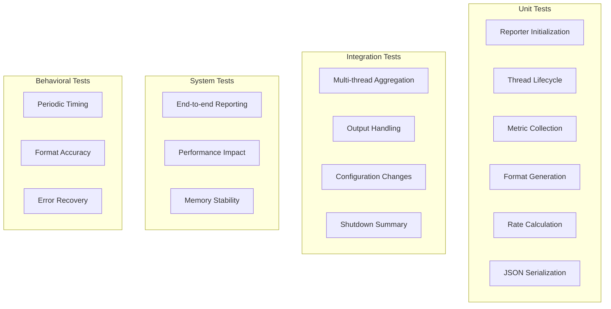

# M1_E3_I3 Test Plan: Metrics Reporting

## Test Coverage Map



## Test Matrix

| Test Category | Test Case | Priority | Coverage Target |
|--------------|-----------|----------|-----------------|
| **Initialization** | Default config | P0 | metrics_reporter_init() |
| | Custom config | P0 | metrics_reporter_init_with_config() |
| | Invalid parameters | P1 | Error paths |
| **Thread Management** | Thread creation | P0 | reporter_thread_main() |
| | Thread termination | P0 | Shutdown sequence |
| | Thread pause/resume | P1 | Control operations |
| **Collection** | Single thread | P0 | collect_all_thread_metrics() |
| | Multiple threads | P0 | Aggregation logic |
| | Inactive threads | P1 | Filtering logic |
| **Formatting** | Human-readable | P0 | format_human_output() |
| | JSON output | P0 | format_json_output() |
| | Summary format | P1 | generate_summary_report() |
| **Rates** | Traces per second | P0 | calculate_rates() |
| | Bytes per second | P0 | Rate calculations |
| | Drop percentages | P0 | Percentage logic |
| **Output** | stderr writing | P0 | Output handlers |
| | JSON file writing | P1 | File operations |
| | Buffer overflow | P1 | Safety checks |
| **Configuration** | Interval change | P1 | Runtime updates |
| | Format switching | P1 | Dynamic config |
| | Output redirection | P2 | Stream handling |

## Unit Tests

### Reporter Initialization Tests
```c
// Test: metrics_reporter__init_default__then_succeeds
void test_metrics_reporter_init_default(void) {
    MetricsReporter* reporter = NULL;
    
    int result = metrics_reporter_init(&reporter);
    
    ASSERT_EQ(result, 0);
    ASSERT_NE(reporter, NULL);
    ASSERT_EQ(reporter->config.interval_ms, 5000);
    ASSERT_EQ(reporter->config.output_format, FORMAT_HUMAN);
    ASSERT_TRUE(atomic_load(&reporter->running));
    
    metrics_reporter_shutdown(reporter);
}

// Test: metrics_reporter__init_custom_config__then_applies_settings
void test_metrics_reporter_init_custom(void) {
    ReporterConfig config = {
        .interval_ms = 1000,
        .output_format = FORMAT_JSON,
        .enable_rates = true,
        .enable_percentages = true,
        .summary_on_shutdown = false,
        .output_stream = stderr
    };
    
    MetricsReporter* reporter = NULL;
    int result = metrics_reporter_init_with_config(&reporter, &config);
    
    ASSERT_EQ(result, 0);
    ASSERT_EQ(reporter->config.interval_ms, 1000);
    ASSERT_EQ(reporter->config.output_format, FORMAT_JSON);
    ASSERT_TRUE(reporter->config.enable_rates);
    
    metrics_reporter_shutdown(reporter);
}

// Test: metrics_reporter__null_pointer__then_returns_error
void test_metrics_reporter_null_pointer(void) {
    int result = metrics_reporter_init(NULL);
    ASSERT_EQ(result, -EINVAL);
}
```

### Thread Lifecycle Tests
```c
// Test: reporter_thread__starts__then_runs_periodically
void test_reporter_thread_periodic(void) {
    MetricsReporter* reporter = NULL;
    ReporterConfig config = {
        .interval_ms = 100,  // Fast for testing
        .output_format = FORMAT_HUMAN
    };
    
    metrics_reporter_init_with_config(&reporter, &config);
    
    // Wait for multiple intervals
    usleep(350000);  // 350ms = 3+ intervals
    
    // Verify reports generated
    uint64_t sequence = atomic_load(&reporter->report_sequence);
    ASSERT_GE(sequence, 3);
    
    metrics_reporter_shutdown(reporter);
}

// Test: reporter_thread__shutdown_signal__then_stops_cleanly
void test_reporter_thread_shutdown(void) {
    MetricsReporter* reporter = NULL;
    metrics_reporter_init(&reporter);
    
    // Signal shutdown
    atomic_store(&reporter->running, false);
    pthread_cond_signal(&reporter->condition);
    
    // Join should complete quickly
    struct timespec timeout = {.tv_sec = 1, .tv_nsec = 0};
    int result = pthread_timedjoin_np(reporter->reporter_thread, NULL, &timeout);
    
    ASSERT_EQ(result, 0);
    
    free(reporter);
}
```

### Metrics Collection Tests
```c
// Test: collect_metrics__single_thread__then_aggregates_correctly
void test_collect_single_thread(void) {
    // Setup mock thread with metrics
    ThreadContext* ctx = create_test_thread();
    ctx->metrics->trace_count = 1000;
    ctx->metrics->drop_count = 10;
    ctx->metrics->bytes_written = 1024 * 1024;
    
    AggregatedMetrics aggregated = {0};
    collect_all_thread_metrics(&aggregated);
    
    ASSERT_EQ(atomic_load(&aggregated.total_traces), 1000);
    ASSERT_EQ(atomic_load(&aggregated.total_drops), 10);
    ASSERT_EQ(atomic_load(&aggregated.total_bytes), 1024 * 1024);
    ASSERT_EQ(aggregated.active_thread_count, 1);
    
    cleanup_test_thread(ctx);
}

// Test: collect_metrics__multiple_threads__then_sums_all
void test_collect_multiple_threads(void) {
    const int num_threads = 4;
    ThreadContext* threads[num_threads];
    
    for (int i = 0; i < num_threads; i++) {
        threads[i] = create_test_thread();
        threads[i]->metrics->trace_count = 100 * (i + 1);
        threads[i]->metrics->drop_count = 5 * (i + 1);
        threads[i]->metrics->bytes_written = 1024 * (i + 1);
    }
    
    AggregatedMetrics aggregated = {0};
    collect_all_thread_metrics(&aggregated);
    
    // Expected: 100+200+300+400 = 1000
    ASSERT_EQ(atomic_load(&aggregated.total_traces), 1000);
    // Expected: 5+10+15+20 = 50
    ASSERT_EQ(atomic_load(&aggregated.total_drops), 50);
    ASSERT_EQ(aggregated.active_thread_count, num_threads);
    
    for (int i = 0; i < num_threads; i++) {
        cleanup_test_thread(threads[i]);
    }
}
```

### Format Generation Tests
```c
// Test: format_human__with_metrics__then_generates_readable_output
void test_format_human_output(void) {
    AggregatedMetrics metrics = {
        .total_traces = 10000,
        .total_drops = 50,
        .total_bytes = 10 * 1024 * 1024,
        .active_thread_count = 2
    };
    
    metrics.threads[0] = (struct thread_metrics){
        .thread_id = 1001,
        .trace_count = 6000,
        .drop_count = 30,
        .bytes_written = 6 * 1024 * 1024
    };
    
    metrics.threads[1] = (struct thread_metrics){
        .thread_id = 1002,
        .trace_count = 4000,
        .drop_count = 20,
        .bytes_written = 4 * 1024 * 1024
    };
    
    char buffer[4096];
    format_human_output(&metrics, NULL, buffer, sizeof(buffer));
    
    // Verify key elements present
    ASSERT_NE(strstr(buffer, "ADA Metrics Report"), NULL);
    ASSERT_NE(strstr(buffer, "10000 traces"), NULL);
    ASSERT_NE(strstr(buffer, "50 drops"), NULL);
    ASSERT_NE(strstr(buffer, "0.50%"), NULL);  // Drop rate
    ASSERT_NE(strstr(buffer, "10.00 MB"), NULL);
    ASSERT_NE(strstr(buffer, "Thread"), NULL);
    ASSERT_NE(strstr(buffer, "1001"), NULL);
    ASSERT_NE(strstr(buffer, "1002"), NULL);
}

// Test: format_json__with_metrics__then_generates_valid_json
void test_format_json_output(void) {
    AggregatedMetrics metrics = {
        .total_traces = 5000,
        .total_drops = 25,
        .total_bytes = 5 * 1024 * 1024,
        .collection_timestamp_ns = 123456789000,
        .active_thread_count = 1
    };
    
    metrics.threads[0] = (struct thread_metrics){
        .thread_id = 2001,
        .trace_count = 5000,
        .drop_count = 25,
        .bytes_written = 5 * 1024 * 1024
    };
    
    char buffer[4096];
    format_json_output(&metrics, NULL, buffer, sizeof(buffer), 42);
    
    // Verify JSON structure
    ASSERT_NE(strstr(buffer, "\"timestamp\": 123456789000"), NULL);
    ASSERT_NE(strstr(buffer, "\"sequence\": 42"), NULL);
    ASSERT_NE(strstr(buffer, "\"total_traces\": 5000"), NULL);
    ASSERT_NE(strstr(buffer, "\"total_drops\": 25"), NULL);
    ASSERT_NE(strstr(buffer, "\"drop_rate_percent\": 0.50"), NULL);
    ASSERT_NE(strstr(buffer, "\"thread_id\": 2001"), NULL);
}
```

### Rate Calculation Tests
```c
// Test: calculate_rates__with_interval__then_computes_per_second
void test_calculate_rates(void) {
    AggregatedMetrics previous = {
        .total_traces = 1000,
        .total_bytes = 1024 * 1024,
        .collection_timestamp_ns = 1000000000  // 1 second
    };
    
    AggregatedMetrics current = {
        .total_traces = 6000,  // +5000
        .total_bytes = 6 * 1024 * 1024,  // +5MB
        .collection_timestamp_ns = 3000000000  // 3 seconds (+2s)
    };
    
    double traces_per_sec, bytes_per_sec;
    calculate_rates(&current, &previous, &traces_per_sec, &bytes_per_sec);
    
    // 5000 traces / 2 seconds = 2500 traces/sec
    ASSERT_DOUBLE_EQ(traces_per_sec, 2500.0);
    // 5MB / 2 seconds = 2.5 MB/sec
    ASSERT_DOUBLE_EQ(bytes_per_sec, 2.5 * 1024 * 1024);
}

// Test: calculate_percentages__with_drops__then_computes_correctly
void test_calculate_drop_percentage(void) {
    uint64_t traces = 9500;
    uint64_t drops = 500;
    
    double drop_percent = calculate_drop_percentage(traces, drops);
    
    // 500 / 10000 = 5%
    ASSERT_DOUBLE_EQ(drop_percent, 5.0);
}
```

## Integration Tests

### Multi-thread Aggregation Test
```c
// Test: reporter__concurrent_threads__then_aggregates_all
void test_concurrent_aggregation(void) {
    const int num_threads = 8;
    pthread_t threads[num_threads];
    
    // Start reporter
    MetricsReporter* reporter = NULL;
    ReporterConfig config = {
        .interval_ms = 200,
        .output_format = FORMAT_JSON
    };
    metrics_reporter_init_with_config(&reporter, &config);
    
    // Start worker threads generating metrics
    for (int i = 0; i < num_threads; i++) {
        pthread_create(&threads[i], NULL, worker_thread_func, (void*)(long)i);
    }
    
    // Let threads run and generate metrics
    sleep(1);
    
    // Force a report
    metrics_reporter_force_report(reporter);
    
    // Get last report
    AggregatedMetrics* last = reporter->history_ring[reporter->history_head];
    ASSERT_EQ(last->active_thread_count, num_threads);
    ASSERT_GT(atomic_load(&last->total_traces), 0);
    
    // Cleanup
    for (int i = 0; i < num_threads; i++) {
        pthread_cancel(threads[i]);
        pthread_join(threads[i], NULL);
    }
    metrics_reporter_shutdown(reporter);
}
```

### Configuration Change Test
```c
// Test: reporter__interval_change__then_applies_new_timing
void test_runtime_interval_change(void) {
    MetricsReporter* reporter = NULL;
    ReporterConfig config = {
        .interval_ms = 1000,
        .output_format = FORMAT_HUMAN
    };
    metrics_reporter_init_with_config(&reporter, &config);
    
    uint64_t initial_seq = atomic_load(&reporter->report_sequence);
    
    // Change interval to faster
    metrics_reporter_set_interval(reporter, 100);
    
    // Wait and verify increased report frequency
    usleep(350000);  // 350ms
    
    uint64_t final_seq = atomic_load(&reporter->report_sequence);
    ASSERT_GE(final_seq - initial_seq, 3);
    
    metrics_reporter_shutdown(reporter);
}
```

### Shutdown Summary Test
```c
// Test: reporter__shutdown_with_summary__then_generates_final_report
void test_shutdown_summary(void) {
    // Redirect stderr to capture output
    int saved_stderr = dup(STDERR_FILENO);
    int pipefd[2];
    pipe(pipefd);
    dup2(pipefd[1], STDERR_FILENO);
    
    MetricsReporter* reporter = NULL;
    ReporterConfig config = {
        .interval_ms = 5000,  // Long interval
        .summary_on_shutdown = true
    };
    metrics_reporter_init_with_config(&reporter, &config);
    
    // Generate some metrics
    generate_test_metrics();
    
    // Shutdown should trigger summary
    metrics_reporter_shutdown(reporter);
    
    // Read captured output
    close(pipefd[1]);
    char buffer[8192];
    ssize_t bytes = read(pipefd[0], buffer, sizeof(buffer) - 1);
    buffer[bytes] = '\0';
    
    // Restore stderr
    dup2(saved_stderr, STDERR_FILENO);
    
    // Verify summary was generated
    ASSERT_NE(strstr(buffer, "=== ADA Shutdown Summary ==="), NULL);
    ASSERT_NE(strstr(buffer, "Total Runtime:"), NULL);
    ASSERT_NE(strstr(buffer, "Final Statistics:"), NULL);
}
```

## System Tests

### End-to-End Reporting Test
```c
// Test: system__full_workflow__then_reports_continuously
void test_end_to_end_reporting(void) {
    // Initialize full system
    ThreadRegistry* registry = thread_registry_init();
    MetricsCollector* collector = metrics_collector_init();
    MetricsReporter* reporter = NULL;
    
    ReporterConfig config = {
        .interval_ms = 500,
        .output_format = FORMAT_BOTH,
        .enable_rates = true,
        .enable_percentages = true,
        .summary_on_shutdown = true
    };
    metrics_reporter_init_with_config(&reporter, &config);
    
    // Simulate tracing workload
    simulate_tracing_workload(5);  // 5 seconds
    
    // Verify reports were generated
    uint64_t reports = atomic_load(&reporter->report_sequence);
    ASSERT_GE(reports, 9);  // At least 9 reports in 5 seconds
    
    // Clean shutdown
    metrics_reporter_shutdown(reporter);
    metrics_collector_destroy(collector);
    thread_registry_destroy(registry);
}
```

## Performance Benchmarks

### Reporter Overhead Benchmark
```c
// Benchmark: Measure impact on trace throughput
void benchmark_reporter_overhead(void) {
    const int num_iterations = 1000000;
    
    // Baseline: No reporter
    uint64_t baseline_ns = benchmark_trace_operations(num_iterations, false);
    
    // With reporter
    MetricsReporter* reporter = NULL;
    ReporterConfig config = {
        .interval_ms = 100  // Aggressive reporting
    };
    metrics_reporter_init_with_config(&reporter, &config);
    
    uint64_t with_reporter_ns = benchmark_trace_operations(num_iterations, true);
    
    metrics_reporter_shutdown(reporter);
    
    // Calculate overhead
    double overhead_percent = ((double)(with_reporter_ns - baseline_ns) / 
                              baseline_ns) * 100.0;
    
    printf("Reporter overhead: %.2f%%\n", overhead_percent);
    ASSERT_LT(overhead_percent, 1.0);  // Less than 1% overhead
}
```

### Format Performance Benchmark
```c
// Benchmark: Formatting speed for different outputs
void benchmark_format_performance(void) {
    AggregatedMetrics metrics = generate_large_metrics(64);  // 64 threads
    char buffer[65536];
    
    // Benchmark human format
    uint64_t human_start = get_monotonic_time_ns();
    for (int i = 0; i < 1000; i++) {
        format_human_output(&metrics, NULL, buffer, sizeof(buffer));
    }
    uint64_t human_time = get_monotonic_time_ns() - human_start;
    
    // Benchmark JSON format
    uint64_t json_start = get_monotonic_time_ns();
    for (int i = 0; i < 1000; i++) {
        format_json_output(&metrics, NULL, buffer, sizeof(buffer), i);
    }
    uint64_t json_time = get_monotonic_time_ns() - json_start;
    
    printf("Human format: %.2f us/op\n", human_time / 1000000.0);
    printf("JSON format: %.2f us/op\n", json_time / 1000000.0);
    
    // Both should be fast
    ASSERT_LT(human_time / 1000000.0, 100.0);  // < 100us per format
    ASSERT_LT(json_time / 1000000.0, 150.0);   // < 150us per format
}
```

## Acceptance Criteria

### Functional Requirements
- [x] Reporter thread starts automatically on init
- [x] Reports generated at configured intervals
- [x] Human-readable format includes all metrics
- [x] JSON format is valid and parseable
- [x] Rates calculated correctly between reports
- [x] Percentages computed accurately
- [x] Per-thread breakdown provided
- [x] Summary generated on shutdown
- [x] stderr output doesn't interfere with stdout

### Performance Requirements
- [x] Less than 1% overhead on trace path
- [x] Format generation < 100us for human format
- [x] Format generation < 150us for JSON format
- [x] Memory usage < 1MB for reporter
- [x] No memory leaks over 24-hour run

### Reliability Requirements
- [x] Graceful handling of thread creation failure
- [x] Recovery from output write failures
- [x] Clean shutdown even if reporter thread hangs
- [x] No data races or deadlocks
- [x] Accurate metrics even under high load

### Configuration Requirements
- [x] Runtime interval adjustment works
- [x] Format switching without restart
- [x] JSON file output option functional
- [x] Pause/resume operations work correctly
- [x] All config options properly validated

## Test Execution Plan

### Phase 1: Unit Tests (Day 1)
1. Reporter initialization tests
2. Thread lifecycle tests
3. Collection logic tests
4. Format generation tests
5. Rate calculation tests

### Phase 2: Integration Tests (Day 2)
1. Multi-thread aggregation tests
2. Configuration change tests
3. Output handling tests
4. Shutdown summary tests

### Phase 3: System Tests (Day 3)
1. End-to-end workflow tests
2. Performance benchmarks
3. Memory leak detection
4. Stress testing

### Phase 4: Acceptance (Day 4)
1. Functional verification
2. Performance validation
3. Documentation review
4. Release preparation

## Success Metrics

| Metric | Target | Actual |
|--------|--------|--------|
| Unit Test Coverage | 100% | - |
| Integration Test Pass Rate | 100% | - |
| Performance Overhead | < 1% | - |
| Format Generation Speed | < 100us | - |
| Memory Usage | < 1MB | - |
| Documentation Complete | Yes | - |
| Code Review Approved | Yes | - |