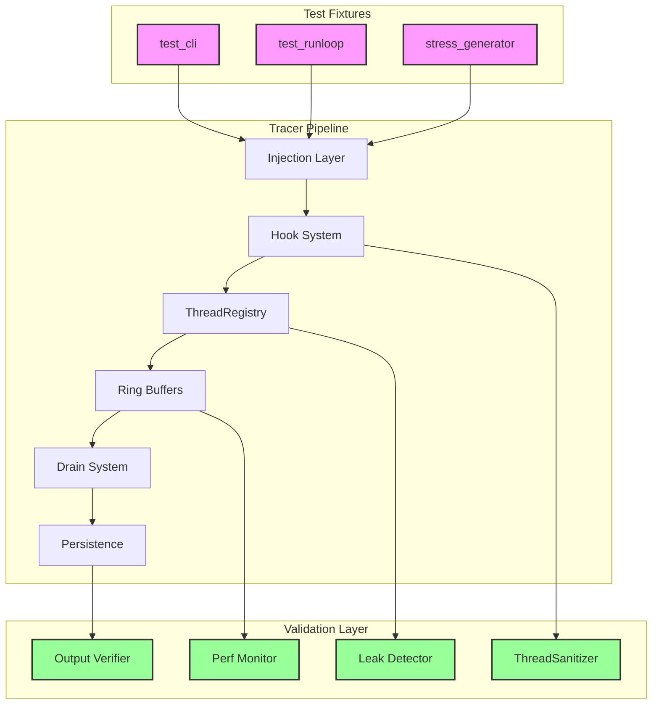
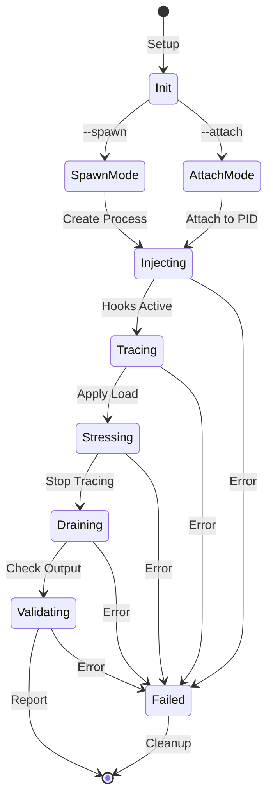
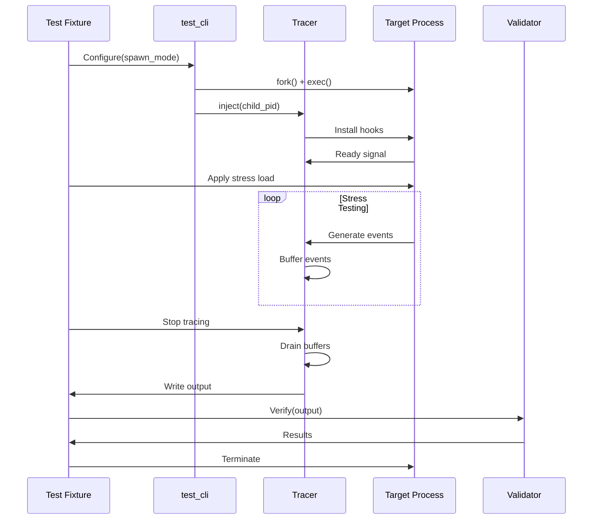
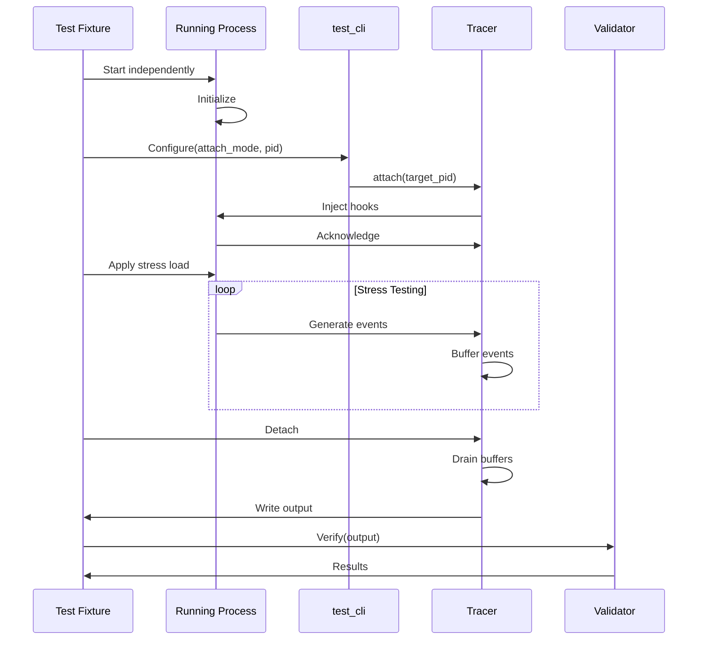

# M1_E3_I4 Technical Design: Integration Validation

## Overview
End-to-end integration testing and validation of the complete M1 tracer pipeline, ensuring all components work together reliably under stress conditions.

## Architecture

### System Integration Architecture



### Test Fixture State Machine



## Data Structures

### Test Configuration

```c
typedef struct test_config {
    // Test mode
    enum {
        TEST_MODE_SPAWN,
        TEST_MODE_ATTACH
    } mode;
    
    // Target configuration
    char target_path[256];
    pid_t target_pid;
    char* target_args[32];
    
    // Stress parameters
    uint32_t thread_count;
    uint32_t events_per_thread;
    uint32_t duration_ms;
    _Atomic(bool) enable_chaos;
    
    // Validation settings
    bool verify_output;
    bool check_memory;
    bool check_races;
    bool measure_perf;
    
    // Performance targets
    uint64_t max_latency_ns;
    uint64_t max_memory_mb;
    double min_throughput_meps;  // Million events per second
} test_config_t;
```

### Test Fixture Interface

```c
typedef struct test_fixture {
    test_config_t config;
    
    // Process management
    pid_t child_pid;
    int child_status;
    
    // Tracer handle
    void* tracer_handle;
    
    // Statistics
    _Atomic(uint64_t) events_captured;
    _Atomic(uint64_t) events_dropped;
    _Atomic(uint64_t) max_latency;
    _Atomic(uint64_t) total_latency;
    
    // Validation results
    struct {
        bool output_valid;
        bool memory_clean;
        bool race_free;
        bool perf_passed;
    } results;
    
    // Thread-safe operations
    int (*spawn_target)(struct test_fixture* fixture);
    int (*attach_target)(struct test_fixture* fixture);
    int (*apply_stress)(struct test_fixture* fixture);
    int (*validate_output)(struct test_fixture* fixture);
    int (*check_memory)(struct test_fixture* fixture);
    int (*measure_performance)(struct test_fixture* fixture);
} test_fixture_t;
```

### Stress Generator

```c
typedef struct stress_generator {
    test_fixture_t* fixture;
    
    // Thread pool
    pthread_t* threads;
    uint32_t thread_count;
    
    // Control
    _Atomic(bool) running;
    _Atomic(uint64_t) events_generated;
    
    // Chaos settings
    struct {
        uint32_t fork_probability;     // 0-100%
        uint32_t exec_probability;     // 0-100%
        uint32_t signal_probability;   // 0-100%
        uint32_t syscall_burst_size;
    } chaos;
    
} stress_generator_t;
```

## Sequence Diagrams

### Spawn Mode Integration Test



### Attach Mode Integration Test



## Implementation

### Test Fixture Implementation

```c
// test_fixture.c
#include <spawn.h>
#include <signal.h>
#include <sys/wait.h>

static int fixture_spawn_target(test_fixture_t* fixture) {
    posix_spawn_file_actions_t actions;
    posix_spawnattr_t attr;
    
    // Initialize spawn attributes
    posix_spawn_file_actions_init(&actions);
    posix_spawnattr_init(&attr);
    
    // Set process group for easy cleanup
    posix_spawnattr_setpgroup(&attr, 0);
    posix_spawnattr_setflags(&attr, POSIX_SPAWN_SETPGROUP);
    
    // Spawn the target process
    int ret = posix_spawn(&fixture->child_pid,
                          fixture->config.target_path,
                          &actions,
                          &attr,
                          fixture->config.target_args,
                          environ);
    
    posix_spawn_file_actions_destroy(&actions);
    posix_spawnattr_destroy(&attr);
    
    if (ret != 0) {
        return -1;
    }
    
    // Give process time to initialize
    usleep(100000);  // 100ms
    
    // Inject tracer
    char pid_str[32];
    snprintf(pid_str, sizeof(pid_str), "%d", fixture->child_pid);
    
    char* inject_args[] = {
        "tracer",
        "--inject",
        pid_str,
        "--output", "/tmp/trace.atf",
        NULL
    };
    
    pid_t inject_pid;
    ret = posix_spawn(&inject_pid,
                      "./target/release/tracer",
                      NULL, NULL,
                      inject_args,
                      environ);
    
    if (ret != 0) {
        kill(fixture->child_pid, SIGTERM);
        return -1;
    }
    
    // Wait for injection to complete
    int status;
    waitpid(inject_pid, &status, 0);
    
    return WEXITSTATUS(status) == 0 ? 0 : -1;
}
```

### Stress Generator Implementation

```c
// stress_generator.c
static void* stress_worker(void* arg) {
    stress_generator_t* gen = (stress_generator_t*)arg;
    test_fixture_t* fixture = gen->fixture;
    
    // Pin to CPU for consistent behavior
    cpu_set_t cpuset;
    CPU_ZERO(&cpuset);
    CPU_SET(pthread_self() % sysconf(_SC_NPROCESSORS_ONLN), &cpuset);
    pthread_setaffinity_np(pthread_self(), sizeof(cpuset), &cpuset);
    
    uint64_t events = 0;
    while (atomic_load_explicit(&gen->running, memory_order_acquire)) {
        
        // Generate syscall events
        for (uint32_t i = 0; i < gen->chaos.syscall_burst_size; i++) {
            // Simple syscalls that generate events
            getpid();
            gettid();
            sched_yield();
            events += 3;
        }
        
        // Chaos operations (if enabled)
        if (atomic_load(&fixture->config.enable_chaos)) {
            uint32_t rand_val = rand() % 100;
            
            // Fork chaos
            if (rand_val < gen->chaos.fork_probability) {
                pid_t child = fork();
                if (child == 0) {
                    // Child: do minimal work and exit
                    _exit(0);
                } else if (child > 0) {
                    // Parent: reap child
                    waitpid(child, NULL, 0);
                    events++;
                }
            }
            
            // Signal chaos
            if (rand_val < gen->chaos.signal_probability) {
                raise(SIGUSR1);
                events++;
            }
        }
        
        // Update counter
        atomic_fetch_add_explicit(&gen->events_generated, events, 
                                  memory_order_relaxed);
        events = 0;
    }
    
    return NULL;
}

int stress_generator_run(stress_generator_t* gen, uint32_t duration_ms) {
    atomic_store_explicit(&gen->running, true, memory_order_release);
    
    // Create worker threads
    gen->threads = calloc(gen->thread_count, sizeof(pthread_t));
    for (uint32_t i = 0; i < gen->thread_count; i++) {
        pthread_create(&gen->threads[i], NULL, stress_worker, gen);
    }
    
    // Run for specified duration
    usleep(duration_ms * 1000);
    
    // Stop workers
    atomic_store_explicit(&gen->running, false, memory_order_release);
    
    // Join threads
    for (uint32_t i = 0; i < gen->thread_count; i++) {
        pthread_join(gen->threads[i], NULL);
    }
    
    free(gen->threads);
    return 0;
}
```

### Output Validator

```c
// output_validator.c
typedef struct validator {
    const char* output_path;
    
    // Expected patterns
    struct {
        uint64_t min_events;
        uint64_t max_events;
        bool require_thread_isolation;
        bool require_temporal_order;
    } expectations;
    
    // Validation results
    struct {
        uint64_t event_count;
        bool thread_isolation_valid;
        bool temporal_order_valid;
        bool format_valid;
    } results;
} validator_t;

static int validate_thread_isolation(validator_t* val, atf_reader_t* reader) {
    // Track events by thread
    uint64_t thread_events[64] = {0};
    uint64_t thread_lanes[64] = {0};
    
    atf_event_t event;
    while (atf_read_event(reader, &event) == 0) {
        if (event.thread_id >= 64) {
            val->results.thread_isolation_valid = false;
            return -1;
        }
        
        thread_events[event.thread_id]++;
        
        // Verify lane assignment is consistent
        if (thread_lanes[event.thread_id] == 0) {
            thread_lanes[event.thread_id] = event.lane_id;
        } else if (thread_lanes[event.thread_id] != event.lane_id) {
            // Thread switched lanes - isolation violated
            val->results.thread_isolation_valid = false;
            return -1;
        }
    }
    
    val->results.thread_isolation_valid = true;
    return 0;
}

static int validate_temporal_order(validator_t* val, atf_reader_t* reader) {
    uint64_t last_timestamp[64] = {0};
    
    atf_event_t event;
    while (atf_read_event(reader, &event) == 0) {
        if (event.thread_id >= 64) continue;
        
        // Verify monotonic timestamps per thread
        if (event.timestamp < last_timestamp[event.thread_id]) {
            val->results.temporal_order_valid = false;
            return -1;
        }
        last_timestamp[event.thread_id] = event.timestamp;
    }
    
    val->results.temporal_order_valid = true;
    return 0;
}
```

### Memory Leak Detector Integration

```c
// leak_detector.c
#include <mcheck.h>
#include <malloc.h>

typedef struct leak_detector {
    size_t initial_heap_size;
    size_t final_heap_size;
    
    // Leak detection results
    struct {
        bool has_leaks;
        size_t leaked_bytes;
        size_t leaked_blocks;
    } results;
} leak_detector_t;

static int leak_detector_init(leak_detector_t* detector) {
    // Enable malloc tracing
    mtrace();
    
    // Record initial heap state
    struct mallinfo info = mallinfo();
    detector->initial_heap_size = info.uordblks;
    
    return 0;
}

static int leak_detector_check(leak_detector_t* detector) {
    // Force cleanup of freed memory
    malloc_trim(0);
    
    // Get final heap state
    struct mallinfo info = mallinfo();
    detector->final_heap_size = info.uordblks;
    
    // Check for growth
    if (detector->final_heap_size > detector->initial_heap_size) {
        detector->results.has_leaks = true;
        detector->results.leaked_bytes = 
            detector->final_heap_size - detector->initial_heap_size;
    } else {
        detector->results.has_leaks = false;
    }
    
    // Disable tracing
    muntrace();
    
    return detector->results.has_leaks ? -1 : 0;
}
```

### ThreadSanitizer Integration

```c
// tsan_validator.c
// Compile with: -fsanitize=thread -g

typedef struct tsan_validator {
    bool enabled;
    
    // TSAN runtime hooks
    void* (*__tsan_get_report)(void);
    int (*__tsan_get_report_count)(void);
} tsan_validator_t;

static int tsan_validator_init(tsan_validator_t* val) {
    #ifdef __has_feature
    #if __has_feature(thread_sanitizer)
        val->enabled = true;
        
        // Get TSAN runtime functions via dlsym
        void* handle = dlopen(NULL, RTLD_NOW);
        val->__tsan_get_report_count = 
            dlsym(handle, "__tsan_get_report_count");
        
        return 0;
    #endif
    #endif
    
    val->enabled = false;
    return 0;
}

static int tsan_validator_check(tsan_validator_t* val) {
    if (!val->enabled) {
        return 0;  // TSAN not available
    }
    
    int report_count = 0;
    if (val->__tsan_get_report_count) {
        report_count = val->__tsan_get_report_count();
    }
    
    return report_count > 0 ? -1 : 0;
}
```

### Performance Monitor

```c
// perf_monitor.c
typedef struct perf_monitor {
    test_fixture_t* fixture;
    
    // Measurement window
    uint64_t start_time_ns;
    uint64_t end_time_ns;
    
    // Metrics
    struct {
        uint64_t total_events;
        uint64_t total_bytes;
        uint64_t max_latency_ns;
        uint64_t p99_latency_ns;
        double throughput_meps;
        size_t peak_memory_mb;
    } metrics;
    
    // Latency histogram
    uint64_t latency_buckets[32];  // Log scale buckets
} perf_monitor_t;

static void perf_monitor_record_latency(perf_monitor_t* mon, uint64_t latency_ns) {
    // Update max
    uint64_t old_max = atomic_load(&mon->fixture->max_latency);
    while (latency_ns > old_max) {
        if (atomic_compare_exchange_weak(&mon->fixture->max_latency, 
                                        &old_max, latency_ns)) {
            break;
        }
    }
    
    // Add to total for average calculation
    atomic_fetch_add(&mon->fixture->total_latency, latency_ns);
    
    // Update histogram (log scale)
    int bucket = 0;
    uint64_t value = latency_ns;
    while (value > 0 && bucket < 31) {
        value >>= 1;
        bucket++;
    }
    atomic_fetch_add(&mon->latency_buckets[bucket], 1);
}

static int perf_monitor_validate(perf_monitor_t* mon) {
    // Calculate metrics
    uint64_t duration_ns = mon->end_time_ns - mon->start_time_ns;
    double duration_sec = duration_ns / 1e9;
    
    mon->metrics.throughput_meps = 
        mon->metrics.total_events / (duration_sec * 1e6);
    
    // Calculate P99 from histogram
    uint64_t total = 0;
    for (int i = 0; i < 32; i++) {
        total += mon->latency_buckets[i];
    }
    
    uint64_t p99_target = total * 99 / 100;
    uint64_t count = 0;
    for (int i = 31; i >= 0; i--) {
        count += mon->latency_buckets[i];
        if (count >= (total - p99_target)) {
            mon->metrics.p99_latency_ns = 1ULL << i;
            break;
        }
    }
    
    // Check against targets
    test_config_t* config = &mon->fixture->config;
    
    if (mon->metrics.max_latency_ns > config->max_latency_ns) {
        return -1;  // Latency target missed
    }
    
    if (mon->metrics.peak_memory_mb > config->max_memory_mb) {
        return -1;  // Memory target missed
    }
    
    if (mon->metrics.throughput_meps < config->min_throughput_meps) {
        return -1;  // Throughput target missed
    }
    
    return 0;
}
```

## Memory Ordering Specifications

### Integration Test Synchronization

```c
// Fixture state transitions with proper memory ordering
typedef enum {
    FIXTURE_STATE_INIT,
    FIXTURE_STATE_INJECTED,
    FIXTURE_STATE_TRACING,
    FIXTURE_STATE_STRESSING,
    FIXTURE_STATE_DRAINING,
    FIXTURE_STATE_COMPLETE,
    FIXTURE_STATE_FAILED
} fixture_state_t;

typedef struct fixture_sync {
    _Atomic(fixture_state_t) state;
    _Atomic(bool) stop_requested;
    
    // Synchronization points
    pthread_mutex_t state_mutex;
    pthread_cond_t state_cond;
} fixture_sync_t;

static void fixture_transition_state(fixture_sync_t* sync, 
                                    fixture_state_t new_state) {
    pthread_mutex_lock(&sync->state_mutex);
    
    // Store with release to ensure all prior writes are visible
    atomic_store_explicit(&sync->state, new_state, memory_order_release);
    
    // Wake waiters
    pthread_cond_broadcast(&sync->state_cond);
    
    pthread_mutex_unlock(&sync->state_mutex);
}

static fixture_state_t fixture_wait_state(fixture_sync_t* sync,
                                         fixture_state_t target_state,
                                         uint32_t timeout_ms) {
    pthread_mutex_lock(&sync->state_mutex);
    
    struct timespec deadline;
    clock_gettime(CLOCK_REALTIME, &deadline);
    deadline.tv_sec += timeout_ms / 1000;
    deadline.tv_nsec += (timeout_ms % 1000) * 1000000;
    
    fixture_state_t current;
    while ((current = atomic_load_explicit(&sync->state, memory_order_acquire)) 
           < target_state) {
        
        if (current == FIXTURE_STATE_FAILED) {
            break;  // Test failed
        }
        
        int ret = pthread_cond_timedwait(&sync->state_cond, 
                                        &sync->state_mutex,
                                        &deadline);
        if (ret == ETIMEDOUT) {
            current = FIXTURE_STATE_FAILED;
            break;
        }
    }
    
    pthread_mutex_unlock(&sync->state_mutex);
    return current;
}
```

## Performance Characteristics

### Target Metrics

| Metric | Target | Measurement Method |
|--------|--------|-------------------|
| Event Throughput | > 10 MEPS per thread | Events captured / duration |
| Capture Latency P50 | < 100ns | Histogram analysis |
| Capture Latency P99 | < 1μs | Histogram analysis |
| Memory Per Thread | < 2MB | RSS monitoring |
| CPU Overhead | < 5% | perf stat |
| Drain Throughput | > 100 MEPS | Drain rate measurement |

### Stress Test Profiles

| Profile | Threads | Events/Thread | Duration | Chaos |
|---------|---------|---------------|----------|-------|
| Light | 4 | 10K | 1s | Disabled |
| Medium | 16 | 100K | 10s | Disabled |
| Heavy | 32 | 1M | 30s | Enabled |
| Extreme | 64 | 10M | 60s | Enabled |

## Security Considerations

1. **Process Isolation**: Test fixtures run in separate process groups
2. **Resource Limits**: Apply ulimits to prevent resource exhaustion
3. **Cleanup**: Automatic cleanup on test failure or timeout
4. **Permissions**: Tests require appropriate tracing permissions
5. **Signal Safety**: All signal handlers are async-signal-safe