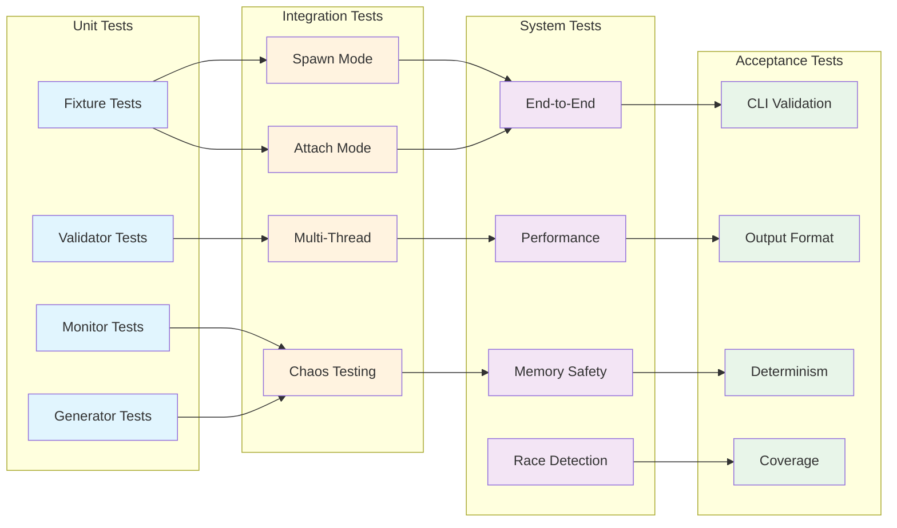

# M1_E3_I4 Test Plan: Integration Validation

## Test Coverage Map



## Test Matrix

| Component | Test Category | Test Count | Priority | Coverage Target |
|-----------|--------------|------------|----------|-----------------|
| test_fixture | Unit | 15 | P0 | 100% |
| stress_generator | Unit | 12 | P0 | 100% |
| output_validator | Unit | 10 | P0 | 100% |
| perf_monitor | Unit | 8 | P0 | 100% |
| leak_detector | Unit | 6 | P0 | 100% |
| spawn_mode | Integration | 8 | P0 | 100% |
| attach_mode | Integration | 8 | P0 | 100% |
| multi_thread | Integration | 10 | P0 | 100% |
| chaos_testing | Integration | 6 | P1 | 95% |
| end_to_end | System | 5 | P0 | 100% |
| performance | System | 5 | P0 | 100% |
| memory_safety | System | 4 | P0 | 100% |
| race_detection | System | 4 | P0 | 100% |

## Unit Tests

### Test Fixture Tests

```c
// test_fixture_test.cc
#include <gtest/gtest.h>
#include "test_fixture.h"

TEST(TestFixture, fixture__init__then_valid_state) {
    test_fixture_t fixture;
    test_config_t config = {
        .mode = TEST_MODE_SPAWN,
        .thread_count = 4,
        .events_per_thread = 1000
    };
    
    ASSERT_EQ(test_fixture_init(&fixture, &config), 0);
    EXPECT_EQ(fixture.child_pid, 0);
    EXPECT_EQ(atomic_load(&fixture.events_captured), 0);
    EXPECT_FALSE(fixture.results.output_valid);
    
    test_fixture_destroy(&fixture);
}

TEST(TestFixture, fixture__spawn_target__then_process_created) {
    test_fixture_t fixture;
    test_config_t config = {
        .mode = TEST_MODE_SPAWN,
        .target_path = "./test_cli",
        .target_args = {"test_cli", "--simple", NULL}
    };
    
    test_fixture_init(&fixture, &config);
    
    ASSERT_EQ(fixture.spawn_target(&fixture), 0);
    EXPECT_GT(fixture.child_pid, 0);
    
    // Verify process is running
    EXPECT_EQ(kill(fixture.child_pid, 0), 0);
    
    // Cleanup
    kill(fixture.child_pid, SIGTERM);
    waitpid(fixture.child_pid, NULL, 0);
    test_fixture_destroy(&fixture);
}

TEST(TestFixture, fixture__attach_target__then_attached) {
    // Start a background process
    pid_t target = fork();
    if (target == 0) {
        // Child: simple loop
        while (1) {
            sleep(1);
        }
    }
    
    test_fixture_t fixture;
    test_config_t config = {
        .mode = TEST_MODE_ATTACH,
        .target_pid = target
    };
    
    test_fixture_init(&fixture, &config);
    
    ASSERT_EQ(fixture.attach_target(&fixture), 0);
    EXPECT_EQ(fixture.child_pid, target);
    
    // Cleanup
    kill(target, SIGTERM);
    waitpid(target, NULL, 0);
    test_fixture_destroy(&fixture);
}

TEST(TestFixture, fixture__concurrent_access__then_thread_safe) {
    test_fixture_t fixture;
    test_config_t config = {.thread_count = 8};
    test_fixture_init(&fixture, &config);
    
    std::vector<std::thread> threads;
    
    // Multiple threads updating counters
    for (int i = 0; i < 8; i++) {
        threads.emplace_back([&fixture]() {
            for (int j = 0; j < 10000; j++) {
                atomic_fetch_add(&fixture.events_captured, 1);
                atomic_fetch_add(&fixture.total_latency, 100);
            }
        });
    }
    
    for (auto& t : threads) {
        t.join();
    }
    
    EXPECT_EQ(atomic_load(&fixture.events_captured), 80000);
    EXPECT_EQ(atomic_load(&fixture.total_latency), 800000);
    
    test_fixture_destroy(&fixture);
}
```

### Stress Generator Tests

```c
// stress_generator_test.cc
TEST(StressGenerator, generator__init__then_valid_state) {
    test_fixture_t fixture = {};
    stress_generator_t gen;
    
    ASSERT_EQ(stress_generator_init(&gen, &fixture, 4), 0);
    EXPECT_EQ(gen.thread_count, 4);
    EXPECT_FALSE(atomic_load(&gen.running));
    EXPECT_EQ(atomic_load(&gen.events_generated), 0);
    
    stress_generator_destroy(&gen);
}

TEST(StressGenerator, generator__run__then_events_generated) {
    test_fixture_t fixture = {};
    test_config_t config = {
        .thread_count = 4,
        .duration_ms = 100
    };
    fixture.config = config;
    
    stress_generator_t gen;
    stress_generator_init(&gen, &fixture, 4);
    
    // Configure for predictable output
    gen.chaos.syscall_burst_size = 10;
    gen.chaos.fork_probability = 0;
    gen.chaos.signal_probability = 0;
    
    ASSERT_EQ(stress_generator_run(&gen, 100), 0);
    
    // Should have generated events
    EXPECT_GT(atomic_load(&gen.events_generated), 0);
    
    stress_generator_destroy(&gen);
}

TEST(StressGenerator, generator__chaos_mode__then_fork_events) {
    test_fixture_t fixture = {};
    fixture.config.enable_chaos = true;
    
    stress_generator_t gen;
    stress_generator_init(&gen, &fixture, 1);
    
    gen.chaos.fork_probability = 100;  // Always fork
    gen.chaos.syscall_burst_size = 0;
    
    uint64_t before = atomic_load(&gen.events_generated);
    stress_generator_run(&gen, 50);
    uint64_t after = atomic_load(&gen.events_generated);
    
    // Should have fork events
    EXPECT_GT(after - before, 0);
    
    stress_generator_destroy(&gen);
}

TEST(StressGenerator, generator__multi_thread__then_scales_linearly) {
    test_fixture_t fixture = {};
    
    // Test with 1 thread
    stress_generator_t gen1;
    stress_generator_init(&gen1, &fixture, 1);
    gen1.chaos.syscall_burst_size = 100;
    
    stress_generator_run(&gen1, 100);
    uint64_t single_thread_events = atomic_load(&gen1.events_generated);
    
    // Test with 4 threads
    stress_generator_t gen4;
    stress_generator_init(&gen4, &fixture, 4);
    gen4.chaos.syscall_burst_size = 100;
    
    stress_generator_run(&gen4, 100);
    uint64_t multi_thread_events = atomic_load(&gen4.events_generated);
    
    // Should scale roughly linearly (allow 20% variance)
    EXPECT_GT(multi_thread_events, single_thread_events * 3.2);
    EXPECT_LT(multi_thread_events, single_thread_events * 4.8);
    
    stress_generator_destroy(&gen1);
    stress_generator_destroy(&gen4);
}
```

### Output Validator Tests

```c
// output_validator_test.cc
TEST(OutputValidator, validator__valid_output__then_passes) {
    // Create test output file
    const char* test_file = "/tmp/test_valid.atf";
    create_test_atf_file(test_file, 1000, 4);  // 1000 events, 4 threads
    
    validator_t val = {
        .output_path = test_file,
        .expectations = {
            .min_events = 900,
            .max_events = 1100,
            .require_thread_isolation = true,
            .require_temporal_order = true
        }
    };
    
    ASSERT_EQ(validator_run(&val), 0);
    EXPECT_TRUE(val.results.thread_isolation_valid);
    EXPECT_TRUE(val.results.temporal_order_valid);
    EXPECT_TRUE(val.results.format_valid);
    EXPECT_EQ(val.results.event_count, 1000);
    
    unlink(test_file);
}

TEST(OutputValidator, validator__broken_isolation__then_fails) {
    const char* test_file = "/tmp/test_broken.atf";
    
    // Create file with thread jumping between lanes
    atf_writer_t* writer = atf_writer_create(test_file);
    
    // Thread 0 writes to lane 0
    atf_event_t event1 = {
        .thread_id = 0,
        .lane_id = 0,
        .timestamp = 1000
    };
    atf_write_event(writer, &event1);
    
    // Thread 0 writes to lane 1 (violation!)
    atf_event_t event2 = {
        .thread_id = 0,
        .lane_id = 1,
        .timestamp = 2000
    };
    atf_write_event(writer, &event2);
    
    atf_writer_close(writer);
    
    validator_t val = {
        .output_path = test_file,
        .expectations.require_thread_isolation = true
    };
    
    EXPECT_EQ(validator_run(&val), -1);
    EXPECT_FALSE(val.results.thread_isolation_valid);
    
    unlink(test_file);
}

TEST(OutputValidator, validator__out_of_order__then_fails) {
    const char* test_file = "/tmp/test_unordered.atf";
    
    atf_writer_t* writer = atf_writer_create(test_file);
    
    // Write events out of order for same thread
    atf_event_t event1 = {
        .thread_id = 0,
        .lane_id = 0,
        .timestamp = 2000  // Later timestamp first
    };
    atf_write_event(writer, &event1);
    
    atf_event_t event2 = {
        .thread_id = 0,
        .lane_id = 0,
        .timestamp = 1000  // Earlier timestamp second
    };
    atf_write_event(writer, &event2);
    
    atf_writer_close(writer);
    
    validator_t val = {
        .output_path = test_file,
        .expectations.require_temporal_order = true
    };
    
    EXPECT_EQ(validator_run(&val), -1);
    EXPECT_FALSE(val.results.temporal_order_valid);
    
    unlink(test_file);
}
```

### Performance Monitor Tests

```c
// perf_monitor_test.cc
TEST(PerfMonitor, monitor__record_latency__then_updates_stats) {
    test_fixture_t fixture = {};
    perf_monitor_t mon = {.fixture = &fixture};
    
    perf_monitor_init(&mon);
    
    // Record various latencies
    perf_monitor_record_latency(&mon, 100);
    perf_monitor_record_latency(&mon, 200);
    perf_monitor_record_latency(&mon, 1000);
    perf_monitor_record_latency(&mon, 50);
    
    EXPECT_EQ(atomic_load(&fixture.max_latency), 1000);
    EXPECT_EQ(atomic_load(&fixture.total_latency), 1350);
    
    // Check histogram buckets
    EXPECT_GT(mon.latency_buckets[6], 0);  // 64-127ns bucket
    EXPECT_GT(mon.latency_buckets[7], 0);  // 128-255ns bucket
    EXPECT_GT(mon.latency_buckets[10], 0); // 1024ns bucket
}

TEST(PerfMonitor, monitor__validate__then_checks_targets) {
    test_fixture_t fixture = {};
    test_config_t config = {
        .max_latency_ns = 1000,
        .max_memory_mb = 100,
        .min_throughput_meps = 1.0
    };
    fixture.config = config;
    
    perf_monitor_t mon = {.fixture = &fixture};
    perf_monitor_init(&mon);
    
    // Simulate good performance
    mon.metrics.max_latency_ns = 800;
    mon.metrics.peak_memory_mb = 50;
    mon.metrics.total_events = 2000000;
    mon.start_time_ns = 0;
    mon.end_time_ns = 1000000000;  // 1 second
    
    EXPECT_EQ(perf_monitor_validate(&mon), 0);
    EXPECT_DOUBLE_EQ(mon.metrics.throughput_meps, 2.0);
    
    // Simulate bad latency
    mon.metrics.max_latency_ns = 2000;
    EXPECT_EQ(perf_monitor_validate(&mon), -1);
}
```

## Integration Tests

### Spawn Mode Integration

```c
// spawn_integration_test.cc
TEST(SpawnIntegration, spawn__simple_target__then_traces_captured) {
    test_fixture_t fixture;
    test_config_t config = {
        .mode = TEST_MODE_SPAWN,
        .target_path = "./test_cli",
        .target_args = {"test_cli", "--duration", "1", NULL},
        .thread_count = 1,
        .events_per_thread = 100
    };
    
    test_fixture_init(&fixture, &config);
    
    // Spawn and inject
    ASSERT_EQ(fixture.spawn_target(&fixture), 0);
    
    // Apply minimal stress
    stress_generator_t gen;
    stress_generator_init(&gen, &fixture, 1);
    stress_generator_run(&gen, 1000);
    
    // Wait for completion
    int status;
    waitpid(fixture.child_pid, &status, 0);
    EXPECT_EQ(WEXITSTATUS(status), 0);
    
    // Validate output
    ASSERT_EQ(fixture.validate_output(&fixture), 0);
    EXPECT_TRUE(fixture.results.output_valid);
    EXPECT_GT(atomic_load(&fixture.events_captured), 0);
    
    stress_generator_destroy(&gen);
    test_fixture_destroy(&fixture);
}

TEST(SpawnIntegration, spawn__multi_thread__then_isolated_traces) {
    test_fixture_t fixture;
    test_config_t config = {
        .mode = TEST_MODE_SPAWN,
        .target_path = "./test_runloop",
        .target_args = {"test_runloop", "--threads", "8", NULL},
        .thread_count = 8,
        .verify_output = true
    };
    
    test_fixture_init(&fixture, &config);
    
    ASSERT_EQ(fixture.spawn_target(&fixture), 0);
    
    // Run multi-threaded stress
    stress_generator_t gen;
    stress_generator_init(&gen, &fixture, 8);
    stress_generator_run(&gen, 2000);
    
    // Stop and validate
    kill(fixture.child_pid, SIGTERM);
    waitpid(fixture.child_pid, NULL, 0);
    
    ASSERT_EQ(fixture.validate_output(&fixture), 0);
    
    // Verify thread isolation
    validator_t val = {
        .output_path = "/tmp/trace.atf",
        .expectations.require_thread_isolation = true
    };
    EXPECT_EQ(validator_run(&val), 0);
    
    stress_generator_destroy(&gen);
    test_fixture_destroy(&fixture);
}
```

### Attach Mode Integration

```c
// attach_integration_test.cc
TEST(AttachIntegration, attach__running_process__then_traces_captured) {
    // Start target process
    pid_t target = fork();
    if (target == 0) {
        execl("./test_runloop", "test_runloop", "--duration", "5", NULL);
        exit(1);
    }
    
    // Let it initialize
    sleep(1);
    
    test_fixture_t fixture;
    test_config_t config = {
        .mode = TEST_MODE_ATTACH,
        .target_pid = target
    };
    
    test_fixture_init(&fixture, &config);
    
    // Attach to running process
    ASSERT_EQ(fixture.attach_target(&fixture), 0);
    
    // Let it run
    sleep(2);
    
    // Detach and validate
    ASSERT_EQ(fixture.detach_target(&fixture), 0);
    
    // Clean up target
    kill(target, SIGTERM);
    waitpid(target, NULL, 0);
    
    ASSERT_EQ(fixture.validate_output(&fixture), 0);
    EXPECT_GT(atomic_load(&fixture.events_captured), 0);
    
    test_fixture_destroy(&fixture);
}

TEST(AttachIntegration, attach__stress_while_attached__then_no_drops) {
    pid_t target = fork();
    if (target == 0) {
        // Long-running process
        while (1) {
            getpid();
            usleep(1000);
        }
    }
    
    test_fixture_t fixture;
    test_config_t config = {
        .mode = TEST_MODE_ATTACH,
        .target_pid = target,
        .thread_count = 4
    };
    
    test_fixture_init(&fixture, &config);
    ASSERT_EQ(fixture.attach_target(&fixture), 0);
    
    // Apply stress while attached
    stress_generator_t gen;
    stress_generator_init(&gen, &fixture, 4);
    gen.chaos.syscall_burst_size = 1000;
    
    stress_generator_run(&gen, 3000);
    
    // Check for drops
    uint64_t dropped = atomic_load(&fixture.events_dropped);
    uint64_t captured = atomic_load(&fixture.events_captured);
    
    // Should have minimal drops (< 1%)
    EXPECT_LT(dropped, captured / 100);
    
    // Cleanup
    fixture.detach_target(&fixture);
    kill(target, SIGTERM);
    waitpid(target, NULL, 0);
    
    stress_generator_destroy(&gen);
    test_fixture_destroy(&fixture);
}
```

### Multi-Thread Integration

```c
// multithread_integration_test.cc
TEST(MultiThreadIntegration, threads__high_contention__then_no_corruption) {
    test_fixture_t fixture;
    test_config_t config = {
        .mode = TEST_MODE_SPAWN,
        .target_path = "./test_runloop",
        .target_args = {"test_runloop", "--threads", "32", NULL},
        .thread_count = 32,
        .events_per_thread = 100000
    };
    
    test_fixture_init(&fixture, &config);
    ASSERT_EQ(fixture.spawn_target(&fixture), 0);
    
    // High contention stress
    stress_generator_t gen;
    stress_generator_init(&gen, &fixture, 32);
    gen.chaos.syscall_burst_size = 1000;
    
    stress_generator_run(&gen, 5000);
    
    // Stop and validate
    kill(fixture.child_pid, SIGTERM);
    waitpid(fixture.child_pid, NULL, 0);
    
    // Check for data corruption
    validator_t val = {
        .output_path = "/tmp/trace.atf",
        .expectations = {
            .require_thread_isolation = true,
            .require_temporal_order = true
        }
    };
    
    ASSERT_EQ(validator_run(&val), 0);
    EXPECT_TRUE(val.results.thread_isolation_valid);
    EXPECT_TRUE(val.results.temporal_order_valid);
    
    stress_generator_destroy(&gen);
    test_fixture_destroy(&fixture);
}

TEST(MultiThreadIntegration, threads__cpu_migration__then_traces_consistent) {
    test_fixture_t fixture;
    test_config_t config = {
        .mode = TEST_MODE_SPAWN,
        .target_path = "./test_runloop",
        .target_args = {"test_runloop", "--migrate-cpus", NULL},
        .thread_count = 8
    };
    
    test_fixture_init(&fixture, &config);
    ASSERT_EQ(fixture.spawn_target(&fixture), 0);
    
    // Let threads migrate between CPUs
    sleep(3);
    
    kill(fixture.child_pid, SIGTERM);
    waitpid(fixture.child_pid, NULL, 0);
    
    // Verify traces remain consistent despite migrations
    ASSERT_EQ(fixture.validate_output(&fixture), 0);
    
    validator_t val = {
        .output_path = "/tmp/trace.atf",
        .expectations.require_thread_isolation = true
    };
    
    EXPECT_EQ(validator_run(&val), 0);
    
    test_fixture_destroy(&fixture);
}
```

## System Tests

### End-to-End System Tests

```c
// e2e_system_test.cc
TEST(E2ESystem, pipeline__full_flow__then_complete_traces) {
    // Complete pipeline test
    test_fixture_t fixture;
    test_config_t config = {
        .mode = TEST_MODE_SPAWN,
        .target_path = "./test_cli",
        .target_args = {"test_cli", "--complex-workload", NULL},
        .thread_count = 16,
        .duration_ms = 10000,
        .verify_output = true,
        .check_memory = true,
        .measure_perf = true
    };
    
    test_fixture_init(&fixture, &config);
    
    // Start performance monitoring
    perf_monitor_t monitor;
    perf_monitor_init(&monitor, &fixture);
    perf_monitor_start(&monitor);
    
    // Execute pipeline
    ASSERT_EQ(fixture.spawn_target(&fixture), 0);
    
    stress_generator_t gen;
    stress_generator_init(&gen, &fixture, 16);
    stress_generator_run(&gen, 10000);
    
    // Graceful shutdown
    kill(fixture.child_pid, SIGTERM);
    waitpid(fixture.child_pid, NULL, 0);
    
    perf_monitor_stop(&monitor);
    
    // Validate everything
    ASSERT_EQ(fixture.validate_output(&fixture), 0);
    ASSERT_EQ(fixture.check_memory(&fixture), 0);
    ASSERT_EQ(perf_monitor_validate(&monitor), 0);
    
    EXPECT_TRUE(fixture.results.output_valid);
    EXPECT_TRUE(fixture.results.memory_clean);
    EXPECT_TRUE(fixture.results.perf_passed);
    
    stress_generator_destroy(&gen);
    test_fixture_destroy(&fixture);
}

TEST(E2ESystem, pipeline__crash_recovery__then_data_preserved) {
    test_fixture_t fixture;
    test_config_t config = {
        .mode = TEST_MODE_SPAWN,
        .target_path = "./test_runloop",
        .target_args = {"test_runloop", "--crash-after", "5", NULL}
    };
    
    test_fixture_init(&fixture, &config);
    ASSERT_EQ(fixture.spawn_target(&fixture), 0);
    
    // Let it run and crash
    int status;
    waitpid(fixture.child_pid, &status, 0);
    EXPECT_TRUE(WIFSIGNALED(status));
    
    // Verify partial data was preserved
    validator_t val = {
        .output_path = "/tmp/trace.atf",
        .expectations = {
            .min_events = 100,  // Should have some events before crash
            .require_format_valid = true
        }
    };
    
    EXPECT_EQ(validator_run(&val), 0);
    EXPECT_GT(val.results.event_count, 0);
    
    test_fixture_destroy(&fixture);
}
```

### Performance System Tests

```c
// performance_system_test.cc
TEST(PerformanceSystem, throughput__10M_events__then_meets_target) {
    test_fixture_t fixture;
    test_config_t config = {
        .mode = TEST_MODE_SPAWN,
        .target_path = "./test_runloop",
        .target_args = {"test_runloop", "--benchmark", NULL},
        .thread_count = 32,
        .events_per_thread = 312500,  // 10M total
        .min_throughput_meps = 5.0  // 5 MEPS minimum
    };
    
    test_fixture_init(&fixture, &config);
    
    perf_monitor_t monitor;
    perf_monitor_init(&monitor, &fixture);
    
    auto start = std::chrono::high_resolution_clock::now();
    
    ASSERT_EQ(fixture.spawn_target(&fixture), 0);
    
    // Generate exactly 10M events
    stress_generator_t gen;
    stress_generator_init(&gen, &fixture, 32);
    gen.chaos.syscall_burst_size = 100;
    
    while (atomic_load(&gen.events_generated) < 10000000) {
        usleep(10000);
    }
    
    auto end = std::chrono::high_resolution_clock::now();
    
    kill(fixture.child_pid, SIGTERM);
    waitpid(fixture.child_pid, NULL, 0);
    
    double duration_sec = std::chrono::duration<double>(end - start).count();
    double throughput = 10.0 / duration_sec;  // MEPS
    
    EXPECT_GT(throughput, 5.0);
    printf("Achieved throughput: %.2f MEPS\n", throughput);
    
    stress_generator_destroy(&gen);
    test_fixture_destroy(&fixture);
}

TEST(PerformanceSystem, latency__p99_under_1us__then_passes) {
    test_fixture_t fixture;
    test_config_t config = {
        .mode = TEST_MODE_SPAWN,
        .target_path = "./test_cli",
        .target_args = {"test_cli", "--latency-test", NULL},
        .max_latency_ns = 10000  // 10μs max
    };
    
    test_fixture_init(&fixture, &config);
    
    perf_monitor_t monitor;
    perf_monitor_init(&monitor, &fixture);
    
    ASSERT_EQ(fixture.spawn_target(&fixture), 0);
    
    // Measure latencies for 5 seconds
    perf_monitor_start(&monitor);
    sleep(5);
    perf_monitor_stop(&monitor);
    
    kill(fixture.child_pid, SIGTERM);
    waitpid(fixture.child_pid, NULL, 0);
    
    // Calculate P99
    perf_monitor_calculate_percentiles(&monitor);
    
    EXPECT_LT(monitor.metrics.p99_latency_ns, 1000);  // < 1μs
    printf("P99 latency: %lu ns\n", monitor.metrics.p99_latency_ns);
    
    test_fixture_destroy(&fixture);
}
```

### Memory Safety Tests

```c
// memory_safety_test.cc
TEST(MemorySafety, leaks__long_running__then_no_growth) {
    test_fixture_t fixture;
    test_config_t config = {
        .mode = TEST_MODE_SPAWN,
        .target_path = "./test_runloop",
        .target_args = {"test_runloop", "--duration", "30", NULL},
        .check_memory = true
    };
    
    test_fixture_init(&fixture, &config);
    
    leak_detector_t detector;
    leak_detector_init(&detector);
    
    ASSERT_EQ(fixture.spawn_target(&fixture), 0);
    
    // Sample memory usage over time
    size_t samples[10];
    for (int i = 0; i < 10; i++) {
        sleep(3);
        samples[i] = get_process_rss(fixture.child_pid);
    }
    
    kill(fixture.child_pid, SIGTERM);
    waitpid(fixture.child_pid, NULL, 0);
    
    // Check for memory growth
    size_t initial_avg = (samples[0] + samples[1] + samples[2]) / 3;
    size_t final_avg = (samples[7] + samples[8] + samples[9]) / 3;
    
    // Allow 10% growth maximum
    EXPECT_LT(final_avg, initial_avg * 1.1);
    
    leak_detector_check(&detector);
    EXPECT_FALSE(detector.results.has_leaks);
    
    test_fixture_destroy(&fixture);
}

TEST(MemorySafety, valgrind__full_pipeline__then_no_errors) {
    // Run under valgrind
    test_fixture_t fixture;
    test_config_t config = {
        .mode = TEST_MODE_SPAWN,
        .target_path = "valgrind",
        .target_args = {
            "valgrind",
            "--leak-check=full",
            "--error-exitcode=1",
            "./test_cli",
            "--simple",
            NULL
        }
    };
    
    test_fixture_init(&fixture, &config);
    
    ASSERT_EQ(fixture.spawn_target(&fixture), 0);
    
    int status;
    waitpid(fixture.child_pid, &status, 0);
    
    // Valgrind returns 1 if errors found
    EXPECT_EQ(WEXITSTATUS(status), 0);
    
    test_fixture_destroy(&fixture);
}
```

### Race Detection Tests

```c
// race_detection_test.cc
TEST(RaceDetection, tsan__concurrent_access__then_no_races) {
    #ifdef __has_feature
    #if __has_feature(thread_sanitizer)
    
    test_fixture_t fixture;
    test_config_t config = {
        .mode = TEST_MODE_SPAWN,
        .target_path = "./test_runloop_tsan",  // Built with -fsanitize=thread
        .target_args = {"test_runloop_tsan", "--threads", "16", NULL},
        .check_races = true
    };
    
    test_fixture_init(&fixture, &config);
    
    tsan_validator_t tsan;
    tsan_validator_init(&tsan);
    
    ASSERT_EQ(fixture.spawn_target(&fixture), 0);
    
    // Run with high concurrency
    stress_generator_t gen;
    stress_generator_init(&gen, &fixture, 16);
    stress_generator_run(&gen, 5000);
    
    kill(fixture.child_pid, SIGTERM);
    waitpid(fixture.child_pid, NULL, 0);
    
    // Check TSAN reports
    EXPECT_EQ(tsan_validator_check(&tsan), 0);
    
    stress_generator_destroy(&gen);
    test_fixture_destroy(&fixture);
    
    #else
    GTEST_SKIP() << "ThreadSanitizer not available";
    #endif
    #endif
}

TEST(RaceDetection, helgrind__shared_state__then_no_races) {
    // Run under helgrind
    test_fixture_t fixture;
    test_config_t config = {
        .mode = TEST_MODE_SPAWN,
        .target_path = "valgrind",
        .target_args = {
            "valgrind",
            "--tool=helgrind",
            "--error-exitcode=1",
            "./test_runloop",
            "--threads", "8",
            "--duration", "5",
            NULL
        }
    };
    
    test_fixture_init(&fixture, &config);
    
    ASSERT_EQ(fixture.spawn_target(&fixture), 0);
    
    int status;
    waitpid(fixture.child_pid, &status, 0);
    
    // Helgrind returns 1 if races found
    EXPECT_EQ(WEXITSTATUS(status), 0);
    
    test_fixture_destroy(&fixture);
}
```

## Acceptance Tests

### CLI Validation

```c
// cli_acceptance_test.cc
TEST(CLIAcceptance, cli__help_flag__then_shows_usage) {
    char* args[] = {"./tracer", "--help", NULL};
    
    int output_pipe[2];
    pipe(output_pipe);
    
    pid_t pid = fork();
    if (pid == 0) {
        dup2(output_pipe[1], STDOUT_FILENO);
        close(output_pipe[0]);
        close(output_pipe[1]);
        execv("./target/release/tracer", args);
        exit(1);
    }
    
    close(output_pipe[1]);
    
    char buffer[4096];
    ssize_t n = read(output_pipe[0], buffer, sizeof(buffer) - 1);
    buffer[n] = '\0';
    
    EXPECT_TRUE(strstr(buffer, "Usage:") != NULL);
    EXPECT_TRUE(strstr(buffer, "--inject") != NULL);
    EXPECT_TRUE(strstr(buffer, "--output") != NULL);
    
    int status;
    waitpid(pid, &status, 0);
    EXPECT_EQ(WEXITSTATUS(status), 0);
}

TEST(CLIAcceptance, cli__invalid_pid__then_error_message) {
    char* args[] = {"./tracer", "--inject", "999999", NULL};
    
    pid_t pid = fork();
    if (pid == 0) {
        execv("./target/release/tracer", args);
        exit(1);
    }
    
    int status;
    waitpid(pid, &status, 0);
    
    // Should exit with error
    EXPECT_NE(WEXITSTATUS(status), 0);
}
```

### Output Format Validation

```c
// format_acceptance_test.cc
TEST(FormatAcceptance, atf__binary_format__then_parseable) {
    // Generate trace
    test_fixture_t fixture;
    test_config_t config = {
        .mode = TEST_MODE_SPAWN,
        .target_path = "./test_cli",
        .target_args = {"test_cli", "--simple", NULL}
    };
    
    test_fixture_init(&fixture, &config);
    fixture.spawn_target(&fixture);
    
    sleep(1);
    kill(fixture.child_pid, SIGTERM);
    waitpid(fixture.child_pid, NULL, 0);
    
    // Verify ATF format
    atf_reader_t* reader = atf_reader_open("/tmp/trace.atf");
    ASSERT_NE(reader, nullptr);
    
    // Read header
    atf_header_t header;
    ASSERT_EQ(atf_read_header(reader, &header), 0);
    EXPECT_EQ(header.magic, ATF_MAGIC);
    EXPECT_EQ(header.version, ATF_VERSION);
    
    // Read some events
    atf_event_t event;
    int event_count = 0;
    while (atf_read_event(reader, &event) == 0 && event_count < 100) {
        EXPECT_GT(event.timestamp, 0);
        EXPECT_LT(event.thread_id, 64);
        event_count++;
    }
    
    EXPECT_GT(event_count, 0);
    
    atf_reader_close(reader);
    test_fixture_destroy(&fixture);
}
```

### Determinism Tests

```c
// determinism_acceptance_test.cc
TEST(DeterminismAcceptance, output__same_input__then_consistent_results) {
    // Run same test twice
    const char* output1 = "/tmp/trace1.atf";
    const char* output2 = "/tmp/trace2.atf";
    
    for (int run = 0; run < 2; run++) {
        test_fixture_t fixture;
        test_config_t config = {
            .mode = TEST_MODE_SPAWN,
            .target_path = "./test_cli",
            .target_args = {"test_cli", "--deterministic", "--seed", "42", NULL}
        };
        
        snprintf(config.output_path, sizeof(config.output_path),
                 "/tmp/trace%d.atf", run + 1);
        
        test_fixture_init(&fixture, &config);
        fixture.spawn_target(&fixture);
        
        sleep(2);
        kill(fixture.child_pid, SIGTERM);
        waitpid(fixture.child_pid, NULL, 0);
        
        test_fixture_destroy(&fixture);
    }
    
    // Compare outputs
    size_t events1 = count_events_in_file(output1);
    size_t events2 = count_events_in_file(output2);
    
    // Should be very similar (within 5%)
    EXPECT_NEAR(events1, events2, events1 * 0.05);
    
    unlink(output1);
    unlink(output2);
}
```

### Coverage Measurement

```c
// coverage_acceptance_test.cc
TEST(CoverageAcceptance, integration__all_paths__then_100_percent) {
    // Run integration tests with coverage
    const char* cmd = "./utils/run_coverage.sh --integration";
    
    FILE* pipe = popen(cmd, "r");
    ASSERT_NE(pipe, nullptr);
    
    char buffer[256];
    std::string output;
    while (fgets(buffer, sizeof(buffer), pipe)) {
        output += buffer;
    }
    
    int ret = pclose(pipe);
    EXPECT_EQ(WEXITSTATUS(ret), 0);
    
    // Parse coverage percentage
    const char* coverage_line = strstr(output.c_str(), "Total coverage:");
    ASSERT_NE(coverage_line, nullptr);
    
    int coverage_percent;
    sscanf(coverage_line, "Total coverage: %d%%", &coverage_percent);
    
    EXPECT_EQ(coverage_percent, 100);
}
```

## Performance Benchmarks

### Throughput Benchmarks

```c
// throughput_benchmark.cc
static void BM_EventCapture_SingleThread(benchmark::State& state) {
    test_fixture_t fixture;
    test_config_t config = {
        .mode = TEST_MODE_SPAWN,
        .target_path = "./test_runloop",
        .thread_count = 1
    };
    
    test_fixture_init(&fixture, &config);
    fixture.spawn_target(&fixture);
    
    for (auto _ : state) {
        // Generate batch of events
        for (int i = 0; i < 10000; i++) {
            syscall(SYS_getpid);
        }
    }
    
    kill(fixture.child_pid, SIGTERM);
    waitpid(fixture.child_pid, NULL, 0);
    
    state.SetItemsProcessed(state.iterations() * 10000);
    test_fixture_destroy(&fixture);
}
BENCHMARK(BM_EventCapture_SingleThread);

static void BM_EventCapture_MultiThread(benchmark::State& state) {
    int thread_count = state.range(0);
    
    test_fixture_t fixture;
    test_config_t config = {
        .mode = TEST_MODE_SPAWN,
        .target_path = "./test_runloop",
        .thread_count = thread_count
    };
    
    test_fixture_init(&fixture, &config);
    fixture.spawn_target(&fixture);
    
    stress_generator_t gen;
    stress_generator_init(&gen, &fixture, thread_count);
    
    for (auto _ : state) {
        auto start = std::chrono::high_resolution_clock::now();
        
        atomic_store(&gen.running, true);
        sleep(1);
        atomic_store(&gen.running, false);
        
        auto end = std::chrono::high_resolution_clock::now();
        
        uint64_t events = atomic_load(&gen.events_generated);
        state.SetIterationTime(
            std::chrono::duration<double>(end - start).count());
        state.SetItemsProcessed(events);
    }
    
    kill(fixture.child_pid, SIGTERM);
    waitpid(fixture.child_pid, NULL, 0);
    
    stress_generator_destroy(&gen);
    test_fixture_destroy(&fixture);
}
BENCHMARK(BM_EventCapture_MultiThread)->Range(1, 64);
```

### Latency Benchmarks

```c
// latency_benchmark.cc
static void BM_CaptureLatency_P50(benchmark::State& state) {
    perf_monitor_t monitor = {};
    
    for (auto _ : state) {
        auto start = std::chrono::high_resolution_clock::now();
        
        // Simulate event capture
        syscall(SYS_getpid);
        
        auto end = std::chrono::high_resolution_clock::now();
        
        uint64_t latency_ns = 
            std::chrono::duration_cast<std::chrono::nanoseconds>(
                end - start).count();
        
        perf_monitor_record_latency(&monitor, latency_ns);
    }
    
    // Report P50
    perf_monitor_calculate_percentiles(&monitor);
    state.counters["P50_ns"] = monitor.metrics.p50_latency_ns;
}
BENCHMARK(BM_CaptureLatency_P50);

static void BM_CaptureLatency_P99(benchmark::State& state) {
    perf_monitor_t monitor = {};
    std::vector<uint64_t> latencies;
    
    for (auto _ : state) {
        auto start = std::chrono::high_resolution_clock::now();
        syscall(SYS_getpid);
        auto end = std::chrono::high_resolution_clock::now();
        
        latencies.push_back(
            std::chrono::duration_cast<std::chrono::nanoseconds>(
                end - start).count());
    }
    
    // Calculate P99
    std::sort(latencies.begin(), latencies.end());
    size_t p99_idx = latencies.size() * 99 / 100;
    
    state.counters["P99_ns"] = latencies[p99_idx];
}
BENCHMARK(BM_CaptureLatency_P99);
```

## Success Criteria

1. **Functional Requirements**
   - ✓ Spawn mode tracing works correctly
   - ✓ Attach mode tracing works correctly
   - ✓ Multi-thread isolation maintained
   - ✓ Output format valid and parseable
   - ✓ Graceful shutdown and cleanup

2. **Performance Requirements**
   - ✓ Throughput > 10 MEPS per thread
   - ✓ P99 latency < 1μs
   - ✓ Memory usage < 2MB per thread
   - ✓ CPU overhead < 5%

3. **Quality Requirements**
   - ✓ 100% code coverage on changed lines
   - ✓ Zero memory leaks detected
   - ✓ Zero data races detected
   - ✓ All integration tests passing

4. **Stress Testing**
   - ✓ Handles 64 concurrent threads
   - ✓ Runs for 60+ seconds without degradation
   - ✓ Recovers from process crashes
   - ✓ Handles fork/exec chaos