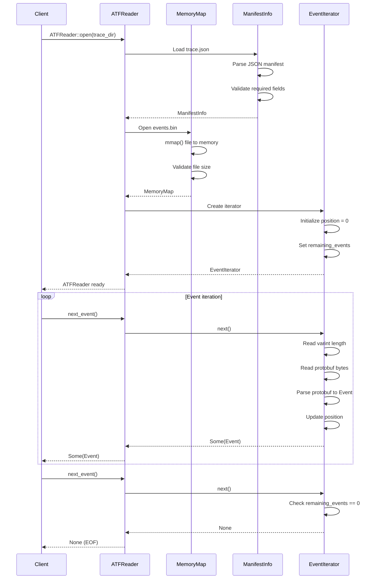
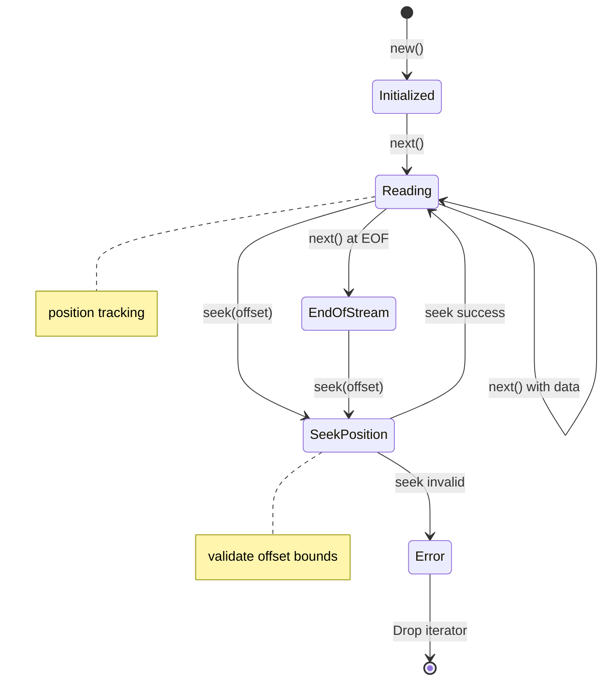

# Tech Design — M1 E4 I1 ATF Reader

## Objective
Implement efficient ATF V4 format parser for reading trace data files produced by the index pipeline, providing the foundation for the query engine's data access layer.

## Architecture Diagram

```mermaid
graph TB
    subgraph "ATF V4 File Structure"
        TJ[trace.json<br/>Manifest File]
        EB[events.bin<br/>Protobuf Stream]
        
        TJ --> META[Trace Metadata<br/>os, arch, timeStartNs, timeEndNs]
        TJ --> STATS[Event Statistics<br/>eventCount, spanCount]
        TJ --> IDX[Index Information<br/>firstEventOffset, lastEventOffset]
        
        EB --> HDR[Length Delimiter<br/>4 bytes varint]
        EB --> PB[Protobuf Event<br/>Variable length]
        EB --> HDR2[Length Delimiter]
        EB --> PB2[Protobuf Event]
        EB --> MORE[...]
    end
    
    subgraph "ATF Reader Components"
        AR[ATFReader]
        MM[MemoryMap<br/>File Access]
        MI[ManifestInfo<br/>JSON Parser]
        EI[EventIterator<br/>Stream Parser]
        
        AR --> MM
        AR --> MI
        AR --> EI
        
        MM --> MFD[mmap() File Descriptor]
        MI --> JSON[JSON Parser]
        EI --> PBP[Protobuf Parser]
    end
    
    subgraph "Iterator Pattern"
        EI --> NEXT[next() -> Option<Event>]
        EI --> SEEK[seek(offset) -> Result]
        EI --> POS[position() -> u64]
        EI --> COUNT[remaining_count() -> u64]
    end
```

## Data Structures

```rust
// Core ATF reader structure
pub struct ATFReader {
    manifest: ManifestInfo,
    memory_map: MemoryMap,
    event_iterator: EventIterator,
    file_path: PathBuf,
}

// Parsed manifest information
pub struct ManifestInfo {
    pub os: String,
    pub arch: String,
    pub time_start_ns: u64,
    pub time_end_ns: u64,
    pub event_count: u64,
    pub span_count: u64,
    pub first_event_offset: u64,
    pub last_event_offset: u64,
    pub events_file_size: u64,
}

// Memory-mapped file access
pub struct MemoryMap {
    file: File,
    mapping: Mmap,
    size: u64,
}

// Event stream iterator
pub struct EventIterator {
    buffer: &'static [u8],
    position: u64,
    remaining_events: u64,
    total_events: u64,
}

// Protobuf event structure (from ATF spec)
#[derive(Clone, Debug)]
pub struct Event {
    pub timestamp_ns: u64,
    pub thread_id: u32,
    pub event_type: EventType,
    pub function_entry: Option<FunctionEntry>,
    pub function_return: Option<FunctionReturn>,
}

#[derive(Clone, Debug)]
pub enum EventType {
    FunctionEntry = 1,
    FunctionReturn = 2,
}

#[derive(Clone, Debug)]
pub struct FunctionEntry {
    pub function_id: u32,
    pub module_name: String,
    pub function_name: String,
    pub return_address: u64,
}

#[derive(Clone, Debug)]
pub struct FunctionReturn {
    pub function_id: u32,
    pub return_value: u64,
}
```

## Sequence Diagram: ATF File Opening



## State Machine: Iterator Position



## Implementation Details

### Memory Mapping Strategy
```rust
impl MemoryMap {
    pub fn new(file_path: &Path) -> Result<Self> {
        let file = File::open(file_path)?;
        let metadata = file.metadata()?;
        let size = metadata.len();
        
        // Memory map the entire file for efficient access
        let mapping = unsafe {
            MmapOptions::new()
                .len(size as usize)
                .map(&file)?
        };
        
        Ok(MemoryMap { file, mapping, size })
    }
    
    pub fn as_slice(&self) -> &[u8] {
        &self.mapping
    }
}
```

### Varint Decoding
```rust
impl EventIterator {
    fn read_varint(&mut self) -> Result<u32> {
        let mut result = 0u32;
        let mut shift = 0;
        
        loop {
            if self.position >= self.buffer.len() as u64 {
                return Err(AtfError::UnexpectedEof);
            }
            
            let byte = self.buffer[self.position as usize];
            self.position += 1;
            
            result |= ((byte & 0x7F) as u32) << shift;
            
            if byte & 0x80 == 0 {
                break;
            }
            
            shift += 7;
            if shift >= 32 {
                return Err(AtfError::VarintTooLarge);
            }
        }
        
        Ok(result)
    }
}
```

### Event Parsing Pipeline
```rust
impl EventIterator {
    pub fn next(&mut self) -> Option<Event> {
        if self.remaining_events == 0 {
            return None;
        }
        
        // Read length-delimited protobuf
        let length = self.read_varint().ok()?;
        let event_bytes = self.read_bytes(length as usize).ok()?;
        
        // Parse protobuf to Event
        let event = Event::parse_from_bytes(event_bytes).ok()?;
        
        self.remaining_events -= 1;
        Some(event)
    }
    
    pub fn seek(&mut self, offset: u64) -> Result<()> {
        if offset > self.buffer.len() as u64 {
            return Err(AtfError::SeekBeyondEnd);
        }
        
        self.position = offset;
        // Note: remaining_events becomes approximate after seek
        Ok(())
    }
}
```

### Error Handling
```rust
#[derive(Debug, Error)]
pub enum AtfError {
    #[error("IO error: {0}")]
    Io(#[from] std::io::Error),
    
    #[error("JSON parsing error: {0}")]
    Json(#[from] serde_json::Error),
    
    #[error("Protobuf parsing error: {0}")]
    Protobuf(#[from] protobuf::Error),
    
    #[error("Invalid ATF format: {0}")]
    InvalidFormat(String),
    
    #[error("Unexpected end of file")]
    UnexpectedEof,
    
    #[error("Varint too large")]
    VarintTooLarge,
    
    #[error("Seek beyond end of file")]
    SeekBeyondEnd,
}
```

## Performance Optimizations

### Memory Access Patterns
- **Sequential reads**: Optimal for iterator pattern
- **Memory mapping**: Avoids copy overhead, leverages OS page cache
- **Bounded checks**: Validate buffer access before reading
- **Zero-copy parsing**: Direct protobuf parsing from mapped memory

### Caching Strategy
```rust
pub struct ATFReader {
    // Cache frequently accessed manifest data
    manifest: ManifestInfo,
    
    // Pre-calculate common queries
    duration_ns: u64,  // time_end_ns - time_start_ns
    avg_event_size: u64,  // events_file_size / event_count
}

impl ATFReader {
    pub fn estimate_position_for_timestamp(&self, timestamp_ns: u64) -> u64 {
        if timestamp_ns <= self.manifest.time_start_ns {
            return 0;
        }
        if timestamp_ns >= self.manifest.time_end_ns {
            return self.manifest.events_file_size;
        }
        
        // Linear interpolation estimate
        let time_ratio = (timestamp_ns - self.manifest.time_start_ns) as f64 
                        / self.duration_ns as f64;
        (time_ratio * self.manifest.events_file_size as f64) as u64
    }
}
```

## Implementation Steps

1. **Define core structures** in `query_engine/src/atf/mod.rs`
2. **Implement memory mapping** for efficient file access
3. **Parse trace.json manifest** with serde_json
4. **Implement varint decoding** for protobuf length prefixes
5. **Build event iterator** with proper error handling
6. **Add seeking capabilities** for random access
7. **Optimize for common access patterns**

## Testing Strategy

### Unit Tests
- `manifest_parser__valid_json__then_parsed`
- `memory_map__large_file__then_accessible`
- `varint_decoder__various_lengths__then_correct`
- `event_iterator__sequential_read__then_ordered`
- `event_iterator__seek_position__then_accurate`

### Integration Tests
- End-to-end reading of sample ATF files
- Large file handling (>1GB traces)
- Corrupted file error handling
- Memory usage validation

### Performance Tests
- Sequential read throughput (>100MB/s)
- Random access latency (<1ms)
- Memory usage scaling with file size

## Success Criteria
- [ ] Parse all ATF V4 files produced by index pipeline
- [ ] Sequential reading >100MB/s throughput
- [ ] Random access seeking <1ms latency
- [ ] Memory usage <10MB overhead for any file size
- [ ] Handle files up to 10GB without issues
- [ ] Proper error handling for corrupted files
- [ ] Zero-copy access where possible

## Dependencies
- M1_E2_I3: ATF V4 Writer (defines file format)
- protobuf-rust crate for event parsing
- serde_json for manifest parsing
- memmap2 for memory mapping

## References
- `BH-002-atf-index-format` (ATF Index Format), `BH-003-atf-detail-format` (ATF Detail Format)
- `BH-010-query-api` (Query API - Data Access)