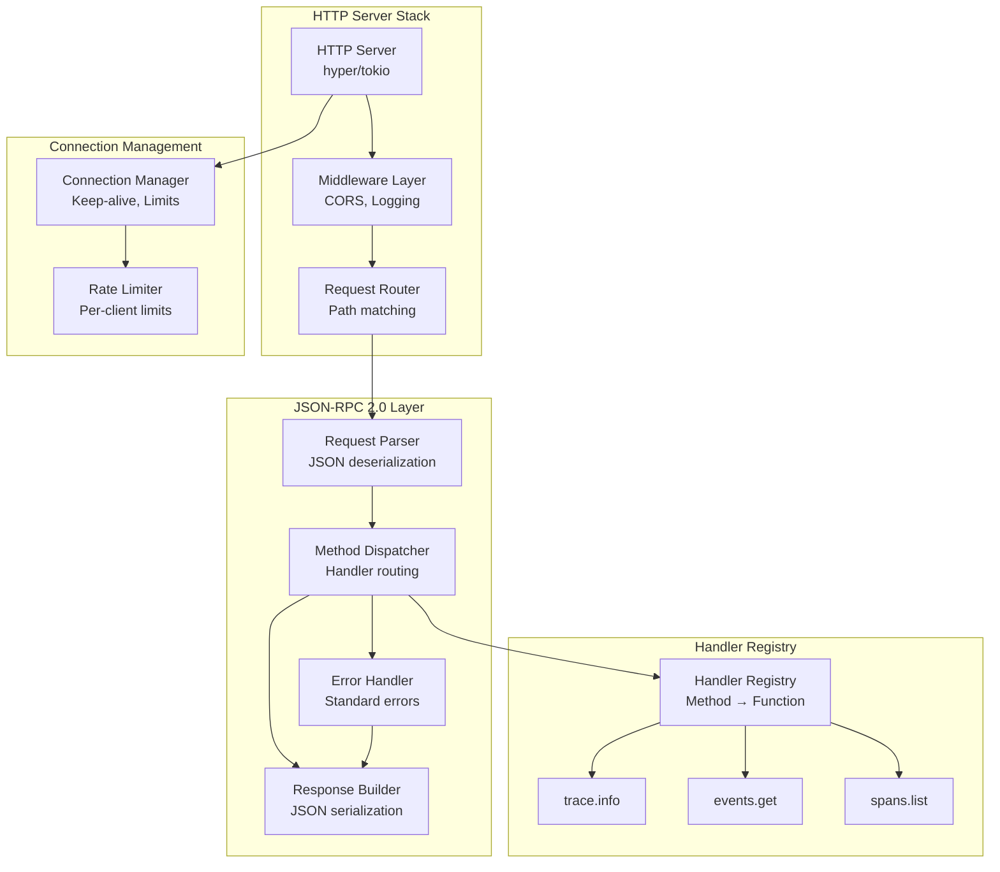
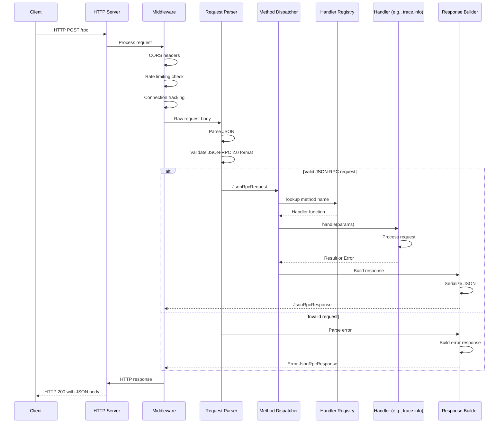
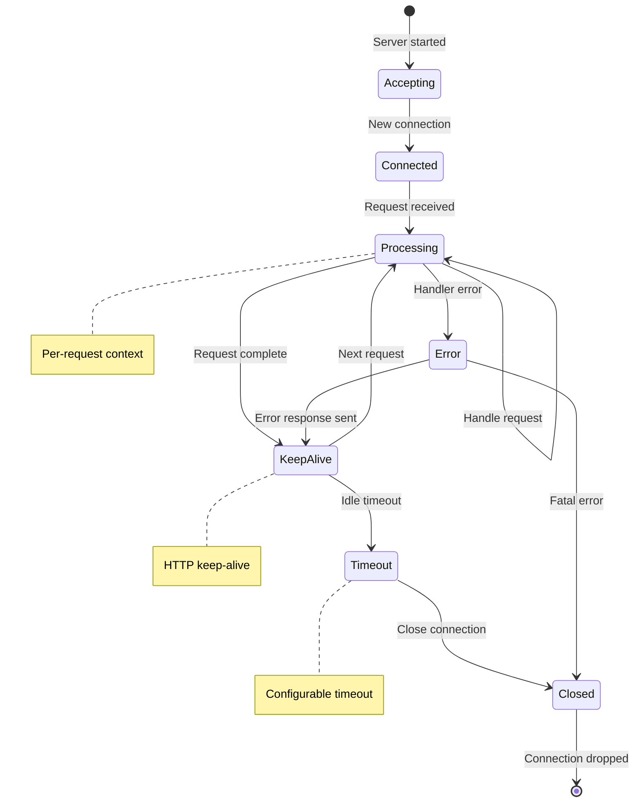

# Tech Design — M1 E4 I2 JSON-RPC Server

## Objective
Implement JSON-RPC 2.0 compliant HTTP server infrastructure to provide standardized API access to trace data analysis, serving as the foundation for all query engine endpoints.

## Architecture Diagram



## Data Structures

```rust
// JSON-RPC 2.0 request structure
#[derive(Debug, Deserialize)]
pub struct JsonRpcRequest {
    pub jsonrpc: String,  // Must be "2.0"
    pub method: String,   // Method name
    pub params: Option<serde_json::Value>,  // Method parameters
    pub id: Option<serde_json::Value>,      // Request ID
}

// JSON-RPC 2.0 response structure
#[derive(Debug, Serialize)]
pub struct JsonRpcResponse {
    pub jsonrpc: String,  // Always "2.0"
    pub result: Option<serde_json::Value>,
    pub error: Option<JsonRpcError>,
    pub id: Option<serde_json::Value>,
}

// JSON-RPC 2.0 error structure
#[derive(Debug, Serialize)]
pub struct JsonRpcError {
    pub code: i32,
    pub message: String,
    pub data: Option<serde_json::Value>,
}

// Server configuration
#[derive(Debug, Clone)]
pub struct ServerConfig {
    pub bind_address: SocketAddr,
    pub max_connections: usize,
    pub request_timeout: Duration,
    pub max_request_size: usize,
    pub enable_cors: bool,
    pub rate_limit_per_minute: u32,
}

// Method handler trait
pub trait JsonRpcHandler: Send + Sync {
    async fn handle(&self, params: Option<serde_json::Value>) 
                   -> Result<serde_json::Value, JsonRpcError>;
}

// Main server structure
pub struct JsonRpcServer {
    config: ServerConfig,
    handler_registry: Arc<HandlerRegistry>,
    connection_manager: Arc<ConnectionManager>,
    rate_limiter: Arc<RateLimiter>,
}

// Handler registry for method dispatch
pub struct HandlerRegistry {
    handlers: HashMap<String, Box<dyn JsonRpcHandler>>,
}

// Connection tracking and management
pub struct ConnectionManager {
    active_connections: Arc<Mutex<HashMap<SocketAddr, ConnectionInfo>>>,
    max_connections: usize,
}

#[derive(Debug)]
pub struct ConnectionInfo {
    established_at: Instant,
    request_count: u64,
    last_activity: Instant,
}
```

## Sequence Diagram: Request Processing



## State Machine: Connection Lifecycle



## Implementation Details

### HTTP Server Foundation
```rust
impl JsonRpcServer {
    pub async fn new(config: ServerConfig) -> Result<Self> {
        let handler_registry = Arc::new(HandlerRegistry::new());
        let connection_manager = Arc::new(ConnectionManager::new(config.max_connections));
        let rate_limiter = Arc::new(RateLimiter::new(config.rate_limit_per_minute));
        
        Ok(JsonRpcServer {
            config,
            handler_registry,
            connection_manager,
            rate_limiter,
        })
    }
    
    pub async fn start(&self) -> Result<()> {
        let addr = self.config.bind_address;
        
        let service = make_service_fn(|conn: &AddrStream| {
            let remote_addr = conn.remote_addr();
            let server = self.clone();
            
            async move {
                Ok::<_, Infallible>(service_fn(move |req| {
                    server.handle_http_request(req, remote_addr)
                }))
            }
        });
        
        let server = Server::bind(&addr).serve(service);
        
        println!("Query Engine JSON-RPC server listening on {}", addr);
        server.await?;
        Ok(())
    }
}
```

### Request Parsing and Validation
```rust
impl JsonRpcServer {
    async fn handle_http_request(
        &self,
        req: Request<Body>,
        remote_addr: SocketAddr
    ) -> Result<Response<Body>, Infallible> {
        // Rate limiting check
        if !self.rate_limiter.check_request(&remote_addr).await {
            return Ok(self.build_rate_limit_response());
        }
        
        // Connection tracking
        self.connection_manager.track_request(&remote_addr);
        
        // Parse and validate request
        match self.process_json_rpc_request(req).await {
            Ok(response) => Ok(response),
            Err(error) => Ok(self.build_error_response(error)),
        }
    }
    
    async fn process_json_rpc_request(
        &self,
        req: Request<Body>
    ) -> Result<Response<Body>, JsonRpcError> {
        // Check method and content type
        if req.method() != Method::POST {
            return Err(JsonRpcError::method_not_found());
        }
        
        if req.headers().get("content-type")
            .and_then(|v| v.to_str().ok()) != Some("application/json") {
            return Err(JsonRpcError::invalid_request("Content-Type must be application/json"));
        }
        
        // Read request body
        let body_bytes = hyper::body::to_bytes(req.into_body()).await
            .map_err(|_| JsonRpcError::parse_error())?;
            
        if body_bytes.len() > self.config.max_request_size {
            return Err(JsonRpcError::invalid_request("Request too large"));
        }
        
        // Parse JSON-RPC request
        let json_rpc_request: JsonRpcRequest = serde_json::from_slice(&body_bytes)
            .map_err(|_| JsonRpcError::parse_error())?;
            
        self.validate_and_dispatch(json_rpc_request).await
    }
}
```

### Method Dispatch System
```rust
impl JsonRpcServer {
    async fn validate_and_dispatch(
        &self,
        request: JsonRpcRequest
    ) -> Result<Response<Body>, JsonRpcError> {
        // Validate JSON-RPC version
        if request.jsonrpc != "2.0" {
            return Err(JsonRpcError::invalid_request("jsonrpc must be '2.0'"));
        }
        
        // Dispatch to handler
        let result = self.handler_registry.dispatch(&request.method, request.params).await;
        
        // Build response
        let response = match result {
            Ok(result) => JsonRpcResponse {
                jsonrpc: "2.0".to_string(),
                result: Some(result),
                error: None,
                id: request.id,
            },
            Err(error) => JsonRpcResponse {
                jsonrpc: "2.0".to_string(),
                result: None,
                error: Some(error),
                id: request.id,
            },
        };
        
        let response_json = serde_json::to_string(&response)
            .map_err(|_| JsonRpcError::internal_error())?;
            
        Ok(Response::builder()
            .status(StatusCode::OK)
            .header("content-type", "application/json")
            .header("access-control-allow-origin", "*")  // If CORS enabled
            .body(Body::from(response_json))
            .unwrap())
    }
}
```

### Handler Registry
```rust
impl HandlerRegistry {
    pub fn new() -> Self {
        HandlerRegistry {
            handlers: HashMap::new(),
        }
    }
    
    pub fn register<H>(&mut self, method: &str, handler: H)
    where
        H: JsonRpcHandler + 'static,
    {
        self.handlers.insert(method.to_string(), Box::new(handler));
    }
    
    pub async fn dispatch(
        &self,
        method: &str,
        params: Option<serde_json::Value>
    ) -> Result<serde_json::Value, JsonRpcError> {
        match self.handlers.get(method) {
            Some(handler) => handler.handle(params).await,
            None => Err(JsonRpcError::method_not_found()),
        }
    }
}
```

### Error Code Standards (JSON-RPC 2.0)
```rust
impl JsonRpcError {
    pub fn parse_error() -> Self {
        JsonRpcError {
            code: -32700,
            message: "Parse error".to_string(),
            data: None,
        }
    }
    
    pub fn invalid_request(details: &str) -> Self {
        JsonRpcError {
            code: -32600,
            message: "Invalid Request".to_string(),
            data: Some(serde_json::Value::String(details.to_string())),
        }
    }
    
    pub fn method_not_found() -> Self {
        JsonRpcError {
            code: -32601,
            message: "Method not found".to_string(),
            data: None,
        }
    }
    
    pub fn invalid_params(details: &str) -> Self {
        JsonRpcError {
            code: -32602,
            message: "Invalid params".to_string(),
            data: Some(serde_json::Value::String(details.to_string())),
        }
    }
    
    pub fn internal_error() -> Self {
        JsonRpcError {
            code: -32603,
            message: "Internal error".to_string(),
            data: None,
        }
    }
    
    // Application-specific errors (starting from -32000)
    pub fn trace_not_found() -> Self {
        JsonRpcError {
            code: -32000,
            message: "Trace file not found".to_string(),
            data: None,
        }
    }
    
    pub fn invalid_filter() -> Self {
        JsonRpcError {
            code: -32001,
            message: "Invalid filter parameters".to_string(),
            data: None,
        }
    }
}
```

### Connection Management
```rust
impl ConnectionManager {
    pub fn new(max_connections: usize) -> Self {
        ConnectionManager {
            active_connections: Arc::new(Mutex::new(HashMap::new())),
            max_connections,
        }
    }
    
    pub fn track_request(&self, addr: &SocketAddr) {
        let mut connections = self.active_connections.lock().unwrap();
        
        if connections.len() >= self.max_connections {
            // Remove oldest connections
            self.cleanup_old_connections(&mut connections);
        }
        
        connections.entry(*addr)
            .and_modify(|info| {
                info.request_count += 1;
                info.last_activity = Instant::now();
            })
            .or_insert_with(|| ConnectionInfo {
                established_at: Instant::now(),
                request_count: 1,
                last_activity: Instant::now(),
            });
    }
    
    fn cleanup_old_connections(&self, connections: &mut HashMap<SocketAddr, ConnectionInfo>) {
        let cutoff = Instant::now() - Duration::from_secs(300); // 5 minutes
        connections.retain(|_, info| info.last_activity > cutoff);
    }
}
```

## Performance Optimizations

### Async Request Processing
- Non-blocking I/O with tokio runtime
- Connection pooling and reuse
- Streaming JSON parsing for large requests
- Response caching for repeated queries

### Memory Management
- Zero-copy JSON parsing where possible
- Pre-allocated response buffers
- Connection state cleanup
- Bounded request queues

### Concurrency
```rust
// Handler execution with timeout
pub async fn execute_with_timeout<F, T>(
    future: F,
    timeout: Duration,
) -> Result<T, JsonRpcError>
where
    F: Future<Output = Result<T, JsonRpcError>>,
{
    match tokio::time::timeout(timeout, future).await {
        Ok(result) => result,
        Err(_) => Err(JsonRpcError::internal_error()),
    }
}
```

## Implementation Steps

1. **HTTP server foundation** with hyper and tokio
2. **JSON-RPC request parsing** and validation
3. **Method dispatch system** with handler registry
4. **Error handling** per JSON-RPC 2.0 spec
5. **Connection management** and rate limiting
6. **CORS and security headers**
7. **Performance optimizations**

## Testing Strategy

### Unit Tests
- `json_rpc_parser__valid_request__then_parsed`
- `method_dispatcher__known_method__then_called`
- `error_handler__parse_error__then_standard_code`
- `connection_manager__max_connections__then_limited`

### Integration Tests
- End-to-end HTTP request/response cycle
- Concurrent request handling
- Error condition coverage
- Rate limiting validation

### Performance Tests
- Request throughput (>1000 req/s)
- Response latency (<10ms)
- Memory usage under load
- Connection scaling

## Success Criteria
- [ ] JSON-RPC 2.0 compliant request/response
- [ ] Handle concurrent requests efficiently
- [ ] Proper error codes per specification
- [ ] Rate limiting and connection management
- [ ] CORS support for browser clients
- [ ] Request timeout handling
- [ ] Graceful error responses

## Dependencies
- M1_E4_I1: ATF Reader (data access layer)
- hyper crate for HTTP server
- tokio for async runtime
- serde_json for JSON serialization

## References
- `BH-010-query-api` (Query API - HTTP API)