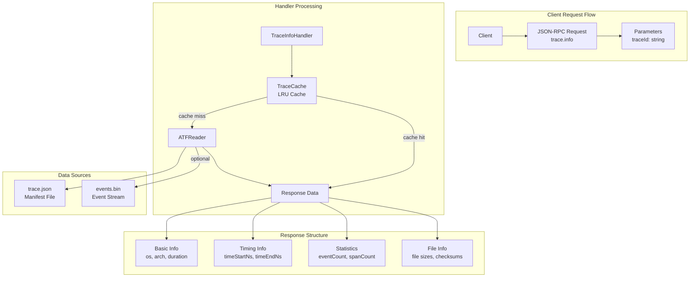
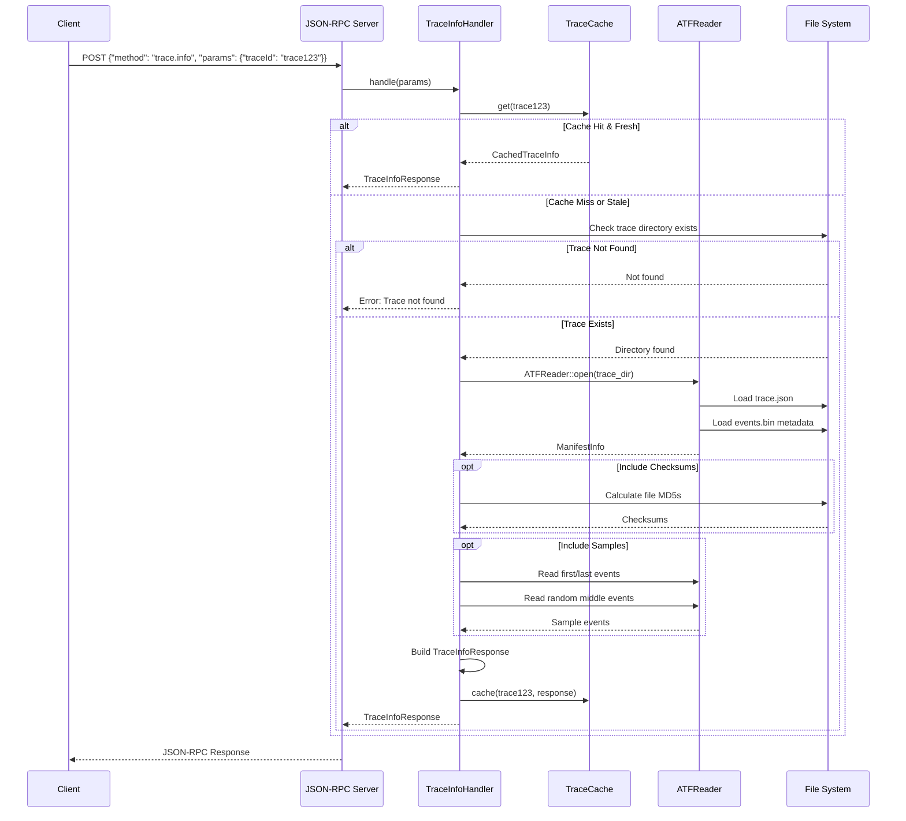
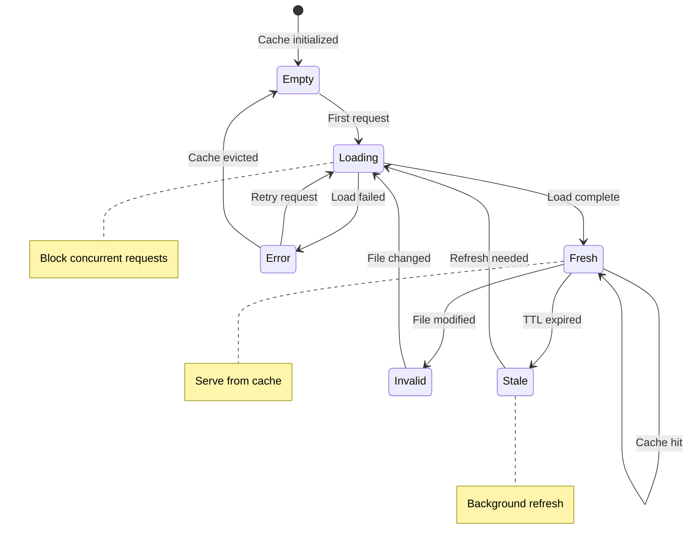

# Tech Design — M1 E4 I3 Trace Info API

## Objective
Implement the trace.info JSON-RPC endpoint that provides fast access to trace metadata and statistics, enabling clients to understand trace characteristics before performing detailed queries.

## Architecture Diagram



## Data Structures

```rust
// Request parameters for trace.info
#[derive(Debug, Deserialize)]
pub struct TraceInfoParams {
    #[serde(rename = "traceId")]
    pub trace_id: String,  // Trace identifier (directory name or path)
    
    #[serde(default)]
    pub include_checksums: bool,  // Include file checksums (optional)
    
    #[serde(default)]
    pub include_samples: bool,    // Include sample events (optional)
}

// Response structure for trace.info
#[derive(Debug, Serialize)]
pub struct TraceInfoResponse {
    // Basic trace information
    #[serde(rename = "traceId")]
    pub trace_id: String,
    pub os: String,
    pub arch: String,
    
    // Timing information
    #[serde(rename = "timeStartNs")]
    pub time_start_ns: u64,
    #[serde(rename = "timeEndNs")]
    pub time_end_ns: u64,
    #[serde(rename = "durationNs")]
    pub duration_ns: u64,
    
    // Event statistics
    #[serde(rename = "eventCount")]
    pub event_count: u64,
    #[serde(rename = "spanCount")]
    pub span_count: u64,
    
    // File information
    pub files: TraceFileInfo,
    
    // Optional fields
    #[serde(skip_serializing_if = "Option::is_none")]
    pub checksums: Option<TraceChecksums>,
    
    #[serde(skip_serializing_if = "Option::is_none")]
    pub samples: Option<TraceSamples>,
}

// File size and metadata information
#[derive(Debug, Serialize)]
pub struct TraceFileInfo {
    #[serde(rename = "manifestSize")]
    pub manifest_size: u64,      // trace.json size in bytes
    #[serde(rename = "eventsSize")]
    pub events_size: u64,        // events.bin size in bytes
    #[serde(rename = "totalSize")]
    pub total_size: u64,         // Combined size
    #[serde(rename = "avgEventSize")]
    pub avg_event_size: u64,     // Average event size in bytes
}

// Optional checksum information
#[derive(Debug, Serialize)]
pub struct TraceChecksums {
    #[serde(rename = "manifestMd5")]
    pub manifest_md5: String,
    #[serde(rename = "eventsMd5")]
    pub events_md5: String,
}

// Optional sample events for preview
#[derive(Debug, Serialize)]
pub struct TraceSamples {
    #[serde(rename = "firstEvents")]
    pub first_events: Vec<EventSample>,  // First 5 events
    #[serde(rename = "lastEvents")]  
    pub last_events: Vec<EventSample>,   // Last 5 events
    #[serde(rename = "randomEvents")]
    pub random_events: Vec<EventSample>, // 5 random events from middle
}

#[derive(Debug, Serialize)]
pub struct EventSample {
    #[serde(rename = "timestampNs")]
    pub timestamp_ns: u64,
    #[serde(rename = "threadId")]
    pub thread_id: u32,
    #[serde(rename = "eventType")]
    pub event_type: String,
    #[serde(skip_serializing_if = "Option::is_none")]
    pub function_name: Option<String>,
    #[serde(skip_serializing_if = "Option::is_none")]
    pub module_name: Option<String>,
}

// Handler implementation
pub struct TraceInfoHandler {
    cache: Arc<Mutex<LruCache<String, CachedTraceInfo>>>,
    trace_root_dir: PathBuf,
    cache_ttl: Duration,
}

// Cached trace information for performance
#[derive(Debug, Clone)]
struct CachedTraceInfo {
    info: TraceInfoResponse,
    cached_at: Instant,
    file_modified_time: SystemTime,
}
```

## Sequence Diagram: trace.info Request Processing



## State Machine: Cache Entry Lifecycle



## Implementation Details

### Handler Registration
```rust
impl TraceInfoHandler {
    pub fn new(trace_root_dir: PathBuf, cache_size: usize, cache_ttl: Duration) -> Self {
        TraceInfoHandler {
            cache: Arc::new(Mutex::new(LruCache::new(cache_size))),
            trace_root_dir,
            cache_ttl,
        }
    }
    
    pub fn register(self, server: &mut JsonRpcServer) {
        server.register_handler("trace.info", Box::new(self));
    }
}

impl JsonRpcHandler for TraceInfoHandler {
    async fn handle(&self, params: Option<serde_json::Value>) 
                   -> Result<serde_json::Value, JsonRpcError> {
        let params: TraceInfoParams = match params {
            Some(p) => serde_json::from_value(p)
                .map_err(|_| JsonRpcError::invalid_params("Invalid trace.info parameters"))?,
            None => return Err(JsonRpcError::invalid_params("Missing traceId parameter")),
        };
        
        let response = self.get_trace_info(params).await?;
        serde_json::to_value(response)
            .map_err(|_| JsonRpcError::internal_error())
    }
}
```

### Core Implementation
```rust
impl TraceInfoHandler {
    async fn get_trace_info(&self, params: TraceInfoParams) -> Result<TraceInfoResponse, JsonRpcError> {
        // Check cache first
        if let Some(cached) = self.check_cache(&params.trace_id)? {
            return Ok(cached.info);
        }
        
        // Load from filesystem
        let trace_dir = self.trace_root_dir.join(&params.trace_id);
        if !trace_dir.exists() {
            return Err(JsonRpcError::trace_not_found());
        }
        
        let atf_reader = ATFReader::open(&trace_dir)
            .map_err(|e| JsonRpcError::internal_error_with_data(&format!("Failed to open trace: {}", e)))?;
        
        let manifest = atf_reader.manifest();
        
        // Build basic response
        let mut response = TraceInfoResponse {
            trace_id: params.trace_id.clone(),
            os: manifest.os.clone(),
            arch: manifest.arch.clone(),
            time_start_ns: manifest.time_start_ns,
            time_end_ns: manifest.time_end_ns,
            duration_ns: manifest.time_end_ns - manifest.time_start_ns,
            event_count: manifest.event_count,
            span_count: manifest.span_count,
            files: self.calculate_file_info(&trace_dir, manifest)?,
            checksums: None,
            samples: None,
        };
        
        // Add optional information
        if params.include_checksums {
            response.checksums = Some(self.calculate_checksums(&trace_dir).await?);
        }
        
        if params.include_samples {
            response.samples = Some(self.extract_samples(&atf_reader).await?);
        }
        
        // Cache the response
        self.cache_response(&params.trace_id, &response, &trace_dir)?;
        
        Ok(response)
    }
    
    fn check_cache(&self, trace_id: &str) -> Result<Option<CachedTraceInfo>, JsonRpcError> {
        let mut cache = self.cache.lock().map_err(|_| JsonRpcError::internal_error())?;
        
        if let Some(cached) = cache.get(trace_id) {
            // Check if cache entry is still valid
            if cached.cached_at.elapsed() < self.cache_ttl {
                // Check if files have been modified
                let trace_dir = self.trace_root_dir.join(trace_id);
                if let Ok(metadata) = fs::metadata(trace_dir.join("trace.json")) {
                    if let Ok(modified) = metadata.modified() {
                        if modified <= cached.file_modified_time {
                            return Ok(Some(cached.clone()));
                        }
                    }
                }
            }
        }
        
        Ok(None)
    }
}
```

### File Information Calculation
```rust
impl TraceInfoHandler {
    fn calculate_file_info(&self, trace_dir: &Path, manifest: &ManifestInfo) 
                          -> Result<TraceFileInfo, JsonRpcError> {
        let manifest_path = trace_dir.join("trace.json");
        let events_path = trace_dir.join("events.bin");
        
        let manifest_size = fs::metadata(manifest_path)
            .map_err(|_| JsonRpcError::internal_error())?
            .len();
            
        let events_size = fs::metadata(events_path)
            .map_err(|_| JsonRpcError::internal_error())?
            .len();
        
        let avg_event_size = if manifest.event_count > 0 {
            events_size / manifest.event_count
        } else {
            0
        };
        
        Ok(TraceFileInfo {
            manifest_size,
            events_size,
            total_size: manifest_size + events_size,
            avg_event_size,
        })
    }
    
    async fn calculate_checksums(&self, trace_dir: &Path) 
                                -> Result<TraceChecksums, JsonRpcError> {
        let manifest_path = trace_dir.join("trace.json");
        let events_path = trace_dir.join("events.bin");
        
        // Calculate checksums in parallel
        let (manifest_md5, events_md5) = tokio::try_join!(
            self.calculate_file_md5(&manifest_path),
            self.calculate_file_md5(&events_path)
        )?;
        
        Ok(TraceChecksums {
            manifest_md5,
            events_md5,
        })
    }
    
    async fn calculate_file_md5(&self, file_path: &Path) -> Result<String, JsonRpcError> {
        use md5::{Md5, Digest};
        
        let mut file = tokio::fs::File::open(file_path).await
            .map_err(|_| JsonRpcError::internal_error())?;
            
        let mut hasher = Md5::new();
        let mut buffer = vec![0; 8192];
        
        loop {
            let bytes_read = file.read(&mut buffer).await
                .map_err(|_| JsonRpcError::internal_error())?;
                
            if bytes_read == 0 {
                break;
            }
            
            hasher.update(&buffer[..bytes_read]);
        }
        
        Ok(format!("{:x}", hasher.finalize()))
    }
}
```

### Sample Event Extraction
```rust
impl TraceInfoHandler {
    async fn extract_samples(&self, atf_reader: &ATFReader) -> Result<TraceSamples, JsonRpcError> {
        let manifest = atf_reader.manifest();
        let mut iterator = atf_reader.event_iterator();
        
        let mut first_events = Vec::new();
        let mut all_events = Vec::new();
        
        // Collect first 5 events
        for _ in 0..5 {
            if let Some(event) = iterator.next() {
                let sample = self.event_to_sample(&event);
                first_events.push(sample.clone());
                all_events.push(sample);
            }
        }
        
        // Collect middle events (sample every N events)
        let sample_interval = if manifest.event_count > 100 {
            manifest.event_count / 50  // Sample ~50 events from middle
        } else {
            1
        };
        
        let mut count = 5;  // Already read first 5
        let mut middle_events = Vec::new();
        
        while let Some(event) = iterator.next() {
            count += 1;
            
            if count % sample_interval == 0 && middle_events.len() < 5 {
                let sample = self.event_to_sample(&event);
                middle_events.push(sample.clone());
                all_events.push(sample);
            }
            
            // Keep last 5 events in a sliding window
            if all_events.len() > 10 { // Keep first 5 + last 5
                all_events.remove(5); // Remove oldest from middle
            }
        }
        
        // Last 5 events are at the end of all_events
        let last_events = if all_events.len() > 5 {
            all_events[all_events.len()-5..].to_vec()
        } else {
            all_events[first_events.len()..].to_vec()
        };
        
        // Random 5 events from middle_events
        let mut random_events = middle_events;
        random_events.truncate(5);
        
        Ok(TraceSamples {
            first_events,
            last_events,
            random_events,
        })
    }
    
    fn event_to_sample(&self, event: &Event) -> EventSample {
        EventSample {
            timestamp_ns: event.timestamp_ns,
            thread_id: event.thread_id,
            event_type: match event.event_type {
                EventType::FunctionEntry => "ENTRY".to_string(),
                EventType::FunctionReturn => "RETURN".to_string(),
            },
            function_name: event.function_entry.as_ref()
                .map(|entry| entry.function_name.clone()),
            module_name: event.function_entry.as_ref()
                .map(|entry| entry.module_name.clone()),
        }
    }
}
```

## Performance Optimizations

### Caching Strategy
- **LRU cache** for trace metadata with configurable size
- **TTL-based expiration** to balance freshness and performance
- **File modification time checking** to detect stale cache entries
- **Lazy loading** of optional data (checksums, samples)

### Async Operations
- **Parallel checksum calculation** for manifest and events files
- **Non-blocking file I/O** using tokio::fs
- **Streaming event sampling** without loading entire file
- **Concurrent request handling** with shared cache

### Memory Management
```rust
// Efficient sampling without loading all events
pub struct StreamingSampler {
    first_count: usize,
    last_buffer: VecDeque<EventSample>,
    sample_interval: u64,
    current_count: u64,
    random_samples: Vec<EventSample>,
}

impl StreamingSampler {
    pub fn new(total_events: u64) -> Self {
        let sample_interval = std::cmp::max(1, total_events / 50);
        
        StreamingSampler {
            first_count: 0,
            last_buffer: VecDeque::with_capacity(5),
            sample_interval,
            current_count: 0,
            random_samples: Vec::new(),
        }
    }
    
    pub fn process_event(&mut self, event: &Event) -> Option<EventSample> {
        self.current_count += 1;
        let sample = event_to_sample(event);
        
        // Collect first 5
        if self.first_count < 5 {
            self.first_count += 1;
            return Some(sample);
        }
        
        // Sample middle events
        if self.current_count % self.sample_interval == 0 && self.random_samples.len() < 5 {
            self.random_samples.push(sample.clone());
        }
        
        // Keep sliding window of last 5
        if self.last_buffer.len() >= 5 {
            self.last_buffer.pop_front();
        }
        self.last_buffer.push_back(sample);
        
        None
    }
}
```

## Implementation Steps

1. **Create TraceInfoHandler struct** with caching
2. **Implement JSON-RPC handler interface**
3. **Add trace directory validation**
4. **Implement manifest data extraction**
5. **Add file size and metadata calculation**
6. **Implement optional checksum calculation**
7. **Add sample event extraction**
8. **Integrate with JSON-RPC server**

## Testing Strategy

### Unit Tests
- `trace_info_handler__valid_trace__then_metadata`
- `trace_info_handler__missing_trace__then_error`
- `cache__fresh_entry__then_hit`
- `checksums__valid_files__then_correct_md5`
- `samples__event_stream__then_representative`

### Integration Tests
- End-to-end JSON-RPC trace.info requests
- Cache behavior under load
- File modification detection
- Error handling for corrupted files

### Performance Tests
- Response time for cached vs uncached requests
- Memory usage with large caches
- Concurrent request handling

## Success Criteria
- [ ] Fast metadata access (<50ms for cached, <500ms uncached)
- [ ] Efficient caching with configurable TTL
- [ ] Optional checksum calculation
- [ ] Representative event sampling
- [ ] Proper error handling for missing/corrupted traces
- [ ] Memory-efficient operation

## Dependencies
- M1_E4_I1: ATF Reader (for trace data access)
- M1_E4_I2: JSON-RPC Server (for handler registration)
- LRU cache implementation
- MD5 checksum library

## References
- `BH-010-query-api` (Query API - trace.info endpoint)
- `BH-002-atf-index-format` (ATF Index Format), `BH-003-atf-detail-format` (ATF Detail Format)