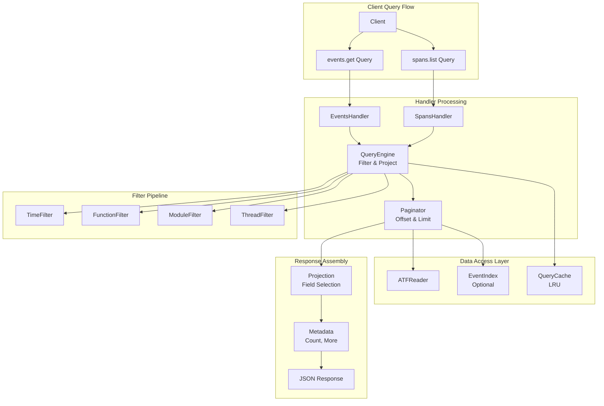
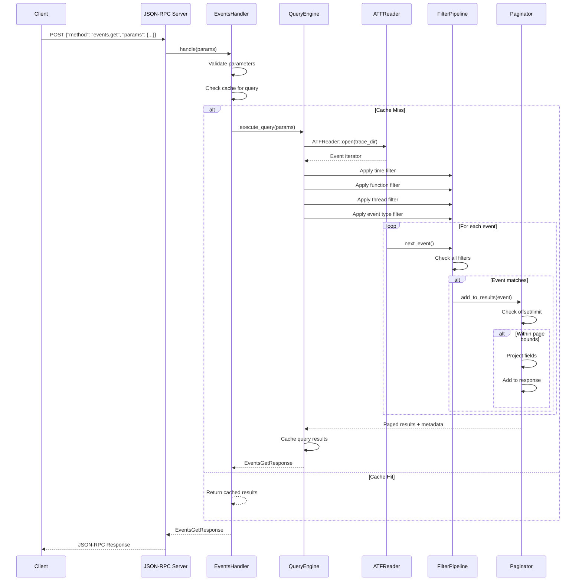
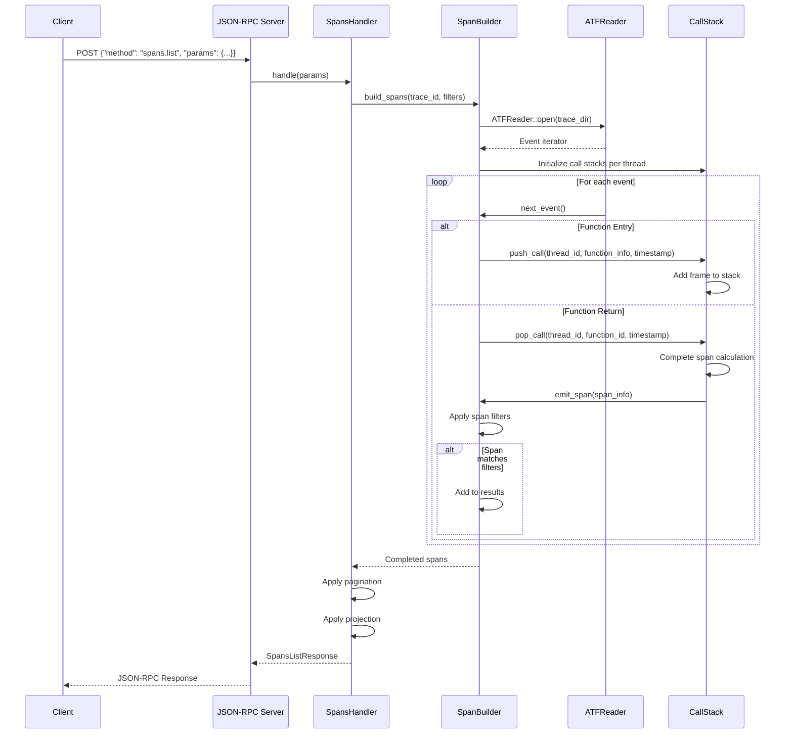
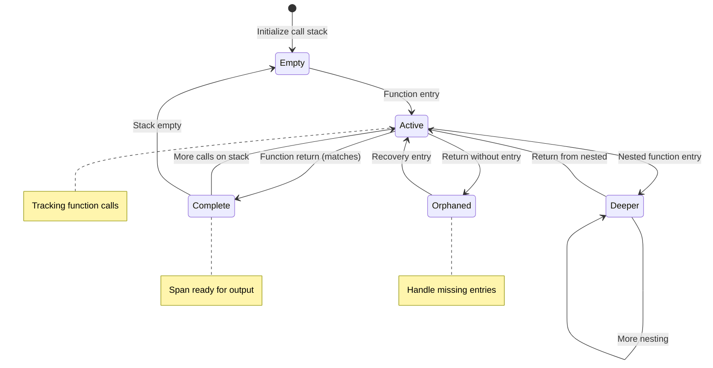

# Tech Design — M1 E4 I4 Events/Spans API

## Objective
Implement the events.get and spans.list JSON-RPC endpoints that enable detailed querying of trace data with filtering, projection, and pagination capabilities for efficient analysis of function call patterns.

## Architecture Diagram



## Data Structures

```rust
// events.get request parameters
#[derive(Debug, Deserialize)]
pub struct EventsGetParams {
    #[serde(rename = "traceId")]
    pub trace_id: String,
    
    // Filtering
    #[serde(default)]
    pub filters: EventFilters,
    
    // Projection (which fields to return)
    #[serde(default)]
    pub projection: EventProjection,
    
    // Pagination
    #[serde(default)]
    pub offset: u64,
    #[serde(default = "default_limit")]
    pub limit: u64,  // Default 1000, max 10000
    
    // Ordering
    #[serde(default = "default_order_by")]
    pub order_by: OrderBy,  // timestamp, thread_id
    #[serde(default)]
    pub ascending: bool,
}

// spans.list request parameters  
#[derive(Debug, Deserialize)]
pub struct SpansListParams {
    #[serde(rename = "traceId")]
    pub trace_id: String,
    
    // Filtering
    #[serde(default)]
    pub filters: SpanFilters,
    
    // Projection
    #[serde(default)]
    pub projection: SpanProjection,
    
    // Pagination
    #[serde(default)]
    pub offset: u64,
    #[serde(default = "default_limit")]
    pub limit: u64,
    
    // Span-specific options
    #[serde(default)]
    pub include_children: bool,  // Include nested spans
    #[serde(default)]
    pub min_duration_ns: Option<u64>,  // Minimum span duration
}

// Event filtering options
#[derive(Debug, Default, Deserialize)]
pub struct EventFilters {
    pub time_start_ns: Option<u64>,
    pub time_end_ns: Option<u64>,
    pub thread_ids: Option<Vec<u32>>,
    pub event_types: Option<Vec<EventType>>,  // ENTRY, RETURN
    pub function_names: Option<Vec<String>>,
    pub module_names: Option<Vec<String>>,
    pub function_ids: Option<Vec<u32>>,
}

// Span filtering options
#[derive(Debug, Default, Deserialize)]
pub struct SpanFilters {
    pub time_start_ns: Option<u64>,
    pub time_end_ns: Option<u64>,
    pub thread_ids: Option<Vec<u32>>,
    pub function_names: Option<Vec<String>>,
    pub module_names: Option<Vec<String>>,
    pub min_duration_ns: Option<u64>,
    pub max_duration_ns: Option<u64>,
    pub min_depth: Option<u32>,  // Call stack depth
    pub max_depth: Option<u32>,
}

// Event projection (field selection)
#[derive(Debug, Default, Deserialize)]
pub struct EventProjection {
    #[serde(default = "default_true")]
    pub timestamp_ns: bool,
    #[serde(default = "default_true")]
    pub thread_id: bool,
    #[serde(default = "default_true")]
    pub event_type: bool,
    #[serde(default)]
    pub function_name: bool,
    #[serde(default)]
    pub module_name: bool,
    #[serde(default)]
    pub function_id: bool,
    #[serde(default)]
    pub return_address: bool,
    #[serde(default)]
    pub return_value: bool,
}

// Span projection  
#[derive(Debug, Default, Deserialize)]
pub struct SpanProjection {
    #[serde(default = "default_true")]
    pub span_id: bool,
    #[serde(default = "default_true")]
    pub function_name: bool,
    #[serde(default = "default_true")]
    pub start_time_ns: bool,
    #[serde(default = "default_true")]
    pub end_time_ns: bool,
    #[serde(default = "default_true")]
    pub duration_ns: bool,
    #[serde(default)]
    pub thread_id: bool,
    #[serde(default)]
    pub module_name: bool,
    #[serde(default)]
    pub depth: bool,
    #[serde(default)]
    pub child_count: bool,
}

// events.get response
#[derive(Debug, Serialize)]
pub struct EventsGetResponse {
    pub events: Vec<EventResult>,
    pub metadata: QueryMetadata,
}

// spans.list response
#[derive(Debug, Serialize)]
pub struct SpansListResponse {
    pub spans: Vec<SpanResult>,
    pub metadata: QueryMetadata,
}

// Individual event result (projected fields)
#[derive(Debug, Serialize)]
pub struct EventResult {
    #[serde(skip_serializing_if = "Option::is_none")]
    pub timestamp_ns: Option<u64>,
    #[serde(skip_serializing_if = "Option::is_none")]
    pub thread_id: Option<u32>,
    #[serde(skip_serializing_if = "Option::is_none")]
    pub event_type: Option<String>,
    #[serde(skip_serializing_if = "Option::is_none")]
    pub function_name: Option<String>,
    #[serde(skip_serializing_if = "Option::is_none")]
    pub module_name: Option<String>,
    #[serde(skip_serializing_if = "Option::is_none")]
    pub function_id: Option<u32>,
    #[serde(skip_serializing_if = "Option::is_none")]
    pub return_address: Option<u64>,
    #[serde(skip_serializing_if = "Option::is_none")]
    pub return_value: Option<u64>,
}

// Individual span result  
#[derive(Debug, Serialize)]
pub struct SpanResult {
    #[serde(skip_serializing_if = "Option::is_none")]
    pub span_id: Option<String>,
    #[serde(skip_serializing_if = "Option::is_none")]
    pub function_name: Option<String>,
    #[serde(skip_serializing_if = "Option::is_none")]
    pub start_time_ns: Option<u64>,
    #[serde(skip_serializing_if = "Option::is_none")]
    pub end_time_ns: Option<u64>,
    #[serde(skip_serializing_if = "Option::is_none")]
    pub duration_ns: Option<u64>,
    #[serde(skip_serializing_if = "Option::is_none")]
    pub thread_id: Option<u32>,
    #[serde(skip_serializing_if = "Option::is_none")]
    pub module_name: Option<String>,
    #[serde(skip_serializing_if = "Option::is_none")]
    pub depth: Option<u32>,
    #[serde(skip_serializing_if = "Option::is_none")]
    pub child_count: Option<u32>,
}

// Query result metadata
#[derive(Debug, Serialize)]
pub struct QueryMetadata {
    pub total_count: u64,      // Total matching records (before pagination)
    pub returned_count: u64,   // Records in this response
    pub offset: u64,           // Current offset
    pub limit: u64,            // Current limit
    pub has_more: bool,        // More records available
    pub execution_time_ms: u64, // Query execution time
}

// Handler implementations
pub struct EventsHandler {
    query_engine: Arc<QueryEngine>,
    cache: Arc<Mutex<LruCache<String, CachedQuery>>>,
}

pub struct SpansHandler {
    query_engine: Arc<QueryEngine>,
    span_builder: Arc<SpanBuilder>,
    cache: Arc<Mutex<LruCache<String, CachedSpans>>>,
}

// Core query execution engine
pub struct QueryEngine {
    trace_root_dir: PathBuf,
    max_query_time: Duration,
    max_results: u64,
}

// Span construction from entry/return pairs
pub struct SpanBuilder {
    call_stack_tracker: HashMap<u32, CallStack>, // Per thread
}

#[derive(Debug)]
struct CallStack {
    frames: Vec<CallFrame>,
}

#[derive(Debug)]
struct CallFrame {
    function_id: u32,
    function_name: String,
    module_name: String,
    start_time_ns: u64,
    depth: u32,
}
```

## Sequence Diagram: events.get Processing



## Sequence Diagram: spans.list Processing



## State Machine: Span Construction



## Implementation Details

### Events Handler
```rust
impl EventsHandler {
    pub fn new(query_engine: Arc<QueryEngine>, cache_size: usize) -> Self {
        EventsHandler {
            query_engine,
            cache: Arc::new(Mutex::new(LruCache::new(cache_size))),
        }
    }
    
    async fn get_events(&self, params: EventsGetParams) -> Result<EventsGetResponse, JsonRpcError> {
        // Validate parameters
        self.validate_params(&params)?;
        
        // Check cache  
        let cache_key = self.generate_cache_key(&params);
        if let Some(cached) = self.check_cache(&cache_key)? {
            return Ok(cached);
        }
        
        // Execute query
        let start = Instant::now();
        let results = self.query_engine.execute_events_query(params.clone()).await?;
        let execution_time = start.elapsed();
        
        let response = EventsGetResponse {
            events: results.events,
            metadata: QueryMetadata {
                total_count: results.total_count,
                returned_count: results.events.len() as u64,
                offset: params.offset,
                limit: params.limit,
                has_more: results.has_more,
                execution_time_ms: execution_time.as_millis() as u64,
            },
        };
        
        // Cache results
        self.cache_response(&cache_key, &response)?;
        
        Ok(response)
    }
    
    fn validate_params(&self, params: &EventsGetParams) -> Result<(), JsonRpcError> {
        if params.trace_id.is_empty() {
            return Err(JsonRpcError::invalid_params("traceId cannot be empty"));
        }
        
        if params.limit > 10000 {
            return Err(JsonRpcError::invalid_params("limit cannot exceed 10000"));
        }
        
        if let (Some(start), Some(end)) = (params.filters.time_start_ns, params.filters.time_end_ns) {
            if start >= end {
                return Err(JsonRpcError::invalid_params("time_start_ns must be less than time_end_ns"));
            }
        }
        
        Ok(())
    }
}
```

### Query Engine Core
```rust
impl QueryEngine {
    pub async fn execute_events_query(&self, params: EventsGetParams) -> Result<QueryResults, JsonRpcError> {
        let trace_dir = self.trace_root_dir.join(&params.trace_id);
        let atf_reader = ATFReader::open(&trace_dir)
            .map_err(|e| JsonRpcError::trace_not_found())?;
        
        let mut iterator = atf_reader.event_iterator();
        let mut results = Vec::new();
        let mut total_count = 0u64;
        let mut current_offset = 0u64;
        
        // Apply filters and collect results
        while let Some(event) = iterator.next() {
            if self.event_matches_filters(&event, &params.filters) {
                total_count += 1;
                
                // Handle pagination
                if current_offset >= params.offset {
                    if results.len() < params.limit as usize {
                        let projected = self.project_event(&event, &params.projection);
                        results.push(projected);
                    }
                }
                current_offset += 1;
            }
        }
        
        let has_more = total_count > params.offset + results.len() as u64;
        
        Ok(QueryResults {
            events: results,
            total_count,
            has_more,
        })
    }
    
    fn event_matches_filters(&self, event: &Event, filters: &EventFilters) -> bool {
        // Time range filter
        if let Some(start) = filters.time_start_ns {
            if event.timestamp_ns < start {
                return false;
            }
        }
        if let Some(end) = filters.time_end_ns {
            if event.timestamp_ns > end {
                return false;
            }
        }
        
        // Thread filter
        if let Some(ref thread_ids) = filters.thread_ids {
            if !thread_ids.contains(&event.thread_id) {
                return false;
            }
        }
        
        // Event type filter
        if let Some(ref event_types) = filters.event_types {
            if !event_types.contains(&event.event_type) {
                return false;
            }
        }
        
        // Function name filter
        if let Some(ref function_names) = filters.function_names {
            let event_function_name = match &event.function_entry {
                Some(entry) => &entry.function_name,
                None => return false,
            };
            if !function_names.contains(event_function_name) {
                return false;
            }
        }
        
        // Module name filter
        if let Some(ref module_names) = filters.module_names {
            let event_module_name = match &event.function_entry {
                Some(entry) => &entry.module_name,
                None => return false,
            };
            if !module_names.contains(event_module_name) {
                return false;
            }
        }
        
        true
    }
    
    fn project_event(&self, event: &Event, projection: &EventProjection) -> EventResult {
        EventResult {
            timestamp_ns: if projection.timestamp_ns { Some(event.timestamp_ns) } else { None },
            thread_id: if projection.thread_id { Some(event.thread_id) } else { None },
            event_type: if projection.event_type { 
                Some(match event.event_type {
                    EventType::FunctionEntry => "ENTRY".to_string(),
                    EventType::FunctionReturn => "RETURN".to_string(),
                })
            } else { None },
            function_name: if projection.function_name {
                event.function_entry.as_ref().map(|e| e.function_name.clone())
            } else { None },
            module_name: if projection.module_name {
                event.function_entry.as_ref().map(|e| e.module_name.clone())
            } else { None },
            function_id: if projection.function_id {
                event.function_entry.as_ref().map(|e| e.function_id)
            } else { None },
            return_address: if projection.return_address {
                event.function_entry.as_ref().map(|e| e.return_address)
            } else { None },
            return_value: if projection.return_value {
                event.function_return.as_ref().map(|r| r.return_value)
            } else { None },
        }
    }
}
```

### Span Builder
```rust
impl SpanBuilder {
    pub async fn build_spans(&self, trace_id: &str, params: &SpansListParams) -> Result<Vec<SpanResult>, JsonRpcError> {
        let trace_dir = self.trace_root_dir.join(trace_id);
        let atf_reader = ATFReader::open(&trace_dir)
            .map_err(|_| JsonRpcError::trace_not_found())?;
        
        let mut iterator = atf_reader.event_iterator();
        let mut call_stacks: HashMap<u32, CallStack> = HashMap::new();
        let mut spans = Vec::new();
        
        while let Some(event) = iterator.next() {
            let thread_id = event.thread_id;
            let stack = call_stacks.entry(thread_id).or_insert_with(CallStack::new);
            
            match event.event_type {
                EventType::FunctionEntry => {
                    if let Some(entry) = &event.function_entry {
                        stack.push_call(CallFrame {
                            function_id: entry.function_id,
                            function_name: entry.function_name.clone(),
                            module_name: entry.module_name.clone(),
                            start_time_ns: event.timestamp_ns,
                            depth: stack.depth(),
                        });
                    }
                },
                EventType::FunctionReturn => {
                    if let Some(frame) = stack.pop_call() {
                        let duration_ns = event.timestamp_ns - frame.start_time_ns;
                        
                        // Create span from completed call
                        let span = SpanResult {
                            span_id: Some(format!("{}-{}-{}", thread_id, frame.function_id, frame.start_time_ns)),
                            function_name: Some(frame.function_name),
                            start_time_ns: Some(frame.start_time_ns),
                            end_time_ns: Some(event.timestamp_ns),
                            duration_ns: Some(duration_ns),
                            thread_id: Some(thread_id),
                            module_name: Some(frame.module_name),
                            depth: Some(frame.depth),
                            child_count: None, // TODO: Calculate nested calls
                        };
                        
                        // Apply filters
                        if self.span_matches_filters(&span, &params.filters) {
                            spans.push(span);
                        }
                    }
                },
            }
        }
        
        // Sort spans by start time
        spans.sort_by_key(|s| s.start_time_ns);
        
        // Apply pagination
        let start_idx = params.offset as usize;
        let end_idx = std::cmp::min(start_idx + params.limit as usize, spans.len());
        
        if start_idx < spans.len() {
            Ok(spans[start_idx..end_idx].to_vec())
        } else {
            Ok(Vec::new())
        }
    }
    
    fn span_matches_filters(&self, span: &SpanResult, filters: &SpanFilters) -> bool {
        // Duration filter
        if let (Some(min_duration), Some(span_duration)) = (filters.min_duration_ns, span.duration_ns) {
            if span_duration < min_duration {
                return false;
            }
        }
        
        if let (Some(max_duration), Some(span_duration)) = (filters.max_duration_ns, span.duration_ns) {
            if span_duration > max_duration {
                return false;
            }
        }
        
        // Time range filter
        if let (Some(start_time), Some(span_start)) = (filters.time_start_ns, span.start_time_ns) {
            if span_start < start_time {
                return false;
            }
        }
        
        if let (Some(end_time), Some(span_end)) = (filters.time_end_ns, span.end_time_ns) {
            if span_end > end_time {
                return false;
            }
        }
        
        // Function and module name filters
        if let Some(ref function_names) = filters.function_names {
            if let Some(ref span_function) = span.function_name {
                if !function_names.contains(span_function) {
                    return false;
                }
            }
        }
        
        true
    }
}
```

## Performance Optimizations

### Query Caching
- **Query result caching** with configurable TTL
- **Parameter-based cache keys** for exact match reuse
- **Partial result caching** for offset-based pagination
- **Memory-bound cache** with LRU eviction

### Streaming Processing
- **Lazy evaluation** - process events on demand
- **Early termination** when result limits reached
- **Memory-efficient filtering** without loading all events
- **Chunked processing** for large traces

### Span Construction
```rust
// Optimized call stack for span building
struct OptimizedCallStack {
    frames: VecDeque<CallFrame>,  // Efficient push/pop
    max_depth: u32,               // Track complexity
    incomplete_spans: u32,        // Monitor stack state
}

impl OptimizedCallStack {
    fn push_call(&mut self, frame: CallFrame) {
        self.frames.push_back(frame);
        self.max_depth = std::cmp::max(self.max_depth, self.frames.len() as u32);
    }
    
    fn pop_call(&mut self) -> Option<CallFrame> {
        self.frames.pop_back()
    }
    
    fn depth(&self) -> u32 {
        self.frames.len() as u32
    }
}
```

## Implementation Steps

1. **Create handler structures** and parameter types
2. **Implement basic events.get** with filtering
3. **Add pagination and projection** support
4. **Build span construction logic** from entry/return pairs
5. **Implement spans.list** with span-specific filters
6. **Add query caching** for performance
7. **Optimize filtering pipeline** and memory usage
8. **Integrate with JSON-RPC server**

## Testing Strategy

### Unit Tests
- `events_handler__basic_query__then_results`
- `spans_handler__build_spans__then_matched_pairs`
- `query_engine__filters__then_correct_subset`
- `span_builder__nested_calls__then_proper_depth`
- `pagination__offset_limit__then_correct_page`

### Integration Tests
- End-to-end JSON-RPC requests with complex filters
- Large trace processing and pagination
- Concurrent query handling
- Cache behavior validation

### Performance Tests
- Query execution time for various filter combinations
- Memory usage during large trace processing
- Span construction performance
- Cache hit ratio and effectiveness

## Success Criteria
- [ ] Basic event querying with all filter types
- [ ] Span construction from entry/return event pairs
- [ ] Efficient pagination with offset/limit
- [ ] Field projection to reduce response size
- [ ] Query caching for repeated requests
- [ ] Handle traces with millions of events
- [ ] Memory-efficient processing
- [ ] Query timeout protection

## Dependencies
- M1_E4_I1: ATF Reader (data access)
- M1_E4_I2: JSON-RPC Server (handler infrastructure)
- M1_E4_I3: Trace Info API (handler pattern)
- LRU cache for query results

## References
- `BH-010-query-api` (Query API - events.get, spans.list)
- `BH-002-atf-index-format` (ATF Index Format), `BH-003-atf-detail-format` (ATF Detail Format)