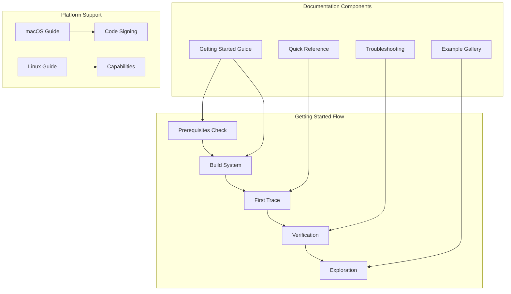
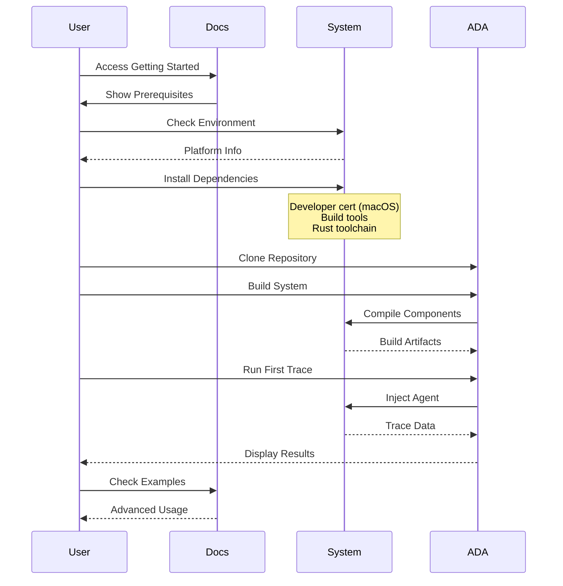
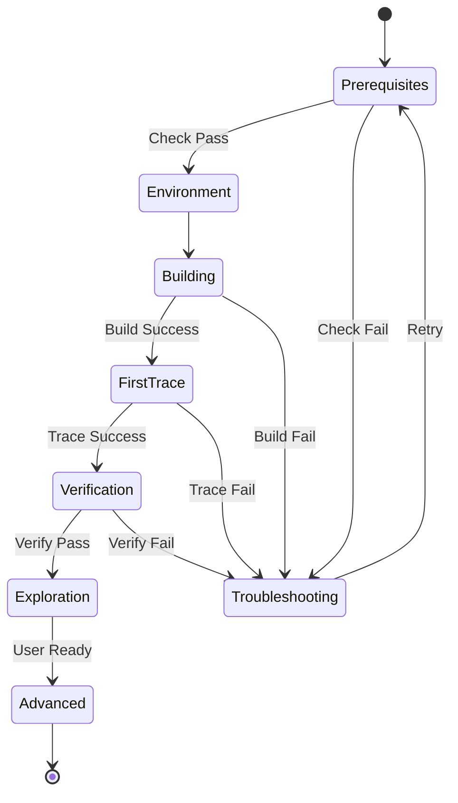

# M1_E5_I1 Technical Design: Getting Started Guide

## Overview
Create comprehensive getting started guide for new ADA users, covering installation, first trace, and common scenarios.

## Architecture

### Documentation Architecture


### User Journey Flow


### Documentation State Machine


## Component Design

### 1. Getting Started Guide Structure
```c
typedef struct getting_started_guide {
    // Document metadata
    struct {
        const char* version;
        const char* last_updated;
        const char* target_audience;
    } metadata;
    
    // Prerequisites section
    struct prerequisites {
        struct platform_requirements {
            const char* os_version;
            const char* arch;
            size_t min_memory_gb;
            size_t min_disk_gb;
        } platform;
        
        struct developer_requirements {
            bool apple_developer_cert;  // macOS only
            bool admin_privileges;
            const char* rust_version;
            const char* cmake_version;
        } developer;
        
        struct tool_requirements {
            const char** required_tools;
            size_t tool_count;
            const char** optional_tools;
            size_t optional_count;
        } tools;
    } prerequisites;
    
    // Build instructions
    struct build_instructions {
        const char* clone_command;
        const char* init_command;
        const char* build_command;
        const char* test_command;
        const char* verify_command;
    } build;
    
    // First trace example
    struct first_trace {
        const char* simple_program;
        const char* trace_command;
        const char* expected_output;
        const char* verification_steps;
    } first_trace;
    
    // Platform-specific sections
    struct platform_specific {
        struct macos_section {
            const char* code_signing_guide;
            const char* entitlements_setup;
            const char* ssh_trace_setup;
        } macos;
        
        struct linux_section {
            const char* ptrace_setup;
            const char* capabilities_config;
            const char* container_support;
        } linux;
    } platform;
    
} getting_started_guide_t;
```

### 2. Quick Reference Card
```c
typedef struct quick_reference {
    // Command reference
    struct command_ref {
        const char* command;
        const char* description;
        const char* example;
        const char* output_sample;
    } *commands;
    size_t command_count;
    
    // Common patterns
    struct pattern_ref {
        const char* use_case;
        const char* pattern;
        const char* explanation;
    } *patterns;
    size_t pattern_count;
    
    // Environment variables
    struct env_ref {
        const char* variable;
        const char* purpose;
        const char* default_value;
        const char* example_value;
    } *env_vars;
    size_t env_count;
    
    // Output formats
    struct format_ref {
        const char* format_name;
        const char* mime_type;
        const char* use_case;
        const char* example;
    } *formats;
    size_t format_count;
    
} quick_reference_t;
```

### 3. Troubleshooting Guide
```c
typedef struct troubleshooting_guide {
    // Issue catalog
    struct issue {
        const char* symptom;
        const char* category;  // build, runtime, platform, etc.
        
        struct diagnostic {
            const char* check_command;
            const char* expected_output;
            const char* actual_pattern;
        } *diagnostics;
        size_t diagnostic_count;
        
        struct solution {
            const char* description;
            const char* commands[8];
            size_t command_count;
            const char* verification;
        } *solutions;
        size_t solution_count;
        
        const char** related_issues;
        size_t related_count;
    } *issues;
    size_t issue_count;
    
    // Diagnostic flowchart
    struct diagnostic_flow {
        const char* entry_point;
        struct flow_node {
            const char* question;
            const char* yes_next;
            const char* no_next;
            const char* solution;
        } *nodes;
        size_t node_count;
    } diagnostic_flow;
    
} troubleshooting_guide_t;
```

### 4. Example Gallery
```c
typedef struct example_gallery {
    // Example entries
    struct example {
        const char* title;
        const char* description;
        const char* difficulty;  // beginner, intermediate, advanced
        
        struct code {
            const char* language;
            const char* source;
            const char* build_command;
        } code;
        
        struct trace {
            const char* trace_command;
            const char* config_options;
            const char* expected_events;
            size_t expected_count;
        } trace;
        
        struct output {
            const char* format;
            const char* sample;
            const char* interpretation;
        } output;
        
        const char** concepts;  // Concepts demonstrated
        size_t concept_count;
        
        const char** prerequisites;
        size_t prerequisite_count;
        
    } *examples;
    size_t example_count;
    
    // Example categories
    struct category {
        const char* name;
        const char* description;
        size_t* example_indices;
        size_t example_count;
    } *categories;
    size_t category_count;
    
} example_gallery_t;
```

## Implementation Details

### 1. Documentation Generator
```c
// Thread-safe documentation builder
typedef struct doc_builder {
    // Document sections (immutable after init)
    _Atomic(getting_started_guide_t*) guide;
    _Atomic(quick_reference_t*) reference;
    _Atomic(troubleshooting_guide_t*) troubleshooting;
    _Atomic(example_gallery_t*) examples;
    
    // Generation state
    _Atomic(uint32_t) generation;
    _Atomic(uint64_t) last_updated;
    
    // Output configuration
    struct {
        const char* output_dir;
        const char* format;  // markdown, html, pdf
        bool include_examples;
        bool include_videos;
    } config;
    
} doc_builder_t;

// Initialize documentation builder
int doc_builder__init(doc_builder_t* builder, const char* output_dir) {
    memset(builder, 0, sizeof(*builder));
    
    builder->config.output_dir = output_dir;
    builder->config.format = "markdown";
    builder->config.include_examples = true;
    
    // Initialize guide structure
    getting_started_guide_t* guide = calloc(1, sizeof(getting_started_guide_t));
    guide->metadata.version = "1.0.0";
    guide->metadata.target_audience = "new_users";
    
    atomic_store_explicit(&builder->guide, guide, memory_order_release);
    
    return 0;
}

// Generate getting started guide
int doc_builder__generate_guide(doc_builder_t* builder) {
    getting_started_guide_t* guide = atomic_load_explicit(
        &builder->guide, memory_order_acquire);
    
    // Generate markdown
    FILE* fp = fopen("GETTING_STARTED.md", "w");
    if (!fp) return -1;
    
    // Write header
    fprintf(fp, "# ADA Getting Started Guide\n\n");
    fprintf(fp, "Version: %s\n", guide->metadata.version);
    fprintf(fp, "Last Updated: %s\n\n", guide->metadata.last_updated);
    
    // Write prerequisites
    fprintf(fp, "## Prerequisites\n\n");
    fprintf(fp, "### Platform Requirements\n");
    fprintf(fp, "- OS: %s\n", guide->prerequisites.platform.os_version);
    fprintf(fp, "- Architecture: %s\n", guide->prerequisites.platform.arch);
    fprintf(fp, "- Memory: %zu GB minimum\n", guide->prerequisites.platform.min_memory_gb);
    fprintf(fp, "- Disk: %zu GB available\n\n", guide->prerequisites.platform.min_disk_gb);
    
    // Platform-specific requirements
    #ifdef __APPLE__
    fprintf(fp, "### macOS Specific Requirements\n");
    fprintf(fp, "- Apple Developer Certificate ($99/year) - MANDATORY\n");
    fprintf(fp, "- Xcode Command Line Tools\n");
    fprintf(fp, "- Code signing for SSH/CI tracing\n\n");
    #endif
    
    #ifdef __linux__
    fprintf(fp, "### Linux Specific Requirements\n");
    fprintf(fp, "- ptrace capabilities or root access\n");
    fprintf(fp, "- Development headers for system libraries\n\n");
    #endif
    
    // Write build instructions
    fprintf(fp, "## Building ADA\n\n");
    fprintf(fp, "```bash\n");
    fprintf(fp, "# Clone the repository\n");
    fprintf(fp, "%s\n\n", guide->build.clone_command);
    fprintf(fp, "# Initialize dependencies\n");
    fprintf(fp, "%s\n\n", guide->build.init_command);
    fprintf(fp, "# Build all components\n");
    fprintf(fp, "%s\n\n", guide->build.build_command);
    fprintf(fp, "# Run tests\n");
    fprintf(fp, "%s\n\n", guide->build.test_command);
    fprintf(fp, "# Verify installation\n");
    fprintf(fp, "%s\n", guide->build.verify_command);
    fprintf(fp, "```\n\n");
    
    // Write first trace example
    fprintf(fp, "## Your First Trace\n\n");
    fprintf(fp, "### 1. Create a simple program\n");
    fprintf(fp, "```c\n%s\n```\n\n", guide->first_trace.simple_program);
    fprintf(fp, "### 2. Run the trace\n");
    fprintf(fp, "```bash\n%s\n```\n\n", guide->first_trace.trace_command);
    fprintf(fp, "### 3. Expected output\n");
    fprintf(fp, "```\n%s\n```\n\n", guide->first_trace.expected_output);
    
    fclose(fp);
    
    // Update generation counter
    atomic_fetch_add_explicit(&builder->generation, 1, memory_order_release);
    
    return 0;
}
```

### 2. Example Runner
```c
// Interactive example runner
typedef struct example_runner {
    // Example being run
    example_gallery_t* gallery;
    size_t current_example;
    
    // Execution state
    struct {
        pid_t target_pid;
        int trace_fd;
        bool is_running;
    } state;
    
    // Output capture
    struct {
        char* stdout_buffer;
        size_t stdout_size;
        char* stderr_buffer;
        size_t stderr_size;
    } output;
    
} example_runner_t;

// Run example with verification
int example_runner__execute(example_runner_t* runner, size_t example_idx) {
    if (example_idx >= runner->gallery->example_count) {
        return -1;
    }
    
    struct example* ex = &runner->gallery->examples[example_idx];
    
    // Build example code
    printf("Building example: %s\n", ex->title);
    int ret = system(ex->code.build_command);
    if (ret != 0) {
        fprintf(stderr, "Build failed\n");
        return -1;
    }
    
    // Run trace
    printf("Running trace...\n");
    FILE* pipe = popen(ex->trace.trace_command, "r");
    if (!pipe) {
        fprintf(stderr, "Failed to start trace\n");
        return -1;
    }
    
    // Capture output
    size_t events_captured = 0;
    char line[1024];
    while (fgets(line, sizeof(line), pipe)) {
        printf("%s", line);
        events_captured++;
    }
    
    pclose(pipe);
    
    // Verify results
    if (events_captured < ex->trace.expected_count) {
        fprintf(stderr, "Warning: Expected %zu events, got %zu\n",
                ex->trace.expected_count, events_captured);
    }
    
    printf("\nExample completed successfully!\n");
    printf("Concepts demonstrated:\n");
    for (size_t i = 0; i < ex->concept_count; i++) {
        printf("  - %s\n", ex->concepts[i]);
    }
    
    return 0;
}
```

### 3. Troubleshooting Assistant
```c
// Interactive troubleshooting helper
typedef struct troubleshoot_assistant {
    troubleshooting_guide_t* guide;
    
    // Diagnostic state
    struct {
        size_t current_issue;
        size_t current_diagnostic;
        size_t current_solution;
    } state;
    
    // History
    struct {
        size_t* visited_issues;
        size_t visited_count;
        size_t visited_capacity;
    } history;
    
} troubleshoot_assistant_t;

// Run diagnostic flow
int troubleshoot__diagnose(troubleshoot_assistant_t* assistant) {
    printf("ADA Troubleshooting Assistant\n");
    printf("=============================\n\n");
    
    // Start with symptom selection
    printf("What issue are you experiencing?\n\n");
    for (size_t i = 0; i < assistant->guide->issue_count; i++) {
        printf("%zu. %s\n", i + 1, assistant->guide->issues[i].symptom);
    }
    
    printf("\nEnter issue number: ");
    size_t selection;
    scanf("%zu", &selection);
    
    if (selection == 0 || selection > assistant->guide->issue_count) {
        printf("Invalid selection\n");
        return -1;
    }
    
    struct issue* issue = &assistant->guide->issues[selection - 1];
    assistant->state.current_issue = selection - 1;
    
    // Run diagnostics
    printf("\nRunning diagnostics for: %s\n", issue->symptom);
    printf("Category: %s\n\n", issue->category);
    
    for (size_t i = 0; i < issue->diagnostic_count; i++) {
        struct diagnostic* diag = &issue->diagnostics[i];
        
        printf("Check %zu: %s\n", i + 1, diag->check_command);
        printf("Run this command and compare output:\n");
        printf("Expected: %s\n", diag->expected_output);
        
        printf("\nDoes the output match? (y/n): ");
        char response;
        scanf(" %c", &response);
        
        if (response == 'n' || response == 'N') {
            // Found the problem
            printf("\nIssue identified!\n");
            
            if (i < issue->solution_count) {
                struct solution* sol = &issue->solutions[i];
                printf("Solution: %s\n\n", sol->description);
                
                printf("Run these commands:\n");
                for (size_t j = 0; j < sol->command_count; j++) {
                    printf("  %s\n", sol->commands[j]);
                }
                
                printf("\nVerification: %s\n", sol->verification);
            }
            
            return 0;
        }
    }
    
    printf("\nDiagnostics passed. Issue may be more complex.\n");
    printf("Please check related issues or contact support.\n");
    
    return 0;
}
```

## Memory Ordering and Thread Safety

### Documentation Access Pattern
```c
// Lock-free documentation access
typedef struct doc_access {
    // Read-only after initialization
    getting_started_guide_t* guide;
    quick_reference_t* reference;
    
    // Statistics (lock-free updates)
    _Atomic(uint64_t) access_count;
    _Atomic(uint64_t) last_access_ns;
    
    // Per-section access tracking
    struct {
        _Atomic(uint32_t) prerequisites;
        _Atomic(uint32_t) building;
        _Atomic(uint32_t) first_trace;
        _Atomic(uint32_t) troubleshooting;
        _Atomic(uint32_t) examples;
    } section_hits;
    
} doc_access_t;

// Thread-safe access
const char* doc_access__get_section(doc_access_t* access, 
                                    const char* section) {
    // Update access count (relaxed - statistics only)
    atomic_fetch_add_explicit(&access->access_count, 1, 
                              memory_order_relaxed);
    
    // Update timestamp
    uint64_t now = get_timestamp_ns();
    atomic_store_explicit(&access->last_access_ns, now, 
                         memory_order_relaxed);
    
    // Track section access
    if (strcmp(section, "prerequisites") == 0) {
        atomic_fetch_add_explicit(&access->section_hits.prerequisites, 1,
                                 memory_order_relaxed);
        return access->guide->prerequisites;
    }
    
    // ... other sections ...
    
    return NULL;
}
```

## Performance Targets

### Documentation Generation
- Guide generation: < 100ms
- Example compilation: < 500ms per example
- Troubleshooting lookup: < 10ms
- Reference search: < 5ms

### User Experience Metrics
- Time to first successful trace: < 10 minutes
- Build completion: < 2 minutes
- Issue resolution rate: > 90%
- Example success rate: 100%

## Error Handling

### Common Error Scenarios
1. **Missing Prerequisites**
   - Clear error messages
   - Direct links to installation guides
   - Platform-specific instructions

2. **Build Failures**
   - Diagnostic commands
   - Common solutions
   - Fallback options

3. **Runtime Issues**
   - Symptom matching
   - Step-by-step diagnostics
   - Escalation path

4. **Platform-Specific Problems**
   - Code signing issues (macOS)
   - Permission problems (Linux)
   - Architecture mismatches

## Testing Considerations

### Documentation Testing
- Automated link checking
- Example code compilation
- Command verification
- Output validation

### User Testing
- New user onboarding flow
- Time-to-first-trace measurement
- Troubleshooting effectiveness
- Documentation clarity metrics

## Security Notes

### Platform Security Requirements
- macOS: Mandatory code signing for production
- Linux: CAP_SYS_PTRACE or root for tracing
- Container: Additional capability configuration
- SSH: Remote tracing security considerations

## Future Enhancements

### Phase 2 Additions
- Interactive web-based guide
- Video tutorials
- Playground environment
- Automated setup scripts

### Phase 3 Features
- IDE integration guides
- CI/CD templates
- Performance tuning guide
- Advanced usage patterns