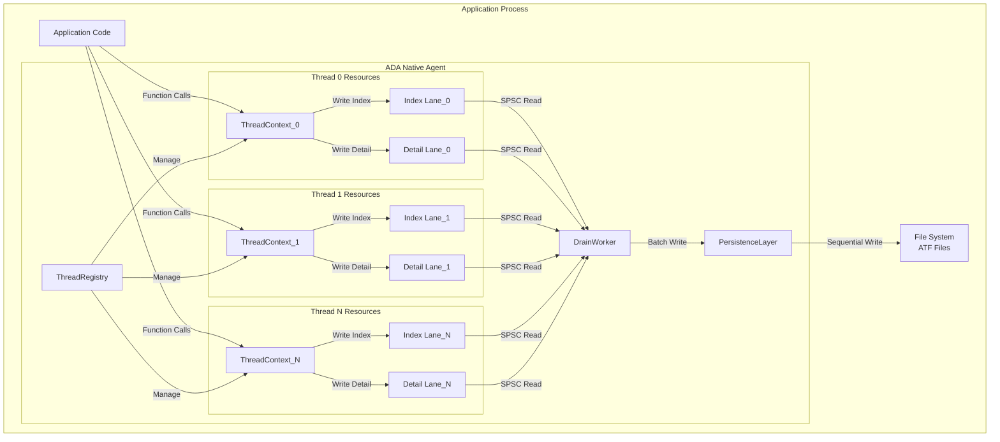
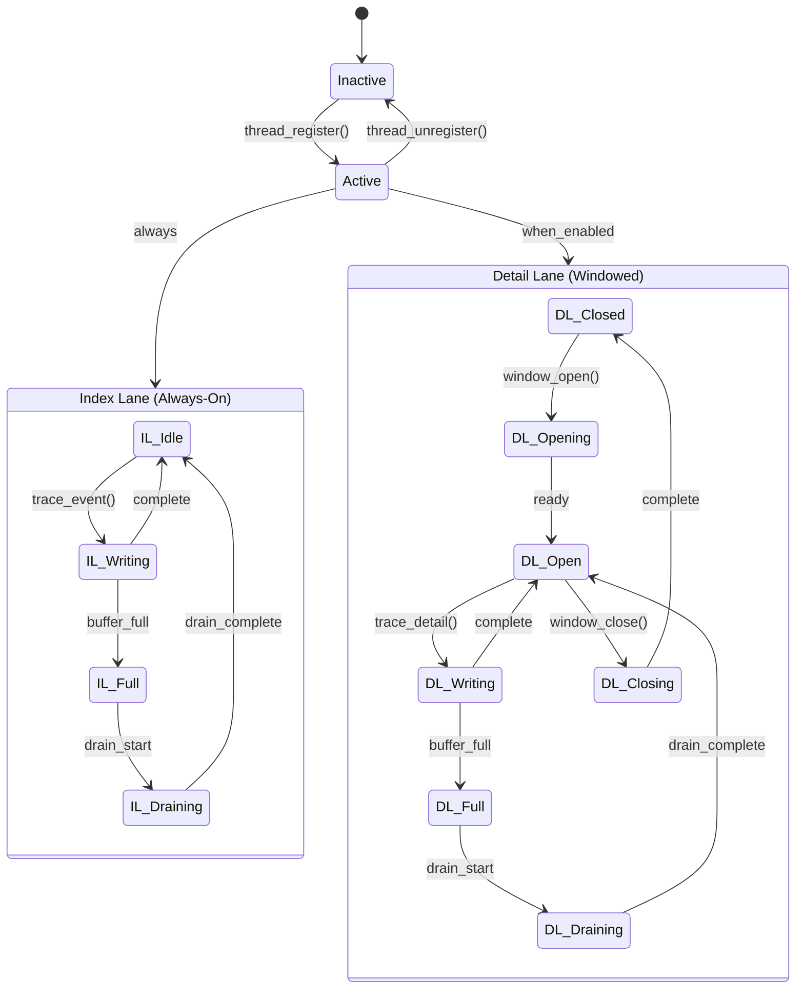
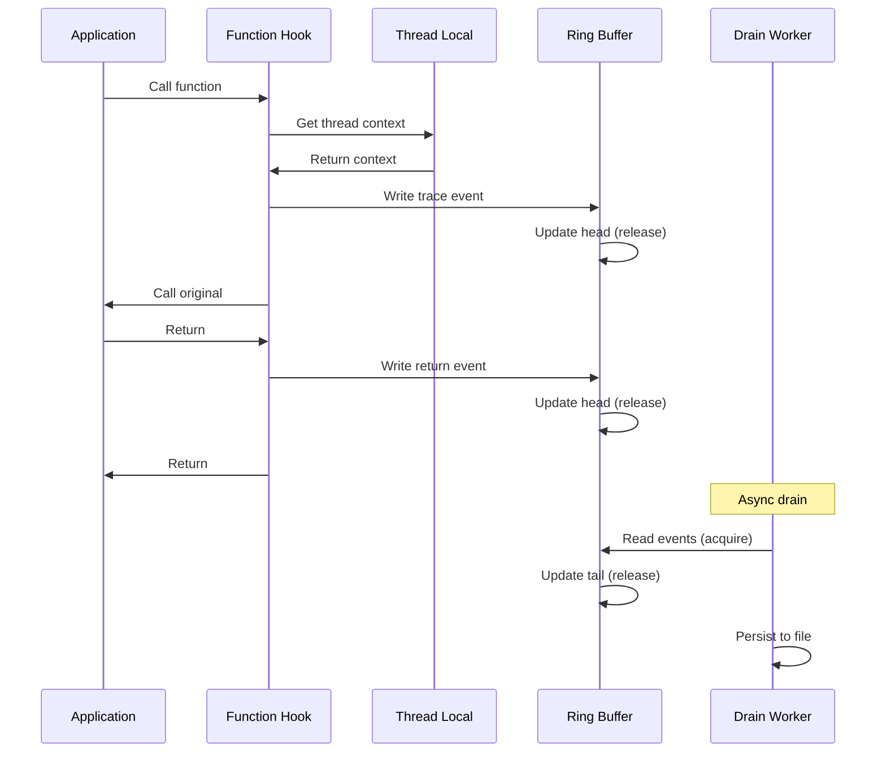
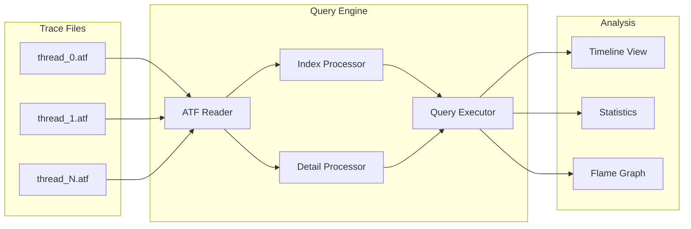

# M1_E5_I2 Technical Design: Architecture Documentation

## Overview

This iteration creates comprehensive architecture documentation for the ADA tracing system's M1 milestone. The documentation covers the per-thread ring buffer architecture, two-lane design, memory ordering specifications, and integration points.

## Success Criteria

- [ ] System overview with complete architecture diagrams
- [ ] Per-thread ring buffer architecture fully documented
- [ ] Two-lane architecture explained with state machines
- [ ] Memory ordering specifications for all atomic operations
- [ ] Performance characteristics documented with benchmarks
- [ __ API reference for all internal components
- [ ] Design decisions and rationale captured
- [ ] Integration points clearly defined

## System Architecture

### High-Level Architecture



### Per-Thread Ring Buffer Architecture

```mermaid
graph LR
    subgraph "Thread Local Storage"
        TLS[thread_local<br/>ThreadContext*]
    end
    
    subgraph "ThreadContext"
        TC_ID[thread_id: uint32_t]
        TC_IL[index_lane: RingBuffer*]
        TC_DL[detail_lane: RingBuffer*]
        TC_STATE[state: atomic<State>]
    end
    
    subgraph "Index Lane Ring Buffer"
        IL_HEAD[head: atomic<uint64_t>]
        IL_TAIL[tail: atomic<uint64_t>]
        IL_BUFF[buffer: uint8_t[64KB]]
        IL_MASK[mask: uint64_t = 0xFFFF]
    end
    
    subgraph "Detail Lane Ring Buffer"
        DL_HEAD[head: atomic<uint64_t>]
        DL_TAIL[tail: atomic<uint64_t>]
        DL_BUFF[buffer: uint8_t[1MB]]
        DL_MASK[mask: uint64_t = 0xFFFFF]
        DL_WIN[window_state: atomic<WindowState>]
    end
    
    TLS --> TC_ID
    TC_IL --> IL_HEAD
    TC_DL --> DL_HEAD
```

### Two-Lane Architecture



## Component Design

### ThreadRegistry

```c
typedef struct ThreadRegistry {
    // Fixed-size array for zero allocation
    ThreadContext contexts[MAX_THREADS];
    
    // Atomic bitmap for fast slot allocation
    _Atomic(uint64_t) slot_bitmap;
    
    // Global state management
    _Atomic(RegistryState) state;
    
    // Statistics
    _Atomic(uint64_t) total_threads;
    _Atomic(uint64_t) active_threads;
} ThreadRegistry;

// Thread registration with lock-free slot allocation
int thread_registry__register_thread(ThreadRegistry* registry) {
    uint64_t old_bitmap, new_bitmap;
    int slot;
    
    do {
        old_bitmap = atomic_load_explicit(&registry->slot_bitmap, 
                                         memory_order_acquire);
        slot = __builtin_ffsll(~old_bitmap) - 1;
        if (slot < 0 || slot >= MAX_THREADS) {
            return -ENOSPC;
        }
        new_bitmap = old_bitmap | (1ULL << slot);
    } while (!atomic_compare_exchange_weak_explicit(
        &registry->slot_bitmap,
        &old_bitmap,
        new_bitmap,
        memory_order_release,
        memory_order_acquire
    ));
    
    // Initialize thread context
    thread_context__init(&registry->contexts[slot], slot);
    
    return slot;
}
```

### Ring Buffer SPSC Semantics

```c
typedef struct RingBuffer {
    // Producer position (written by producer thread only)
    _Atomic(uint64_t) head;
    
    // Consumer position (written by drain worker only)
    _Atomic(uint64_t) tail;
    
    // Fixed-size power-of-2 buffer
    uint8_t* buffer;
    uint64_t mask;
    
    // SPSC guarantees
    pthread_t producer_tid;
    pthread_t consumer_tid;
} RingBuffer;

// Lock-free write with relaxed ordering (single producer)
int ring_buffer__write(RingBuffer* rb, const void* data, size_t size) {
    // Verify SPSC constraint
    assert(pthread_self() == rb->producer_tid);
    
    uint64_t head = atomic_load_explicit(&rb->head, memory_order_relaxed);
    uint64_t tail = atomic_load_explicit(&rb->tail, memory_order_acquire);
    
    uint64_t available = rb->mask + 1 - (head - tail);
    if (size > available) {
        return -ENOSPC;
    }
    
    // Copy data (may wrap around)
    uint64_t first_part = MIN(size, rb->mask + 1 - (head & rb->mask));
    memcpy(&rb->buffer[head & rb->mask], data, first_part);
    if (first_part < size) {
        memcpy(&rb->buffer[0], (uint8_t*)data + first_part, size - first_part);
    }
    
    // Update head with release semantics
    atomic_store_explicit(&rb->head, head + size, memory_order_release);
    
    return 0;
}

// Lock-free read with acquire-release ordering (single consumer)
int ring_buffer__read(RingBuffer* rb, void* data, size_t* size) {
    // Verify SPSC constraint
    assert(pthread_self() == rb->consumer_tid);
    
    uint64_t tail = atomic_load_explicit(&rb->tail, memory_order_relaxed);
    uint64_t head = atomic_load_explicit(&rb->head, memory_order_acquire);
    
    uint64_t available = head - tail;
    if (available == 0) {
        *size = 0;
        return 0;
    }
    
    *size = MIN(*size, available);
    
    // Copy data (may wrap around)
    uint64_t first_part = MIN(*size, rb->mask + 1 - (tail & rb->mask));
    memcpy(data, &rb->buffer[tail & rb->mask], first_part);
    if (first_part < *size) {
        memcpy((uint8_t*)data + first_part, &rb->buffer[0], *size - first_part);
    }
    
    // Update tail with release semantics
    atomic_store_explicit(&rb->tail, tail + *size, memory_order_release);
    
    return 0;
}
```

## Memory Ordering Specifications

### Ordering Requirements Matrix

| Operation | Producer | Consumer | Ordering | Rationale |
|-----------|----------|----------|----------|-----------|
| Write Head | Single Thread | Drain Worker | Release | Make writes visible to consumer |
| Read Head | Drain Worker | Single Thread | Acquire | See all producer writes |
| Write Tail | Drain Worker | Single Thread | Release | Make consumption visible |
| Read Tail | Single Thread | Drain Worker | Acquire | See consumed position |
| Buffer Write | Single Thread | - | Relaxed | Protected by head update |
| Buffer Read | Drain Worker | - | Relaxed | Protected by tail update |
| State Change | Any | Any | Seq_Cst | Global synchronization |

### Fence Placement

```c
// Producer write sequence
void producer_write_sequence(RingBuffer* rb, const void* data, size_t size) {
    // 1. Check space (acquire tail to see consumption)
    uint64_t tail = atomic_load_explicit(&rb->tail, memory_order_acquire);
    
    // 2. Write data (no ordering needed, protected by fence)
    memcpy(buffer_ptr, data, size);
    
    // 3. Compiler fence to prevent reordering
    atomic_signal_fence(memory_order_release);
    
    // 4. Update head (release to make writes visible)
    atomic_store_explicit(&rb->head, new_head, memory_order_release);
}

// Consumer read sequence
void consumer_read_sequence(RingBuffer* rb, void* data, size_t size) {
    // 1. Check data (acquire head to see writes)
    uint64_t head = atomic_load_explicit(&rb->head, memory_order_acquire);
    
    // 2. Read data (no ordering needed, protected by acquire)
    memcpy(data, buffer_ptr, size);
    
    // 3. Compiler fence to prevent reordering
    atomic_signal_fence(memory_order_release);
    
    // 4. Update tail (release to make consumption visible)
    atomic_store_explicit(&rb->tail, new_tail, memory_order_release);
}
```

## Performance Characteristics

### Target Performance Metrics

| Metric | Target | Measurement Method |
|--------|--------|-------------------|
| Write Latency (Index) | < 50ns | rdtsc-based measurement |
| Write Latency (Detail) | < 100ns | rdtsc-based measurement |
| Throughput per Thread | > 10M events/sec | Benchmark suite |
| Memory Overhead | < 2MB per thread | Memory profiler |
| Cache Line Bouncing | 0 | Performance counters |
| Lock Contention | 0 | Lock profiler |
| Drain Latency | < 1ms | End-to-end timing |

### Cache Line Optimization

```c
// Aligned to prevent false sharing
typedef struct __attribute__((aligned(64))) ThreadContext {
    // Hot path data in first cache line
    uint32_t thread_id;
    uint32_t flags;
    RingBuffer* index_lane;
    RingBuffer* detail_lane;
    
    // Padding to cache line boundary
    uint8_t _pad1[64 - 24];
    
    // Cold path data in separate cache lines
    _Atomic(ThreadState) state;
    uint64_t total_events;
    uint64_t dropped_events;
    
    // Padding to cache line boundary
    uint8_t _pad2[64 - 24];
} ThreadContext;
```

## API Reference

### Core APIs

#### Thread Management
```c
// Register current thread for tracing
int ada_thread_register(void);

// Unregister current thread
void ada_thread_unregister(void);

// Get current thread context
ThreadContext* ada_thread_context(void);
```

#### Tracing APIs
```c
// Trace index event (always-on)
int ada_trace_index(uint32_t event_id, uint64_t timestamp);

// Trace detail event (windowed)
int ada_trace_detail(const void* data, size_t size);

// Open detail window
int ada_detail_window_open(uint64_t duration_ns);

// Close detail window
void ada_detail_window_close(void);
```

#### Drain APIs
```c
// Start drain worker
int ada_drain_start(DrainConfig* config);

// Stop drain worker
void ada_drain_stop(void);

// Force immediate drain
int ada_drain_flush(void);
```

### Internal APIs

#### Ring Buffer Operations
```c
// Initialize ring buffer
int ring_buffer__init(RingBuffer* rb, size_t size);

// Write data (SPSC producer)
int ring_buffer__write(RingBuffer* rb, const void* data, size_t size);

// Read data (SPSC consumer)
int ring_buffer__read(RingBuffer* rb, void* data, size_t* size);

// Get available space
size_t ring_buffer__available_write(const RingBuffer* rb);

// Get available data
size_t ring_buffer__available_read(const RingBuffer* rb);
```

#### Thread Registry Operations
```c
// Initialize registry
int thread_registry__init(ThreadRegistry* registry);

// Register thread
int thread_registry__register_thread(ThreadRegistry* registry);

// Unregister thread
void thread_registry__unregister_thread(ThreadRegistry* registry, int slot);

// Iterate active threads
void thread_registry__foreach_active(ThreadRegistry* registry,
                                    void (*callback)(ThreadContext*, void*),
                                    void* userdata);
```

## Design Decisions and Rationale

### Why Per-Thread Ring Buffers?

1. **Zero Contention**: Each thread writes to its own buffer
2. **Cache Locality**: Thread-local data stays in L1/L2 cache
3. **NUMA Friendly**: Buffers allocated on thread's NUMA node
4. **Predictable Performance**: No lock contention or CAS loops

### Why Two-Lane Architecture?

1. **Index Lane (Always-On)**:
   - Small, fixed-size events
   - Always captured for correlation
   - Low overhead (~50ns per event)
   - 64KB buffer for fast cache access

2. **Detail Lane (Windowed)**:
   - Variable-size detailed data
   - Captured only when needed
   - Higher overhead acceptable
   - 1MB buffer for rich traces

### Why SPSC Queues?

1. **Simple Correctness**: Single producer, single consumer
2. **Optimal Performance**: No CAS operations needed
3. **Relaxed Ordering**: Most operations use relaxed ordering
4. **Clear Ownership**: Producer owns head, consumer owns tail

### Why Lock-Free Design?

1. **Deadlock Immunity**: No locks, no deadlocks
2. **Signal Safety**: Can trace from signal handlers
3. **Async-Signal Safety**: Safe from any context
4. **Performance**: No kernel transitions

## Integration Points

### Hooking Integration



### Query Engine Integration



### Platform Integration

#### macOS Specific
```c
// Code signing for SIP compliance
#ifdef __APPLE__
int ada_codesign_check(void) {
    SecCodeRef code = NULL;
    SecCodeCopySelf(kSecCSDefaultFlags, &code);
    
    SecRequirementRef requirement = NULL;
    SecRequirementCreateWithString(
        CFSTR("anchor apple generic and certificate leaf[field.1.2.840.113635.100.6.1.9]"),
        kSecCSDefaultFlags,
        &requirement
    );
    
    OSStatus status = SecCodeCheckValidity(code, kSecCSDefaultFlags, requirement);
    
    CFRelease(code);
    CFRelease(requirement);
    
    return (status == errSecSuccess) ? 0 : -1;
}
#endif
```

#### Linux Specific
```c
// Ptrace capability check
#ifdef __linux__
int ada_ptrace_check(void) {
    cap_t caps = cap_get_proc();
    cap_flag_value_t value;
    
    if (cap_get_flag(caps, CAP_SYS_PTRACE, CAP_EFFECTIVE, &value) != 0) {
        cap_free(caps);
        return -1;
    }
    
    cap_free(caps);
    return (value == CAP_SET) ? 0 : -1;
}
#endif
```

## Error Handling Strategy

### Error Categories

1. **Fatal Errors**: Abort tracing
   - Out of memory
   - Invalid configuration
   - Platform security violation

2. **Recoverable Errors**: Log and continue
   - Buffer full (drop events)
   - Drain timeout (retry)
   - File write failure (buffer)

3. **Transient Errors**: Retry with backoff
   - Temporary file system full
   - Network timeout (remote drain)
   - Resource temporarily unavailable

### Error Propagation

```c
typedef enum {
    ADA_SUCCESS = 0,
    ADA_ERROR_NOMEM = -ENOMEM,
    ADA_ERROR_NOSPC = -ENOSPC,
    ADA_ERROR_BUSY = -EBUSY,
    ADA_ERROR_PERM = -EPERM,
    ADA_ERROR_INVALID = -EINVAL,
} ada_error_t;

// Error context for detailed diagnostics
typedef struct {
    ada_error_t code;
    const char* file;
    int line;
    const char* function;
    char message[256];
} ada_error_context_t;

// Thread-local error context
_Thread_local ada_error_context_t g_last_error;

#define ADA_SET_ERROR(code, fmt, ...) \
    do { \
        g_last_error.code = (code); \
        g_last_error.file = __FILE__; \
        g_last_error.line = __LINE__; \
        g_last_error.function = __func__; \
        snprintf(g_last_error.message, sizeof(g_last_error.message), \
                 fmt, ##__VA_ARGS__); \
    } while (0)
```

## Iteration Summary

This iteration delivers comprehensive architecture documentation that serves as the technical reference for the ADA tracing system. The documentation covers all aspects of the per-thread ring buffer architecture, two-lane design, memory ordering requirements, and integration points, providing a complete technical foundation for system understanding and maintenance.