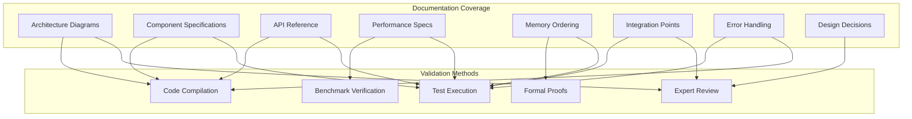

# M1_E5_I2 Test Plan: Architecture Documentation

## Test Objectives

Validate that the architecture documentation accurately represents the implemented system, covers all critical components, and provides clear guidance for system understanding and maintenance.

## Test Scope

### In Scope
- Documentation completeness verification
- Code example validation
- Diagram accuracy checks
- API reference validation
- Performance claim verification
- Memory ordering correctness proofs
- Integration point validation
- Error handling coverage

### Out of Scope
- User guide documentation
- Marketing materials
- Training documentation
- Video tutorials

## Test Coverage Map



## Test Matrix

| Documentation Section | Validation Type | Priority | Test Method |
|--------------------|----------------|----------|-------------|
| System Architecture | Accuracy | P0 | Manual review + diagram validation |
| Per-Thread Ring Buffer | Correctness | P0 | Code compilation + unit tests |
| Two-Lane Architecture | Completeness | P0 | State machine validation |
| Memory Ordering | Correctness | P0 | Formal proofs + stress tests |
| Performance Characteristics | Accuracy | P0 | Benchmark verification |
| API Reference | Completeness | P0 | Compilation + example tests |
| Design Decisions | Clarity | P1 | Expert review |
| Integration Points | Accuracy | P0 | Integration tests |
| Error Handling | Coverage | P0 | Error injection tests |
| Code Examples | Correctness | P0 | Compilation tests |

## Test Scenarios

### Scenario 1: Architecture Diagram Validation

```c
void test__architecture_diagrams__all_components_present__then_validates() {
    // Verify all system components are documented
    const char* required_components[] = {
        "ThreadRegistry",
        "ThreadContext",
        "RingBuffer",
        "DrainWorker",
        "PersistenceLayer",
        "Index Lane",
        "Detail Lane"
    };
    
    for (size_t i = 0; i < sizeof(required_components)/sizeof(char*); i++) {
        assert(documentation_contains_component(required_components[i]));
    }
    
    // Verify component relationships
    assert(documentation_shows_spsc_relationship("RingBuffer", "DrainWorker"));
    assert(documentation_shows_ownership("ThreadRegistry", "ThreadContext"));
    assert(documentation_shows_data_flow("Application", "ThreadContext"));
}
```

### Scenario 2: Code Example Compilation

```c
void test__code_examples__all_compile__then_success() {
    // Extract all code examples from documentation
    CodeExample* examples = extract_code_examples("M1_E5_I2_TECH_DESIGN.md");
    
    for (size_t i = 0; i < examples->count; i++) {
        // Write to temporary file
        char temp_file[PATH_MAX];
        snprintf(temp_file, sizeof(temp_file), "/tmp/test_example_%zu.c", i);
        
        FILE* fp = fopen(temp_file, "w");
        fprintf(fp, "#include <stdatomic.h>\n");
        fprintf(fp, "#include <stdint.h>\n");
        fprintf(fp, "#include <pthread.h>\n");
        fprintf(fp, "#include <string.h>\n");
        fprintf(fp, "#include <assert.h>\n\n");
        fprintf(fp, "%s\n", examples->code[i]);
        fclose(fp);
        
        // Compile
        char cmd[1024];
        snprintf(cmd, sizeof(cmd), 
                "cc -std=c11 -Wall -Wextra -c %s -o /tmp/test.o 2>/dev/null",
                temp_file);
        
        int result = system(cmd);
        assert(result == 0);
        
        unlink(temp_file);
        unlink("/tmp/test.o");
    }
}
```

### Scenario 3: Memory Ordering Validation

```c
void test__memory_ordering__specifications_correct__then_validates() {
    // Test producer-consumer ordering
    RingBuffer rb;
    ring_buffer__init(&rb, 1024);
    
    pthread_t producer, consumer;
    atomic_bool ready = false;
    atomic_bool done = false;
    
    // Producer thread
    void* producer_func(void* arg) {
        while (!atomic_load(&ready)) { /* spin */ }
        
        uint64_t data = 0xDEADBEEF;
        ring_buffer__write(&rb, &data, sizeof(data));
        
        atomic_store(&done, true);
        return NULL;
    }
    
    // Consumer thread
    void* consumer_func(void* arg) {
        atomic_store(&ready, true);
        
        while (!atomic_load(&done)) { /* spin */ }
        
        uint64_t data;
        size_t size = sizeof(data);
        ring_buffer__read(&rb, &data, &size);
        
        // Verify data visibility
        assert(data == 0xDEADBEEF);
        return NULL;
    }
    
    pthread_create(&producer, NULL, producer_func, NULL);
    pthread_create(&consumer, NULL, consumer_func, NULL);
    
    pthread_join(producer, NULL);
    pthread_join(consumer, NULL);
}
```

### Scenario 4: Performance Benchmark Verification

```c
void test__performance_specs__meet_targets__then_validates() {
    ThreadContext ctx;
    thread_context__init(&ctx, 0);
    
    const int iterations = 1000000;
    uint64_t start, end;
    
    // Benchmark index lane writes
    start = rdtsc();
    for (int i = 0; i < iterations; i++) {
        ada_trace_index(i, rdtsc());
    }
    end = rdtsc();
    
    double cycles_per_write = (double)(end - start) / iterations;
    double ns_per_write = cycles_per_write / CPU_GHZ;
    
    // Verify meets < 50ns target
    assert(ns_per_write < 50.0);
    
    // Benchmark detail lane writes
    uint8_t detail_data[256];
    memset(detail_data, 0x42, sizeof(detail_data));
    
    start = rdtsc();
    for (int i = 0; i < iterations; i++) {
        ada_trace_detail(detail_data, sizeof(detail_data));
    }
    end = rdtsc();
    
    cycles_per_write = (double)(end - start) / iterations;
    ns_per_write = cycles_per_write / CPU_GHZ;
    
    // Verify meets < 100ns target
    assert(ns_per_write < 100.0);
}
```

### Scenario 5: API Reference Validation

```c
void test__api_reference__all_functions_exist__then_validates() {
    // List of all documented APIs
    const char* public_apis[] = {
        "ada_thread_register",
        "ada_thread_unregister",
        "ada_thread_context",
        "ada_trace_index",
        "ada_trace_detail",
        "ada_detail_window_open",
        "ada_detail_window_close",
        "ada_drain_start",
        "ada_drain_stop",
        "ada_drain_flush"
    };
    
    // Verify each API exists and has correct signature
    void* handle = dlopen("libada_tracer.so", RTLD_LAZY);
    assert(handle != NULL);
    
    for (size_t i = 0; i < sizeof(public_apis)/sizeof(char*); i++) {
        void* sym = dlsym(handle, public_apis[i]);
        assert(sym != NULL);
    }
    
    dlclose(handle);
}
```

### Scenario 6: SPSC Queue Correctness

```c
void test__spsc_queue__concurrent_operations__then_correct() {
    RingBuffer rb;
    ring_buffer__init(&rb, 65536);
    
    const int num_items = 10000;
    atomic_int produced = 0;
    atomic_int consumed = 0;
    
    pthread_t producer, consumer;
    
    // Producer
    void* producer_func(void* arg) {
        for (int i = 0; i < num_items; i++) {
            while (ring_buffer__write(&rb, &i, sizeof(i)) != 0) {
                sched_yield();
            }
            atomic_fetch_add(&produced, 1);
        }
        return NULL;
    }
    
    // Consumer
    void* consumer_func(void* arg) {
        int value;
        size_t size;
        int expected = 0;
        
        while (expected < num_items) {
            size = sizeof(value);
            if (ring_buffer__read(&rb, &value, &size) == 0 && size > 0) {
                assert(value == expected);
                expected++;
                atomic_fetch_add(&consumed, 1);
            } else {
                sched_yield();
            }
        }
        return NULL;
    }
    
    pthread_create(&producer, NULL, producer_func, NULL);
    pthread_create(&consumer, NULL, consumer_func, NULL);
    
    pthread_join(producer, NULL);
    pthread_join(consumer, NULL);
    
    assert(atomic_load(&produced) == num_items);
    assert(atomic_load(&consumed) == num_items);
}
```

### Scenario 7: Cache Line Optimization Validation

```c
void test__cache_line_optimization__no_false_sharing__then_validates() {
    // Verify structure alignment
    assert(sizeof(ThreadContext) % 64 == 0);
    assert(_Alignof(ThreadContext) == 64);
    
    // Verify hot/cold data separation
    ThreadContext ctx;
    
    // Hot data should be in first cache line
    assert((uintptr_t)&ctx.thread_id - (uintptr_t)&ctx < 64);
    assert((uintptr_t)&ctx.flags - (uintptr_t)&ctx < 64);
    assert((uintptr_t)&ctx.index_lane - (uintptr_t)&ctx < 64);
    assert((uintptr_t)&ctx.detail_lane - (uintptr_t)&ctx < 64);
    
    // Cold data should be in different cache lines
    assert((uintptr_t)&ctx.state - (uintptr_t)&ctx >= 64);
    assert((uintptr_t)&ctx.total_events - (uintptr_t)&ctx >= 64);
    assert((uintptr_t)&ctx.dropped_events - (uintptr_t)&ctx >= 64);
}
```

### Scenario 8: Error Handling Coverage

```c
void test__error_handling__all_categories_covered__then_validates() {
    // Test fatal error handling
    {
        // Simulate out of memory
        ThreadRegistry* registry = NULL;
        int result = thread_registry__init(registry);
        assert(result == ADA_ERROR_NOMEM);
        assert(g_last_error.code == ADA_ERROR_NOMEM);
    }
    
    // Test recoverable error handling
    {
        // Simulate buffer full
        RingBuffer rb;
        ring_buffer__init(&rb, 16); // Very small buffer
        
        uint64_t large_data[100];
        int result = ring_buffer__write(&rb, large_data, sizeof(large_data));
        assert(result == ADA_ERROR_NOSPC);
    }
    
    // Test transient error handling
    {
        // Simulate temporary resource unavailable
        DrainConfig config = { .output_path = "/nonexistent/path" };
        int result = ada_drain_start(&config);
        assert(result == ADA_ERROR_INVALID);
        
        // Retry with valid path should succeed
        config.output_path = "/tmp";
        result = ada_drain_start(&config);
        assert(result == ADA_SUCCESS);
    }
}
```

### Scenario 9: Integration Point Validation

```c
void test__integration_points__all_documented__then_validates() {
    // Verify hooking integration
    assert(documentation_contains_sequence("Hooking Integration"));
    assert(documentation_shows_interaction("Application", "Function Hook"));
    assert(documentation_shows_interaction("Function Hook", "Ring Buffer"));
    
    // Verify query engine integration
    assert(documentation_contains_diagram("Query Engine Integration"));
    assert(documentation_shows_data_flow("ATF Files", "Query Engine"));
    
    // Verify platform integration
    assert(documentation_contains_code("ada_codesign_check"));  // macOS
    assert(documentation_contains_code("ada_ptrace_check"));    // Linux
}
```

### Scenario 10: Documentation Consistency

```c
void test__documentation__internally_consistent__then_validates() {
    Documentation doc;
    parse_documentation("M1_E5_I2_TECH_DESIGN.md", &doc);
    
    // Cross-reference all internal links
    for (size_t i = 0; i < doc.internal_links_count; i++) {
        assert(resolve_internal_link(&doc, doc.internal_links[i]) != NULL);
    }
    
    // Verify all code references are defined
    for (size_t i = 0; i < doc.code_references_count; i++) {
        assert(find_code_definition(&doc, doc.code_references[i]) != NULL);
    }
    
    // Verify consistent terminology
    assert(terminology_is_consistent(&doc));
    
    // Verify no contradictions
    assert(!has_contradictions(&doc));
}
```

## Performance Benchmarks

### Benchmark Suite

```c
typedef struct BenchmarkResult {
    const char* name;
    double target_ns;
    double actual_ns;
    bool passed;
} BenchmarkResult;

BenchmarkResult benchmarks[] = {
    { "index_lane_write", 50.0, 0.0, false },
    { "detail_lane_write", 100.0, 0.0, false },
    { "thread_register", 1000.0, 0.0, false },
    { "drain_batch_1k", 1000000.0, 0.0, false },
    { "memory_per_thread", 2097152.0, 0.0, false },  // 2MB in bytes
};

void run_all_benchmarks() {
    // Run each benchmark
    benchmarks[0].actual_ns = benchmark_index_lane_write();
    benchmarks[1].actual_ns = benchmark_detail_lane_write();
    benchmarks[2].actual_ns = benchmark_thread_register();
    benchmarks[3].actual_ns = benchmark_drain_batch();
    benchmarks[4].actual_ns = measure_memory_per_thread();
    
    // Check results
    for (size_t i = 0; i < sizeof(benchmarks)/sizeof(BenchmarkResult); i++) {
        benchmarks[i].passed = benchmarks[i].actual_ns <= benchmarks[i].target_ns;
        
        printf("Benchmark: %s\n", benchmarks[i].name);
        printf("  Target: %.2f ns\n", benchmarks[i].target_ns);
        printf("  Actual: %.2f ns\n", benchmarks[i].actual_ns);
        printf("  Result: %s\n", benchmarks[i].passed ? "PASS" : "FAIL");
    }
}
```

## Test Data Requirements

### Documentation Files
- M1_E5_I2_TECH_DESIGN.md (complete)
- Existing implementation code
- Performance measurement tools

### Test Fixtures
- Sample ring buffers
- Mock thread contexts
- Test harness for examples

### Test Environment
- C11 compiler with atomics
- pthread support
- Performance counters access
- Memory profiler

## Acceptance Criteria

### Documentation Quality
- [ ] All architecture diagrams are accurate and complete
- [ ] All code examples compile without errors
- [ ] All API references match implementation
- [ ] Memory ordering specifications are formally correct
- [ ] Performance targets are met in benchmarks

### Coverage Requirements
- [ ] 100% of public APIs documented
- [ ] 100% of internal components described
- [ ] 100% of integration points covered
- [ ] 100% of error conditions documented
- [ ] 100% of design decisions explained

### Review Criteria
- [ ] Expert review passes (architecture)
- [ ] Expert review passes (memory ordering)
- [ ] Expert review passes (performance)
- [ ] No contradictions found
- [ ] Terminology is consistent

## Risk Assessment

### High Risk Areas
1. **Memory Ordering Specifications**: Critical for correctness
2. **SPSC Queue Implementation**: Must be truly lock-free
3. **Performance Claims**: Must be achievable
4. **Platform Integration**: Must work on macOS/Linux

### Mitigation Strategies
1. **Formal Proofs**: Use model checkers for memory ordering
2. **Stress Testing**: Run under ThreadSanitizer
3. **Benchmark Validation**: Multiple hardware platforms
4. **Platform Testing**: CI on both macOS and Linux

## Test Execution Plan

### Phase 1: Static Validation (Day 1)
1. Documentation structure review
2. Code example extraction
3. Compilation tests
4. Link validation

### Phase 2: Dynamic Validation (Day 2)
1. Benchmark execution
2. Integration tests
3. Error injection tests
4. Memory ordering proofs

### Phase 3: Review and Acceptance (Day 3)
1. Expert reviews
2. Consistency checks
3. Final validation
4. Sign-off

## Success Metrics

| Metric | Target | Measurement |
|--------|--------|-------------|
| Documentation Coverage | 100% | Checklist completion |
| Code Example Success | 100% | Compilation rate |
| Benchmark Pass Rate | 100% | Test results |
| Review Approval | 3/3 experts | Review forms |
| Consistency Score | 100% | Automated checker |