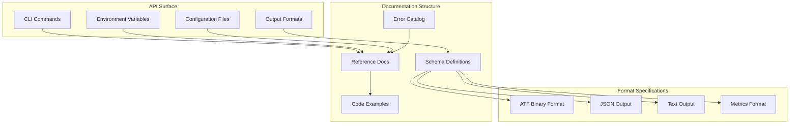
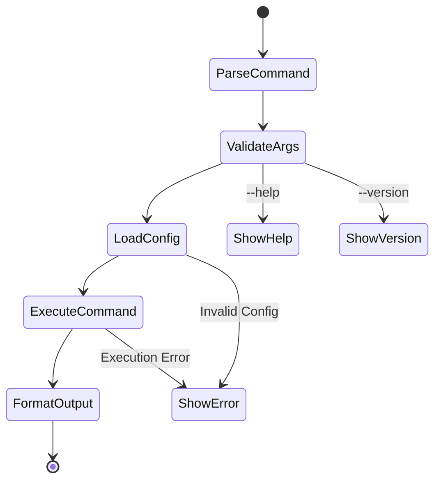
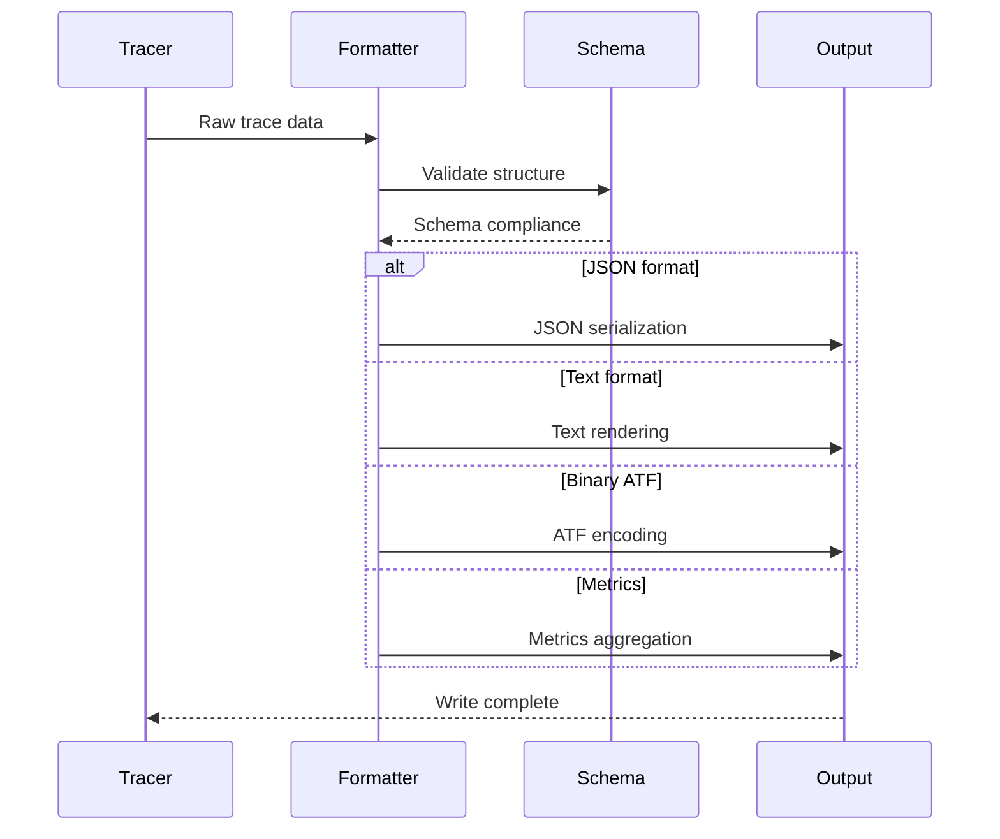
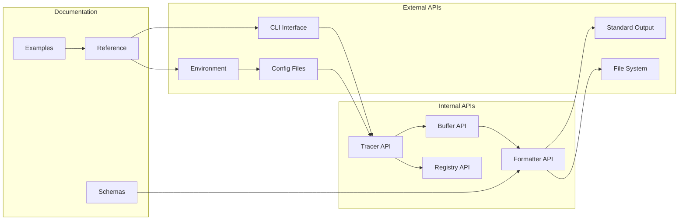

# M1_E5_I3 Technical Design: API Reference Documentation

## 1. Architecture Overview



## 2. Component Design

### 2.1 CLI Command Structure



### 2.2 Configuration Hierarchy

```c
typedef struct Config {
    // Priority order (highest to lowest)
    struct {
        _Atomic(uint32_t) flags;           // Command-line flags
        _Atomic(uint32_t) precedence;      // Priority level
    } cli;
    
    struct {
        char* values[MAX_ENV_VARS];        // Environment variables
        _Atomic(uint32_t) count;
    } env;
    
    struct {
        char path[PATH_MAX];               // Config file path
        _Atomic(uint32_t) version;         // Config version
    } file;
    
    struct {
        uint32_t buffer_size;              // Default values
        uint32_t thread_count;
        uint32_t sampling_rate;
    } defaults;
} Config;

// Configuration resolution
void config__resolve__then_applies_priority(Config* config) {
    // CLI flags override everything
    if (atomic_load_explicit(&config->cli.flags, memory_order_acquire)) {
        apply_cli_config(config);
    }
    // Environment variables override file and defaults
    else if (atomic_load_explicit(&config->env.count, memory_order_acquire)) {
        apply_env_config(config);
    }
    // Config file overrides defaults
    else if (config->file.path[0]) {
        apply_file_config(config);
    }
    // Use defaults
    else {
        apply_default_config(config);
    }
}
```

### 2.3 Output Format Pipeline



## 3. API Documentation Structure

### 3.1 Command Reference Template

```c
typedef struct CommandDoc {
    char name[64];                         // Command name
    char synopsis[256];                    // Usage pattern
    char description[1024];                // Detailed description
    
    struct {
        char flag[32];                     // Flag/option
        char type[32];                     // Value type
        char description[256];             // Option description
        char default_value[64];            // Default if any
        _Atomic(uint32_t) required;        // Required flag
    } options[MAX_OPTIONS];
    
    struct {
        char code[256];                    // Example command
        char output[1024];                 // Expected output
        char explanation[512];             // What it demonstrates
    } examples[MAX_EXAMPLES];
    
    struct {
        int32_t code;                      // Exit code
        char message[256];                 // Error message
        char remedy[256];                  // How to fix
    } errors[MAX_ERRORS];
} CommandDoc;
```

### 3.2 Schema Definition Structure

```c
typedef struct SchemaDoc {
    char format[32];                      // Format name (ATF, JSON, etc.)
    uint32_t version;                      // Schema version
    
    struct {
        char name[64];                     // Field name
        char type[32];                     // Data type
        char constraints[256];             // Validation rules
        _Atomic(uint32_t) required;        // Required field
    } fields[MAX_FIELDS];
    
    struct {
        char json[4096];                   // JSON schema
        char validation[2048];             // Validation rules
    } specification;
} SchemaDoc;
```

## 4. File Format Specifications

### 4.1 ATF Binary Format

```c
// ATF file header (64 bytes)
typedef struct __attribute__((packed)) {
    uint32_t magic;                        // 0x41544630 ('ATF0')
    uint32_t version;                      // Format version
    uint64_t timestamp;                    // Creation timestamp
    uint32_t thread_count;                 // Number of threads
    uint32_t index_offset;                 // Offset to index section
    uint32_t detail_offset;                // Offset to detail section
    uint32_t metadata_offset;              // Offset to metadata
    uint8_t reserved[28];                  // Future use
} ATFHeader;

// Index entry (32 bytes)
typedef struct __attribute__((packed)) {
    uint64_t timestamp;                    // Event timestamp
    uint32_t thread_id;                    // Thread identifier
    uint32_t event_type;                   // Event type code
    uint64_t detail_offset;                // Offset in detail section
    uint32_t detail_size;                  // Size of detail data
    uint32_t checksum;                     // CRC32 checksum
} ATFIndexEntry;

// Detail section header (16 bytes)
typedef struct __attribute__((packed)) {
    uint32_t entry_count;                  // Number of entries
    uint32_t total_size;                   // Total section size
    uint64_t base_timestamp;               // Base timestamp for deltas
} ATFDetailHeader;
```

### 4.2 JSON Output Schema

```json
{
  "$schema": "http://json-schema.org/draft-07/schema#",
  "title": "ADA Trace Output",
  "type": "object",
  "required": ["version", "metadata", "traces"],
  "properties": {
    "version": {
      "type": "string",
      "pattern": "^\\d+\\.\\d+\\.\\d+$"
    },
    "metadata": {
      "type": "object",
      "required": ["timestamp", "hostname", "process"],
      "properties": {
        "timestamp": {"type": "integer"},
        "hostname": {"type": "string"},
        "process": {
          "type": "object",
          "required": ["pid", "name"],
          "properties": {
            "pid": {"type": "integer"},
            "name": {"type": "string"}
          }
        }
      }
    },
    "traces": {
      "type": "array",
      "items": {
        "type": "object",
        "required": ["thread_id", "timestamp", "event"],
        "properties": {
          "thread_id": {"type": "integer"},
          "timestamp": {"type": "integer"},
          "event": {
            "type": "object",
            "required": ["type", "data"],
            "properties": {
              "type": {"type": "string"},
              "data": {"type": "object"}
            }
          }
        }
      }
    }
  }
}
```

## 5. Error Code Catalog

```c
// Error code ranges
enum ErrorCategory {
    ERR_SUCCESS = 0,
    
    // Initialization errors (1000-1999)
    ERR_INIT_BASE = 1000,
    ERR_INIT_MEMORY = 1001,
    ERR_INIT_CONFIG = 1002,
    ERR_INIT_PERMISSION = 1003,
    
    // Runtime errors (2000-2999)
    ERR_RUNTIME_BASE = 2000,
    ERR_RUNTIME_BUFFER_FULL = 2001,
    ERR_RUNTIME_THREAD_LIMIT = 2002,
    ERR_RUNTIME_IO = 2003,
    
    // Format errors (3000-3999)
    ERR_FORMAT_BASE = 3000,
    ERR_FORMAT_INVALID_ATF = 3001,
    ERR_FORMAT_CORRUPT = 3002,
    ERR_FORMAT_VERSION = 3003,
    
    // Configuration errors (4000-4999)
    ERR_CONFIG_BASE = 4000,
    ERR_CONFIG_INVALID = 4001,
    ERR_CONFIG_MISSING = 4002,
    ERR_CONFIG_CONFLICT = 4003
};

typedef struct ErrorDoc {
    int32_t code;
    const char* name;
    const char* message;
    const char* detail;
    const char* remedy;
} ErrorDoc;

static const ErrorDoc error_catalog[] = {
    {ERR_INIT_MEMORY, "ERR_INIT_MEMORY", 
     "Failed to allocate memory",
     "Insufficient memory for buffer allocation",
     "Reduce buffer size or increase system memory"},
    
    {ERR_RUNTIME_BUFFER_FULL, "ERR_RUNTIME_BUFFER_FULL",
     "Trace buffer is full",
     "Producer rate exceeds consumer capacity",
     "Increase buffer size or reduce sampling rate"},
    
    {ERR_FORMAT_INVALID_ATF, "ERR_FORMAT_INVALID_ATF",
     "Invalid ATF file format",
     "File header magic number mismatch",
     "Ensure file is a valid ATF trace file"},
    
    // ... more error definitions
};
```

## 6. Environment Variables

```c
typedef struct EnvVar {
    const char* name;
    const char* type;
    const char* default_value;
    const char* description;
    _Atomic(uint32_t) priority;
} EnvVar;

static const EnvVar env_vars[] = {
    {"ADA_BUFFER_SIZE", "integer", "16777216",
     "Per-thread buffer size in bytes", 10},
    
    {"ADA_THREAD_LIMIT", "integer", "64",
     "Maximum number of concurrent threads", 10},
    
    {"ADA_OUTPUT_FORMAT", "string", "json",
     "Output format: json|text|binary|metrics", 20},
    
    {"ADA_CONFIG_PATH", "path", "~/.ada/config.toml",
     "Configuration file path", 30},
    
    {"ADA_LOG_LEVEL", "string", "info",
     "Logging level: debug|info|warn|error", 40},
    
    {"ADA_SAMPLING_RATE", "float", "1.0",
     "Sampling rate (0.0-1.0)", 50},
    
    {"ADA_METRICS_INTERVAL", "integer", "1000",
     "Metrics reporting interval in ms", 60}
};
```

## 7. Memory Ordering Requirements

```c
// API state machine with memory ordering
typedef struct APIState {
    _Atomic(uint32_t) initialized;        // Acquire/release
    _Atomic(uint32_t) active_threads;     // Relaxed for stats
    _Atomic(uint64_t) total_events;       // Relaxed for metrics
    _Atomic(uint32_t) error_count;        // Acquire for errors
    _Atomic(uint32_t) version;            // Acquire for updates
} APIState;

// Thread-safe API initialization
int api__initialize__then_ready(APIState* state) {
    uint32_t expected = 0;
    
    // Try to initialize (only one thread succeeds)
    if (atomic_compare_exchange_strong_explicit(
            &state->initialized, &expected, 1,
            memory_order_acq_rel, memory_order_acquire)) {
        
        // Initialize all components
        init_buffers();
        init_formatters();
        init_error_handlers();
        
        // Mark as fully initialized
        atomic_store_explicit(&state->initialized, 2,
                            memory_order_release);
        return 0;
    }
    
    // Wait for initialization to complete
    while (atomic_load_explicit(&state->initialized, 
                               memory_order_acquire) != 2) {
        sched_yield();
    }
    
    return 0;
}
```

## 8. Version Compatibility Matrix

```c
typedef struct VersionCompat {
    uint32_t api_version;
    uint32_t atf_version;
    uint32_t min_client;
    uint32_t max_client;
    const char* notes;
} VersionCompat;

static const VersionCompat compatibility[] = {
    {0x010000, 0x010000, 0x010000, 0x01FFFF,
     "Initial M1 release, baseline API"},
    
    {0x010100, 0x010000, 0x010000, 0x01FFFF,
     "Added metrics output format"},
    
    {0x010200, 0x010100, 0x010000, 0x01FFFF,
     "Enhanced error reporting"},
    
    {0x020000, 0x020000, 0x020000, 0x02FFFF,
     "Breaking change: new ATF format"}
};
```

## 9. Performance Characteristics

```c
// API performance bounds
typedef struct APIPerfBounds {
    struct {
        uint64_t p50_ns;                  // 50th percentile
        uint64_t p99_ns;                  // 99th percentile
        uint64_t max_ns;                  // Maximum latency
    } latency;
    
    struct {
        uint64_t events_per_sec;          // Throughput
        uint64_t bytes_per_sec;           // Bandwidth
    } throughput;
    
    struct {
        size_t per_thread;                // Per-thread memory
        size_t metadata;                  // Metadata overhead
    } memory;
} APIPerfBounds;

static const APIPerfBounds perf_bounds = {
    .latency = {
        .p50_ns = 50,
        .p99_ns = 500,
        .max_ns = 5000
    },
    .throughput = {
        .events_per_sec = 10000000,
        .bytes_per_sec = 500000000
    },
    .memory = {
        .per_thread = 16777216,
        .metadata = 65536
    }
};
```

## 10. Integration Points

