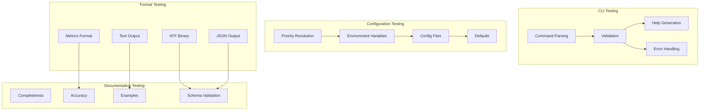

# M1_E5_I3 Test Plan: API Reference Documentation

## 1. Test Coverage Map



## 2. Test Matrix

| Component | Unit Tests | Integration Tests | Documentation Tests | Performance Tests |
|-----------|------------|-------------------|-------------------|-------------------|
| CLI Parser | 20 | 10 | 5 | 2 |
| Config Resolution | 15 | 8 | 5 | 2 |
| Format Validators | 25 | 12 | 10 | 3 |
| Error Handlers | 20 | 10 | 8 | 2 |
| Schema Validators | 30 | 15 | 15 | 3 |
| Example Validators | 10 | 5 | 20 | 1 |
| **Total** | **120** | **60** | **63** | **13** |

## 3. Unit Test Specifications

### 3.1 CLI Command Tests

```c
// Test: Command parsing with all flags
void cli__parse_all_flags__then_config_complete() {
    const char* argv[] = {
        "ada",
        "--buffer-size", "32768",
        "--threads", "32",
        "--format", "json",
        "--output", "trace.json",
        "--sampling", "0.5",
        "--verbose"
    };
    int argc = 13;
    
    Config config = {0};
    int result = cli_parse(argc, argv, &config);
    
    assert(result == 0);
    assert(config.defaults.buffer_size == 32768);
    assert(config.defaults.thread_count == 32);
    assert(strcmp(config.output_format, "json") == 0);
    assert(config.sampling_rate == 0.5f);
    assert(config.verbose == 1);
}

// Test: Invalid flag combinations
void cli__conflicting_flags__then_error() {
    const char* argv[] = {
        "ada",
        "--format", "json",
        "--format", "binary"  // Conflict
    };
    int argc = 5;
    
    Config config = {0};
    int result = cli_parse(argc, argv, &config);
    
    assert(result == ERR_CONFIG_CONFLICT);
}

// Test: Help text generation
void cli__help_flag__then_shows_usage() {
    const char* argv[] = {"ada", "--help"};
    int argc = 2;
    
    char buffer[4096] = {0};
    int result = cli_generate_help(argc, argv, buffer, sizeof(buffer));
    
    assert(result == 0);
    assert(strstr(buffer, "Usage:") != NULL);
    assert(strstr(buffer, "Options:") != NULL);
    assert(strstr(buffer, "--buffer-size") != NULL);
}
```

### 3.2 Configuration Priority Tests

```c
// Test: CLI overrides environment
void config__cli_over_env__then_cli_wins() {
    // Set environment variable
    setenv("ADA_BUFFER_SIZE", "16384", 1);
    
    // Parse CLI with different value
    const char* argv[] = {"ada", "--buffer-size", "32768"};
    Config config = {0};
    
    config_resolve(&config, argv, 3);
    
    assert(config.defaults.buffer_size == 32768);  // CLI wins
}

// Test: Environment overrides file
void config__env_over_file__then_env_wins() {
    // Create config file
    const char* config_content = "buffer_size = 8192\n";
    write_test_config(config_content);
    
    // Set environment variable
    setenv("ADA_BUFFER_SIZE", "16384", 1);
    
    Config config = {0};
    config_load_file(&config, "test.conf");
    config_apply_env(&config);
    
    assert(config.defaults.buffer_size == 16384);  // Env wins
}

// Test: File overrides defaults
void config__file_over_default__then_file_wins() {
    const char* config_content = "thread_count = 128\n";
    write_test_config(config_content);
    
    Config config = {0};
    config_set_defaults(&config);  // Default is 64
    config_load_file(&config, "test.conf");
    
    assert(config.defaults.thread_count == 128);  // File wins
}
```

### 3.3 Format Validation Tests

```c
// Test: ATF header validation
void atf__valid_header__then_accepted() {
    ATFHeader header = {
        .magic = 0x41544630,
        .version = 1,
        .timestamp = 1234567890,
        .thread_count = 16,
        .index_offset = 64,
        .detail_offset = 4096,
        .metadata_offset = 8192
    };
    
    int result = atf_validate_header(&header);
    assert(result == 0);
}

// Test: JSON schema validation
void json__valid_output__then_matches_schema() {
    const char* json = "{"
        "\"version\": \"1.0.0\","
        "\"metadata\": {"
            "\"timestamp\": 1234567890,"
            "\"hostname\": \"test\","
            "\"process\": {\"pid\": 1234, \"name\": \"test\"}"
        "},"
        "\"traces\": []"
    "}";
    
    int result = json_validate_schema(json, strlen(json));
    assert(result == 0);
}

// Test: Metrics format validation
void metrics__valid_format__then_parseable() {
    const char* metrics = 
        "ada_events_total{thread=\"1\"} 1000\n"
        "ada_buffer_usage{thread=\"1\"} 0.75\n"
        "ada_errors_total{type=\"buffer_full\"} 5\n";
    
    MetricsData data = {0};
    int result = metrics_parse(metrics, strlen(metrics), &data);
    
    assert(result == 0);
    assert(data.events_total == 1000);
    assert(data.buffer_usage == 0.75f);
    assert(data.errors_total == 5);
}
```

### 3.4 Error Documentation Tests

```c
// Test: Error code uniqueness
void errors__all_codes__then_unique() {
    size_t count = sizeof(error_catalog) / sizeof(ErrorDoc);
    
    for (size_t i = 0; i < count; i++) {
        for (size_t j = i + 1; j < count; j++) {
            assert(error_catalog[i].code != error_catalog[j].code);
        }
    }
}

// Test: Error message formatting
void errors__format_message__then_complete() {
    char buffer[512];
    int result = error_format(ERR_RUNTIME_BUFFER_FULL, buffer, sizeof(buffer));
    
    assert(result == 0);
    assert(strstr(buffer, "ERR_RUNTIME_BUFFER_FULL") != NULL);
    assert(strstr(buffer, "Trace buffer is full") != NULL);
    assert(strstr(buffer, "Increase buffer size") != NULL);
}

// Test: Error category ranges
void errors__categories__then_non_overlapping() {
    assert(ERR_INIT_BASE < ERR_RUNTIME_BASE);
    assert(ERR_RUNTIME_BASE < ERR_FORMAT_BASE);
    assert(ERR_FORMAT_BASE < ERR_CONFIG_BASE);
}
```

## 4. Integration Test Specifications

### 4.1 End-to-End API Tests

```c
// Test: Complete CLI invocation
void cli__full_command__then_executes() {
    // Start tracer with all options
    const char* cmd = "ada trace "
        "--buffer-size 16384 "
        "--threads 32 "
        "--format json "
        "--output test.json "
        "./test_program";
    
    int result = system(cmd);
    assert(WIFEXITED(result));
    assert(WEXITSTATUS(result) == 0);
    
    // Verify output file
    struct stat st;
    assert(stat("test.json", &st) == 0);
    assert(st.st_size > 0);
    
    // Validate JSON content
    char* content = read_file("test.json");
    assert(json_validate_schema(content, strlen(content)) == 0);
}

// Test: Configuration precedence chain
void config__full_chain__then_correct_priority() {
    // Setup: default -> file -> env -> cli
    
    // 1. Create config file
    write_config_file("buffer_size = 8192\n");
    
    // 2. Set environment
    setenv("ADA_BUFFER_SIZE", "16384", 1);
    
    // 3. Run with CLI override
    const char* cmd = "ada trace --buffer-size 32768 ./test";
    
    Config config = {0};
    extract_runtime_config(&config);
    
    assert(config.defaults.buffer_size == 32768);  // CLI wins
}
```

### 4.2 Format Interoperability Tests

```c
// Test: Binary to JSON conversion
void format__atf_to_json__then_preserves_data() {
    // Generate ATF file
    generate_test_atf("test.atf", 1000);  // 1000 events
    
    // Convert to JSON
    const char* cmd = "ada convert --from atf --to json "
                     "--input test.atf --output test.json";
    int result = system(cmd);
    assert(result == 0);
    
    // Verify event count preserved
    ATFStats atf_stats = atf_get_stats("test.atf");
    JSONStats json_stats = json_get_stats("test.json");
    
    assert(atf_stats.event_count == json_stats.event_count);
    assert(atf_stats.thread_count == json_stats.thread_count);
}

// Test: JSON to metrics aggregation
void format__json_to_metrics__then_correct_stats() {
    // Create JSON with known data
    create_test_json("test.json", 100, 10);  // 100 events, 10 threads
    
    // Generate metrics
    const char* cmd = "ada metrics --input test.json --output metrics.txt";
    int result = system(cmd);
    assert(result == 0);
    
    // Verify metrics
    MetricsData metrics = parse_metrics_file("metrics.txt");
    assert(metrics.events_total == 100);
    assert(metrics.thread_count == 10);
}
```

## 5. Documentation Validation Tests

### 5.1 Completeness Tests

```c
// Test: All commands documented
void docs__all_commands__then_have_reference() {
    const char* commands[] = {
        "trace", "convert", "metrics", "validate", "help", "version"
    };
    
    for (size_t i = 0; i < sizeof(commands)/sizeof(char*); i++) {
        CommandDoc* doc = find_command_doc(commands[i]);
        assert(doc != NULL);
        assert(strlen(doc->synopsis) > 0);
        assert(strlen(doc->description) > 0);
        assert(doc->examples[0].code[0] != '\0');
    }
}

// Test: All environment variables documented
void docs__all_env_vars__then_documented() {
    const char* env_vars[] = {
        "ADA_BUFFER_SIZE", "ADA_THREAD_LIMIT", "ADA_OUTPUT_FORMAT",
        "ADA_CONFIG_PATH", "ADA_LOG_LEVEL", "ADA_SAMPLING_RATE"
    };
    
    for (size_t i = 0; i < sizeof(env_vars)/sizeof(char*); i++) {
        EnvVarDoc* doc = find_env_doc(env_vars[i]);
        assert(doc != NULL);
        assert(strlen(doc->description) > 0);
        assert(strlen(doc->default_value) > 0);
    }
}
```

### 5.2 Example Validation Tests

```c
// Test: All examples compile and run
void examples__all_code__then_executes() {
    ExampleSet* examples = load_all_examples();
    
    for (size_t i = 0; i < examples->count; i++) {
        // Write example to file
        write_file("example.c", examples->items[i].code);
        
        // Compile
        int compile = system("cc -o example example.c -lada");
        assert(compile == 0);
        
        // Run
        int run = system("./example");
        assert(WIFEXITED(run));
        assert(WEXITSTATUS(run) == 0);
    }
}

// Test: Example output matches documentation
void examples__output__then_matches_docs() {
    ExampleSet* examples = load_all_examples();
    
    for (size_t i = 0; i < examples->count; i++) {
        char actual[4096];
        run_example(examples->items[i].code, actual, sizeof(actual));
        
        // Compare with documented output
        assert(strcmp(actual, examples->items[i].output) == 0);
    }
}
```

## 6. Performance Benchmarks

### 6.1 API Latency Benchmarks

```c
// Benchmark: Command parsing performance
void bench__cli_parse__measure_latency() {
    const char* argv[] = {
        "ada", "--buffer-size", "16384", 
        "--threads", "32", "--format", "json"
    };
    int argc = 8;
    
    uint64_t latencies[1000];
    for (int i = 0; i < 1000; i++) {
        Config config = {0};
        uint64_t start = rdtsc();
        cli_parse(argc, argv, &config);
        uint64_t end = rdtsc();
        latencies[i] = end - start;
    }
    
    uint64_t p50 = percentile(latencies, 1000, 50);
    uint64_t p99 = percentile(latencies, 1000, 99);
    
    assert(p50 < 1000);   // < 1µs at P50
    assert(p99 < 10000);  // < 10µs at P99
}

// Benchmark: Configuration resolution
void bench__config_resolve__measure_overhead() {
    Config config = {0};
    setup_test_environment();  // Set env vars, create config file
    
    uint64_t start = rdtsc();
    for (int i = 0; i < 1000; i++) {
        config_resolve(&config, NULL, 0);
    }
    uint64_t end = rdtsc();
    
    uint64_t avg_cycles = (end - start) / 1000;
    assert(avg_cycles < 5000);  // < 5000 cycles average
}
```

### 6.2 Format Performance Benchmarks

```c
// Benchmark: JSON serialization throughput
void bench__json_format__measure_throughput() {
    TraceData* data = generate_trace_data(10000);  // 10K events
    char buffer[1048576];  // 1MB buffer
    
    uint64_t start = rdtsc();
    size_t written = json_serialize(data, buffer, sizeof(buffer));
    uint64_t end = rdtsc();
    
    double seconds = cycles_to_seconds(end - start);
    double throughput = 10000.0 / seconds;
    
    assert(throughput > 100000);  // > 100K events/sec
}

// Benchmark: ATF encoding performance
void bench__atf_encode__measure_bandwidth() {
    TraceData* data = generate_trace_data(10000);
    uint8_t buffer[1048576];
    
    uint64_t start = rdtsc();
    size_t written = atf_encode(data, buffer, sizeof(buffer));
    uint64_t end = rdtsc();
    
    double seconds = cycles_to_seconds(end - start);
    double bandwidth = written / seconds;
    
    assert(bandwidth > 100 * 1024 * 1024);  // > 100 MB/s
}
```

## 7. Acceptance Criteria

### 7.1 API Documentation Completeness

- [ ] All CLI commands documented with synopsis, options, examples
- [ ] All environment variables documented with types and defaults
- [ ] All configuration options documented with precedence rules
- [ ] All output formats documented with schemas
- [ ] All error codes documented with messages and remedies
- [ ] Version compatibility matrix complete
- [ ] Performance characteristics documented

### 7.2 Schema Validation

- [ ] ATF binary format fully specified
- [ ] JSON schema validates all outputs
- [ ] Metrics format follows Prometheus conventions
- [ ] Text format human-readable and parseable
- [ ] All formats have example outputs
- [ ] Schema versioning implemented

### 7.3 Example Coverage

- [ ] Every command has at least 3 examples
- [ ] Every error has recovery example
- [ ] Every format has conversion example
- [ ] Configuration precedence demonstrated
- [ ] Performance tuning examples provided
- [ ] Integration examples with other tools

### 7.4 Error Documentation

- [ ] All error codes unique and categorized
- [ ] Error messages clear and actionable
- [ ] Recovery procedures documented
- [ ] Error examples reproducible
- [ ] Error catalog searchable
- [ ] Troubleshooting guide complete

## 8. Test Environment

```yaml
test_environment:
  platforms:
    - os: macOS
      version: "14.0+"
      arch: arm64
    - os: Linux
      version: "Ubuntu 22.04"
      arch: x86_64
  
  dependencies:
    - name: Google Test
      version: "1.14.0"
    - name: JSON Schema Validator
      version: "2.2.0"
    - name: Prometheus Parser
      version: "0.13.0"
  
  test_data:
    - sample_traces: 100MB
    - config_files: 50
    - error_scenarios: 200
```

## 9. Coverage Requirements

```yaml
coverage_requirements:
  unit_tests:
    lines: 100%
    branches: 95%
    functions: 100%
  
  integration_tests:
    api_surface: 100%
    error_paths: 100%
    format_conversions: 100%
  
  documentation_tests:
    examples: 100%
    schemas: 100%
    error_codes: 100%
  
  performance_tests:
    benchmarks: 100%
    regression_detection: enabled
```

## 10. Risk Mitigation

| Risk | Impact | Mitigation |
|------|--------|------------|
| Incomplete documentation | High | Automated doc generation from code |
| Schema version drift | Medium | Version validation in tests |
| Example code rot | Medium | Continuous example testing |
| Error code conflicts | Low | Compile-time uniqueness checks |
| Performance regression | Medium | Automated benchmark tracking |
| Format incompatibility | High | Round-trip conversion tests |