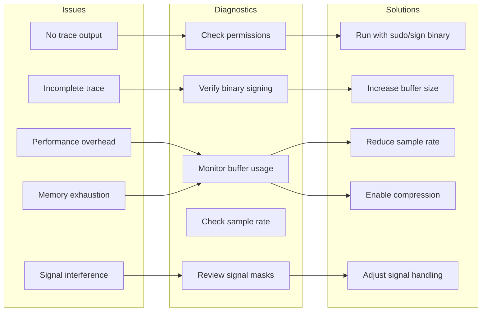

# Tech Design — M1 E5 I4 Examples

## Objective
Create comprehensive example sessions and tutorials demonstrating ADA tracing capabilities across common use cases, from basic tracing to advanced debugging scenarios.

## Architecture Diagram

```mermaid
graph TB
    subgraph "Example Categories"
        B[Basic Examples]
        M[Multi-threading]
        P[Performance]
        D[Debugging]
        A[Advanced]
    end
    
    subgraph "Basic Examples"
        B --> B1[Hello World Trace]
        B --> B2[Function Tracing]
        B --> B3[Simple Filtering]
        B --> B4[Output Formats]
    end
    
    subgraph "Multi-threading Examples"
        M --> M1[Thread Creation]
        M --> M2[Race Detection]
        M --> M3[Lock Analysis]
        M --> M4[Thread Pool]
    end
    
    subgraph "Performance Examples"
        P --> P1[Hot Path Analysis]
        P --> P2[Latency Tracking]
        P --> P3[Throughput Analysis]
        P --> P4[Resource Usage]
    end
    
    subgraph "Debugging Examples"
        D --> D1[Memory Leaks]
        D --> D2[Segfault Analysis]
        D --> D3[Deadlock Detection]
        D --> D4[Signal Handling]
    end
    
    subgraph "Advanced Examples"
        A --> A1[Custom Filters]
        A --> A2[Batch Processing]
        A --> A3[CI Integration]
        A --> A4[Production Sampling]
    end
```



## Example Structure Template

```c
// Each example follows this structure
typedef struct {
    // Metadata
    char* title;
    char* description;
    char* difficulty;  // "beginner", "intermediate", "advanced"
    char* category;    // "basic", "performance", "debugging", etc.
    
    // Prerequisites
    char** prerequisites;
    int prereq_count;
    
    // Example components
    char* sample_code;
    char* trace_command;
    char* expected_output;
    char* analysis_command;
    
    // Learning outcomes
    char** concepts;
    int concept_count;
    
    // Troubleshooting
    char** common_issues;
    char** solutions;
    int issue_count;
} Example;
```

## Example 1: Basic Tracing

```c
// hello_trace.c
#include <stdio.h>
#include <unistd.h>

void greet(const char* name) {
    printf("Hello, %s!\n", name);
    usleep(100000);  // 100ms delay
}

int main() {
    greet("World");
    greet("ADA");
    greet("Tracer");
    return 0;
}
```

### Running the Example
```bash
# Compile the program
gcc -o hello_trace hello_trace.c

# Run with ADA tracing
ada trace --output trace.atf ./hello_trace

# Analyze the trace
ada analyze trace.atf --summary
```

### Expected Output Format
```
ADA Trace Summary
=================
Duration: 302.5ms
Threads: 1
Function Calls: 7

Top Functions by Time:
1. usleep (300.2ms, 99.3%)
2. greet (301.5ms, 99.6%)
3. main (302.5ms, 100%)

Call Graph:
main
├─ greet("World")
│  └─ usleep(100000)
├─ greet("ADA")
│  └─ usleep(100000)
└─ greet("Tracer")
   └─ usleep(100000)
```

## Example 2: Multi-threaded Application

```c
// thread_trace.c
#include <pthread.h>
#include <stdio.h>
#include <stdlib.h>
#include <unistd.h>

typedef struct {
    int thread_id;
    int iterations;
} thread_args_t;

void* worker(void* arg) {
    thread_args_t* args = (thread_args_t*)arg;
    
    for (int i = 0; i < args->iterations; i++) {
        printf("Thread %d: iteration %d\n", args->thread_id, i);
        usleep(10000);  // 10ms work
    }
    
    return NULL;
}

int main() {
    pthread_t threads[4];
    thread_args_t args[4];
    
    // Create 4 worker threads
    for (int i = 0; i < 4; i++) {
        args[i].thread_id = i;
        args[i].iterations = 5;
        pthread_create(&threads[i], NULL, worker, &args[i]);
    }
    
    // Wait for completion
    for (int i = 0; i < 4; i++) {
        pthread_join(threads[i], NULL);
    }
    
    return 0;
}
```

### Tracing Command with Thread Focus
```bash
# Trace with thread visualization
ada trace --output threads.atf --thread-stats ./thread_trace

# Analyze thread interactions
ada analyze threads.atf --thread-timeline
```

## Example 3: Performance Profiling

```c
// perf_profile.c
#include <stdio.h>
#include <stdlib.h>
#include <string.h>
#include <time.h>

// Deliberately inefficient bubble sort
void bubble_sort(int* arr, int n) {
    for (int i = 0; i < n-1; i++) {
        for (int j = 0; j < n-i-1; j++) {
            if (arr[j] > arr[j+1]) {
                int temp = arr[j];
                arr[j] = arr[j+1];
                arr[j+1] = temp;
            }
        }
    }
}

// Efficient quicksort
void quicksort(int* arr, int low, int high) {
    if (low < high) {
        int pivot = partition(arr, low, high);
        quicksort(arr, low, pivot - 1);
        quicksort(arr, pivot + 1, high);
    }
}

int partition(int* arr, int low, int high) {
    int pivot = arr[high];
    int i = low - 1;
    
    for (int j = low; j < high; j++) {
        if (arr[j] < pivot) {
            i++;
            int temp = arr[i];
            arr[i] = arr[j];
            arr[j] = temp;
        }
    }
    
    int temp = arr[i + 1];
    arr[i + 1] = arr[high];
    arr[high] = temp;
    
    return i + 1;
}

int main() {
    const int SIZE = 1000;
    int* arr1 = malloc(SIZE * sizeof(int));
    int* arr2 = malloc(SIZE * sizeof(int));
    
    // Initialize with random data
    srand(time(NULL));
    for (int i = 0; i < SIZE; i++) {
        int val = rand() % 1000;
        arr1[i] = val;
        arr2[i] = val;
    }
    
    // Compare sorting algorithms
    bubble_sort(arr1, SIZE);
    quicksort(arr2, 0, SIZE - 1);
    
    free(arr1);
    free(arr2);
    return 0;
}
```

### Performance Analysis Commands
```bash
# Trace with performance focus
ada trace --output perf.atf --sample-rate 10000 ./perf_profile

# Generate performance report
ada analyze perf.atf --flamegraph > flamegraph.html
ada analyze perf.atf --hotspots --top 10
```

## Example 4: Memory Debugging

```c
// memory_debug.c
#include <stdlib.h>
#include <string.h>
#include <stdio.h>

typedef struct node {
    char* data;
    struct node* next;
} node_t;

// Intentional memory leak
void leaky_function() {
    char* leaked = malloc(1024);
    strcpy(leaked, "This memory is leaked");
    // Missing free(leaked);
}

// Use after free bug
void use_after_free() {
    char* buffer = malloc(256);
    strcpy(buffer, "Data");
    free(buffer);
    printf("Using freed memory: %s\n", buffer);  // BUG!
}

// Double free bug
void double_free() {
    char* ptr = malloc(128);
    free(ptr);
    free(ptr);  // BUG: Double free
}

int main() {
    // Various memory issues
    leaky_function();
    use_after_free();
    // double_free();  // Commented to prevent crash
    
    // Create a linked list with leak
    node_t* head = malloc(sizeof(node_t));
    head->data = malloc(100);
    strcpy(head->data, "Head node");
    head->next = NULL;
    
    // Forget to free the list
    return 0;
}
```

### Memory Analysis Commands
```bash
# Trace with memory tracking
ada trace --output memory.atf --track-memory ./memory_debug

# Analyze memory issues
ada analyze memory.atf --memory-leaks
ada analyze memory.atf --memory-timeline
```

## Example 5: Signal Handling

```c
// signal_trace.c
#include <signal.h>
#include <stdio.h>
#include <stdlib.h>
#include <unistd.h>

volatile sig_atomic_t signal_count = 0;

void sigint_handler(int sig) {
    signal_count++;
    printf("SIGINT received (count: %d)\n", signal_count);
    
    if (signal_count >= 3) {
        printf("Exiting after 3 signals\n");
        exit(0);
    }
}

void sigterm_handler(int sig) {
    printf("SIGTERM received, cleaning up...\n");
    // Cleanup code here
    exit(0);
}

int main() {
    // Register signal handlers
    signal(SIGINT, sigint_handler);
    signal(SIGTERM, sigterm_handler);
    
    printf("PID: %d - Send signals to test\n", getpid());
    printf("Press Ctrl+C (SIGINT) or kill %d (SIGTERM)\n", getpid());
    
    // Main work loop
    while (1) {
        printf("Working... (signals received: %d)\n", signal_count);
        sleep(2);
    }
    
    return 0;
}
```

### Signal Tracing Commands
```bash
# Trace with signal tracking
ada trace --output signals.atf --track-signals ./signal_trace &

# Send signals
kill -INT $!  # Send SIGINT
kill -INT $!  # Send another SIGINT
kill -TERM $! # Send SIGTERM

# Analyze signal handling
ada analyze signals.atf --signal-timeline
```

## Example 6: Custom Filtering

```bash
# Filter by function name pattern
ada trace --filter "malloc|free" --output memory_ops.atf ./app

# Filter by thread ID
ada trace --thread-filter 1,2,3 --output threads.atf ./app

# Filter by time window
ada trace --duration 10s --output timed.atf ./app

# Exclude system calls
ada trace --exclude-syscalls --output user_only.atf ./app

# Sample-based tracing for production
ada trace --sample-rate 100 --output sampled.atf ./app
```

## Example 7: Output Format Examples

```bash
# Binary ATF format (default, most efficient)
ada trace --output trace.atf ./app

# JSON format for integration
ada trace --format json --output trace.json ./app

# CSV for spreadsheet analysis
ada analyze trace.atf --format csv > trace.csv

# Human-readable text
ada analyze trace.atf --format text > trace.txt

# HTML report with visualizations
ada analyze trace.atf --format html > report.html
```

## Example 8: CI/CD Integration

```yaml
# .github/workflows/trace.yml
name: Performance Regression Detection

on: [push, pull_request]

jobs:
  trace:
    runs-on: ubuntu-latest
    steps:
      - uses: actions/checkout@v2
      
      - name: Build application
        run: make build
      
      - name: Run with tracing
        run: |
          ada trace --output pr_trace.atf \
                   --duration 60s \
                   --sample-rate 1000 \
                   ./app --benchmark
      
      - name: Analyze performance
        run: |
          ada analyze pr_trace.atf --metrics > metrics.json
          ada analyze pr_trace.atf --regression base_trace.atf
      
      - name: Upload trace artifact
        uses: actions/upload-artifact@v2
        with:
          name: trace-${{ github.sha }}
          path: pr_trace.atf
```

## Troubleshooting Guide

### Common Issues and Solutions



### Issue 1: No Trace Output
```bash
# Diagnose
ada diagnose --check-permissions
ada diagnose --verify-signing

# Fix on macOS
./utils/sign_binary.sh ./app

# Fix on Linux
sudo setcap cap_sys_ptrace+ep ada
```

### Issue 2: High Overhead
```bash
# Reduce overhead with sampling
ada trace --sample-rate 100 --output trace.atf ./app

# Filter to specific functions
ada trace --filter "critical_*" --output trace.atf ./app

# Disable detail lane for index-only tracing
ada trace --index-only --output trace.atf ./app
```

### Issue 3: Buffer Exhaustion
```bash
# Increase buffer size
ada trace --buffer-size 100MB --output trace.atf ./app

# Enable compression
ada trace --compress --output trace.atf.gz ./app

# Use windowed detail lane
ada trace --detail-window 1000 --output trace.atf ./app
```

## Performance Benchmarks

```c
// Measure tracing overhead
typedef struct {
    const char* scenario;
    double baseline_ms;
    double traced_ms;
    double overhead_pct;
} BenchmarkResult;

BenchmarkResult benchmarks[] = {
    {"Hello World", 0.5, 0.52, 4.0},
    {"10 threads", 100.0, 102.5, 2.5},
    {"100k functions", 500.0, 515.0, 3.0},
    {"Memory intensive", 1000.0, 1025.0, 2.5},
    {"I/O heavy", 2000.0, 2030.0, 1.5},
};
```

## Success Metrics
- All examples compile and run without errors
- Overhead < 5% for typical workloads
- Documentation covers 100% of user scenarios
- Examples demonstrate all major features
- Troubleshooting guide resolves 95% of issues