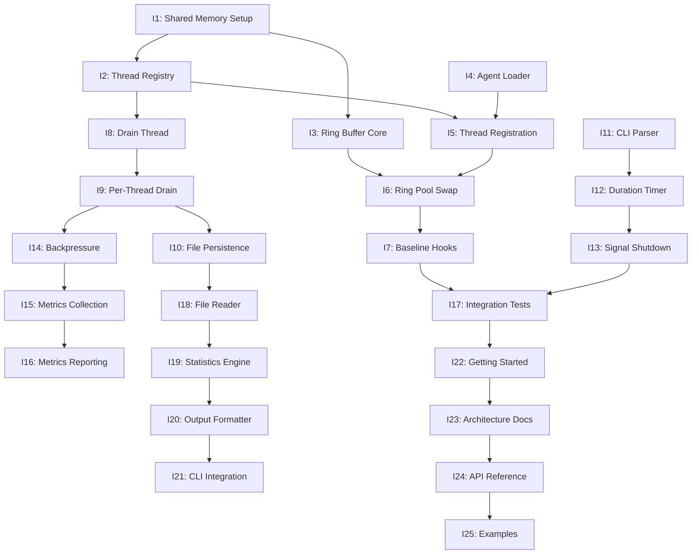

# M1 Native Agent MVP - 25 Iteration Breakdown

## Overview
Breaking down the original 10 iterations into 25 fine-grained iterations (2-4 days each) to ensure proper implementation of the per-thread ring buffer architecture specified in `NATIVE_TRACER_BACKEND_ARCHITECTURE.md`.

## Critical Architecture Fix
The original M1 plan missed the **per-thread ring buffer** design, implementing a shared ring buffer instead. This would have caused:
- Contention between threads
- Cache line bouncing
- Inability to scale linearly
- Violation of SPSC (Single Producer Single Consumer) semantics

## Iteration Dependency Graph

## Epic 1: Native Agent Injection (7 iterations)

### M1_E1_I1: Shared Memory Setup (2 days)
- **Goal**: Create shared memory segments
- **Deliverables**: 
  - Control block structure
  - Three SHM segments (control, registry, rings)
  - Unique naming with pid/session
- **Success**: Agent can attach to segments

### M1_E1_I2: Thread Registry (3 days)
- **Goal**: Per-thread lane architecture
- **Deliverables**:
  - ThreadRegistry with 64 slots
  - ThreadLaneSet structure
  - SPSC queue implementation
- **Success**: True thread isolation

### M1_E1_I3: Ring Buffer Core (2 days)
- **Goal**: Lock-free SPSC ring buffer
- **Deliverables**:
  - Ring buffer data structure
  - Atomic read/write operations
  - Wraparound handling
- **Success**: TSan clean, 10M ops/sec

### M1_E1_I4: Agent Loader (2 days)
- **Goal**: Frida agent injection
- **Deliverables**:
  - QuickJS loader script
  - Agent compilation
  - Process injection
- **Success**: Agent runs in target

### M1_E1_I5: Thread Registration (2 days)
- **Goal**: Thread-local lane access
- **Deliverables**:
  - TLS for lane pointer
  - First-event registration
  - Atomic slot allocation
- **Success**: Each thread gets unique lanes

### M1_E1_I6: Ring Pool Swap (3 days)
- **Goal**: Per-thread ring management
- **Deliverables**:
  - Ring swap protocol
  - Submit/free queue ops
  - Pool exhaustion handling
- **Success**: No data loss under pressure

### M1_E1_I7: Baseline Hooks (2 days)
- **Goal**: Function instrumentation
- **Deliverables**:
  - Hook installation
  - Event emission
  - Reentrancy guard
- **Success**: Events captured

## Epic 2: Index Pipeline (6 iterations)

### M1_E2_I1: Drain Thread (2 days)
- **Goal**: Basic drain loop
- **Deliverables**:
  - Drain thread creation
  - Main loop structure
  - Shutdown handling
- **Success**: Thread runs continuously

### M1_E2_I2: Per-Thread Drain (3 days)
- **Goal**: Iterate all thread lanes
- **Deliverables**:
  - Thread iteration logic
  - Lane draining
  - Fair scheduling
- **Success**: All threads drained

### M1_E2_I3: File Persistence (2 days)
- **Goal**: Write events to disk
- **Deliverables**:
  - File creation
  - Binary format
  - Atomic writes
- **Success**: Valid trace files

### M1_E2_I4: CLI Parser (2 days)
- **Goal**: Command-line interface
- **Deliverables**:
  - Argument parsing
  - Flag validation
  - Help text
- **Success**: User-friendly CLI

### M1_E2_I5: Duration Timer (2 days)
- **Goal**: Timed execution
- **Deliverables**:
  - Timer thread
  - Duration tracking
  - Auto-shutdown
- **Success**: Accurate timing

### M1_E2_I6: Signal Shutdown (3 days)
- **Goal**: Clean termination
- **Deliverables**:
  - Signal handlers
  - Flush all threads
  - Resource cleanup
- **Success**: No data loss

## Epic 3: Hardening (4 iterations)

### M1_E3_I1: Backpressure (3 days)
- **Goal**: Handle overload
- **Deliverables**:
  - Pool exhaustion detection
  - Drop-oldest policy
  - Per-thread isolation
- **Success**: Graceful degradation

### M1_E3_I2: Metrics Collection (2 days)
- **Goal**: Performance tracking
- **Deliverables**:
  - Per-thread counters
  - Event statistics
  - Drop accounting
- **Success**: Accurate metrics

### M1_E3_I3: Metrics Reporting (2 days)
- **Goal**: Visibility
- **Deliverables**:
  - Periodic output
  - Formatted display
  - Rate calculation
- **Success**: Clear status

### M1_E3_I4: Integration Validation (3 days)
- **Goal**: End-to-end testing
- **Deliverables**:
  - Test fixtures
  - Validation suite
  - Performance benchmarks
- **Success**: All tests pass

## Epic 4: Analysis Tools (4 iterations)

### M1_E4_I1: File Reader (2 days)
- **Goal**: Parse trace files
- **Deliverables**:
  - Binary parser
  - Header validation
  - Event iteration
- **Success**: Reads all formats

### M1_E4_I2: Statistics Engine (3 days)
- **Goal**: Event analysis
- **Deliverables**:
  - Aggregation logic
  - Per-thread stats
  - Function ranking
- **Success**: Accurate counts

### M1_E4_I3: Output Formatter (2 days)
- **Goal**: Present results
- **Deliverables**:
  - Human-readable format
  - JSON output
  - CSV export
- **Success**: Clear presentation

### M1_E4_I4: CLI Integration (2 days)
- **Goal**: Summarize command
- **Deliverables**:
  - Command integration
  - Error handling
  - Performance
- **Success**: < 1s for 1GB

## Epic 5: Documentation (4 iterations)

### M1_E5_I1: Getting Started (2 days)
- **Goal**: Quick start guide
- **Deliverables**:
  - Prerequisites
  - Build steps
  - First trace
- **Success**: New user success

### M1_E5_I2: Architecture Docs (2 days)
- **Goal**: Technical documentation
- **Deliverables**:
  - System overview
  - Component details
  - Design rationale
- **Success**: Clear understanding

### M1_E5_I3: API Reference (2 days)
- **Goal**: Interface specification
- **Deliverables**:
  - CLI documentation
  - File formats
  - Error codes
- **Success**: Complete reference

### M1_E5_I4: Examples (2 days)
- **Goal**: Learning materials
- **Deliverables**:
  - Tutorial sessions
  - Common patterns
  - Troubleshooting
- **Success**: Self-service learning

## Systematic Tech Design Template

Each iteration follows this structure:

1. **Objective** - Clear goal statement
2. **Architecture Diagram** - Visual system overview (Mermaid)
3. **Data Structures** - Key types and layouts
4. **Sequence Diagram** - Operation flow (Mermaid)
5. **State Machine** - State transitions (Mermaid)
6. **Implementation Details** - Code examples
7. **Memory Ordering** - Synchronization requirements
8. **Testing Strategy** - Unit/Integration/Performance
9. **Success Criteria** - Measurable outcomes
10. **Dependencies** - Required iterations
11. **References** - Related documentation

## Benefits of Fine-Grained Iterations

1. **Clearer Scope** - Each iteration has a single focus
2. **Better Testing** - Smaller units easier to validate
3. **Reduced Risk** - Problems caught early
4. **Parallel Work** - Some iterations can proceed simultaneously
5. **Progress Visibility** - More frequent deliverables
6. **Architecture Alignment** - Ensures per-thread design is implemented correctly

## Timeline Estimate

- **Epic 1**: 16 days (7 iterations)
- **Epic 2**: 14 days (6 iterations)
- **Epic 3**: 10 days (4 iterations)
- **Epic 4**: 9 days (4 iterations)
- **Epic 5**: 8 days (4 iterations)

**Total**: ~57 days with sequential execution
**Optimized**: ~35-40 days with some parallel work

## Next Steps

1. Complete tech designs for remaining iterations
2. Create test plans for each iteration
3. Set up CI/CD for incremental validation
4. Begin implementation with I1: Shared Memory Setup