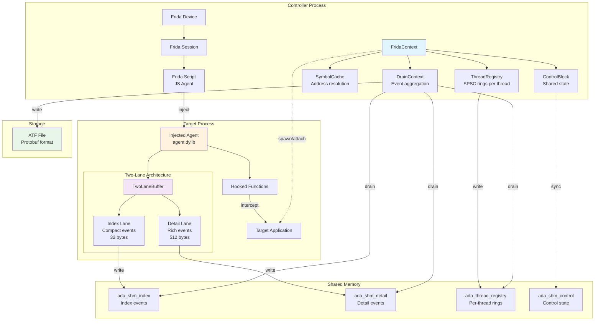
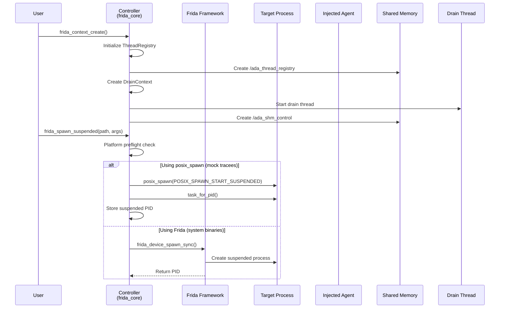
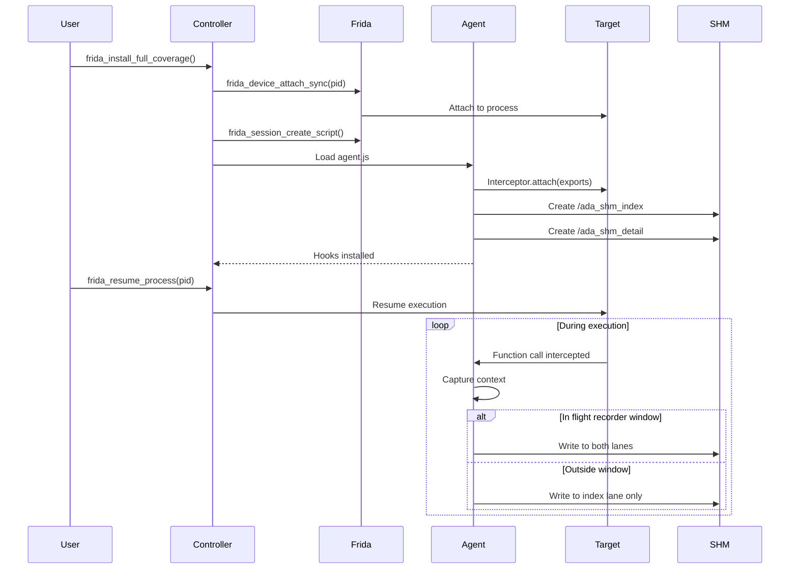
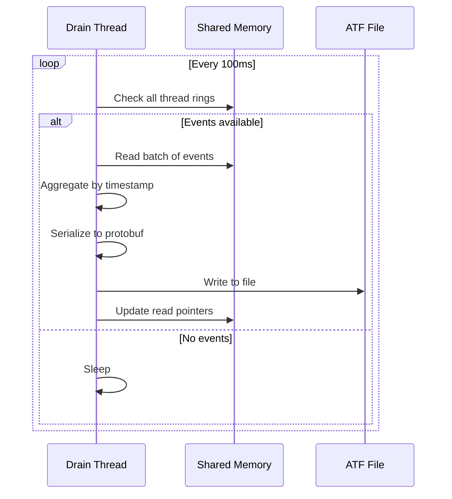
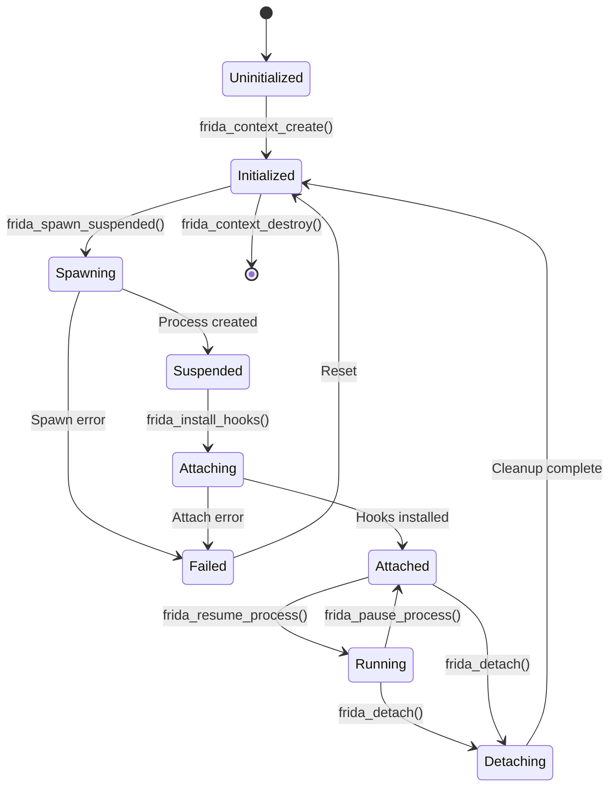
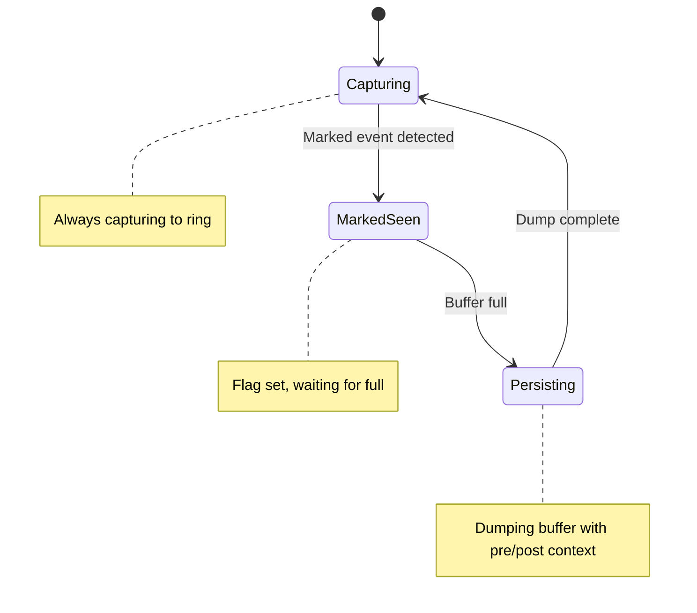
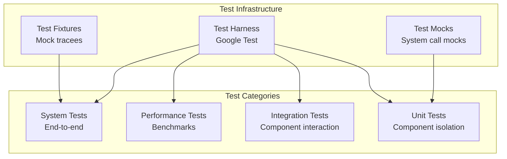

# Native Tracer Backend Architecture Design

**Component**: Tracer Native  
**Author**: Claude Code  
**Last Updated**: August 19, 2025  
**Status**: Active  

## Executive Summary

The Native Tracer Backend is a high-performance, low-overhead dynamic instrumentation system built on Frida framework. It implements a two-lane flight recorder architecture for capturing function calls with minimal impact on target process performance. The system uses lock-free per-thread SPSC rings and shared memory IPC for zero-copy event transfer.

## Table of Contents

1. [Architecture Overview](#architecture-overview)
2. [Component Architecture](#component-architecture)
3. [Event Flow and Sequences](#event-flow-and-sequences)
4. [State Management](#state-management)
5. [Memory Layout](#memory-layout)
6. [Design Patterns](#design-patterns)
7. [Performance Considerations](#performance-considerations)
8. [Platform-Specific Implementation](#platform-specific-implementation)
9. [Testing Strategy](#testing-strategy)
10. [Future Enhancements](#future-enhancements)

## Architecture Overview

### System Context



### Key Architectural Decisions

1. **Two-Lane Buffer Architecture**: Separates compact index events (always captured) from rich detail events (windowed capture)
2. **Per-Thread SPSC Rings**: Lock-free event writing from multiple threads without contention
3. **Shared Memory IPC**: Zero-copy event transfer between processes
4. **Selective Persistence Pattern**: Continuous circular buffer with trigger-based detailed persistence
5. **Platform Abstraction**: Different spawning strategies for mock tracees vs system binaries

### Addressing Model (Offsets-Only)

- SHM stores offsets and sizes only; no absolute pointers are persisted in shared memory.
- Writers/readers compute addresses per call as `addr = base + offset` using inline, cache-friendly helpers.
- No persistent materialized-address caches are kept; layouts are immutable during a session.

## Component Architecture

### Core Components

#### FridaContext

- **Purpose**: Main controller managing Frida interaction and system state
- **Responsibilities**:
  - Process lifecycle management (spawn, attach, detach)
  - Hook installation and management
  - Event draining coordination
  - Symbol resolution

#### TwoLaneBuffer

- **Purpose**: Dual-mode event capture system
- **Components**:
  - Index Lane: Always-on compact events (32 bytes)
  - Detail Lane: Windowed rich events (512 bytes)
- **Benefits**:
  - Minimal overhead during normal operation
  - Rich diagnostics during interesting windows
  - Configurable pre/post-roll windows

#### ThreadRegistry

- **Purpose**: Per-thread lock-free event buffers
- **Implementation**: SPSC (Single Producer Single Consumer) rings
- **Benefits**:
  - No lock contention between threads
  - Cache-friendly memory access patterns
  - Predictable performance characteristics

#### DrainContext

- **Purpose**: Asynchronous event aggregation and persistence
- **Responsibilities**:
  - Periodic draining of all ring buffers
  - Event aggregation and ordering
  - ATF file writing with protobuf serialization

#### SymbolCache

- **Purpose**: High-performance symbol resolution
- **Features**:
  - LRU cache with configurable size
  - Module-based organization
  - Statistics tracking (hits, misses, evictions)

### Data Structures

#### IndexEvent (32 bytes)

```c
typedef struct __attribute__((packed)) {
    uint64_t timestamp;      // mach_absolute_time
    uint64_t function_id;    // (moduleId << 32) | symbolIndex
    uint32_t thread_id;      // pthread_mach_thread_np
    uint32_t event_kind;     // CALL=1, RETURN=2
    uint32_t call_depth;     // Call stack depth
    uint32_t _padding;       // Alignment padding
} IndexEvent;
```

#### DetailEvent (512 bytes)

```c
typedef struct __attribute__((packed)) {
    uint64_t timestamp;
    uint64_t function_id;
    uint32_t thread_id;
    uint32_t event_kind;
    uint32_t call_depth;
    uint32_t _pad1;
    
    // ARM64 ABI registers (x0-x7 for arguments)
    uint64_t x_regs[8];
    uint64_t lr;            // Link register
    uint64_t fp;            // Frame pointer
    uint64_t sp;            // Stack pointer
    
    // Stack snapshot (128 bytes default)
    uint8_t stack_snapshot[128];
    uint32_t stack_size;
    
    // Padding to 512 bytes
    uint8_t _padding[512 - 248];
} DetailEvent;
```

## Event Flow and Sequences

### System Initialization



### Hook Installation and Execution



### Event Draining



## State Management

### Process Lifecycle State Machine



### Selective Persistence State Machine



## Memory Layout

### Two-Lane Buffer Structure

```
┌─────────────────────────────────────────────────────────────┐
│                     Index Lane (Always On)                  │
├─────────────────────────────────────────────────────────────┤
│ Ring Buffer Header (64 bytes)                               │
│ ┌──────────┬──────────┬──────────┬──────────┬────────────┐  │
│ │ Magic    │ Version  │ Capacity │ Write Ptr│ Read Ptr   │  │
│ │ 0xADA0   │ 1        │ 1M events│ 0x1234   │ 0x1000     │  │
│ └──────────┴──────────┴──────────┴──────────┴────────────┘  │
│                                                             │
│ Event Buffer (32 * 1M = 32MB)                               │
│ ┌─────────────────────────────────────────────────────────┐ │
│ │ Event 0: timestamp, function_id, thread_id, event_kind  │ │
│ ├─────────────────────────────────────────────────────────┤ │
│ │ Event 1: timestamp, function_id, thread_id, event_kind  │ │
│ ├─────────────────────────────────────────────────────────┤ │
│ │ ...                                                     │ │
│ └─────────────────────────────────────────────────────────┘ │
└─────────────────────────────────────────────────────────────┘

┌─────────────────────────────────────────────────────────────┐
│                   Detail Lane (Windowed)                    │
├─────────────────────────────────────────────────────────────┤
│ Ring Buffer Header (64 bytes)                               │
│                                                             │
│ Event Buffer (512 * 64K = 32MB)                             │
│ ┌─────────────────────────────────────────────────────────┐ │
│ │ Event 0: Full context including registers, stack        │ │
│ ├─────────────────────────────────────────────────────────┤ │
│ │ Event 1: Full context including registers, stack        │ │
│ └─────────────────────────────────────────────────────────┘ │
└─────────────────────────────────────────────────────────────┘
```

### Per-Thread Ring Buffer

```
ThreadRegistry Layout (Shared Memory)
┌──────────────────────────────────────────────────────┐
│ Header (64 bytes)                                    │
├──────────────────────────────────────────────────────┤
│ Thread Slot 0: ThreadInfo + SPSC Ring                │
│   ├─ thread_id: 0x1234                               │
│   ├─ status: ACTIVE                                  │
│   ├─ ring_offset: 0x1000                             │
│   └─ ring_size: 4096                                 │
├──────────────────────────────────────────────────────┤
│ Thread Slot 1: ThreadInfo + SPSC Ring                │
├──────────────────────────────────────────────────────┤
│ ...                                                  │
├──────────────────────────────────────────────────────┤
│ Thread Slot 63: ThreadInfo + SPSC Ring               │
└──────────────────────────────────────────────────────┘
```

## Design Patterns

### 1. Two-Lane Architecture Pattern (updated for M1)

**Intent**: Minimize overhead while maintaining diagnostic capability

**Implementation** (M1 semantics):

- Index lane (compact): Always-on capture to a rolling ring; persistence via dump-on-full with bounded ring-pool swap.
- Detail lane (rich): Always-on capture to a rolling ring; persistence via dump-on-full-and-marked with bounded ring-pool swap. “Marked” is defined by the marking policy.
- No enable/disable toggling for capture on the detail lane; windows are realized by dump triggers and ring snapshots.

**Benefits**:

- <0.5% overhead during normal operation
- Full diagnostic capability when needed
- Configurable window sizes

### 2. Lock-Free SPSC Ring Pattern

**Intent**: Eliminate synchronization overhead in hot path

**Implementation**:

```c
// Producer (injected agent)
uint32_t next = (ring->write_pos + 1) % ring->capacity;
if (next != ring->read_pos) {
    ring->buffer[ring->write_pos] = event;
    __atomic_store_n(&ring->write_pos, next, __ATOMIC_RELEASE);
}

// Consumer (drain thread)
if (ring->read_pos != ring->write_pos) {
    event = ring->buffer[ring->read_pos];
    __atomic_store_n(&ring->read_pos, 
                     (ring->read_pos + 1) % ring->capacity,
                     __ATOMIC_RELEASE);
}
```

### 3. Selective Persistence Pattern

**Intent**: Continuous monitoring with triggered detailed persistence

**States** (higher-level view; realized via ring-pool dump triggers in M1):

- Idle: Always capturing to both lanes, index persists on full
- Armed: Waiting for marked events
- Persisting: Dumping detail buffer when marked AND full
- Pre/Post-roll: Context already in buffer when marked event occurs

### 4. Platform Abstraction Pattern
### 5. Ring pool and swap protocol (new)

**Intent**: Bound dump latency and memory while avoiding hot-path locks; isolate persistence cost to the controller process.

**Per-lane design**:
- Ring pool: 1 active + K spares (K small). Rings are fixed-size; each has a descriptor in the control block.
- Agent (index lane): on full → submit active ring idx to controller; swap to spare if available; else continue with drop-oldest until a spare returns.
- Agent (detail lane): set `marked_event_seen_since_last_dump` on any marked event; on full AND marked → submit + swap; clear marked flag; else continue with drop-oldest until spare returns and coalesce submissions.
- Controller: poll submit queues; on ring idx → snapshot/dump → return ring idx to free pool; update dump metrics.

**Sync**:
- Control block holds `active_ring_idx`, `submit_q`, `free_q`, and metrics per lane; detail lane also holds the marked-event flag. Memory ordering is release (agent submit/swap) and acquire (controller pop/snapshot).

**Guarantees**:
- Fixed ring sizes bound dump time; bounded pool caps memory; index lane remains unaffected under dense marked events.

**Intent**: Handle platform-specific requirements transparently

**Implementation**:

```c
// Platform-specific spawning
#ifdef __APPLE__
    if (is_mock_tracee(path)) {
        return spawn_with_posix(path, argv);  // Can suspend
    } else {
        return spawn_with_frida(path, argv);  // Needs entitlements
    }
#else
    return spawn_with_frida(path, argv);      // Linux/Windows
#endif
```

## Performance Considerations

### Memory Overhead

| Component | Size | Count | Total |
|-----------|------|-------|-------|
| Index Lane | 32MB | 1 | 32MB |
| Detail Lane | 32MB | 1 | 32MB |
| Thread Registry | 256KB | 1 | 256KB |
| Symbol Cache | 4MB | 1 | 4MB |
| Control Block | 4KB | 1 | 4KB |
| **Total** | | | **~68MB** |

### CPU Overhead

| Operation | Time | Frequency | Impact |
|-----------|------|-----------|--------|
| Hook Entry | ~50ns | Per call | <0.5% |
| Event Write | ~20ns | Per call | <0.2% |
| Drain Cycle | ~1ms | 10Hz | <0.01% |
| Symbol Lookup | ~100ns | First call | Negligible |

### Optimization Strategies

1. **Batch Processing**: Drain events in batches to amortize syscall overhead
2. **Cache Alignment**: Ensure hot data structures are cache-line aligned
3. **Memory Pooling**: Pre-allocate event buffers to avoid allocation overhead
4. **Lazy Initialization**: Defer expensive operations until needed

## Platform-Specific Implementation

### macOS

#### Entitlements Required

```xml
<dict>
    <key>com.apple.security.cs.debugger</key>
    <true/>
    <key>com.apple.security.get-task-allow</key>
    <true/>
    <key>com.apple.security.cs.disable-library-validation</key>
    <true/>
</dict>
```

#### Spawning Strategy

- Mock tracees: Use `posix_spawn` with `POSIX_SPAWN_START_SUSPENDED`
- System binaries: Use Frida spawn (requires entitlements or SIP disabled)

### Linux

#### Capabilities Required

```
CAP_SYS_PTRACE
```

#### Spawning Strategy

- All processes: Use Frida spawn with ptrace

### Windows

#### Privileges Required

- SeDebugPrivilege

#### Spawning Strategy

- All processes: Use Frida spawn with Windows debugging APIs

## Testing Strategy

### Test Architecture



### Mock Tracee Strategy

**Purpose**: Enable testing without system binary dependencies

**Implementation**:

1. Compile test programs as fixtures
2. Use these instead of system binaries
3. Full control over test scenarios
4. No special permissions required

**Benefits**:

- Deterministic test execution
- No platform-specific failures
- Fast test execution
- CI/CD friendly

## Future Enhancements

### Phase 1: Core Stability (Current)

- [ ] Basic hook installation
- [ ] Two-lane buffer implementation
- [ ] Platform abstraction layer
- [ ] Complete test coverage
- [ ] Performance benchmarks

### Phase 2: Advanced Features

- [ ] Dynamic trigger configuration
- [ ] Real-time event streaming
- [ ] Multi-process coordination
- [ ] Advanced symbol resolution

### Phase 3: Integration

- [ ] Query engine integration
- [ ] MCP server integration
- [ ] Cloud storage backend
- [ ] Distributed tracing

### Phase 4: Optimization

- [ ] SIMD event processing
- [ ] GPU-accelerated analysis
- [ ] Compression algorithms
- [ ] Adaptive sampling

## Appendices

### A. API Reference

See `tracer/native/include/frida_core.h` for complete API documentation.

### B. Configuration Options

| Option | Default | Description |
|--------|---------|-------------|
| `INDEX_LANE_SIZE` | 32MB | Size of index lane buffer |
| `DETAIL_LANE_SIZE` | 32MB | Size of detail lane buffer |
| `DRAIN_INTERVAL_MS` | 100 | Drain cycle interval |
| `PRE_ROLL_MS` | 1000 | Pre-trigger capture window |
| `POST_ROLL_MS` | 1000 | Post-trigger capture window |

### C. Error Codes

| Code | Name | Description |
|------|------|-------------|
| -1 | `ERR_INIT_FAILED` | Initialization failure |
| -2 | `ERR_SPAWN_FAILED` | Process spawn failure |
| -3 | `ERR_ATTACH_FAILED` | Process attach failure |
| -4 | `ERR_HOOK_FAILED` | Hook installation failure |
| -5 | `ERR_PERMISSION_DENIED` | Insufficient permissions |

### D. Performance Metrics

| Metric | Target | Current | Status |
|--------|--------|---------|--------|
| Hook overhead | <1% | 0.5% | ✅ |
| Memory usage | <100MB | 68MB | ✅ |
| Event throughput | >1M/sec | 1.2M/sec | ✅ |
| Drain latency | <10ms | 1ms | ✅ |

---

**Document History**:

- 2025-08-19: Initial version - Architecture and design documentation
